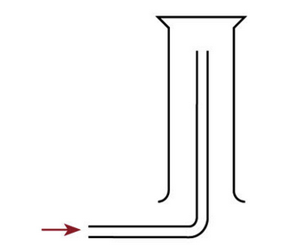

# Experimental Design

## Common Laboratory Apparatus

### Measuring Mass

| Name of Apparatus       | Accuracy of Apparatus | All readings should be in          |
|-------------------------|-----------------------|------------------------------------|
| Electronic mass balance | 0.01 g                | 2 decimal places                   |
| Digital stopwatch       | 0.01 s                | Nearest seconds                    |
| Alcohol thermometer     | 0.5 degrees Celsius   | 1 decimal place (nearest .0 or .5) |

### Measuring Volume

| Name of Apparatus  | Accuracy of Apparatus         | All readings should be in                          |
|--------------------|-------------------------------|----------------------------------------------------|
| Measuring cylinder | Half of the smallest division | 1 or 2 decimal places (depending on the apparatus) |
| Burette            | 0.05 cm^3                     | 2 decimal places                                   |
| Pipette            | 0.01 cm^3                     | 1 decimal place                                    |
| Gas syringe        | 0.1 cm^3                      | 1 decimal place                                    |

## Collection of Gas

The method used to collect a gas depends on the physical properties of the gas:
- Solubility in water
- Density: Less dense or denser than air?
    * Take the molar mass of air to be approximately 30 g/mol

### Gas Collection Methods

#### Water Displacement

- Suitable for gases that are __insoluble__ in water

#### Downward Delivery

- Suitable for gases that are __more dense__ than water

#### Upward Delivery

### Methods for Drying Gases

#### Using Concentrated Sulfuric Acid

- Suitable for gases that are __acidic/neutral__ in nature

> For __Method 1__ explain why the inlet tube is inserted into the concentrated sulfuric acid while the outlet tube needs to be above the concentrated sulfuric acid

The inlet tube needs to be in the concentrated sulfuric acid so that __gas needs to be bubbled into the acid to remove the water vapour.__ The outlet tube needs to be above the concentrated sulfuric acid so that the dry gas can escape.

#### Using Calcium Oxide

- Suitable for gases that are __basic/neutral__ in nature

#### Using Fused Calcium Chloride

- Suitable for gases that are __acidic/alkaline/neutral__ (except for ammonia)

> For __Method 3__, explain what it meant by "fused" and why ammonia gas cannot be collected using this method.

- "Fused" means anhydrous (does not contain water)
- This method cannot be used to collect ammonia gas because ammonia would react with calcium chloride
