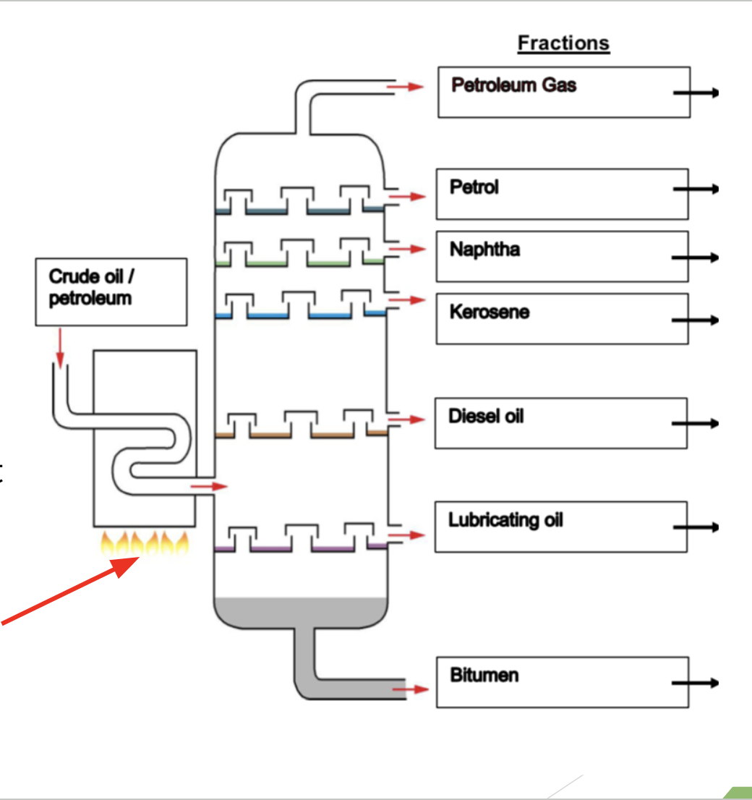

# Fuels and Crude Oil

> _Editor's note: wtf is this topic_

## Fractionating Column

Mixture of crude oil is heated so that __it enters the fractionating column as a *gaseous mixture*__ &rarr; ALL the fractions exist as vapour at the same time and then __separate out by selectively condensing__

__Note:__ During fractional distillation the liquids __DO NOT 'boil' or 'evaporate' one at a time__

> State the relationship between the position of the fractions collected and their respective boiling points.

## Carbon-Intensive Sectors

- Electricity generation
- Transport industry
- Heavy industry
    * Types of businesses that carry a high capital cost, high barriers to entry and low transportability, e.g. petrochemical industry, oil refining, aerospace and aviation.

