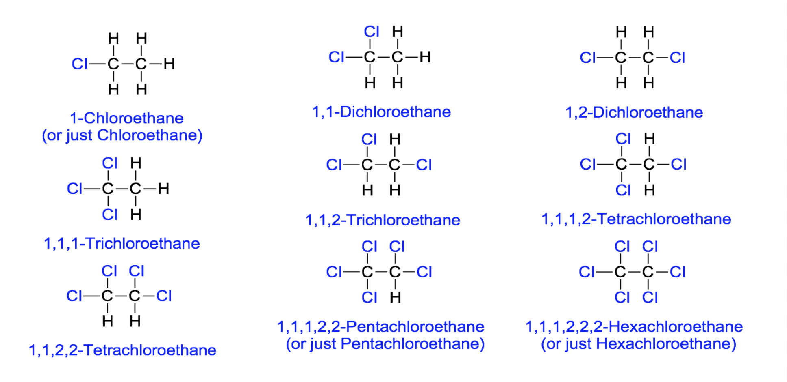

# Alkanes and Alkenes

## Chemical Reactions

- Substitution
    * One atom or a group of atoms in a molecule is replaced by another atom or group of atoms from another substance.
    * $\ce{C_2H_5Br + KOH (aq) -> C_2H_5OH + KBr}$
- Addition
    * Two or more molecules react to form a single product where atoms of one reactant are added to adjacent atoms across a carbon-carbon multiple bond.
    * $\ce{C_4H_8 + H_2 -> C_4H_10}$
- Elimination
    * The removal of atoms attached to adjacent carbon atoms in an organic compound to form an unsaturated product and a small molecule.
    * $\ce{C_4H_9OH -> C_4H_8 + H_2O}$
- Condensation
    * Two molecules combine with the removal of water or some other small molecule.
    * $\ce{CH_3COOH + CH_3 OH ->[Conc. \space H_2SO_4 \space Catalyst] CH_3COOCH_3 + H_2O}$
- Hydrolysis
    * Water reacted with a molecule, causing the reactant molecule to break down into smaller molecules
    * $\ce{CH_3COOCH_3 + H_2O ->[dilute \space acid/alkali \space catalyst] CH_3COOH + CH_3OH}$

## Alkanes

### Unreactivity of Alkanes

- Strong $\ce{C-C}$ and $\ce{C-H}$ covalent bonds &rarr; Hard to break
- Undergo __combustion, substitution__ and __cracking__.

### Combustion

The complete combustion of an alkane produces carbon dioxide and water. The reaction is very important because it is highly exothermic.

$$\ce{CH_4(g) + 2O_2(g) -> CO_2(g) + 2H_2O(g)}$$

#### Complete combustion of propane:

$$\ce{C_3H_8 + 5O_2 -> 3CO_2 + 4H_2O}$$

#### Incomplete combustion of propane (insufficient oxygen):

$$\ce{C_3H_8 + 5O_2 -> CO_2 + 2CO + 4H_2O}$$
$$\ce{2C_3H_8 + 9O_2 -> 4CO_2 + 2CO + 8H_2O}$$

> Substance X can be used to detect the presence of water. Identify substance X and describe any changes you would observe if water was present in the test-tube containing X.

Anhydrous copper(II) sulfate can be used to test for water. The white anhydrous copper(II) sulfate will change into blue hydrated copper(II) sulfate upon the addition of water.

> Substance Y can be used to detect the presence of carbon dioxide. Identify substance Y and describe any change you would observe if carbon dioxide was present in the test-tube containing Y.

Limewater/aqueous calcium hydroxide can be used to test for carbon dioxide. A white precipitate will be formed when carbon dioxide is bubbled through limewater.

### Substitution

- Alkanes react with chlorine in the presence of ultra-violet light.
- In this reaction, UV light is used to break the covalent bond in the chlorine molecule to produce chlorine atoms. 
- A hydrogen atom in methane is replaced by a chlorine atom.
- The products belong to a homologous series - *halogenoalkanes.*
- The reaction produces a complex mixture of products as multiple substitutions are also possible.

$$\ce{CH_4 + 2Cl ->[Ultraviolet \space light] CH_3Cl + HCl}$$
$$\ce{CH_3Cl + 2Cl ->[Ultraviolet \space light] CH_2Cl_2 + HCl}$$

#### All possible reaction products

### Cracking

Under __high temperatures__ and in the presence of __$\ce{Al_2O_3}$ catalyst__, long chain alkanes can be broken down to smaller alkenes + alkanes/hydrogen gas

$$\ce{C_8H_18 ->[$\ce{Al_2O_3}$ \space catalyst, \space high \space temperature] C_6H_14 + C_2H_4}$$

For:
- production of __smaller molecules with higher demand__ (e.g. ethene, propene, petrol)
- Produce __hydrogen gas for fuel or for the Haber process__.
