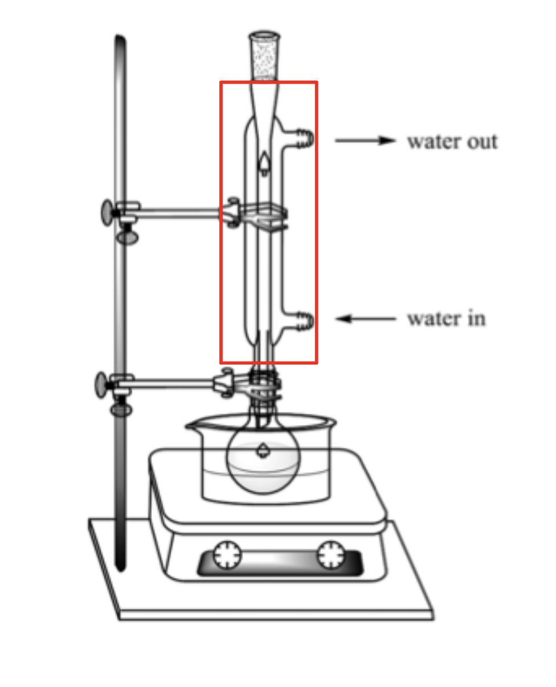

# Alcohols and Carboxylic Acids

## Alcohols

__Functional Group:__

$$\ce{O-H}$$

__General Formula:__

$$\ce{C_n H_{2n+1} OH}$$

| Name     | Molecular Formula | Structural Formula                       |
|----------|-------------------|------------------------------------------|
| Methanol | $\ce{CH_3 OH}$    | $\ce{CH_3 - O - H}$                      |
| Ethanol  | $\ce{C_2 H_5 OH}$ | $\ce{CH_3 - CH_2 - O - H}$               |
| Propanol | $\ce{C_3 H_7 OH}$ | $\ce{CH_3 - CH_2 - CH_2 - O - H}$        |
| Butanol  | $\ce{C_4 H_9 OH}$ | $\ce{CH_3 - CH_2 - CH_2 - CH_2 - O - H}$ |

## How are Alcohols Synthesised?

### Method A: Fermentation of Glucose

- Fermentation: chemical process in which __microorganisms__ such as yeast act on glucose to produce ethanol and carbon dioxide.
- Yeast contains __enzymes__ that catalyse the breakdown of glucose to form ethanol and carbon dioxide.

#### Balanced Chemical Equation

$$\ce{C_6 H_{12} O_6 (aq) -> 2C_2H_5OH (aq) + 2CO_2 (g)}$$ with yeast.

#### Essential Conditions

- Temperature is kept at 37 degrees Celsius
- Absence of oxygen
- Enzymes in yeast

### Method B: Hydration of Alkanes

#### Essential Conditions

- High temperature and pressure (300 degrees Celsius, 60 atm), 
- $\ce{H_3 PO_4}$ catalyst

### Physical Properties of Alcohols

- Soluble in water
- Most are liquids at room temperature
- Alcohols with more carbon atoms (12 and above) are solids at room temperature

The ability to form hydrogen bonds (a type of intermolecular force) allows alcohols to interact with water molecules allowing it dissolves in water. More energy is also required to overcome the hydrogen bonds resulting in higher melting and boiling points of alcohol

#### Solubility of Alcohols

- Alkanes
    * All alkanes are insoluble in water.
    * Alcohols: solubility decreases as number of carbons in chain increases
- The alkyl group (carbon chain) is non-polar and cannot form hydrogen bonds with water. 
- The longer the carbon chain, the more insoluble the alcohol.

## How do Alcohols React?

Alcohols are generally more reactive than alkanes.
- The $\ce{C-O}$ and $\ce{O-H}$ bonds in alcohols are more reactive than the $\ce{C-C}$ and $\ce{C-H}$ bonds in alkanes

### Combustion of Alcohol

- Like all organic compounds, alcohols undergo combustion in the presence of oxygen and heat to produce __carbon dioxide and steam.__

$$\ce{C_2H_5OH (l) + 3O_2 (g) -> 2CO_2 (g) + 3H_2O(g)}$$

### Oxidation

$$\ce{C_3H_7OH -> C_2H_5COOH}$$ with acidified $\ce{KMnO_4}$

What is the proof that the alcohol has been oxidised?
- Oxygen atom has been added to propanol to form propanoic acid.

What happens if wine is left exposed to air?
- Ethanol in wine is oxidised by aerobic bacteria, forming ethanoic acid.
- This process only happens to ethanol

### Dehydration

$$\ce{C_3H_7OH -> C_3H_6 + H_2O}$$ with concentrated $\ce{H_3PO_4}$ catalyst

#### As a solvent

- Used in paints, varnishes and perfumes.
- Why is alcohol a good solvent?

The structure of alcohol enables interaction with the organic substances which would not have dissolved in water.

The presence of the hydroxyl group allows to form hydrogen bonds readily with other non-organic substances.

#### As a fuel

- Main constituent in methylated spirit (used in spirit lamps and burners)
- In some countries, it is added to petrol and sold as a "blend".

### Summary: Chemical Reactions that Yield Ethanol

1. Fermentation of sugar with yeast
2. Addition of steam to alkenes (Hydration)

## Carboxylic Acids

### Structure of Carboxylic Acids

__Functional Group:__
$$\ce{O=C-O-H}$$

__General Formula:__
$$\ce{C_n H_{2n+1} COOH}$$

| Name           | Molecular Formula | Structural Formula         |
|----------------|-------------------|----------------------------|
| Methanoic Acid | $\ce{HCOOH}$      | $\ce{H-COOH}$              |
| Ethanoic Acid  | $\ce{CH_3 COOH}$  | $\ce{CH_3-COOH}$           |
| Propanoic Acid | $\ce{C_2H_5COOH}$ | $\ce{CH_3-CH_2-COOH}$      |
| Butanoic Acid  | $\ce{C_3H_7COOH}$ | $\ce{CH_3-CH_2-CH_2-COOH}$ |

### How are Carboxylic Acids Made?

#### Oxidation of Alcohols

1. Heat alcohol with acidified $\ce{KMnO_4}$ solution

$$\ce{C_3H_7OH -> C_3H_5COOH}$$ with acidified $\ce{KMnO_4}$

#### Physical Properties of Carboxylic Acids

- Soluble in water
- Most are liquids at room temperature

### How Do Carboxylic Acids React?

#### As acids

__Ionic Equation of Ethanoic Acid__

$$\ce{CH_3COOH <=> H^+ (aq) + CH_3COO^- (aq)}$$

__General Reactions as Acids__

- Being weak acids, carboxylic acids react with:
    * Metals
    * Bases
    * Carbonates

#### Write balanced chemical equations for reactions involving carboxylic acids

- $\ce{2CH_3COOH (aq) + Na_2CO_3(aq) -> 2CH_3COONa (aq) + H_2O (l) + CO_2(g)}$
- $\ce{2C_3H_7COOH (aq) + CaO (s) -> (C_3H_7COO)_2Ca (aq) + H_2O (l)}$
- $\ce{HCOOH (aq) + KOH (aq) -> HCOOK(aq) + H_2O(l)}$

## Esterification - Introduction to Esters

### What are esters?

- Sweet aroma
- Used in food and perfume industry

### Homologous Series - Esters 

#### Ethyl Ethanoate

$$\ce{CH3-COO-C_2H_5}$$

#### Methyl Propanoate

$$\ce{C_2H_5-COO-CH_3}$$

#### Functional Group

$$\ce{-COO-}$$

#### General Formula

$$\ce{C_nH_{2n}O_2}$$
$$\ce{C_nH_{2n+2}COO}$$

#### Name

__-yl -anoate__

### Synthesis of Esters

$$\ce{CH_3COOH + CH_3OH <=> CH_3-COO-CH_3 + H_2O}$$ with concentrated $H_2SO_4$ catalyst.

__Carboxylic acid + alcohol <=> ester + water__

#### Experimental Set-up

- The carboxylic acid and alcohol are heated under __reflux__ in the presence of a __catalyst__ (a few drops of concentrated sulfuric acid).

__Which apparatus is the condenser? purpose?__

- To prevent volatile organic reagents from escaping.
- __Any vapour will condense on the cool surface of the condenser and flow back into the flask.__

### Hydrolysis of Esters

- Esters can be __hydrolysed__ (broken down by water) to form original carboxylic acid and alcohol
- Warm with dilute acid

1. Look out for the $\ce{C-O}$ bond in the functional group of ester
$$\ce{C_2H_5-CO-O-CH_3}$$
    - methyl propanoate
2. Separate out the molecule
$$\ce{C_2H_5COO + O-CH_3}$$
3. Add $\ce{-O-H}$ to the $\ce{C=O}$, to form an acid. Add $\ce{-O-H}$ to the remaining part of the compound to form an alcohol.
$$\ce{C_2H_5COOH + H-O-CH_3}$$
    - propanoic acid + methanol

> [!NOTE]
> __Why does the use of dilute acid favour the reverse reaction?__
>
> Hint: What product is formed in the forward reaction?
>
> The presence of water shifts the equilibrium to the left, hence a dilute acid solution would favour the reverse reaction.

