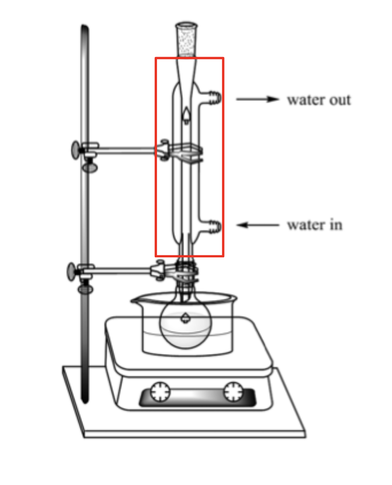

# Fuels and Crude Oil

> _Editor's note: wtf is this topic_

## Introduction to Fuels

- Fossil fuels are formed from decayed plants and animals from millions of years ago.
- They are mainly organic compounds that contain only carbon and hydrogen, known as __hydrocarbons__
- Fossil fuels are important as they are the largest sources of energy for powering transport and electrical appliances, which are essential for us to function in our daily lives.
- When fossil fuels undergo combustion, heat is released as the reaction is an exothermic one. The thermal energy can then be converted to other forms of energy.
- __Crude oil__ and __natural gas__ are forms of fossil fuel.

## Fractional Distillation of Crude Oil

- The different compounds in crude oil have different boiling points.
- Generally, hydrocarbons with larger relative molecular mass have higher boiling and melting points.
- As one moves up the fractionating tower, the temperature decreases.
    * Hydrocarbons boil and rise up the column until they reach the trays that are cool enough for them to condense (into liquids).
    * The liquids are siphoned off at different levels. Hence, hydrocarbon compounds with the highest boiling points will condense in trays __near the bottom of the fractionating column.__
        + Note that the liquid siphoned off at each level is called a __fraction__.
        + Every fraction comprises a __mixture__ of compounds, instead of pure substance.
- The lightest hydrocarbon (petroleum gas, which has the smallest relative molecular mass), does not condense and is collected at the top of the fractionating tower. It can also be used as a fuel.

> Mixture of crude oil is heated so that __it enters the fractionating column as a *gaseous mixture*__ &rarr; ALL the fractions exist as vapour at the same time and then __separate out by selectively condensing__
> __Note:__ During fractional distillation the liquids __DO NOT 'boil' or 'evaporate' one at a time__

## Difference between bioresources and biofuels

Bioresources are raw materials from human or animal activity that are renewable and biodegradable, however, biofuels are fuels that may be derived from bioresources, to be used as alternatives to conventional fossil fuels.

## Government's Plan to Support Domestic Power Generation

It's plan is to blend the use of biomethane in larger quantities with natural gas in the piped networks to support domestic power generation.

## Three Factors for Consideration before Extensive Implementation of Use of Biofuels in Singapore.

- Cost effectiveness in emissions reduction
- Existing infrastructure for fuels and feedstocks
- Suitability of applications for deployment by 2050.

## Suggest one negative impact of the use of biofuel and bioresources on the biodiversity, land use and carbon cycle.

- Biodiversity : With the need for biofuel, there might be a tendency to increase the production of certain types of crops. This will lead to the loss of biodiversity and possible disruption in the natural eco-systems.
- Land use: With the demand for biofuel, there might be demand for land use to grow such crops to meet the demand. There will be competing uses for the land such as for agricultural needs to support food compared to the fuel industry.
- Carbon cycle: Deforestation and land conversion programmes to clear and prepare the lands required to produce biofuel, may release significant amount of CO2. This can offset the environmental sustainability factor of biofuels of being carbon-neutral.

## Possible Contribution of Singapore in Future of Biofuel

Singapore could possibly be a leader in the importing of biofuels and refining them for export.

## Biofuels

- Biofuels are alternative renewable energy sources to crude oil and natural gas.
    * Biofuels are a renewable energy source that is derived from plant, algal or animal biomass.

## Carbon-Intensive Sectors

- Electricity generation
- Transport industry
- Heavy industry
    * Types of businesses that carry a high capital cost, high barriers to entry and low transportability, e.g. petrochemical industry, oil refining, aerospace and aviation.

## Organisation and Understanding of Biofuel

__Biofuel is a renewable energy source that is derived from plant, algal, or animal biomass.__

__Solid Biofuel:__
- Wood chips

__Liquid biofuel:__
- Biodiesel (from vegetable oil)
- Bioethanol (from sugarcane and corn)
__Gaseous biofuel__
- Biogas (from animal waste)

__Bioresources__ are raw materials from human or animal activity that are renewable and biodegradable.

Examples of bioresources are wood chips, vegetable oil, animal fats.
# Introduction to Organic Chemistry

## Organic Compounds

Elements that most organic compounds contain:
- All organic compounds contain __carbon__.
- Most also contain hydrogen
- Others may contain elements such as oxygen, nitrogen or a halogen.

### Homologous Series

- A homologous series is a family of compounds with the __same general formula and similar chemical properties.__
- Each homologous series has a general formula.
	- Subsequent members of organic compounds in the same homologous series differ by a chemical formula of $\ce{-CH_2}$

### Functional Group

- A functional group is a group of atoms that are bonded together in a way that is unique to that particular homologous series. The functional group is responsible for a compound's characteristic __chemical properties__.
- As they possess the same functional group, members of the same homologous series will __react in a similar way to one another.__

## Alkanes and Alkenes

### Properties

|                           | Alkane                                                                                                   | Alkene                                                                                                  |
|---------------------------|----------------------------------------------------------------------------------------------------------|---------------------------------------------------------------------------------------------------------|
| Saturated or Unsaturated? | Saturated hydrocarbon. An alkane contains only single covalent bonds between carbon atoms, $\ce{C-C}$. | Unsaturated hydrocarbon. An alkene contains a double covalent bond between carbon atoms, $\ce{C=C}$ |
| General Formula           | $\ce{C_nH_{2n + 2}}$                                                                                     | $\ce{C_nH_{2n+2}}$                                                                                      |

### Using Prefixes to Name Organic Compounds

| Prefix | Number of Carbon | Name of Alkane | Name of Alkene |
|--------|------------------|----------------|----------------|
| meth-  | 1                | methane        | -              |
| eth-   | 2                | ethane         | ethene         |
| prop-  | 3                | propane        | propene        |
| but-   | 4                | butane         | butene         |
| pent-  | 5                | pentane        | pentene        |

### Properties

- E.g: Boiling point, Melting point, Electrical conductivity (physical properties).
- For Organic Chemistry: __Viscosity (physical)__ and __Flammability (Chemical)__

#### Viscosity

- Measure of "thickness" and stickiness of a liquid
- Ability of fluid to flow

#### Flammability

- __Chemical property:__ The ability of a chemical to burn or ignite, causing fire or combustion.
- Can compare flashpoints: GENERALLY - __higher flashpoint, lower flammability.__

### Trends: MP and BP (physical)

#### Trend and Explanation

The melting points and boiling points of the alkanes generally increases as *relative molecular mass* increases.
- Larger molecules have stronger intermolecular forces of attraction.
- More energy is required to overcome the stronger intermolecular forces of attraction.
- higher MP and BP.

### Trends: Flammability (chemical)

#### Trend and Explanation

The flashpoints of the alkanes and alkenes generally increases as *relative molecular mass increases* &rarr; *flammability* decreases.
- larger molecules have stronger intermolecular forces of attraction, thus less volatile (likelihood of existing as a gas)
- larger molecules also have higher percentage of carbon &rarr; requires more oxygen to burn &rarr; less flammable.

### Trends: Viscosity (Physical)

#### Trend and Explanation

As relative molecular mass increases, the liquid alkanes and alkenes have *higher viscosity.*
- larger molecules have stronger intermolecular forces of attraction.
- harder for liquid containing larger molecules to flow.

### Summary

The gradual change in properties can be observed in __all__ homologous series as a result of the *increase in molecular mass of molecules down the homologous series*.

## Isomerism

### Definition

Isomerism is the phenomenon where __compounds (isomers) have the same molecular formula but different structural formulae.__

- Do not have to be of the same homologous series.
- Different homologous series can have the __same molecular formula.__

# Alkanes and Alkenes

## Chemical Reactions

- Substitution
    * One atom or a group of atoms in a molecule is replaced by another atom or group of atoms from another substance.
    * $\ce{C_2H_5Br + KOH (aq) -> C_2H_5OH + KBr}$
- Addition
    * Two or more molecules react to form a single product where atoms of one reactant are added to adjacent atoms across a carbon-carbon multiple bond.
    * $\ce{C_4H_8 + H_2 -> C_4H_10}$
- Elimination
    * The removal of atoms attached to adjacent carbon atoms in an organic compound to form an unsaturated product and a small molecule.
    * $\ce{C_4H_9OH -> C_4H_8 + H_2O}$
- Condensation
    * Two molecules combine with the removal of water or some other small molecule.
    * $\ce{CH_3COOH + CH_3 OH ->[Conc. \space H_2SO_4 \space Catalyst] CH_3COOCH_3 + H_2O}$
- Hydrolysis
    * Water reacted with a molecule, causing the reactant molecule to break down into smaller molecules
    * $\ce{CH_3COOCH_3 + H_2O ->[dilute \space acid/alkali \space catalyst] CH_3COOH + CH_3OH}$

## Alkanes

### Unreactivity of Alkanes

- Strong $\ce{C-C}$ and $\ce{C-H}$ covalent bonds &rarr; Hard to break
- Undergo __combustion, substitution__ and __cracking__.

### Combustion

The complete combustion of an alkane produces carbon dioxide and water. The reaction is very important because it is highly exothermic.

$$\ce{CH_4(g) + 2O_2(g) -> CO_2(g) + 2H_2O(g)}$$

#### Complete combustion of propane:

$$\ce{C_3H_8 + 5O_2 -> 3CO_2 + 4H_2O}$$

#### Incomplete combustion of propane (insufficient oxygen):

$$\ce{C_3H_8 + 5O_2 -> CO_2 + 2CO + 4H_2O}$$
$$\ce{2C_3H_8 + 9O_2 -> 4CO_2 + 2CO + 8H_2O}$$

> Substance X can be used to detect the presence of water. Identify substance X and describe any changes you would observe if water was present in the test-tube containing X.

Anhydrous copper(II) sulfate can be used to test for water. The white anhydrous copper(II) sulfate will change into blue hydrated copper(II) sulfate upon the addition of water.

> Substance Y can be used to detect the presence of carbon dioxide. Identify substance Y and describe any change you would observe if carbon dioxide was present in the test-tube containing Y.

Limewater/aqueous calcium hydroxide can be used to test for carbon dioxide. A white precipitate will be formed when carbon dioxide is bubbled through limewater.

### Substitution

- Alkanes react with chlorine in the presence of ultra-violet light.
- In this reaction, UV light is used to break the covalent bond in the chlorine molecule to produce chlorine atoms. 
- A hydrogen atom in methane is replaced by a chlorine atom.
- The products belong to a homologous series - *halogenoalkanes.*
- The reaction produces a complex mixture of products as multiple substitutions are also possible.

$$\ce{CH_4 + 2Cl ->[UV \space light] CH_3Cl + HCl}$$
$$\ce{CH_3Cl + 2Cl ->[UV \space light] CH_2Cl_2 + HCl}$$

#### All possible reaction products

### Cracking

Under __high temperatures__ and in the presence of __$\ce{Al_2O_3}$ catalyst__, long chain alkanes can be broken down to smaller alkenes + alkanes/hydrogen gas

$$\ce{C_8H_18 ->[$\ce{Al_2O_3}$ \space catalyst, \space high \space temperature] C_6H_14 + C_2H_4}$$

For:
- production of __smaller molecules with higher demand__ (e.g. ethene, propene, petrol)
- Produce __hydrogen gas for fuel or for the Haber process__.

# Alcohols and Carboxylic Acids

## Alcohols

__Functional Group:__

$$\ce{O-H}$$

__General Formula:__

$$\ce{C_n H_{2n+1} OH}$$

| Name     | Molecular Formula | Structural Formula                       |
|----------|-------------------|------------------------------------------|
| Methanol | $\ce{CH_3 OH}$    | $\ce{CH_3 - O - H}$                      |
| Ethanol  | $\ce{C_2 H_5 OH}$ | $\ce{CH_3 - CH_2 - O - H}$               |
| Propanol | $\ce{C_3 H_7 OH}$ | $\ce{CH_3 - CH_2 - CH_2 - O - H}$        |
| Butanol  | $\ce{C_4 H_9 OH}$ | $\ce{CH_3 - CH_2 - CH_2 - CH_2 - O - H}$ |

## How are Alcohols Synthesised?

### Method A: Fermentation of Glucose

- Fermentation: chemical process in which __microorganisms__ such as yeast act on glucose to produce ethanol and carbon dioxide.
- Yeast contains __enzymes__ that catalyse the breakdown of glucose to form ethanol and carbon dioxide.

#### Balanced Chemical Equation

$$\ce{C_6 H_{12} O_6 (aq) ->[yeast] 2C_2H_5OH (aq) + 2CO_2 (g)}$$

#### Essential Conditions

- Temperature is kept at 37 degrees Celsius
- Absence of oxygen
- Enzymes in yeast

### Method B: Hydration of Alkanes

#### Essential Conditions

- High temperature and pressure (300 degrees Celsius, 60 atm), 
- $\ce{H_3 PO_4}$ catalyst

### Physical Properties of Alcohols

- Soluble in water
- Most are liquids at room temperature
- Alcohols with more carbon atoms (12 and above) are solids at room temperature

The ability to form hydrogen bonds (a type of intermolecular force) allows alcohols to interact with water molecules allowing it dissolves in water. More energy is also required to overcome the hydrogen bonds resulting in higher melting and boiling points of alcohol

#### Solubility of Alcohols

- Alkanes
    * All alkanes are insoluble in water.
    * Alcohols: solubility decreases as number of carbons in chain increases
- The alkyl group (carbon chain) is non-polar and cannot form hydrogen bonds with water. 
- The longer the carbon chain, the more insoluble the alcohol.

## How do Alcohols React?

Alcohols are generally more reactive than alkanes.
- The $\ce{C-O}$ and $\ce{O-H}$ bonds in alcohols are more reactive than the $\ce{C-C}$ and $\ce{C-H}$ bonds in alkanes

### Combustion of Alcohol

- Like all organic compounds, alcohols undergo combustion in the presence of oxygen and heat to produce __carbon dioxide and steam.__

$$\ce{C_2H_5OH (l) + 3O_2 (g) -> 2CO_2 (g) + 3H_2O(g)}$$

### Oxidation

$$\ce{C_3H_7OH ->[acidified\space KMnO_4] C_2H_5COOH}$$

What is the proof that the alcohol has been oxidised?
- Oxygen atom has been added to propanol to form propanoic acid.

What happens if wine is left exposed to air?
- Ethanol in wine is oxidised by aerobic bacteria, forming ethanoic acid.
- This process only happens to ethanol

### Dehydration

$$\ce{C_3H_7OH ->[conc.\space H_3PO_4\space catalyst] C_3H_6 + H_2O}$$

#### As a solvent

- Used in paints, varnishes and perfumes.
- Why is alcohol a good solvent?

The structure of alcohol enables interaction with the organic substances which would not have dissolved in water.

The presence of the hydroxyl group allows to form hydrogen bonds readily with other non-organic substances.

#### As a fuel

- Main constituent in methylated spirit (used in spirit lamps and burners)
- In some countries, it is added to petrol and sold as a "blend".

### Summary: Chemical Reactions that Yield Ethanol

1. Fermentation of sugar with yeast
2. Addition of steam to alkenes (Hydration)

## Carboxylic Acids

### Structure of Carboxylic Acids

__Functional Group:__
$$\ce{O=C-O-H}$$

__General Formula:__
$$\ce{C_n H_{2n+1} COOH}$$

| Name           | Molecular Formula | Structural Formula         |
|----------------|-------------------|----------------------------|
| Methanoic Acid | $\ce{HCOOH}$      | $\ce{H-COOH}$              |
| Ethanoic Acid  | $\ce{CH_3 COOH}$  | $\ce{CH_3-COOH}$           |
| Propanoic Acid | $\ce{C_2H_5COOH}$ | $\ce{CH_3-CH_2-COOH}$      |
| Butanoic Acid  | $\ce{C_3H_7COOH}$ | $\ce{CH_3-CH_2-CH_2-COOH}$ |

### How are Carboxylic Acids Made?

#### Oxidation of Alcohols

1. Heat alcohol with acidified $\ce{KMnO_4}$ solution

$$\ce{C_3H_7OH ->[acidified\space KMnO_4] C_3H_5COOH}$$

#### Physical Properties of Carboxylic Acids

- Soluble in water
- Most are liquids at room temperature

### How Do Carboxylic Acids React?

#### As acids

__Ionic Equation of Ethanoic Acid__

$$\ce{CH_3COOH <=> H^+ (aq) + CH_3COO^- (aq)}$$

__General Reactions as Acids__

- Being weak acids, carboxylic acids react with:
    * Metals
    * Bases
    * Carbonates

#### Write balanced chemical equations for reactions involving carboxylic acids

- $\ce{2CH_3COOH (aq) + Na_2CO_3(aq) -> 2CH_3COONa (aq) + H_2O (l) + CO_2(g)}$
- $\ce{2C_3H_7COOH (aq) + CaO (s) -> (C_3H_7COO)_2Ca (aq) + H_2O (l)}$
- $\ce{HCOOH (aq) + KOH (aq) -> HCOOK(aq) + H_2O(l)}$

## Esterification - Introduction to Esters

### What are esters?

- Sweet aroma
- Used in food and perfume industry

### Homologous Series - Esters 

#### Ethyl Ethanoate

$$\ce{CH3-COO-C_2H_5}$$

#### Methyl Propanoate

$$\ce{C_2H_5-COO-CH_3}$$

#### Functional Group

$$\ce{-COO-}$$

#### General Formula

$$\ce{C_nH_{2n}O_2}$$
$$\ce{C_nH_{2n+2}COO}$$

#### Name

__-yl -anoate__

### Synthesis of Esters

$$\ce{CH_3COOH + CH_3OH <=>[Conc. H_2SO_4 Catalyst] CH_3-COO-CH_3 + H_2O}$$

__Carboxylic acid + alcohol <=> ester + water__

#### Experimental Set-up

- The carboxylic acid and alcohol are heated under __reflux__ in the presence of a __catalyst__ (a few drops of concentrated sulfuric acid).

__Which apparatus is the condenser? purpose?__

- To prevent volatile organic reagents from escaping.
- __Any vapour will condense on the cool surface of the condenser and flow back into the flask.__

### Hydrolysis of Esters

- Esters can be __hydrolysed__ (broken down by water) to form original carboxylic acid and alcohol
- Warm with dilute acid

1. Look out for the $\ce{C-O}$ bond in the functional group of ester
$$\ce{C_2H_5-CO-||-O-CH_3}$$
    - methyl propanoate
2. Separate out the molecule
$$\ce{C_2H_5COO + O-CH_3}$$
3. Add $\ce{-O-H}$ to the $\ce{C=O}$, to form an acid. Add $\ce{-O-H}$ to the remaining part of the compound to form an alcohol.
$$\ce{C_2H_5COOH + H-O-CH_3}$$
    - propanoic acid + methanol

> [!NOTE]
> __Why does the use of dilute acid favour the reverse reaction?__
>
> Hint: What product is formed in the forward reaction?
>
> The presence of water shifts the equilibrium to the left, hence a dilute acid solution would favour the reverse reaction.

# Polymers

## Macromolecules

- Macromolecules are made from smaller subunits, such as:
    * Polymers
        + Smaller subunits are the same type of molecules
    * Non-Polymers

## Polymers and Repeating Units

- Polymers are made from many __smaller molecules__ called __monomers__
- Each small unit within the polymer that repeats itself is a __repeating unit__

## Addition Polymerisation of Ethene

### Chemical Equation

$$\ce{nC_2H_4 -> (-C_2H_4-)_n}$$

### Conditions

- High temperature and pressure

### Uses

Plastic bags, cling film, plastic containers.

## Condensation Polymerisation

Condensation polymerisation occurs when two monomers with __different functional groups__ combine to form a polymer, with the __removal of a small molecule such as water.__

- One monomer that contains the two carboxylic acid functional groups $\ce{(-COOH)}$, __dicarboxylic acid__
- Another monomer that contains either two alcohol functional groups $\ce{(-OH)}$, __diol__, or two amine functional groups $\ce{-NH_2}$, __diamine__

## Condensation Polymers

### Polyester

- Monomers are linked together by ester linkage

### Polyamide

- Monomers are linked together by amide linkage.

### Condensation Polymer - Polyester (Terylene)

Polyester is formed when a diol and a carboxylic acid undergo condensation polymerisation.

# Polymers - The 'Aftermath' of Plastics

## Characteristics of Plastics

- Relatively cheap
- Easily moulded into various shapes
- Light, tough and waterproof
- Durable (resistant to decay, rusting and chemical attack)

## Problems Caused by Plastics

### Environmental Problems

#### Water Pollution

- Plastics in the sea __endanger marine animals,__ often __mistaken for food__ and harmed by them.
- Plastics also __clog up rivers and drains,__ becoming breeding grounds for mosquitoes, spreading diseases like __dengue__.

#### Air Pollution

- Plastics are mostly flammable. When incinerated, plastics __produce poisonous and greenhouse gases.__

## Recycling of Plastics

### Physical Method

#### Pre-treatment of Plastic Waste

- Sort by different methods (manual/density sorting)
- Wash to remove contaminants
- Shredding or grinding to smaller pieces.

#### Mechanical Recycling

- After pre-treatment, small pieces of plastics such as poly(ethene), PE, are melted, cooled, pulled into long, thin strands, and cut into pellets.

### Chemical Method

#### Cracking

- Plastic waste can undergo cracking to form __short chains of alkanes and alkenes__
- Either thermal cracking or catalytic cracking can be done to obtain such products.
    * Short-chain alkanes can be used as fuels
    * Short-chain alkenes may be used to make other useful chemicals through polymerisation.

#### Deploymerisation

- A process in which polymers are broken down into their monomers

##### Acid Hydrolysis

Polyesters can be __hydrolysed__ (broken down by water) to form the original monomers. This is done by __warming__ the polyester with an acid catalyst.

