## Introduction to Electrochemistry

### Electrolyte

- Ionic compound in molten or aqueous state
- Conducts electricity due to free mobile ions
- Examples: mobile dilute $\ce{H_2SO_4}$, molten $\ce{NaCl}$ and $\ce{CuSO_4}$ solution

### Electrodes

-  A rod or plate which conducts electricity through the electrolyte
-  __ANODE  - OXIDATION__ takes place at this electrode
- __CATHODE - REDUCTION__ takes place at this electrode
- Types of Electrodes:
    * __Inert Electrode__ - An electrode that does not take part in chemical reactions during electrolysis, e.g. graphite/carbon and platinum.
    * It does not react with the product of electrolysis or the electrolytes, and not oxidised in the process.
    * __Reactive Electrode__ - An electrode that takes part in chemical reactions during electrolysis, e.g. metal plates such as copper.

### Electrolytes

Electrolytes conduct electricity differently from electrodes such as metals and graphite.

|                      | Electrolytes (ionic compound)                       | Metals                                           | Graphite                                          |
|----------------------|-----------------------------------------------------|--------------------------------------------------|---------------------------------------------------|
| Method of Conduction | Mobile ions                                         | Flow of mobile electrons from one end to another | Flow of mobile valence electrons along the layers |
| Effect of Conduction | Decomposed to form new substances (chemical change) | Remains chemically unchanged.                    | Remains chemically unchanged                                                   |

## Electrolytic Cells vs Simple Cells

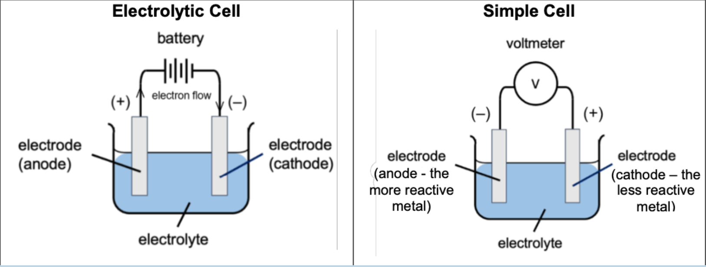

|                   | Electrolytic Cell                                                                                      | Simple Cell                                                                             |
|-------------------|----------------------------------------------------------------------------------------------------------------------------|------------------------------------------------------------------------------------------------------------------------|
| Source of Energy  | Electrical energy is supplied by an external source (e.g. battery)                                     | Electrical energy is produced through chemical reactions                                |
| Energy Conversion | Electrical -> Chemical                                                                                 | Chemical -> Electrical                                                                  |
| Electron Movement | Electrons move from negative terminal of battery to cathode, through electrolyte into anode. | Electrons move from anode to external circuit (voltmeter/bulb e.t.c) into cathode. |

### Similarities

- Both have positive and negative electrodes
- Both have electrolyte
- Both form a closed circuit with the electrons flowing.
- Electrons flow from anode to cathode.

### Differences

#### Electrolytic Cell

- Electrodes connected by battery (source of energy)
- Anode is positive, cathode is negative

#### Simple Cell

- Electrodes connected by voltmeter
- Electrodes are different metals (difference in reactivity as the source of chemical energy)
- Anode is negative, cathode is positive.

### Why are there these similarities and differences?

- Opposite polarity for anode and cathode due to difference in energy conversion
- Oxidation always occurs at anode, reduction always occurs at cathode.

## Factors Affecting Products of Electrolysis

The polarity of a terminal in an electrolytic cell is __determined by the polarity of the battery it is connected to.__

### Definition of Electrolysis

Electrolysis is the decomposition of a compound by electricity.

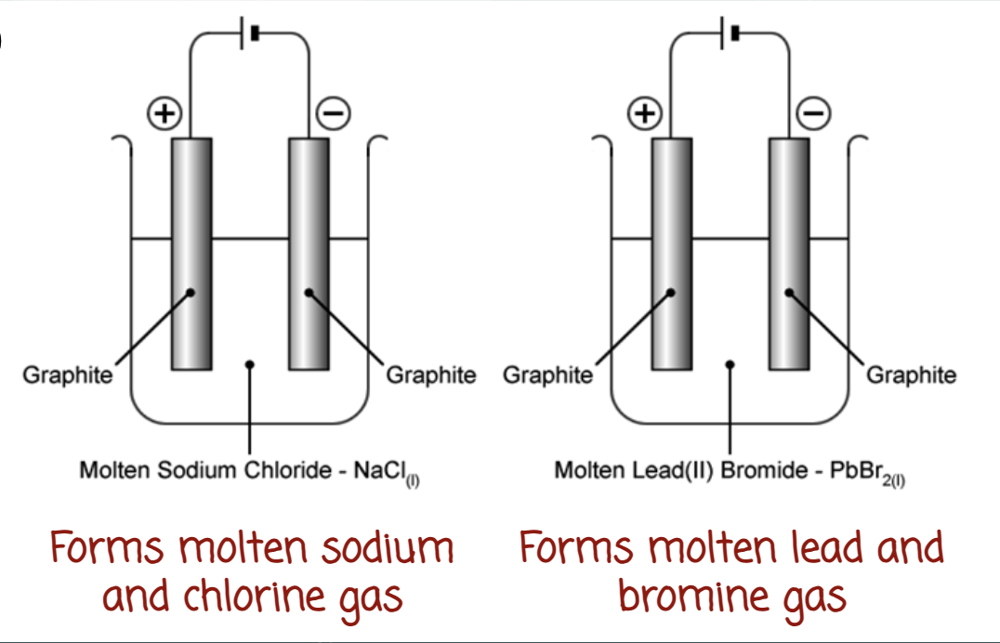

When the ionic compound is __molten__ or when it is __dissolved in water__, the positive and negative __ions__ become __mobile__ and are free to move towards the electrode of opposite charge, thus __conducting electricity.__

#### Electrolysis of Molten Sodium Chloride

##### Set up

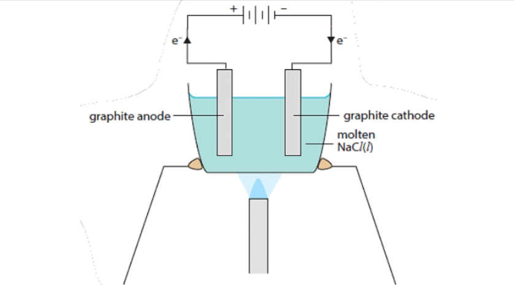

| Electrolyte                            | Ions Present                   | Electrodes                                                                                                                         |
| -------------------------------------- | ------------------------------ | ---------------------------------------------------------------------------------------------------------------------------------- |
| molten sodium chloride, $\ce{NaCl(l)}$ | $\ce{Na^+ (l),\space Cl^-(l)}$ | Graphite electrode (inert) - may have to be replaced periodically due to graphite reacting with oxygen gas under high temperature. |

##### Anode (+) (Oxidation)

- $\ce{Cl^-}$ attracted to anode
- $\ce{Cl^-}$ lose electrons to form $\ce{Cl_2(g)}$, $\ce{Cl^-}$ is oxidised
- $\ce{Cl^-}$ discharged (*meaning ions leave the electrode*)
- Half equation: $\ce{2Cl^{-}(l) -> Cl_{2}(g) + 2e^-}$ 

##### Cathode (-) (Reduction)

- $\ce{Na^+}$ attracted to cathode
- $\ce{Na^{+}}$ gain electrons form $\ce{Na(l)}$, $\ce{Na^+}$ is reduced
- $\ce{Na^+}$ is discharged
- Half equation: $\ce{Na^{+}(l)+ e^{-}-> Na(l)}$ (reduction)

##### Overall Equation

$$ \ce{2NaCl (l) -> 2Na(l) + Cl_{2} (g)}$$

##### Observations

1. Effervescence of greenish-yellow gas appears around at the anode.
2. Greyish (or silvery) liquid is formed at the cathode.

### Selective Discharge of Cations and Anions (Aqueous Electrolytes)

- Consider the difference in ions present in molten sodium chloride and aqueous sodium chloride - molten sodium chloride contains only $\ce{Na^+}$ and $\ce{Cl^-}$ ions, while aqueous sodium chloride contains $\ce{Na^+, \space Cl^-, \space H^+, \space OH^-}$ ions.
- In an aqueous solution, water undergoes partial ionisation to form $\ce{H^+}$ and $\ce{OH^-}$ ions:

    $$\ce{H_2O(l) <=> H^+ (aq) + OH^-(aq)}$$

- In an aqueous electrolyte, there will always be more than one type of cation and anion present.
- However, only one type of cation and anion will be selectively (preferentially) discharged during electrolysis.

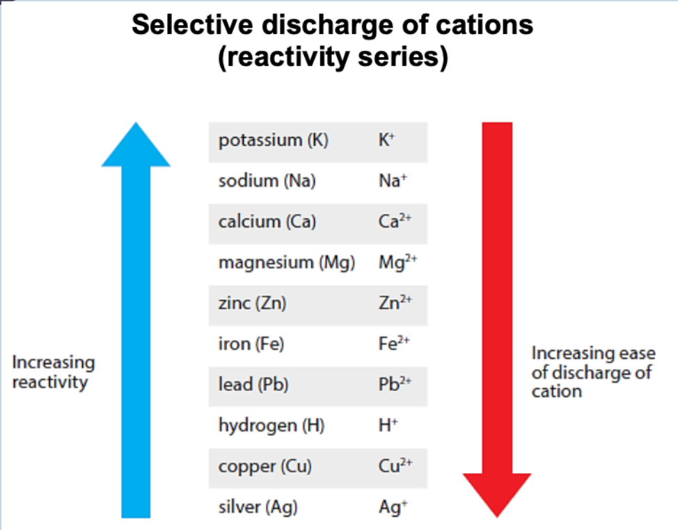
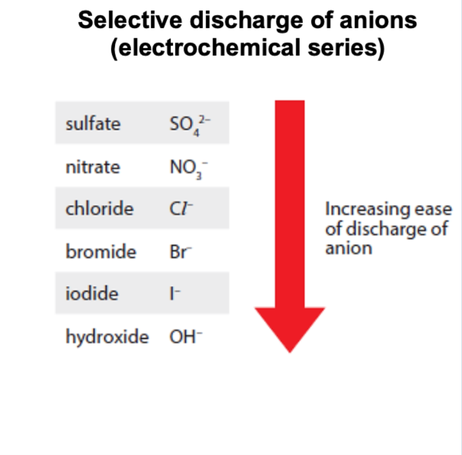

### Comparing Dilute Sodium Chloride vs Dilute Copper(II) Nitrate

|              | Electrolysis of Dilute Sodium Chloride solution | Electrolysis of dilute Copper(II) nitrate solution      |
|--------------|-------------------------------------------------|---------------------------------------------------------|
| Set-Up       | 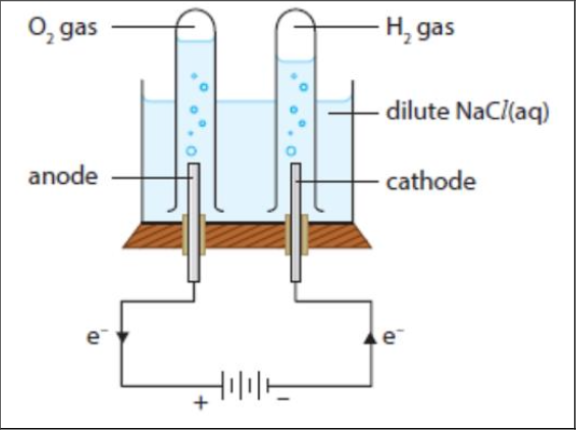        | 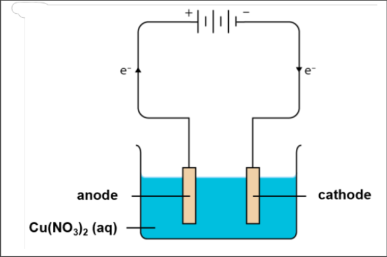                |
| Electrolyte  | aqueous sodium chloride, $\ce{NaCl(l)}$         | aqueous copper(II) nitrate, $\ce{Cu(NO_3)_2 (aq)}$      |
| Ions present | $\ce{Na^+ (aq), Cl^- (aq), H^+(aq), OH^-(aq)}$  | $\ce{Cu^{2+} (aq), NO_3^{-} (aq), H^+ (aq), OH^- (aq)}$ |
| Electrodes   | graphite electrode (inert)                      | graphite electrode (inert)                              |

#### Anode (+) (Oxidation)

##### Dilute Sodium Chloride

- $\ce{Cl^-}$ and $\ce{OH^-}$ attracted to anode
- $\ce{OH^-}$ is lower than $\ce{Cl^-}$ in electrochemical series, hence $\ce{OH^-}$ is selectively discharged.
- Half equation:

$$\ce{4OH^- (aq) -> 2H_2 O (l) + O_2 (g) + 4e^-}$$

#### Dilute Copper(II) Nitrate

- $\ce{NO_3^-}$ and $\ce{OH^-}$ attracted to anode.
- $\ce{OH^-}$ is lower than $\ce{NO_3^-}$ in electrochemical series, hence $\ce{OH^-}$ is selectively discharged.
- Half equation:

$$\ce{4OH^- (aq) -> 2H_2O(l) + O_2 (g) + 4e^-}$$

#### Cathode (-) (Reduction)

##### Dilute Sodium Chloride

- $\ce{Na^+}$ and $\ce{H^+}$ attracted to cathode
- Hydrogen is less reactive than sodium, hence $\ce{H^+}$ is selectively discharged
- Half equation:

$$\ce{2H^+ (aq) + 2e^- -> H_2(g)}$$

##### Dilute Copper(II) Nitrate

- $\ce{Cu^{2+}}$ and $\ce{H^+}$ attracted to cathode
- Copper is less reactive than hydrogen, hence copper is selectively discharged.
- Half equation:

$$\ce{Cu^{2+} + 2e^- -> Cu (s)}$$

#### Overall Equation

##### Dilute Sodium Chloride

$$\ce{2H_2O(l) -> 2H_2(g) + O_2(g)}$$

##### Dilute Copper(II) Nitrate

$$\ce{2Cu^{2+} + 4OH^- (aq) -> 2Cu(s) + 2H_2O(l) + O_2(g)}$$

#### Observations

##### Dilute Sodium Chloride

1. Solution remains neutral as both $\ce{H^+}$ and $\ce{OH^-}$ ions are discharged.
2. Water levels drops
3. Effervescence of colourless gas at both electrodes. Volume of hydrogen gas collected at the cathode is twice the volume of oxygen gas collected at the anode. For every 4 moles of electrons transferred, 2 moles of hydrogen gas and 1 mole of oxygen is produced.

##### Dilute Copper(II) Chloride

1. Solution becomes more acidic as $\ce{OH^-}$ ions are selective discharged while $\ce{H^+}$ ions remain in solution.
2. Reddish-brown solid formed on cathode.
3. Effervescence of colourless gas at anode.
4. Blue solution fades/turns colourless

### Concentration of Halide Ions (For aqueous electrolyte)

- In a concentrated solution, the ease of discharge of $\ce{Cl^-}$, $\ce{Br^-}$, or$\ce{I^-}$ anions increases.

|              | Electrolysis of dilute $\ce{HCl(aq)}$ acid      | Electrolysis of concentrated $\ce{HCl(aq)}$        |
|--------------|-------------------------------------------------|----------------------------------------------------|
| Set Up       |         | 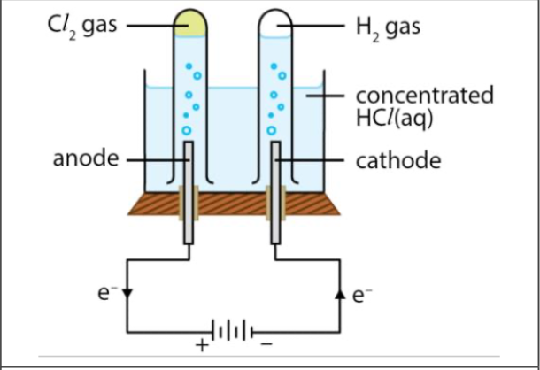           |
| Electrolyte  | dilute hydrochloric acid, $\ce{HCl(aq)}$        | concentrated hydrochloric acid, $\ce{HCl(aq)}$     |
| Ions present | $\ce{H^+(aq),\space OH^-(aq), \space Cl^-(aq)}$ | $\ce{H^+(aq), \space OH^- (aq), \space Cl^- (aq)}$ |
| Electrodes   | graphite electrode (inert)                      | graphite electrode (inert)                         |

#### Anode (+) (Oxidation - Concentrated)

- $\ce{Cl^-}$ and $\ce{OH^-}$ are attracted to anode.
- Concentration effect applies since concentration of $\ce{Cl^-}$ is greater than $\ce{OH^-}$, hence $\ce{Cl^-}$ is selectively discharged.
- Half equation:

$$\ce{2Cl^- (aq) -> Cl_2 (g) + 2e^-}$$

#### Cathode (-) (Reduction - Concentrated)

- $\ce{H^+}$ attracted to cathode
- Since $\ce{H^+}$ is the only cation, $\ce{H^+}$ selectively discharged
- Half equation:
 
$$\ce{2H^+ (aq) + 2e^- -> H_2(g)}$$

#### Overall Equation - Concentrated

$$\ce{2H^+ (aq) + 2Cl^-(aq) -> H_2(g) + Cl_2(g)}$$

#### Observations - Concentrated

1. Solution becomes less acidic as there is a net discharge of $\ce{H^+}$ while $\ce{OH^-}$ ions remain in solution.
2. Effervescence of colourless gas at cathode and greenish-yellow gas at anode. Volume of hydrogen gas collected at the cathode is same as the volume of chlorine gas collected at the anode. For every 2 mole of electrons transferred, 1 mole of hydrogen gas and 1 mole of chlorine is produced.

### Types of Electrodes

- If the electrode used is not graphite or platinum but another metal, the electrode is reactive and is oxidised as the anode during electrolysis.

|              | Electrolysis of dilute copper(II) sulfate solution with reactive electrode |
|--------------|----------------------------------------------------------------------------|
| Set Up       | 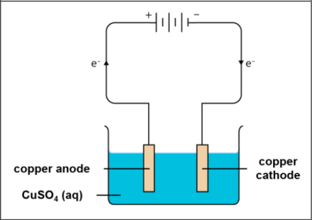                                 |
| Electrolyte  | dilute copper(II) sulfate solution                                         |
| Ions present | $\ce{Cu^2+(aq), SO_4^{2-} (aq), H^+ (aq), OH^- (aq)}$                      | $\ce{Cu^{2+}(aq), SO_4^{2-} (aq), H^+ (aq), OH^- (aq)}$ |
| Electrodes   | copper electrode (inert)                                                   |

#### Anode (+) (Oxidation)

- $\ce{SO_4^{2-}}$ and $\ce{OH^-}$ attracted to anode
- However, copper electrode is a reactive electrode, copper electrode is oxidised instead of anions.
- Half equation:

$$\ce{Cu(s) -> Cu^{2+} + 2e^-}$$

#### Cathode (-) (Reduction)

- $\ce{Cu^{2+}}$ and $\ce{H^+}$ attracted to cathode
- Copper is less reactive than hydrogen, hence $\ce{Cu^{2+}}$ is selectively discharged.
- Half equation:

$$\ce{Cu^{2+} + 2e^- -> Cu(s)}$$

#### Observations

1. Solutions remains neutral as no $\ce{H^+}$ and $\ce{OH^-}$ ions are discharged.
2. Intensity of blue solution remains as concentration of $\ce{Cu^{2+}}$ remains unchanged.
3. Size of anode decreases, size of cathode increases.

## Summary

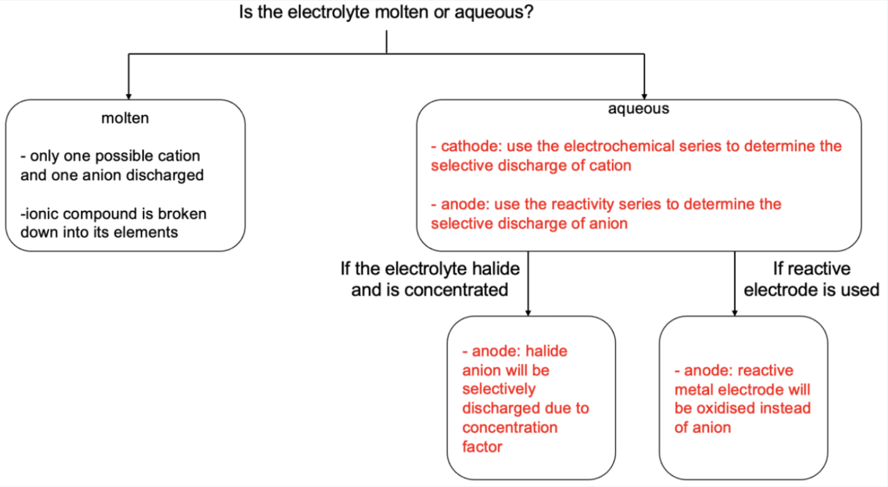

## Applications of Electrolysis

### Metal Purification

- Impure copper can be purified using electrolysis
- The piece of impure copper is made the anode (+) and the piece of pure copper is made the cathode(-).
- Electrolyte is an aqueous solution of copper(II) ions.

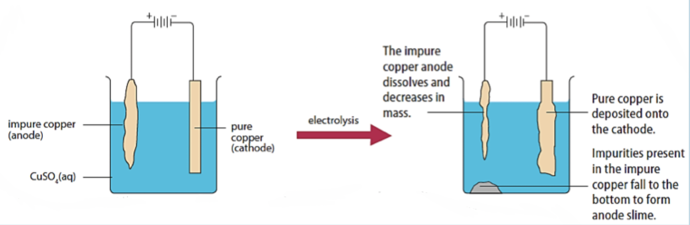

### Electroplating

- Electroplating is coating a thin layer of metal onto an object.
- This is done to protect the object from corrosion and give the object a more attractive appearance.
- The plating metal is made the anode (+), and the object to be plated is made the cathode (-)
- __Electrolyte is an aqueous solution of a salt of the plating metal.__

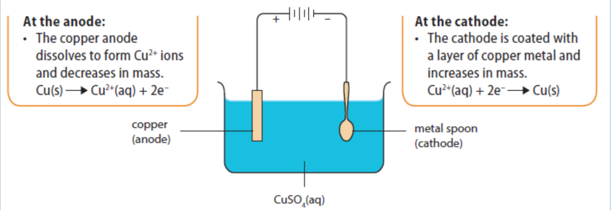

## Hydrogen Fuel Cells

> Suggest why scientists want to make hydrogen from sea water.

To reduce the usage of methane (a fossil fuel) to produce hydrogen from steam reforming. To use non-potable sea water which is present in large quantities, to produce hydrogen instead of more precious fresh water.

> Explain why electrolysis of water has high energy costs.

Electrical energy is constantly supplied to split water to form hydrogen and oxygen gas.

> Write a half equation to show how chlorine is produced from chloride ions.

$$\ce{2Cl^-(aq) -> Cl_2 (g) + 2e^-}$$

