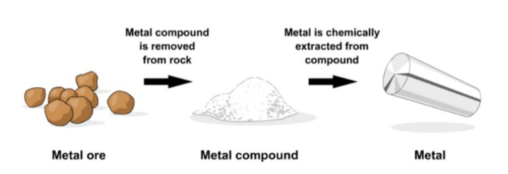
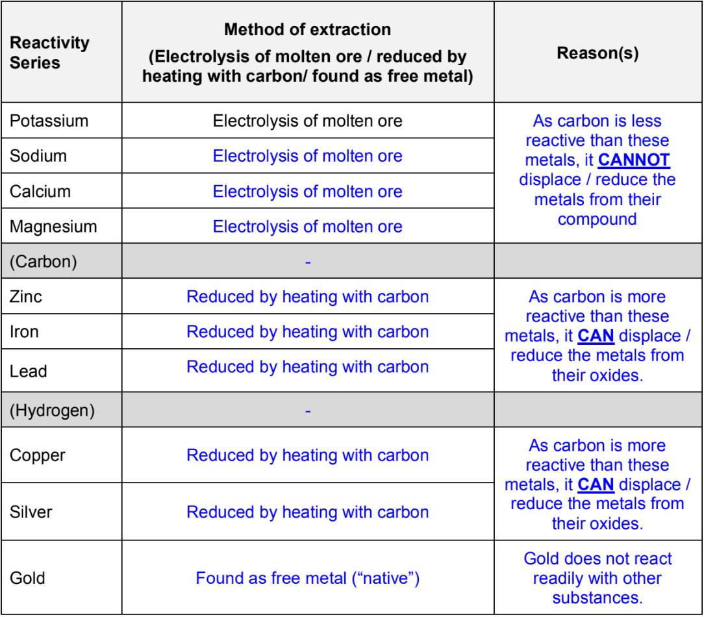
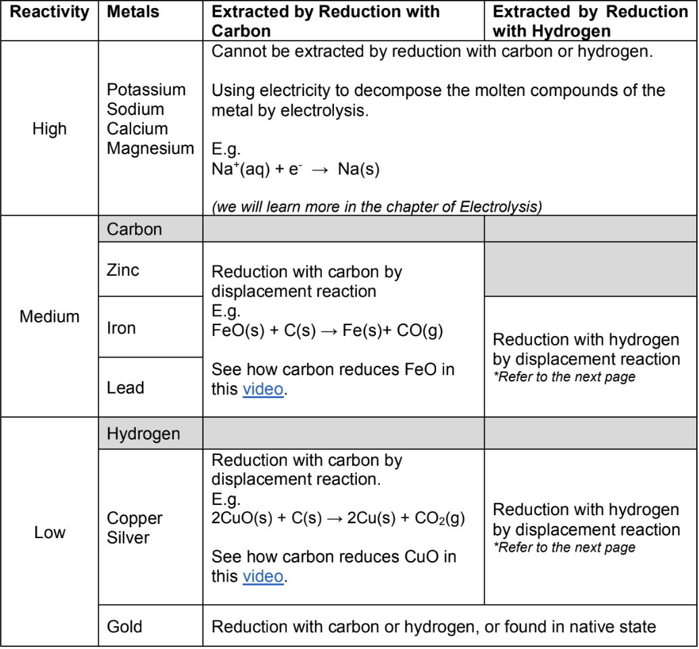
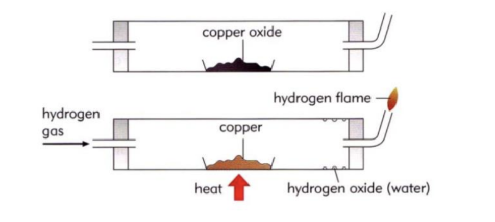

# Reactivity Series

## Metals and their Chemical Properties

### Reactions between Metals

1. $\ce{2K(s) + 2H_2 O (l) -> 2KOH(aq) + H_2(g)}$
2. $\ce{2Na(s) + 2H_2O(l) -> 2NaOH(aq) + H_2(g)}$
3. $\ce{Mg(s) + H_2O(g) -> MgO(s) + H_2 (g)}$
4. $\ce{Ca(s) + 2HCl(aq) -> CaCl_2 (aq) + H_2(g)}$

### Reactivity of Metals

| Metal              | Reaction with Cold Water and Steam                        | Reaction with dilute $\ce{HCl(aq)}$ acid         |
|--------------------|-----------------------------------------------------------|--------------------------------------------------|
| Potassium (K)      | react violently with cold water, explode with steam       | explode with dilute hydrochloric acid            |
| Sodium (Na)        | react violently with cold water, explode with steam       | reacts violently with dilute hydrochloric acid   |
| Calcium (Ca)       | reacts readily with cold water, explodes with steam       | reacts violently with dilute hydrochloric acid   |
| Magnesium (Mg)     | reacts slowly with cold water, react violently with steam | react readily with dilute hydrochloric acid      |
| Zinc (Zn)          | no reaction with cold water, reacts readily with steam    | reacts readily with dilute hydrochloric acid     |
| Iron (Fe)          | no reaction with cold water, reacts slowly with steam     | reacts slowly with hydrochloric acid             |
| Lead (Pb)          | no reaction with cold water and steam                     | reacts very slowly with dilute hydrochloric acid |
| __(Hydrogen) (H)__ |                                                           |                                                  |
| Copper (Cu)        | no reaction with cold water and steam                     | no reaction with dilute hydrochloric acid        |
| Silver (Ag)        | no reaction with cold water and steam                     | no reaction with dilute hydrochloric acid        |

> Please Stop Calling Me Careless Zebra I Like Hyper Cool Smart Giraffe

### Exceptions in the Reactivity Series

> Lead metal reacts with dilute nitric acid. However, when lead metal is added to dilute $\ce{HCl}$ or dilute $\ce{H_2SO_4}$, there is an initial reaction and a little effervescence before the reaction stops. From the reactivity series, lead is above Hydrogen and hence should react with acids to form salt and hydrogen gas.
> Explain why the observations with dilute $\ce{HCl}$ or dilute $\ce{H_2SO_4}$ do not corroborate with the trends predicted by the reactivity series.

- $\ce{Pb(s) + 2HCl (aq) -> PbCl_2(s) + H_2 (g)}$
- $\ce{Pb(s) + H_2SO_4(aq) -> PbSO_4 (s) + H_2 (g)}$

Lead(II) chloride and lead(II) sulfate are both insoluble in water. Upon forming, the soluble salts will coat the lead metal and prevent the metal from further reaction with the acid.

## Displacement of Metals

### Displacement Reactions

Generally, a displacement reaction involves the reaction between __a more reactive element__ and __the compound of a less reactive element__.

> $$\ce{Fe(s) + CuCl_2(aq) -> Cu(s)+ FeCl_2(aq)}$$

The __iron__ has displaced __copper__ from __copper(II) chloride__ solution to form __copper__ and __iron(II) chloride__ solution.

### Practice Question

> Add a strip of zinc metal into aqueous copper(II) sulfate
> Equation: $\ce{Zn(s) + CuSO_4 (aq) -> ZnSO_4(aq) + Cu(s)}$

__Observations:__
- Reddish-brown solid deposits formed.
- Size of metal strip becomes smaller.
- Blue solution fades (or turns colourless)

__Explanations:__
Zinc is more reactive than copper and would displace copper from copper(II) sulfate. Hence, copper metal is deposited and zinc metal ionises to form a colourless solution of zinc sulfate.

## Thermal Stability of Metal Compounds - Decomposition

### Relationship between the reactivity of metal and the thermal stability of its compound

A compound is __thermally stable__ if it __does not decompose__ under the influence of temperature.

Some metal carbonates can be decomposed by heat, producing carbon dioxide gas in the process.

| Metal Carbonates     | Observations                                                |
|----------------------|-------------------------------------------------------------|
| potassium carbonate  | Unaffected by heat                                          |
| sodium carbonate     |                                                             |
| calcium carbonate    | decomposes into metal oxide and carbon dioxide upon heating |
| magnesium carbonate  |                                                             |
| zinc carbonate       |                                                             |
| Iron(II) carbonate   |                                                             |
| lead(II) carbonate   |                                                             |
| copper(II) carbonate |                                                             |
| silver carbonate     | decomposes into silver and carbon dioxide upon heating      |

The more reactive the metal is, the more difficult it is to decompose its carbonate by heat.

Hence, the more reactive metals form carbonates that are more thermally stable.

## Discovering Metals

### Extraction of Metals

The process of getting metals from the ores is called the extraction of metals.

The extraction process is as described:

There are two main methods used to chemically extract the given metal from its metal compounds.

1. __Electrolysis:__ the melting of metal compounds and the use of electricity to decompose the molten compound to obtain the metal.
2. __Reduction by carbon/coke__: Heating the metal compound with carbon to obtain the pure metal. This is considered as both a redox and a displacement reaction.

The reason why there are two different methods to extract metals is:
1. Metals have different reactivity.
2. Extraction methods have costs.

Only two metals, gold and platinum, are found principally in their native states.

Many other metals naturally exist as metal compounds (such as sulfides, oxides, and hydroxides) in ores.

As most metals are reactive, once they are exposed, they would react with oxygen, water, etc. present in the surrounding to form metal compounds.

__In a nutshell:__
- Metals above carbon require extraction by electrolysis of molten ore
- Metals below carbon can be extracted by heating metal ore with carbon.
- Gold needs not be extracted chemically. It is found free (native) metal in the ground.

## Consolidation

The method used to extract a given metal from its compound depends on the reactivity of the metal and the stability of the ore.

> Explain why the very reactive metals (metals above carbon) can only be extracted by electrolysis and not by the reduction of its oxide by carbon.

These metals are more reactive (or more easily oxidised) than carbon and cannot be extracted from their oxides by reduction of carbon.

These metals are very stable as ions in metal compounds. It is very difficult to extract the metal from its compounds.

Electricity is needed to decompose the molten ionic compound to obtain the metal (electrolysis)

> Explain why the less reactive metals (metals below carbon) can be extracted by reduction of their oxides by carbon (displacement reaction).

These metals are less reactive (or less easily oxidised) than carbon and can be displaced from their compounds by reduction with carbon to obtain the metal.

_(These metals can be extracted using electrolysis too! But electrolysis is a very expensive process.)_

## Reduction of Metal Oxides With Hydrogen

Some metals can be extracted from their metal oxide ores by the reduction with hydrogen gas.

Copper, silver and gold can be extracted from their metal oxides by reduction with hydrogen gas.

Copper < Silver < Gold (easiest)

__Chemical Equation__:

$$\ce{CuO(s) + H_2(g) -> Cu(s) + H_2O(l)}$$

## Rusting of Iron

For rusting to occur, the conditions required are:
- Presence of oxygen
- Presence of water

__General Chemical Equation__

$$\ce{4Fe(s) + 3O_2(g) + 2XH_2O(l) -> 2Fe_2 O_3 X H_2 O(s)}$$

### Using Freshly Boiled Water and Oil

- Freshly boiled water has negligible dissolved oxygen as most would have escaped from the solution during the boiling process. This minimises the exposure of the nail to oxygen.
- The oil layer prevents oxygen from the surrounding air from dissolving in the water.

### Increasing rate of rusting

- The rusting process involves the transfer of electrons
- Presence of ions in the solution increases the conductivity of the solution, allowing faster transfer of electrons.
- Rate of rust formation is accelerated.

## Protection of Iron (against rusting)

### Surface Protection

Coating with a layer of:
- paint
- oil/grease
- plastic or __less reactive__ metal (tin, silver) by electroplating.

__How does this prevent rusting?__
- The protective layer prevents the metal from contacting with water and oxygen, thus reducing the rate of rusting
- If the protective layer is scraped off/removed, the iron is exposed to water and oxygen and rusting occurs.

__Uses__
- machine, motor cars, bridges, ships

__Coated with Tin:__
- Cans for can food

__Coated with Chromium""__
- Taps, kettles, bicycles, handlebars

### Sacrificial Protection (using sacrificial metal)

#### __Coat with a layer of $\ce{Zn}$ (galvanising)__

Kitchen sinks, 'zinc' roofs

#### __Attaching blocks of $\ce{Zn}$ or $\ce{Mg}$ metals to iron or steel__
- Note: These blocks of $\ce{Zn}$ and $\ce{Mg}$ metal have to be replaced regularly once they have all been reacted.

__How does this prevent rusting?__

- Both $\ce{Zn}$ and $\ce{Mg}$ are more reactive than iron and would react more readily with oxygen and corrode preferentially, preventing the iron from rusting.
- A coating layer of $\ce{Zn}$ or $\ce{Mg}$ on the entire iron metal surface is not necessary. As long as $\ce{Mg}$ or $\ce{Zn}$ is present, iron will not rust.

__Uses__
- Underground pipes, ships, columns of steel piers

