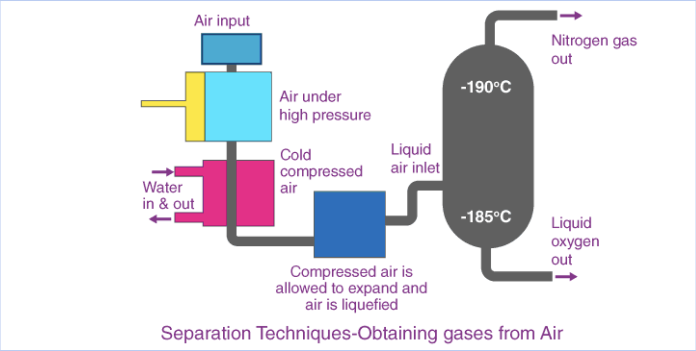

# Ammonia

## Recap on Ammonia

__Chemical Formula:__ $\ce{NH_3}$

### Weak Alkalis

- A weak alkali partially dissociates in water to form hydroxide ions. $\ce{NH_3 (g) + H_2O (l) <=> NH_4^+ (aq) + OH^- (aq)}$

### Conductivity of Ammonia

- Ammonia __cannot conduct electricity in solid, liquid, and gaseous states__ due to __absence of mobile ions and mobile electrons__ to carry charges.
- It is able to conduct electricity in __aqueous state__ due to __the formation of ammonium and hydroxide ions.__

### Testing for Ammonia

- Place a __piece of moist/damp red litmus paper__ at the mouth of the test paper
- Colorless pungent gas __turns moist/damp red litmus paper blue.__

## Uses of Ammonia

Ammonia is a very important chemical, used in the manufacture of:

1. Fertilisers
2. Nitric acid
3. Household cleaning products

__Nitrogen is an essential element required for the survival of plants. Even with an abundance of 78% nitrogen in the air, there is a lack of nitrogen for crop growth. Why is this so?__

- Though $\ce{N_2}$ is present in a large percentage of air, plants are unable to absorb $\ce{N_2}$ from the air directly. $\ce{N_2}$ as to be dissolved in water before plants can absorb them through the roots. 
- (Nitrogen is dissolved naturally when lightning occurs and by certain types of bacteria in soil but these processes do not occur fast enough to support current crop growth.)

### Common Artificial Fertilisers

1. Ammonium Nitrate, $\ce{NH_4 NO_3}$
2. Ammonium Sulfate, $\ce{(NH_4)_2 SO_4}$

## Reversible Reactions

Reversible reactions are chemical reactions that can proceed in both the forward and backward directions.

### Examples:

__Thermal decomposition of ammonium chloride__

$$\ce{NH_4Cl (s) <=> NH_3 (g) + HCl(g)}$$

__Formation and decomposition of hydrogen iodide__

$$\ce{2HI(g) <=> H_2 (g) + I_2 (g)}$$

In reversible reactions, the reactants can change into products and the products can change back into reactants.

> [!NOTE]
> Note the type of arrows to denote reversible chemical reactions.

## Production of Ammonia

### General Word Equation for Reaction Between Ammonium Salt and Base

Alkali + ammonium salt &rarr; salt + water + ammonia

### Raw materials for Haber Process

- The raw materials in the manufacture of ammonia are __nitrogen__ and __hydrogen__.
- The nitrogen is obtained by the __fractional distillation of liquefied air.__
- The hydrogen is obtained from a variety of sources:
    * Reacting together methane and steam
        + methane + steam &rarr; carbon monoxide + hydrogen gas
        + $\ce{CH_4 (g) + H_2O (g) -> CO(g) + 3H_2 (g)}$

__Fractional Distillation of Liquefied Air__

- Cracking hydrocarbons found in crude oil:
    * butane &rarr; ethene + hydrogen
    * $\ce{C_4H_{10} (g) -> 2C_2H_4 (g) + H_2 (g)}$

### Conditions Suitable for Reversible Reactions

Conditions such as temperature and pressure need to be adjusted for reversible reactions.

#### Function of the Iron Catalyst

- The iron catalyst is used to increase the rate of reaction
- It increases the speed of reaction by providing an __alternative reaction pathway__ with a __lower activation energy__
- The finely divided iron catalyst provides a __larger surface area to volume ratio__ for the reaction to take place, further increasing the rate of reaction.

#### Why is ammonia gas condensed into a liquid and not transported in gaseous state?

- Compressing the gas to liquid state allows more ammonia to be stored per volume
- It also allows for easier storage and transportation of ammonia gas.

