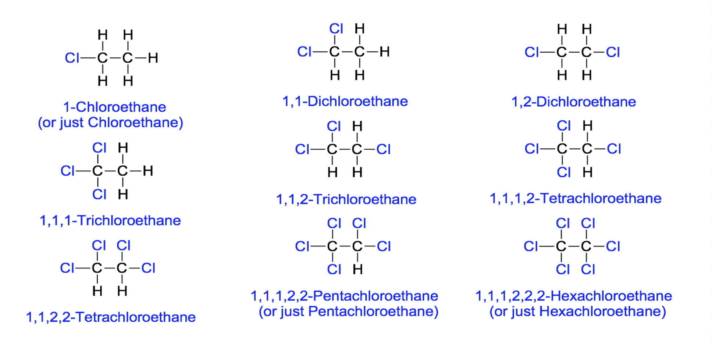
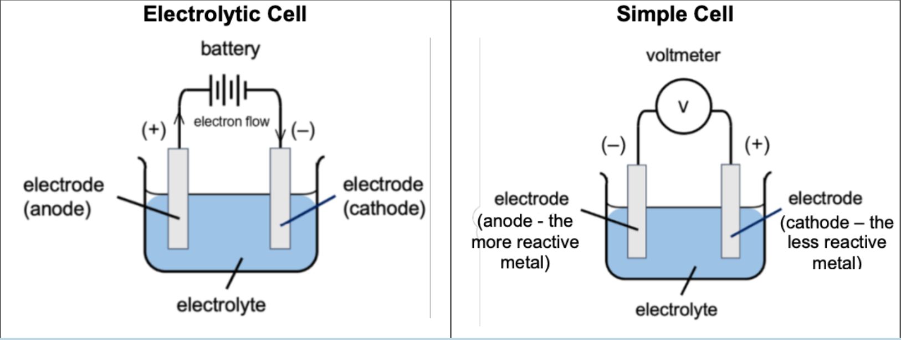
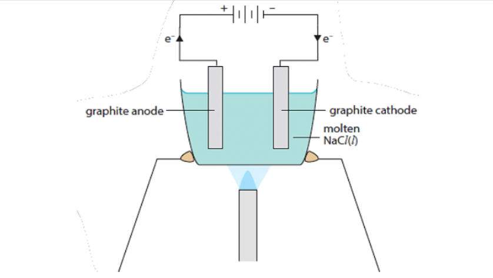
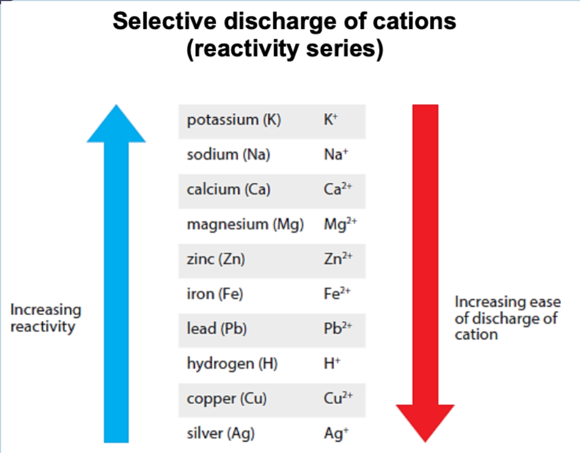
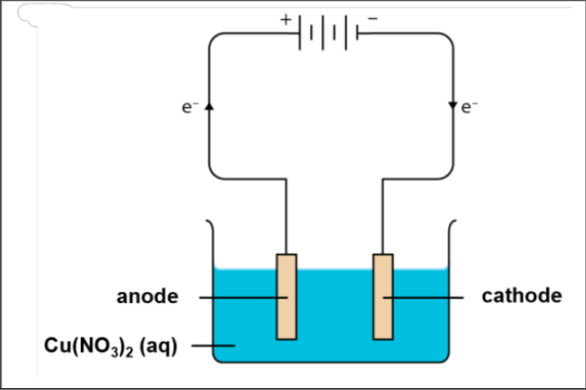
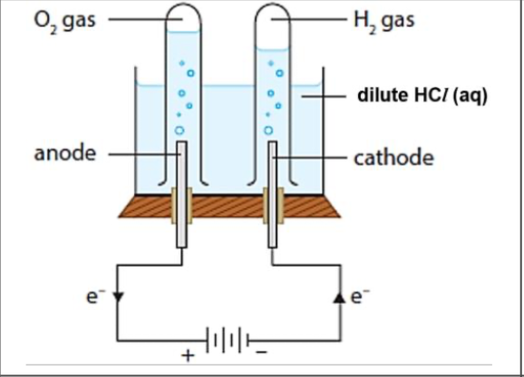
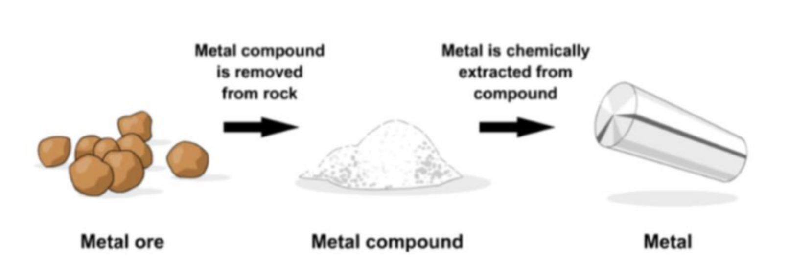
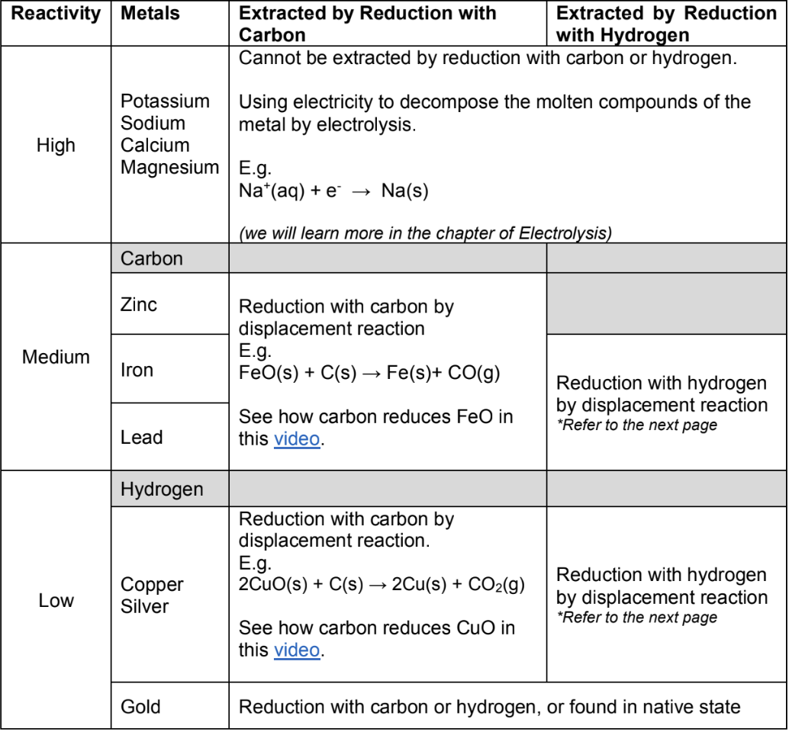

# Chemistry

# Rate of Reaction

## Definition: Rate of Reaction

- The __rate (or speed)__ of a chemical reaction tells us __how quickly or slowly__ a reaction takes place.
- It is defined as the __change in amount of product formed or reactant used per unit time.__

## Methods to Determine Rate of Reaction

### Method 1: Measuring Volume of Gas Produced Per Unit Time

> When 0.50 g of $\ce{CaCO_3}$ solid is added to excess hydrochloric acid, carbon dioxide is formed. The carbon dioxide gas can be collected in the gas syringe using the following apparatus. To determine the rate of the reaction, the volume of gas collected in the gas syringe can be measured over a period of time. A graph of volume of gas collected against time is plotted.


### Method 2: Measuring loss in mass of reaction per unit time

To determine the rate of reaction between 0.50 g of $\ce{CaCO_3}$ solid and excess hydrochloric acid.

#### Apparatus

- Conical flask
- Electronic mass balance
- Stopwatch

#### Experimental Setup


#### Procedure

1. Set up the apparatus as shown above.
2. Use a cotton wool plug to cover the mouth of the conical flask to prevent acid from splashing out during the reaction (resulting in a loss in reactants).
3. Record the mass of the conical flask and its contents.
4. Release the thread and ensure that the calcium carbonate are added into the acid. Start the stopwatch immediately.
5. Record the mass of the conical flask and its contents at regular time intervals (e.g. every 1 minute) until mass remains constant.
6. Use the data collected to plot a graph of mass of conical flask and contents against time.
7. The rate of reaction can be determined from the gradient of the graph of mass against time.

### Method 3: Measuring a changing quantity

To determine the rate of the reaction between 50 cm^3 of 0.200 mol/dm^3 sodium thiosulfate solution and hydrochloric acid.

$$\ce{Na_2S_2O_3 (aq) + 2HCl (aq) -> 2NaCl(aq) + H_2O(l) + SO_2 (g) + S(s)}$$

#### Apparatus

- Conical flask/beaker
- Stopwatch
- White tile with cross or colourimeter

#### Experimental Setup


#### Procedure

1. Set up the apparatus as shown above.
2. Using a measuring cylinder, measure 50 cm^3 of 0.2 mol/dm^3 of sodium thiosulfate solution into the conical flask
3. Using a measuring cylinder, add 100 cm^3 of 0.2 mol/dm^3 dilute hydrochloric acid into the conical flask and start the stopwatch immediately.
4. Look at the cross through the mouth of the flask. Stop the stopwatch when the cross is no longer visible. (yellow solid sulfur produced is opaque and blocks the cross from view as more of it is formed.)
5. Repeat the experiment with a changed variable (e.g. temperature, concentration of solution).
6. The change in rate of reaction can be determined by comparing the change in time taken fro the cross to be covered.

#### Alternative Method

1. Use the colourimeter to measure the colour intensity of the reaction mixture in the conical flask at regular time intervals (e.g. every 1 minute).
2. Use the data collected to plot a graph of colour intensity against time.
3. The rate of reaction can hence be determined through the gradient of the graph of colour intensity against time.

## Collision Theory

- For a reaction to occur and products to form, __the reactant particles must collide with each other.__
- However, only __effective collisions will result in a reaction.__ An effective collision must fulfil the following conditions:
    * The reactant particles must __collide with sufficient energy, equal to or greater than the reaction's activation energy.__
    * The reactant particles must also collide with the __correct orientation__, i.e., "the right way round".

## Factors Affecting Rate of Reaction

There are five factors affecting the rate of reaction. They are:
1. __Concentration:__ applicable for reactants in __aqueous__ state
2. __Pressure:__ applicable for reactants in __gaseous__ state
3. __Particle Size:__ applicable for reactants in __solid__ state.
4. __Temperature__
5. __Presence of Catalyst__

### Factor 1: Concentration

| Lower Concentration                                  | Higher Concentration                                |
|------------------------------------------------------|-----------------------------------------------------|
| __Fewer__ reactant particles per unit volume         | __More__ reactant particles per unit volume         |
| Reactant particles are __further__ from each other.  | Reactant particles are __closer__ to each other     |
| __Fewer__ collisions per unit time between particles | __More__ collisions per unit time between particles |
| Frequency of effective collisions is __lower__       | Frequency of effective collisions is __higher__     |
| __Slower__ rate of reaction                          | __Faster__ rate of reaction                         |

### Factor 2: Pressure

| Lower Pressure                                     | Higher Pressure                                 |
|----------------------------------------------------|-------------------------------------------------|
| __Fewer__ reactant particles __per unit volume__   | __More__ reactant particles __per unit volume__ |
| Reactant particles are __further__ from each other | Reactant particles are __closer__ to each other |
| __Fewer collisions__ per unit time between particles | __More collisions__ per unit time between particles | 
| Frequency of effective collisions is __lower__ | Frequency of effective collisions is __higher__ |
| __Slower__ rate of reaction | __Faster__ rate of reaction |

### Factor 3: Particle Size

| Large Particle Size (Granulated Solid) | Small Particle Size (Powdered Solid) |
|----------------------------------------|--------------------------------------|
| __Bigger__ pieces of solid reactants | __Smaller__ pieces of solid reactants |
| __Smaller__ surface area of solid reactants (given same mass, less number of particles) | __Bigger__ surface area of solid reactants (given same mass, more number of particles) | 
| __Fewer__  collisions per unit time between particles | __More__ collisions per unit time between particles | 
| Frequency of __effective collisions is lower__ | Frequency of __effective collisions is higher__ | 
| __Slower__ rate of reaction | __Faster__ rate of reaction |

### Factor 4: Temperature

| Lower Temperature                                                                            | Higher Temperature                                                                |
|------------------------------------------------------------------------------------------------------------------------------|-------------------------------------------------------------------------------------------------------------------|
| Particles have __less__ kinetic energy and move __slower__                                   | Particles have __more__ kinetic energy and move __faster__                        |
| __Less__ frequent collisions between particles                                               | __More__ frequent collisions between particles                                    |
| __Less__ particles collide with energy __greater or equal__ to activation energy, $E_a$ | __More__ particles coliide with energy greater or equal to activation energy, $E_a$ |
| Frequency of effective collisions is __lower__                                               | Frequency of effective collisions is __higher__                                   |
| __Slower__ rate of reaction                                                                  | __Faster__ rate of reaction                                                       |

## Catalysts

A catalyst increases the rate of chemical reactions without being chemically changed at the end of the reaction.

__Characteristics of Catalysts__
- Increased rate of reaction but not the yield 
- Not used up in the reaction as it can be regenerated at the end of the reaction
- Selective in action (i.e. each catalyst only catalyses certain reactions)
- Can be poisoned by impurities
- Physical appearance may change but remain chemically the same
- Provide an alternative pathway with a lower activation energy, $E_a$, for the reaction

### Factor 5: Presence of Catalyst

| Uncatalysed reaction | Catalysed reaction |
|-|-|
| No catalysts to provide alternative pathway of lower activation energy for the reaction to proceed. | Catalysts increase the speedo f reaction by providing an __alternative pathway of lower activation energy__ for the reaction to succeed. |
| __Less__ particles collide with energy greater or equal to __activation energy, $E_a$__  | __More__ particles collide with energy greater or equal to __activation energy, $E_a$__ |
| Frequency of effective collisions is __lower__ | Frequency of effective collision is __higher__ |
| __Slower__ speed of reaction | __Faster__ rate of reaction |

### Industrial Catalyst

- Industrial catalysts are usually transition metals and their compounds due ot the ability to have variable oxidation states
- By using catalysts, less extreme physical conditions (heat and pressure) are required, saving energy.

| Catalyst                         | Use                                          |
|----------------------------------|----------------------------------------------|
| Iron                             | Manufacture of ammonia in the Haber process  |
| Aluminium or Silicon Dioxide     | Cracking of hydrocarbons                     |
| Nickel                           | Manufacture of margarine from vegetable oils |
| Platinum, Palladium, and rhodium | Catalytic converters                         |

### Biological Catalysts (Enzymes)

- Enzymes are biological catalysts, which catalyse biological processes such a s digestion, energy production, detoxification etc.
- Enzymes are made of proteins
- Sensitive to temperature - most enzymes operate best at body temperature (between 35 degrees Celsius and 40 degrees Celsius). Enzymes are dormant/inactive at low temperatures and __denatured__ at high temperatures. Denaturation is when the specific active site changes and enzyme cannot catalyse the specific reaction anymore.
- Sensitive to pH - operates best at optimal pH range. Different enzymes have different optimal pH range.

#### Specific Catalytic Action

- The active site of each enzyme is specific, and can only fit certain reactant molecules in a specific orientation.
- Applications - Manufacture of food such as cheese, yoghurt and bread, in laundry detergent.

## Graphical Analysis

- Graphs are often used to describe information about a chemical reaction.
- Gradient of graph indicates the speed of the reaction. The steeper the gradient, the faster the speed of reaction. The gradient can change as reaction proceeds as reactants are used up.
- The final volume of gas / mass of the reaction indicates the yield of the reaction. The yield of the products depends on the amount of limiting reagents.

# Fuels and Crude Oil

> _Editor's note: wtf is this topic_

## Introduction to Fuels

- Fossil fuels are formed from decayed plants and animals from millions of years ago.
- They are mainly organic compounds that contain only carbon and hydrogen, known as __hydrocarbons__
- Fossil fuels are important as they are the largest sources of energy for powering transport and electrical appliances, which are essential for us to function in our daily lives.
- When fossil fuels undergo combustion, heat is released as the reaction is an exothermic one. The thermal energy can then be converted to other forms of energy.
- __Crude oil__ and __natural gas__ are forms of fossil fuel.

## Fractional Distillation of Crude Oil


- The different compounds in crude oil have different boiling points.
- Generally, hydrocarbons with larger relative molecular mass have higher boiling and melting points.
- As one moves up the fractionating tower, the temperature decreases.
    * Hydrocarbons boil and rise up the column until they reach the trays that are cool enough for them to condense (into liquids).
    * The liquids are siphoned off at different levels. Hence, hydrocarbon compounds with the highest boiling points will condense in trays __near the bottom of the fractionating column.__
        + Note that the liquid siphoned off at each level is called a __fraction__.
        + Every fraction comprises a __mixture__ of compounds, instead of pure substance.
- The lightest hydrocarbon (petroleum gas, which has the smallest relative molecular mass), does not condense and is collected at the top of the fractionating tower. It can also be used as a fuel.

> Mixture of crude oil is heated so that __it enters the fractionating column as a *gaseous mixture*__ &rarr; ALL the fractions exist as vapour at the same time and then __separate out by selectively condensing__
> __Note:__ During fractional distillation the liquids __DO NOT 'boil' or 'evaporate' one at a time__

## Difference between bioresources and biofuels

Bioresources are raw materials from human or animal activity that are renewable and biodegradable, however, biofuels are fuels that may be derived from bioresources, to be used as alternatives to conventional fossil fuels.

## Government's Plan to Support Domestic Power Generation

It's plan is to blend the use of biomethane in larger quantities with natural gas in the piped networks to support domestic power generation.

## Three Factors for Consideration before Extensive Implementation of Use of Biofuels in Singapore.

- Cost effectiveness in emissions reduction
- Existing infrastructure for fuels and feedstocks
- Suitability of applications for deployment by 2050.

## Suggest one negative impact of the use of biofuel and bioresources on the biodiversity, land use and carbon cycle.

- Biodiversity : With the need for biofuel, there might be a tendency to increase the production of certain types of crops. This will lead to the loss of biodiversity and possible disruption in the natural eco-systems.
- Land use: With the demand for biofuel, there might be demand for land use to grow such crops to meet the demand. There will be competing uses for the land such as for agricultural needs to support food compared to the fuel industry.
- Carbon cycle: Deforestation and land conversion programmes to clear and prepare the lands required to produce biofuel, may release significant amount of CO2. This can offset the environmental sustainability factor of biofuels of being carbon-neutral.

## Possible Contribution of Singapore in Future of Biofuel

Singapore could possibly be a leader in the importing of biofuels and refining them for export.

## Biofuels

- Biofuels are alternative renewable energy sources to crude oil and natural gas.
    * Biofuels are a renewable energy source that is derived from plant, algal or animal biomass.

## Carbon-Intensive Sectors

- Electricity generation
- Transport industry
- Heavy industry
    * Types of businesses that carry a high capital cost, high barriers to entry and low transportability, e.g. petrochemical industry, oil refining, aerospace and aviation.

## Organisation and Understanding of Biofuel

__Biofuel is a renewable energy source that is derived from plant, algal, or animal biomass.__

__Solid Biofuel:__
- Wood chips

__Liquid biofuel:__
- Biodiesel (from vegetable oil)
- Bioethanol (from sugarcane and corn)
__Gaseous biofuel__
- Biogas (from animal waste)

__Bioresources__ are raw materials from human or animal activity that are renewable and biodegradable.

Examples of bioresources are wood chips, vegetable oil, animal fats.
# Introduction to Organic Chemistry

## Organic Compounds

Elements that most organic compounds contain:
- All organic compounds contain __carbon__.
- Most also contain hydrogen
- Others may contain elements such as oxygen, nitrogen or a halogen.

### Homologous Series

- A homologous series is a family of compounds with the __same general formula and similar chemical properties.__
- Each homologous series has a general formula.
	- Subsequent members of organic compounds in the same homologous series differ by a chemical formula of $\ce{-CH_2}$

### Functional Group

- A functional group is a group of atoms that are bonded together in a way that is unique to that particular homologous series. The functional group is responsible for a compound's characteristic __chemical properties__.
- As they possess the same functional group, members of the same homologous series will __react in a similar way to one another.__

## Alkanes and Alkenes

### Properties

|                           | Alkane                                                                                                   | Alkene                                                                                                  |
|---------------------------|----------------------------------------------------------------------------------------------------------|---------------------------------------------------------------------------------------------------------|
| Saturated or Unsaturated? | Saturated hydrocarbon. An alkane contains only single covalent bonds between carbon atoms, $\ce{C-C}$. | Unsaturated hydrocarbon. An alkene contains a double covalent bond between carbon atoms, $\ce{C=C}$ |
| General Formula           | $\ce{C_nH_{2n + 2}}$                                                                                     | $\ce{C_nH_{2n+2}}$                                                                                      |

### Using Prefixes to Name Organic Compounds

| Prefix | Number of Carbon | Name of Alkane | Name of Alkene |
|--------|------------------|----------------|----------------|
| meth-  | 1                | methane        | -              |
| eth-   | 2                | ethane         | ethene         |
| prop-  | 3                | propane        | propene        |
| but-   | 4                | butane         | butene         |
| pent-  | 5                | pentane        | pentene        |

### Properties

- E.g: Boiling point, Melting point, Electrical conductivity (physical properties).
- For Organic Chemistry: __Viscosity (physical)__ and __Flammability (Chemical)__

#### Viscosity

- Measure of "thickness" and stickiness of a liquid
- Ability of fluid to flow

#### Flammability

- __Chemical property:__ The ability of a chemical to burn or ignite, causing fire or combustion.
- Can compare flashpoints: GENERALLY - __higher flashpoint, lower flammability.__

### Trends: MP and BP (physical)

#### Trend and Explanation

The melting points and boiling points of the alkanes generally increases as *relative molecular mass* increases.
- Larger molecules have stronger intermolecular forces of attraction.
- More energy is required to overcome the stronger intermolecular forces of attraction.
- higher MP and BP.

### Trends: Flammability (chemical)

#### Trend and Explanation

The flashpoints of the alkanes and alkenes generally increases as *relative molecular mass increases* &rarr; *flammability* decreases.
- larger molecules have stronger intermolecular forces of attraction, thus less volatile (likelihood of existing as a gas)
- larger molecules also have higher percentage of carbon &rarr; requires more oxygen to burn &rarr; less flammable.

### Trends: Viscosity (Physical)

#### Trend and Explanation

As relative molecular mass increases, the liquid alkanes and alkenes have *higher viscosity.*
- larger molecules have stronger intermolecular forces of attraction.
- harder for liquid containing larger molecules to flow.

### Summary

The gradual change in properties can be observed in __all__ homologous series as a result of the *increase in molecular mass of molecules down the homologous series*.

## Isomerism

### Definition

Isomerism is the phenomenon where __compounds (isomers) have the same molecular formula but different structural formulae.__

- Do not have to be of the same homologous series.
- Different homologous series can have the __same molecular formula.__

# Alkanes and Alkenes

## Chemical Reactions

- Substitution
    * One atom or a group of atoms in a molecule is replaced by another atom or group of atoms from another substance.
    * $\ce{C_2H_5Br + KOH (aq) -> C_2H_5OH + KBr}$
- Addition
    * Two or more molecules react to form a single product where atoms of one reactant are added to adjacent atoms across a carbon-carbon multiple bond.
    * $\ce{C_4H_8 + H_2 -> C_4H_10}$
- Elimination
    * The removal of atoms attached to adjacent carbon atoms in an organic compound to form an unsaturated product and a small molecule.
    * $\ce{C_4H_9OH -> C_4H_8 + H_2O}$
- Condensation
    * Two molecules combine with the removal of water or some other small molecule.
    * $\ce{CH_3COOH + CH_3 OH ->[Conc. \space H_2SO_4 \space Catalyst] CH_3COOCH_3 + H_2O}$
- Hydrolysis
    * Water reacted with a molecule, causing the reactant molecule to break down into smaller molecules
    * $\ce{CH_3COOCH_3 + H_2O ->[dilute \space acid/alkali \space catalyst] CH_3COOH + CH_3OH}$

## Alkanes

### Unreactivity of Alkanes

- Strong $\ce{C-C}$ and $\ce{C-H}$ covalent bonds &rarr; Hard to break
- Undergo __combustion, substitution__ and __cracking__.

### Combustion

The complete combustion of an alkane produces carbon dioxide and water. The reaction is very important because it is highly exothermic.

$$\ce{CH_4(g) + 2O_2(g) -> CO_2(g) + 2H_2O(g)}$$

#### Complete combustion of propane:

$$\ce{C_3H_8 + 5O_2 -> 3CO_2 + 4H_2O}$$

#### Incomplete combustion of propane (insufficient oxygen):

$$\ce{C_3H_8 + 5O_2 -> CO_2 + 2CO + 4H_2O}$$
$$\ce{2C_3H_8 + 9O_2 -> 4CO_2 + 2CO + 8H_2O}$$


> Substance X can be used to detect the presence of water. Identify substance X and describe any changes you would observe if water was present in the test-tube containing X.

Anhydrous copper(II) sulfate can be used to test for water. The white anhydrous copper(II) sulfate will change into blue hydrated copper(II) sulfate upon the addition of water.

> Substance Y can be used to detect the presence of carbon dioxide. Identify substance Y and describe any change you would observe if carbon dioxide was present in the test-tube containing Y.

Limewater/aqueous calcium hydroxide can be used to test for carbon dioxide. A white precipitate will be formed when carbon dioxide is bubbled through limewater.

### Substitution

- Alkanes react with chlorine in the presence of ultra-violet light.
- In this reaction, UV light is used to break the covalent bond in the chlorine molecule to produce chlorine atoms. 
- A hydrogen atom in methane is replaced by a chlorine atom.
- The products belong to a homologous series - *halogenoalkanes.*
- The reaction produces a complex mixture of products as multiple substitutions are also possible.

$$\ce{CH_4 + 2Cl ->[UV \space light] CH_3Cl + HCl}$$
$$\ce{CH_3Cl + 2Cl ->[UV \space light] CH_2Cl_2 + HCl}$$

#### All possible reaction products



### Cracking

Under __high temperatures__ and in the presence of __$\ce{Al_2O_3}$ catalyst__, long chain alkanes can be broken down to smaller alkenes + alkanes/hydrogen gas

$$\ce{C_8H_18 ->[$\ce{Al_2O_3}$ \space catalyst, \space high \space temperature] C_6H_14 + C_2H_4}$$

For:
- production of __smaller molecules with higher demand__ (e.g. ethene, propene, petrol)
- Produce __hydrogen gas for fuel or for the Haber process__.

# Alcohols and Carboxylic Acids

## Alcohols

__Functional Group:__

$$\ce{O-H}$$

__General Formula:__

$$\ce{C_n H_{2n+1} OH}$$

| Name     | Molecular Formula | Structural Formula                       |
|----------|-------------------|------------------------------------------|
| Methanol | $\ce{CH_3 OH}$    | $\ce{CH_3 - O - H}$                      |
| Ethanol  | $\ce{C_2 H_5 OH}$ | $\ce{CH_3 - CH_2 - O - H}$               |
| Propanol | $\ce{C_3 H_7 OH}$ | $\ce{CH_3 - CH_2 - CH_2 - O - H}$        |
| Butanol  | $\ce{C_4 H_9 OH}$ | $\ce{CH_3 - CH_2 - CH_2 - CH_2 - O - H}$ |

## How are Alcohols Synthesised?

### Method A: Fermentation of Glucose

- Fermentation: chemical process in which __microorganisms__ such as yeast act on glucose to produce ethanol and carbon dioxide.
- Yeast contains __enzymes__ that catalyse the breakdown of glucose to form ethanol and carbon dioxide.

#### Balanced Chemical Equation

$$\ce{C_6 H_{12} O_6 (aq) ->[yeast] 2C_2H_5OH (aq) + 2CO_2 (g)}$$

#### Essential Conditions

- Temperature is kept at 37 degrees Celsius
- Absence of oxygen
- Enzymes in yeast

### Method B: Hydration of Alkanes

#### Essential Conditions

- High temperature and pressure (300 degrees Celsius, 60 atm), 
- $\ce{H_3 PO_4}$ catalyst

### Physical Properties of Alcohols

- Soluble in water
- Most are liquids at room temperature
- Alcohols with more carbon atoms (12 and above) are solids at room temperature

The ability to form hydrogen bonds (a type of intermolecular force) allows alcohols to interact with water molecules allowing it dissolves in water. More energy is also required to overcome the hydrogen bonds resulting in higher melting and boiling points of alcohol

#### Solubility of Alcohols

- Alkanes
    * All alkanes are insoluble in water.
    * Alcohols: solubility decreases as number of carbons in chain increases
- The alkyl group (carbon chain) is non-polar and cannot form hydrogen bonds with water. 
- The longer the carbon chain, the more insoluble the alcohol.

## How do Alcohols React?

Alcohols are generally more reactive than alkanes.
- The $\ce{C-O}$ and $\ce{O-H}$ bonds in alcohols are more reactive than the $\ce{C-C}$ and $\ce{C-H}$ bonds in alkanes

### Combustion of Alcohol

- Like all organic compounds, alcohols undergo combustion in the presence of oxygen and heat to produce __carbon dioxide and steam.__

$$\ce{C_2H_5OH (l) + 3O_2 (g) -> 2CO_2 (g) + 3H_2O(g)}$$

### Oxidation

$$\ce{C_3H_7OH ->[acidified\space KMnO_4] C_2H_5COOH}$$

What is the proof that the alcohol has been oxidised?
- Oxygen atom has been added to propanol to form propanoic acid.

What happens if wine is left exposed to air?
- Ethanol in wine is oxidised by aerobic bacteria, forming ethanoic acid.
- This process only happens to ethanol

### Dehydration

$$\ce{C_3H_7OH ->[conc.\space H_3PO_4\space catalyst] C_3H_6 + H_2O}$$

#### As a solvent

- Used in paints, varnishes and perfumes.
- Why is alcohol a good solvent?

The structure of alcohol enables interaction with the organic substances which would not have dissolved in water.

The presence of the hydroxyl group allows to form hydrogen bonds readily with other non-organic substances.

#### As a fuel

- Main constituent in methylated spirit (used in spirit lamps and burners)
- In some countries, it is added to petrol and sold as a "blend".

### Summary: Chemical Reactions that Yield Ethanol

1. Fermentation of sugar with yeast
2. Addition of steam to alkenes (Hydration)

## Carboxylic Acids

### Structure of Carboxylic Acids

__Functional Group:__
$$\ce{O=C-O-H}$$

__General Formula:__
$$\ce{C_n H_{2n+1} COOH}$$

| Name           | Molecular Formula | Structural Formula         |
|----------------|-------------------|----------------------------|
| Methanoic Acid | $\ce{HCOOH}$      | $\ce{H-COOH}$              |
| Ethanoic Acid  | $\ce{CH_3 COOH}$  | $\ce{CH_3-COOH}$           |
| Propanoic Acid | $\ce{C_2H_5COOH}$ | $\ce{CH_3-CH_2-COOH}$      |
| Butanoic Acid  | $\ce{C_3H_7COOH}$ | $\ce{CH_3-CH_2-CH_2-COOH}$ |

### How are Carboxylic Acids Made?

#### Oxidation of Alcohols

1. Heat alcohol with acidified $\ce{KMnO_4}$ solution

$$\ce{C_3H_7OH ->[acidified\space KMnO_4] C_3H_5COOH}$$

#### Physical Properties of Carboxylic Acids

- Soluble in water
- Most are liquids at room temperature

### How Do Carboxylic Acids React?

#### As acids

__Ionic Equation of Ethanoic Acid__

$$\ce{CH_3COOH <=> H^+ (aq) + CH_3COO^- (aq)}$$

__General Reactions as Acids__

- Being weak acids, carboxylic acids react with:
    * Metals
    * Bases
    * Carbonates

#### Write balanced chemical equations for reactions involving carboxylic acids

- $\ce{2CH_3COOH (aq) + Na_2CO_3(aq) -> 2CH_3COONa (aq) + H_2O (l) + CO_2(g)}$
- $\ce{2C_3H_7COOH (aq) + CaO (s) -> (C_3H_7COO)_2Ca (aq) + H_2O (l)}$
- $\ce{HCOOH (aq) + KOH (aq) -> HCOOK(aq) + H_2O(l)}$

## Esterification - Introduction to Esters

### What are esters?

- Sweet aroma
- Used in food and perfume industry

### Homologous Series - Esters 

#### Ethyl Ethanoate

$$\ce{CH3-COO-C_2H_5}$$

#### Methyl Propanoate

$$\ce{C_2H_5-COO-CH_3}$$

#### Functional Group

$$\ce{-COO-}$$

#### General Formula

$$\ce{C_nH_{2n}O_2}$$
$$\ce{C_nH_{2n+2}COO}$$

#### Name

__-yl -anoate__

### Synthesis of Esters

$$\ce{CH_3COOH + CH_3OH <=>[Conc. H_2SO_4 Catalyst] CH_3-COO-CH_3 + H_2O}$$

__Carboxylic acid + alcohol <=> ester + water__

#### Experimental Set-up

- The carboxylic acid and alcohol are heated under __reflux__ in the presence of a __catalyst__ (a few drops of concentrated sulfuric acid).

__Which apparatus is the condenser? purpose?__

- To prevent volatile organic reagents from escaping.
- __Any vapour will condense on the cool surface of the condenser and flow back into the flask.__


### Hydrolysis of Esters

- Esters can be __hydrolysed__ (broken down by water) to form original carboxylic acid and alcohol
- Warm with dilute acid

1. Look out for the $\ce{C-O}$ bond in the functional group of ester
$$\ce{C_2H_5-CO-||-O-CH_3}$$
    - methyl propanoate
2. Separate out the molecule
$$\ce{C_2H_5COO + O-CH_3}$$
3. Add $\ce{-O-H}$ to the $\ce{C=O}$, to form an acid. Add $\ce{-O-H}$ to the remaining part of the compound to form an alcohol.
$$\ce{C_2H_5COOH + H-O-CH_3}$$
    - propanoic acid + methanol

> [!NOTE]
> __Why does the use of dilute acid favour the reverse reaction?__
>
> Hint: What product is formed in the forward reaction?
>
> The presence of water shifts the equilibrium to the left, hence a dilute acid solution would favour the reverse reaction.

# Polymers

## Macromolecules

- Macromolecules are made from smaller subunits, such as:
    * Polymers
        + Smaller subunits are the same type of molecules
    * Non-Polymers

## Polymers and Repeating Units

- Polymers are made from many __smaller molecules__ called __monomers__
- Each small unit within the polymer that repeats itself is a __repeating unit__

## Addition Polymerisation of Ethene

### Chemical Equation

$$\ce{nC_2H_4 -> (-C_2H_4-)_n}$$

### Conditions

- High temperature and pressure

### Uses

Plastic bags, cling film, plastic containers.

## Condensation Polymerisation

Condensation polymerisation occurs when two monomers with __different functional groups__ combine to form a polymer, with the __removal of a small molecule such as water.__

- One monomer that contains the two carboxylic acid functional groups $\ce{(-COOH)}$, __dicarboxylic acid__
- Another monomer that contains either two alcohol functional groups $\ce{(-OH)}$, __diol__, or two amine functional groups $\ce{-NH_2}$, __diamine__

## Condensation Polymers

### Polyester

- Monomers are linked together by ester linkage

### Polyamide

- Monomers are linked together by amide linkage.

### Condensation Polymer - Polyester (Terylene)

Polyester is formed when a diol and a carboxylic acid undergo condensation polymerisation.

# Polymers - The 'Aftermath' of Plastics

## Characteristics of Plastics

- Relatively cheap
- Easily moulded into various shapes
- Light, tough and waterproof
- Durable (resistant to decay, rusting and chemical attack)

## Problems Caused by Plastics

### Environmental Problems

#### Water Pollution

- Plastics in the sea __endanger marine animals,__ often __mistaken for food__ and harmed by them.
- Plastics also __clog up rivers and drains,__ becoming breeding grounds for mosquitoes, spreading diseases like __dengue__.

#### Air Pollution

- Plastics are mostly flammable. When incinerated, plastics __produce poisonous and greenhouse gases.__

## Recycling of Plastics

### Physical Method

#### Pre-treatment of Plastic Waste

- Sort by different methods (manual/density sorting)
- Wash to remove contaminants
- Shredding or grinding to smaller pieces.

#### Mechanical Recycling

- After pre-treatment, small pieces of plastics such as poly(ethene), PE, are melted, cooled, pulled into long, thin strands, and cut into pellets.

### Chemical Method

#### Cracking

- Plastic waste can undergo cracking to form __short chains of alkanes and alkenes__
- Either thermal cracking or catalytic cracking can be done to obtain such products.
    * Short-chain alkanes can be used as fuels
    * Short-chain alkenes may be used to make other useful chemicals through polymerisation.

#### Deploymerisation

- A process in which polymers are broken down into their monomers

##### Acid Hydrolysis

Polyesters can be __hydrolysed__ (broken down by water) to form the original monomers. This is done by __warming__ the polyester with an acid catalyst.

# Maintaining Air Quality

## Composition of Air

### Composition (by volume) of Air

```chart
{
    "type": "pie",
    "data": {
        "labels": [
            "Nitrogen",
            "Oxygen",
            "Argon",
            "Carbon dioxide"
        ], 
        "datasets": [
            {
               "data": [
                    78,
                    21,
                    0.96,
                    0.44
               ],
               "backgroundColor": [
                    "#a6e3a1",
                    "#cba6f7",
                    "#89b4fa",
                    "#fab387"
               ]
            }
        ]
    }
}
```

- __Nitrogen:__ 78%
- __Oxygen:__ 21%
- __Argon:__ 0.96%
- __Carbon Dioxide:__ 0.04%

## Humidity

Humidity is the measurement of water vapour content in air and the water vapour content in air varies.

### Suggest a possible reason why the water vapour content in air varies

Humidity is affected by __temperature__ and __pressure__.

__Location__ can also affect the humidity. In the desert, it is likely that there will be less water vapour present as compared to the coastal areas.

## Separation of Air

How can air be separated to obtain the various constituent gases?

| Type of Gas    | Composition by Volume | Boiling Point / °C |
|----------------|-----------------------|--------------------|
| Nitrogen       | 78%                   | -196.0             |
| Oxygen         | 21%                   | -183.0             |
| Argon          | 0.93%                 | -185.0             |
| Carbon dioxide | 0.04%                 | -78.5              |

Based on the table, each gas has its own boiling point and __through fractional distillation of liquefied air,__ it is possible to obtain each individual gas.

- In the Haber Process, the nitrogen used in the manufacture of ammonia is obtained through distillation of liquefied air.
- However, this is not encouraged for gases aside from nitrogen.
    * That is due to the fact that attempting to obtain any gas aside from nitrogen from liquefied air gives a low yield as the composition of gases in air shows that majority of air is made up of nitrogen.

## Types of Air Pollutants

### Air pollutants, their sources, and effects

#### Carbon Monoxide, $\ce{CO}$

##### Source of Pollutant

- __Incomplete combustion__ of carbon-containing fuels
- Examples of sources:
    * Vehicles and industrial plants
    * Forest fire

##### Effects of Pollutant

- Colourless, odourless __toxic__ gas that __reduces the ability of haemoglobin in blood to transport oxygen to the rest of the body.__ (due to formation of carboxyhaemoglobin)
- Leads to __breathing difficulties, headaches, fatigue before death.__

##### Ways to Reduce Pollutant

- __Catalytic converters__ to convert carbon monoxide to carbon dioxide
- __Reduce__ the use of carbon-containing fuels

##### Relevant Chemical Equations

__Chemical equations in catalytic converters:__
- $\ce{2NO (g) + 2CO (g) -> 2CO_2 (g) N_2 (g)}$
- $\ce{2CO (g) + O_2 (g) -> 2CO_2 (g)}$

#### Oxides of Nitrogen - $\ce{NO, NO2}$

##### Source of Pollutant

- $\ce{N_2}$ and $\ce{O_2}$ in the air reacts at __high temperatures__ to form $\ce{NO}$.
- $\ce{NO}$ then further reacts with $\ce{O_2}$ to form $\ce{NO_2}$.

__Examples:__
- Combustion engine of vehicles
- Forest fire
- Lightning

##### Effects of Pollutant

__Impact on Health__
- Irritates eyes and lungs, causing breathing difficulties

##### Effects on Environment

- Forms __acid rain__ which __corrodes buildings and harms plants and aquatic life (Give the impacts!)__

##### Ways to Reduce Pollutant

- __Catalytic Converters__ to convert nitrogen monoxide to nitrogen

##### Relevant Chemical Equations

__How are oxides of nitrogen produced?__

1. $\ce{N_2 (g) + O_2 (g) -> 2NO(g)}$
2. $\ce{2NO (g) + O_2(g) -> 2NO_2 (g)}$

__How is acid rain formed?__

$$\ce{4NO_2 (g) + 2H_2O (l) -> 4HNO_3(aq)}$$

__How does catalytic converter reduce oxides of nitrogen?__

$$\ce{2NO (g) + 2CO (g) -> 2CO_2 (g) + N_2 (g)}$$

#### Sulfur Dioxide - $\ce{SO_2}$

##### Source of Pollutant

- Combustion of fossil fuel such as coal, petroleum

__Examples of Sources:__
- Power stations
- Volcanic eruption

##### Effects of Pollutant

__Impact on Health__

- Irritates eyes and lungs, causing breathing difficulties

__Impact on Environment__

- Forms __acid rain__ which corrodes buildings and harms plants and aquatic life.

##### Ways to Reduce Pollutant

- Expensive method:
    * Remove fossil fuels before they are burnt
- Cheaper method:
    * Flue gas desulfurisation

##### Relevant Chemical Equations

__How is sulfur dioxide produced?__

$$\ce{S(s) + O_2 (g) -> SO_2 (g)}$$

__How is acid rain formed?__

1. $\ce{2SO_2 (g) + 2H_2O (l) -> 2H_2SO_4 (aq)}
2. __or__ $\ce{SO_2 + H_2O -> H_2SO_3}$
3. $\ce{2H_2SO_3 + O_2 -> 2H_2SO_4}$

__How does flue gas desulfurisation work?__

- $\ce{CaCO_3(s) -> CaO(s) + CO_2(g)}$
- $\ce{CaO(s) + SO_2 (g) -> CaSO_3 (s)}$
- $\ce{2CaSO_3 (s) + O_2 (g) -> 2CaSO_4 (s)}$

#### Unburnt Hydrocarbons (e.g. octane)

##### Source of Pollutant

- Incomplete combustion of fuels in vehicle engine

##### Effects of Pollutant

__Impact on Health__
- Cancer causing (carcinogenic)
- Reacts with sunlight and other pollutants to form ozone.

##### Ways to Reduce Pollutant

- __Catalytic converters__ to convert unburnt hydrocarbons to carbon dioxide and water
- Use of cleaner fuels such as hydrogen

##### Relevant Chemical Equations

__How do catalytic converters reduce unburnt hydrocarbons?__

$$\ce{2C_8H_{18} (l) + 25O_2 (g) -> 16CO_2 (g) + 18H_2O (g)}$$

### Effects of Acid Rain

#### Ground level ozone, $\ce{O_3}$

##### Source of Pollutant

- Forms when __unburnt hydrocarbons and nitrogen oxides__ react in the presence of sunlight

##### Effects of Pollutant

__Impact on health__
- Creates __photochemical smog__ (a mixture of ozone, unburnt hydrocarbons, and nitrogen oxides) which __irritates eyes and lungs, causing breathing difficulties__

__Impact on environment__
- damages crops

##### Ways to Reduce Pollutant

*see methods of reducing unburnt hydrocarbons and nitrogen oxides as they react to produce ground level ozone.*

### Ozone Layer

#### Ozone and its Importance

- Ozone is an important part of the stratosphere
- Acts as shield, __filtering out some of the harmful ultraviolet radiation__, *reducing the chances of getting skin cancer, genetic mutations and eye damage.*

#### How is Ozone Similar to Oxygen?

- Ozone is an allotrope of oxygen, formed out of 3 oxygen atoms.

#### Important Fact

- In small concentrations, ozone is non-toxic
- However, in high concentrations (100 ppm), __ozone becomes toxic__
- Too much ozone can damage the tissues of the respiratory tract.

#### Chlorofluorocarbons

- Chlorofluorocarbons are examples of ozone-depleting substances (ODS)
- Also known as CFCs, they are compounds that contain the elements carbon, fluorine, and chlorine.
- __CFCs are generally used in the manufacture of aerosol sprays, blowing agents for foams and packing materials, as solvents, and as refrigerants.__

##### Role of CFCs

CFCs in the atmosphere are decomposed by sunlight to produce chlorine radicals. These chlorine radicals then react with ozone molecules and destroy them by converting them into oxygen molecules.

1. $\ce{CFCl_3 ->[UV light] CFCl_2^+ + Cl^-}$
2. $\ce{Cl^- + O_3 -> ClO^- + O_2}$
3. $\ce{ClO^- + O^- -> O_2 + Cl^-}$

### Carbon Cycle

- Describes the process in which carbon atoms continually travel from the atmosphere to the Earth and then back into the atmosphere.
- This cycle is important for maintaining a stable climate and carbon balance on Earth.
- Carbon dioxide is __0.03%__ of atmosphere content by volume
- This represents a huge reservoir of carbon, which is constantly being removed from and returned to the atmosphere by a variety of processes.

| Process that takes in carbon from the atmosphere | Process which gives out carbon to the atmosphere |
|--------------------------------------------------|--------------------------------------------------|
| Photosynthesis by plants                         | Respiration by animals                           |
| Ocean uptake                                     | Respiration by plants                            |
|                                                  | Combustion of carbon-containing fuels            |
|                                                  | Bacterial decomposition of organic matter        |
# Salts

## What are Salts?

A salt is an ionic compound that consists of a cation (positive ion) and an anion (negative ion).

### Reactions that produce salts

- acid + reactive metal &rarr; salt + hydrogen
- acid + carbonate &rarr; salt + water + carbon dioxide
- acid + base &rarr; salt + water
- base + ammonium salt &rarr; salt + water + ammonia gas

## Solubility of Salts

| Compound Containing                  | Solubility        | Exceptions                                                             |
|--------------------------------------|-------------------|------------------------------------------------------------------------|
| __Sodium, Potassium, Ammonium__ ions | All are soluble   | -                                                                      |
| __Nitrate__ ions                     | All are soluble   | -                                                                      |
| __Chloride__ ions                    | All are soluble   | lead, silver insoluble                                                 |
| __Sulfate__ ions                     | All are soluble   | barium, calcium, lead insoluble. Silver sparingly soluble              |
| __Carbonate__ ions                   | All are insoluble | sodium, potassium, ammonium, Group 1 are soluble                       |
| __Hydroxide__ ions                   | All are insoluble | sodium, potassium, Group 1, barium soluble. Calcium sparingly soluble. |
| __Halides__                          | All are soluble   | silver, lead                                                           |
| __Oxides__                           | All are insoluble | -                                                                      |

## Preparation of Salts

### Uses of Salts

- Ammonium Phosphate
    * $\ce{(NH_4)_3 PO_4}$
    * A fertiliser used to provide plants with the elements nitrogen and phosphorus, essential for the plants' healthy growth.
- Monosodium Glutamate
    * $\ce{NaC_5H_8NO_4}$
    * A sodium salt of glutamic acid which is used as a flavour enhancer in the food industry, and is especially used to enhance the taste of savoury foods.
- Sodium Fluoride
    - $\ce{NaF}$
    - A salt used to provide the fluoride ions in toothpaste. The fluoride ions prevent cavities and tooth decay.

### Criteria for Preparation of Salts

- Solubility of the salt product
- Solubility of the reactants
- Method to achieve minimal contamination
- Ease of obtaining pure products
- Safety of procedure

### Method 1: Reaction of acid with an excess insoluble substance, metal / carbonate / base

- To prepare a soluble salt from an acid
- Cation of the salt is provided by the insoluble substance, metal / carbonate / base
- Anion of the salt is provided by the acid.

#### Considerations

- Very reactive metals such as Group 1 metals are not reacted with acids due to safety as these metals react explosively with acids.
- Unreactive metals such as copper, silver, and gold do not react with acids.

#### Steps

1. Using a measuring cylinder, transfer $50 cm^3$ of a <ins>suitable acid</ins> into a beaker.
2. Add __excess__ <ins>suitable insoluble metal / carbonate / base</ins> to the acid. Stir the mixture continuously until no more <ins>insoluble metal / carbonate / base</ins> can dissolve.
    - Excess of the insoluble substance can be seen at the bottom of the beaker.
    - __Rationale__
        * Insoluble substance is added in excess to ensure that all the acid has reacted. If not, the mixture at the end will contain excess acid and contaminate the salt produced.
3. Filter to remove <ins>excess insoluble substance</ins> (unreacted) as residue. Collect the filtrate, which is the <ins>desired salt solution</ins>
    - To remove excess insoluble substance
4. Heat the filtrate in an evaporating dish until saturated.
    - To obtain a saturated solution for crystallisation.
5. Cool the saturated solution to allow salt crystals to form.
    - Solubility decreases as solution cools.
6. Filter to collect the crystals. Wash the crystals with a little cold distilled water. Dry the crystals between sheets of filter paper.
    - Use cold distilled water to minimise dissolving of the soluble salt crystals.

### Method 2: Titration

- To prepare a soluble salt containing group 1 or ammonium cation
- Cation of the salt is provided by a soluble alkali or group 1 metal carbonate
- Anion of the salt is provided by the acid.

#### Considerations

- Titration is used to prepare group 1 salts as the metals of these salts are very reactive metals and group 1 carbonates and bases are soluble. Hence, method 1 was unsuitable.

#### Steps

1. Fill a burette with <ins>suitable dilute acid</ins>. Note the initial burette reading, $V_1 cm^3$
2. Pipette $25.0cm^3$ of <ins>suitable aqueous alkali or aqueous carbonate</ins> into a conical flask.
3. Add a few drops of a <ins>suitable indicator</ins> to the solution in the conical flask.
4. Add the <ins>dilute acid</ins> from the burette slowly, swirling the conical flask, until the indicator changes colour permanently. Record the final burette reading, $V_2 cm^3$
5. Find the volume of <ins>dilute acid</ins> added for complete reaction, $V_2 - V_1 cm^3$
    - The colour change at the end point indicates that the reactant has been fully neutralised. The end point indicates the volume of alkali required to react completely with the acid.
6. Repeat the titration without adding the indicator. Add $V_2 - V_1 cm^3$ of the <ins>dilute acid to the aqueous alkali or aqueous carbonate</ins> into a conical flask, to obtain the <ins>desired salt solution.</ins>
    - Titration repeated without indicator so that the final salt produced is not contaminated by the indicator.
7. Heat the <ins>salt solution</ins> in an evaporating dish until saturated.
    - To obtain a saturated solution for crystallisation.
8. Cool the saturated solution to allow <ins>salt crystals</ins> to form. 
    - Solubility decreases as solution cools
9. Filter to collect the crystals. Wash crystals with a little cold distilled water. Dry the crystals between sheets of filter paper.
    - Use cold distilled water to minimise dissolving of the soluble salt crystal.

### Method 3: Ionic Precipitation

- To prepare an insoluble salt using 2 soluble solutions.
- Cation of the salt is provided by an aqueous salt solution, usually a nitrate of the desired cation as well as all nitrate salts are soluble.
- Anion of the salt is provided by another aqueous salt solution or acid, usually a sodium salt of the desired anion as all sodium salts are soluble.
- A precipitate is formed when two clear solutions react together to form an opaque solid product
- All solutions are clear but may be coloured, e.g. "blue solution of copper(II) sulfate".
- All precipitates are opaque and may be coloured, e.g. "yellow precipitate of lead(II) iodide".
- Note: There is no such thing as a clear precipitate!

#### Steps

1. Using a measuring cylinder, transfer $50 cm^3$ of a <ins>suitable salt solution AB</ins> into a beaker
2. Add the other <ins>suitable salt solution CD</ins> into the beaker and stir. Continue to add excess <ins>solution CD</ins> until no more precipitate <ins>AD</ins> forms.
    - Add excess CD so that all AB will be reacted.
3. Filter the mixture to obtain the insoluble salt, <ins>AD</ins> as the residue
    - The filtrate obtained is salt CB and excess CD
4. Wash the residue <ins>AD</ins> with distilled water. Dry the residue between sheets of filter paper. 
    - The residue is washed to remove any excess soluble CD and soluble CB.

# Qualitative Analysis

## Solubility of Ionic Compounds

| Compound           | Soluble / Insoluble | Description                                       |
|--------------------|---------------------|---------------------------------------------------|
| Copper(II) Sulfate | Soluble             | A: white powdery solid, B: blue crystalline solid |
| Sodium Hydroxide   | Soluble             | White powdery solid                               |
| Ammonium carbonate | Soluble             | White crystalline solid                           |
| Silver chloride    | Insoluble           | White powdery solid                               |
| Barium Sulfate     | Insoluble           | White powdery solid                               |
| Iron(II) Sulfate   | Soluble             | Green crystalline solid                           |

## Cation Test

### First Method: Addition of Sodium Hydroxide

#### Experimental procedure:

1. Add 2-3 drops of sodium hydroxide to the given solution and shake gently. Note observations.
2. Continue adding sodium hydroxide to the mixture and shake gently. Note down your observations upon addition of excess sodium hydroxide to the mixture.

#### Observation

- Precipitate formed?
- Colour of precipitate?

If precipitate is formed, proceed to the next step. 

- Shake and observe carefully to see if the precipitate

### Test for Cations - Table

__Experimental Procedure:__ Add 2-3 drops of aqueous sodium hydroxide to the solution
__Type of Reaction:__ Precipitation

| Sample Solution    | Cations Present    | Chemical Formulae of Products     |
|--------------------|--------------------|-----------------------------------|
| Aluminium nitrate  | $\ce{Al^{3+}}$ ion | $\ce{Al(OH)_3 (s) + NaNO_3 (aq)}$ |
| Calcium nitrate    | $\ce{Ca^{2+}}$ ion | $\ce{Ca(OH)_2 (s) + NaNO_3 (aq)}$ |
| Zinc nitrate       | $\ce{Zn^{2+}}$ ion | $\ce{Ca(OH)_2 (s) + NaNO_3 (aq)}$ |
| Copper(II) nitrate | $\ce{Cu^{2+}}$ ion | $\ce{Cu(OH)_2 (s) + NaNO_3 (aq)}$ |
| Iron(II) nitrate   | $\ce{Fe^{2+}}$ ion | $\ce{Fe(OH)_2 (s) + NaNO_3 (aq)}$ |
| Iron(III) nitrate  | $\ce{Fe^{3+}}$ ion | $\ce{Fe(OH)_3 (s) + NaNO_3 (aq)}$ |

__Experimental Procedure:__ Add equal volumes of sodium hydroxide and test sample in the test tube and warm.
__Type of Reaction:__ Base + Ammonium salt

| Sample Solution    | Cations Present    | Chemical Formulae of Products     |
|--------------------|--------------------|-----------------------------------|
| Ammonium nitrate | $\ce{NH^+_4}$ ion |  $\ce{NH_3 (g) + H_2O(l) + NaNO_3 (aq)}$ |

### Dissociation Equation for Aqueous Ammonia

$$\ce{NH_3 (aq) + H_2O (l) -> NH_4^+ (aq) + OH^- (aq)}$$

As aqueous ammonia dissociates to form ammonium cations and hydroxide anions, the hydroxide anions are able to react with the metal cations to form the insoluble hydroxides which will appear in the form of precipitates.

## Second Method: Addition of Aqueous Ammonia

### Experimental Procedure

1. Add 2-3 drops of aqueous ammonia to the given solution and shake gently. Note down the observations.
2. Continue adding aqueous ammonia to the mixture and shake gently. Note down your observations upon addition of excess sodium hydroxide to the mixture.

### Why do we need 2 reagents?

#### What are the observations for addition of aqueous sodium hydroxide and aqueous ammonia to calcium nitrate?

- __Observations for addition of sodium hydroxide:__ White precipitate forms upon addition of aqueous sodium hydroxide. When excess aqueous sodium hydroxide is added, the white precipitate does not dissolve.
- __Observations for addition of aqueous ammonia:__ No precipitate forms upon addition of aqueous ammonia.

#### Why is there such a difference in observation for addition of sodium hydroxide and aqueous ammonia?

- The white precipitate formed in the addition of sodium hydroxide is calcium hydroxide, $\ce{Ca(OH)_2}$. According to the solubility table, calcium hydroxide is partially soluble in water.
- As sodium hydroxide is a strong alkali while aqueous ammonia is a weak alkali, the concentration of $\ce{OH^-}$ ions present in the solution differs.
- Hence, the concentration of calcium hydroxide when aqueous ammonia is added is lower than that of when aqueous sodium hydroxide is added.
- At lower concentrations, the solid structure of calcium hydroxide does not become a visible size. 
- Therefore, we are not able to see the formation of the precipitate.Header name

|    | Experimental Procedure                                                   | Chemical Formula                             | Ionic Equation                                   |
|----|--------------------------------------------------------------------------|----------------------------------------------|--------------------------------------------------|
| 1) | Add 2-3 drops of aqueous sodium hydroxide to copper(II) nitrate solution | $\ce{Cu(NO_3)_2 (aq) + NaOH (aq)}$           | $\ce{Cu^{2+} (aq) + 2OH^- (aq) -> Cu(OH)_2 (s) } |
| 2) | Add 2-3 drops of aqueous sodium hydroxide to iron(III) nitrate solution. | $\ce{Fe(NO_3)_3 (aq) + NaOH (aq)}$           | $\ce{Fe^{3+} (aq) + 3OH^- (aq) -> Fe(OH)_3 (s)}$ |
| 3) | Add 2-3 drops of aqueous sodium hydroxide to zinc nitrate solution       | $\ce{Zn(NO_3)_2 (aq) + NaOH (aq)}$           | $\ce{Zn^{2+} (aq) + 2OH^- (aq) -> Zn(OH)_2 (s)}$ |
| 4) | Add 2-3 drops of __aqueous ammonia__ to aluminium nitrate solution       | $\ce{Al(NO_3)_2 (aq) + NH_3 (g) + H_2O (l)}$ | $\ce{Al^{3+} + 3OH^- (aq) -> Al(OH)_3 (s)}$      |
| 5) | Add 2-3 drops of __aqueous ammonia__ to iron(II) nitrate solution | $\ce{Fe(NO_3)_2 (aq) + NH_3 (g) + H_2O (l)}$ | $\ce{Fe^{2+} (aq) + 2OH^- (aq) -> Fe(OH)_2 (s)}$ | 

## Anion Tests

|    | Aqueous Anions Present | Sample Solutions Containing Ions                     | Experimental Procedure                                   | Chemical formula of reagents               | Chemical formula of products        | Type of Reaction |
|----|------------------------|------------------------------------------------------|----------------------------------------------------------|--------------------------------------------|-------------------------------------|------------------|
| 1) | Chlorides              | Aqueous coppper (II) chloride (any soluble chloride) | Add dilute nitric acid, then add silver nitrate solution | $\ce{CuCl_2 (aq) + AgNO_3 (aq)}$           | $\ce{Cu(NO_3)_2 (aq) + AgCl (s)}$   | Precipitation    |
| 2) | Iodides                | Aqueous sodium iodide                                | Add dilute nitric acid, then add silver nitrate solution | $\ce{NaI (aq) + AgNO_3 (aq)}$              | $\ce{NaNO_3 (aq) + Ag(s)}$          | Precipitation    |
| 3) | Sulfates               | Aqueous aluminium sulfate                            | Add dilute nitric acid, then add barium nitrate solution | $\ce{Al_2(SO_4)_3 (aq) + Ba(NO_3)_2 (aq)}$ | $\ce{Al(NO_3)_3 (aq) + BaSO_4 (s)}$ | Precipitation    |
| 4) | Carbonates | Aqueous ammonium carbonate | Add dilute hydrochloric acid | $\ce{(NH_4)_2CO_3 (aq) + HCl(aq)}$ | $\ce{NH_4 Cl (aq) + H_2O (l) + CO_2 (g)}$ | reaction between acid and carbonate |
| 5) | Nitrates | Aqueous potassium nitrate | Add dilute sodium hydroxide, then add a piece of aluminium foil. Warm carefully. | | | | 

### Purpose of Adding Nitric Acid

- There may be impurities present: i.e. hydroxide and carbonate ions that can precipitate with the same test reagents and give misleading positive results. 
    * Most carbonates and hydroxides are __insoluble.__
- Thus, nitric acid is added to acidify the test sample, so as to __react away any possible carbonates and hydroxides__ in the test sample.
- These carbonates and hydroxides (if present) can also precipitate with the same test reagent and give false positive results.

## Testing for Water

- Copper (II) sulfate has two different forms. One is anhydrous and one is hydrated.
- The anhydrous copper(II) sulfate is a white powdery solid while hydrated copper(II) sulfate is a blue crystalline solid.

## Summary

### Test for anions

| Anion     | Test                                                              | Test Result                             |
|-----------|-------------------------------------------------------------------|-----------------------------------------|
| Carbonate | add dilute acid                                                   | effervescence, carbon dioxide produced. |
| Chloride  | Acidify with dilute nitric acid, then add aqueous silver nitrate  | white ppt.                              |
| Iodide    | Acidify with dilute nitric acid, then add aqueous silver nitrate  | yellow ppt.                             |
| Nitrate   | Add aqueous sodium hydroxide, then aluminium foil; warm carefully | ammonia produced                        |
| Sulfate   | Acidify with dilute nitric acid, then add aqueous barium sulfate  | white ppt.                              |

### Test for aqueous cations

| Cation      | Effect of Aqueous Sodium Hydroxide                         | Effect of Aqueous Ammonia                                      |
|-------------|------------------------------------------------------------|----------------------------------------------------------------|
| Aluminium   | White ppt., soluble in excess giving a colourless solution | white ppt., insoluble in excess                                |
| Ammonium    | Ammonia produced on warming                                | -                                                              |
| Calcium     | White ppt., insoluble in excess                            | No ppt.                                                        |
| Copper (II) | light blue ppt., insoluble in excess                       | light blue ppt., soluble in excess giving a dark blue solution |
| Iron (II)   | green ppt., insoluble in excess                            | green ppt., insoluble in excess                                |
| Iron (III)  | red-brown ppt., insoluble in excess                        | red-brown ppt., insoluble in excess                            |
| Zinc        | White ppt., soluble in excess giving a colourless solution | White ppt., soluble in excess giving a colourless solution     |

### Test for gases

| Gas            | Test and Test Result                                                         |
|----------------|------------------------------------------------------------------------------|
| Ammonia        | Turns damp red litmus paper blue                                             |
| Carbon dioxide | Gives white ppt. with limewater (ppt. dissolves with excess $\ce{CO_2}$ )    |
| Chlorine       | Bleaches damp litmus paper                                                   |
| Hydrogen       | 'pops' with a lighted splint                                                 |
| Oxygen         | Relights a glowing splint                                                    |
| Sulfur Dioxide | Turns aqueous acidified potassium manganate (VII) from purple to colourless. |

# Redox Reactions

## Definitions of Redox

| Type             | Definition of Oxidation     | Definition of Reduction     |
|------------------|-----------------------------|-----------------------------|
| Oxygen           | Gain of oxygen              | Loss of oxygen              |
| Hydrogen         | Loss of hydrogen            | Gain of hydrogen            |
| Electrons        | Loss of electrons           | Gain of electrons           |
| Oxidation States | Increase in Oxidation State | Decrease in Oxidation State |

## Transfer of Electrons - Definition

In the following redox reaction, __zinc metal is oxidised while copper(II) ions are reduced.__

Consider the following reaction:

$$\ce{Zn(s) + CuCl_2(aq) -> ZnCl_2 (aq) + Cu(s)}$$

Ionic equation:

$$\ce{Zn(s) + Cu^{2+} (aq) -> Zn^{2+} (aq) + Cu(s)}$$

An ionic half equation shows which reactant particles gain or lose electrons to form products. To construct ionic half equations, follow these steps:

1. __Isolate reactant and product of the same element__ into a single ionic half equation.
2. __Add coefficients__ to balance the number of elements on the reactant and product sides of the ionic half equation
3. __Add electrons__ to the ionic half equations to balance the charges on the reactant and product sides. Note that electrons are negatively charged.
4. __Write state symbols__ for all reactant and product particles.

Oxidation ionic half equation involving zinc:

$$\ce{Zn(s) -> Zn^{2+} (aq) + 2e^-}$$

Reduction ionic half equation involving copper:

$$\ce{Cu^{2+} + 2e^- -> Cu(s)}$$

| Reactant Particle | Is reactant particle oxidised/reduced? | Are electrons on reactant or product side? | Did reactant particle undergo gain or loss of electrons? |
|-------------------|----------------------------------------|--------------------------------------------|----------------------------------------------------------|
| $\ce{Zn}$         | Oxidised                               | product                                    | loss                                                     |
| $\ce{Cu^{2+}}$    | Reduced                                | reactant                                   | gain                                                     |

#### Using ideas about electron transfer, explain why the reaction between zinc metal and aqueous copper(II) chloride is a redox reaction.
    
- Zinc atom loses electrons to form $\ce{Zn^{2+}}$ ions and copper(II) ions gained electrons to form copper atoms. Hence, zinc atom is oxidised and copper(II) ions are reduced simultaneously.

#### Based on the definitions of oxidation and reduction written in (iii), deduce if oxidation and reduction can take place independently of one another. Explain your answer.

- Oxidation and reduction cannot take place independently of one another as electrons that are lost by a particle is gained by another particle.

#### From your answer in (v), briefly define a redox reaction.

- A redox reaction is a chemical reaction in which reduction and oxidation occur at the same time.

### Examples

_By constructing ionic and ionic half equations for the following reactions, use ideas about electron transfer to explain why they are redox reactions._

$$\ce{2HCl(aq) + Mg(s) -> MgCl_2(aq) + H_2(g)}$$

Ionic equation: $\ce{2H^+(aq) + Mg(s) -> Mg^{2+}(aq) + H_2(g)}$

Ionic half equations:

Oxidation: $\ce{Mg(s) -> Mg^{2+} (aq) + 2e^-}$

Reduction: $\ce{2H^+(aq) + 2e^- -> H_2(g)}$

*Using ideas about electron transfer, explain why the reaction is a redox reaction.*

Magnesium atom loses <ins>electrons</ins> and is <ins>oxidised</ins> to form $\ce{Mg^{2+}}$ <ins>ions</ins>, while hydrogen <ins>ions</ins> gains electrons and is reduced to $\ce{H_2}$ <ins>molecules</ins> simultaneously.

## Oxidation State Rules

1. Elements that are uncombined with other elements are assigned an oxidation number of 0.
2. In simple ions, the oxidation number is simply the charge on the ion.
3. In complex ions, the sum of the oxidation numbers is equivalent to the net charge for polyatomic ions.
4. The oxidation number of hydrogen in all of its compounds is +1, except in metal hydrides where its oxidation number is -1.
5. The oxidation number of oxygen in all its compounds is -2, except in peroxides where it is -1.
6. The oxidation number of Group 1 elements (e.g. sodium) in their compounds is +1, for Group 2 elements (e.g. magnesium) in their compounds is +2, and for aluminium in its compounds is +3.
7. There are many oxidation numbers for Group 17 elements in their compounds but the usual one is -1.
8. The sum of the oxidation numbers of all the elements in a compound is zero.

### Explaining Redox Using O.S

> The oxidation state of <ins>chlorine</ins> decreased from 0 in $\ce{Cl_2}$ to -1 in $\ce{KCl}$, hence chlorine was reduced. The oxidation state of <ins>bromine</ins> increased from -1 in $\ce{KBr}$ to 0 in $\ce{Br_2}$, hence bromine was oxidised simultaneously.

## Oxidising and Reducing Agents

In a redox reaction, both oxidation and reduction take place.
- An __oxidising agent__ (or oxidant) oxidises another substance - and is itself reduced.
- An __reducing agent__ (or reductant) reduces another substance - and is itself oxidised.

### Example

Identify the oxidising agent and reducing agent in the following reaction:

$$\ce{CuO (s) + H_2 (g) -> Cu (s) + H_2 O (\textit{l})}$$

The oxidation state of __hydrogen__ increased from <ins>0 in $\ce{H_2}$ to +1 in $\ce{H_2 O}$ </ins>. Hence, hydrogen is oxidised. The oxidation state of __copper__ decreased from <ins>+2 in $\ce{CuO}$ to 0 in $\ce{Cu}$.</ins> Therefore, hydrogen is the reducing agent and $\ce{CuO}$ is the oxidising agent.

### Testing of Oxidising Agents and Reducing Agents

#### Acidified potassium manganate(VII) solution

Half equation: $\ce{MnO_4^- (aq) + 8H^+ (aq) + 5e^- -> Mn^{2+} (aq) + H_2 O (\textit{l})}$

Acidified $\ce{KMnO_4}$ solution is a <ins>strong oxidising agent</ins> and it turns from purple to colourless when coming into contact with a reducing agent.

#### Potassium iodide solution

Half equation: $\ce{2I^- (aq) -> I_2 (s) + 2e^-}$

$\ce{KI}$ solution is a <ins>reducing agent</ins> and it turns from colourless to brown when coming into contact with an oxidising agent.

# Electrochemistry

## Introduction to Electrochemistry

### Electrolyte

- Ionic compound in molten or aqueous state
- Conducts electricity due to free mobile ions
- Examples: mobile dilute $\ce{H_2SO_4}$, molten $\ce{NaCl}$ and $\ce{CuSO_4}$ solution

### Electrodes

-  A rod or plate which conducts electricity through the electrolyte
-  __ANODE  - OXIDATION__ takes place at this electrode
- __CATHODE - REDUCTION__ takes place at this electrode
- Types of Electrodes:
    * __Inert Electrode__ - An electrode that does not take part in chemical reactions during electrolysis, e.g. graphite/carbon and platinum.
    * It does not react with the product of electrolysis or the electrolytes, and not oxidised in the process.
    * __Reactive Electrode__ - An electrode that takes part in chemical reactions during electrolysis, e.g. metal plates such as copper.

### Electrolytes

Electrolytes conduct electricity differently from electrodes such as metals and graphite.

|                      | Electrolytes (ionic compound)                       | Metals                                           | Graphite                                          |
|----------------------|-----------------------------------------------------|--------------------------------------------------|---------------------------------------------------|
| Method of Conduction | Mobile ions                                         | Flow of mobile electrons from one end to another | Flow of mobile valence electrons along the layers |
| Effect of Conduction | Decomposed to form new substances (chemical change) | Remains chemically unchanged.                    | Remains chemically unchanged                                                   |

## Electrolytic Cells vs Simple Cells



|                   | Electrolytic Cell                                                                                      | Simple Cell                                                                             |
|-------------------|----------------------------------------------------------------------------------------------------------------------------|------------------------------------------------------------------------------------------------------------------------|
| Source of Energy  | Electrical energy is supplied by an external source (e.g. battery)                                     | Electrical energy is produced through chemical reactions                                |
| Energy Conversion | Electrical -> Chemical                                                                                 | Chemical -> Electrical                                                                  |
| Electron Movement | Electrons move from negative terminal of battery to cathode, through electrolyte into anode. | Electrons move from anode to external circuit (voltmeter/bulb e.t.c) into cathode. |

### Similarities

- Both have positive and negative electrodes
- Both have electrolyte
- Both form a closed circuit with the electrons flowing.
- Electrons flow from anode to cathode.

### Differences

#### Electrolytic Cell

- Electrodes connected by battery (source of energy)
- Anode is positive, cathode is negative

#### Simple Cell

- Electrodes connected by voltmeter
- Electrodes are different metals (difference in reactivity as the source of chemical energy)
- Anode is negative, cathode is positive.

### Why are there these similarities and differences?

- Opposite polarity for anode and cathode due to difference in energy conversion
- Oxidation always occurs at anode, reduction always occurs at cathode.

## Factors Affecting Products of Electrolysis

The polarity of a terminal in an electrolytic cell is __determined by the polarity of the battery it is connected to.__

### Definition of Electrolysis

Electrolysis is the decomposition of a compound by electricity.


When the ionic compound is __molten__ or when it is __dissolved in water__, the positive and negative __ions__ become __mobile__ and are free to move towards the electrode of opposite charge, thus __conducting electricity.__

#### Electrolysis of Molten Sodium Chloride

##### Set up



| Electrolyte                            | Ions Present                   | Electrodes                                                                                                                         |
| -------------------------------------- | ------------------------------ | ---------------------------------------------------------------------------------------------------------------------------------- |
| molten sodium chloride, $\ce{NaCl(l)}$ | $\ce{Na^+ (l),\space Cl^-(l)}$ | Graphite electrode (inert) - may have to be replaced periodically due to graphite reacting with oxygen gas under high temperature. |

##### Anode (+) (Oxidation)

- $\ce{Cl^-}$ attracted to anode
- $\ce{Cl^-}$ lose electrons to form $\ce{Cl_2(g)}$, $\ce{Cl^-}$ is oxidised
- $\ce{Cl^-}$ discharged (*meaning ions leave the electrode*)
- Half equation: $\ce{2Cl^{-}(l) -> Cl_{2}(g) + 2e^-}$ 

##### Cathode (-) (Reduction)

- $\ce{Na^+}$ attracted to cathode
- $\ce{Na^{+}}$ gain electrons form $\ce{Na(l)}$, $\ce{Na^+}$ is reduced
- $\ce{Na^+}$ is discharged
- Half equation: $\ce{Na^{+}(l)+ e^{-}-> Na(l)}$ (reduction)

##### Overall Equation

$$ \ce{2NaCl (l) -> 2Na(l) + Cl_{2} (g)}$$

##### Observations

1. Effervescence of greenish-yellow gas appears around at the anode.
2. Greyish (or silvery) liquid is formed at the cathode.

### Selective Discharge of Cations and Anions (Aqueous Electrolytes)

- Consider the difference in ions present in molten sodium chloride and aqueous sodium chloride - molten sodium chloride contains only $\ce{Na^+}$ and $\ce{Cl^-}$ ions, while aqueous sodium chloride contains $\ce{Na^+, \space Cl^-, \space H^+, \space OH^-}$ ions.
- In an aqueous solution, water undergoes partial ionisation to form $\ce{H^+}$ and $\ce{OH^-}$ ions:

    $$\ce{H_2O(l) <=> H^+ (aq) + OH^-(aq)}$$

- In an aqueous electrolyte, there will always be more than one type of cation and anion present.
- However, only one type of cation and anion will be selectively (preferentially) discharged during electrolysis.




### Comparing Dilute Sodium Chloride vs Dilute Copper(II) Nitrate

|              | Electrolysis of Dilute Sodium Chloride solution | Electrolysis of dilute Copper(II) nitrate solution      |
|--------------|-------------------------------------------------|---------------------------------------------------------|
| Set-Up       |         |                 |
| Electrolyte  | aqueous sodium chloride, $\ce{NaCl(l)}$         | aqueous copper(II) nitrate, $\ce{Cu(NO_3)_2 (aq)}$      |
| Ions present | $\ce{Na^+ (aq), Cl^- (aq), H^+(aq), OH^-(aq)}$  | $\ce{Cu^{2+} (aq), NO_3^{-} (aq), H^+ (aq), OH^- (aq)}$ |
| Electrodes   | graphite electrode (inert)                      | graphite electrode (inert)                              |

#### Anode (+) (Oxidation)

##### Dilute Sodium Chloride

- $\ce{Cl^-}$ and $\ce{OH^-}$ attracted to anode
- $\ce{OH^-}$ is lower than $\ce{Cl^-}$ in electrochemical series, hence $\ce{OH^-}$ is selectively discharged.
- Half equation:

$$\ce{4OH^- (aq) -> 2H_2 O (l) + O_2 (g) + 4e^-}$$

#### Dilute Copper(II) Nitrate

- $\ce{NO_3^-}$ and $\ce{OH^-}$ attracted to anode.
- $\ce{OH^-}$ is lower than $\ce{NO_3^-}$ in electrochemical series, hence $\ce{OH^-}$ is selectively discharged.
- Half equation:

$$\ce{4OH^- (aq) -> 2H_2O(l) + O_2 (g) + 4e^-}$$

#### Cathode (-) (Reduction)

##### Dilute Sodium Chloride

- $\ce{Na^+}$ and $\ce{H^+}$ attracted to cathode
- Hydrogen is less reactive than sodium, hence $\ce{H^+}$ is selectively discharged
- Half equation:

$$\ce{2H^+ (aq) + 2e^- -> H_2(g)}$$

##### Dilute Copper(II) Nitrate

- $\ce{Cu^{2+}}$ and $\ce{H^+}$ attracted to cathode
- Copper is less reactive than hydrogen, hence copper is selectively discharged.
- Half equation:

$$\ce{Cu^{2+} + 2e^- -> Cu (s)}$$

#### Overall Equation

##### Dilute Sodium Chloride

$$\ce{2H_2O(l) -> 2H_2(g) + O_2(g)}$$

##### Dilute Copper(II) Nitrate

$$\ce{2Cu^{2+} + 4OH^- (aq) -> 2Cu(s) + 2H_2O(l) + O_2(g)}$$

#### Observations

##### Dilute Sodium Chloride

1. Solution remains neutral as both $\ce{H^+}$ and $\ce{OH^-}$ ions are discharged.
2. Water levels drops
3. Effervescence of colourless gas at both electrodes. Volume of hydrogen gas collected at the cathode is twice the volume of oxygen gas collected at the anode. For every 4 moles of electrons transferred, 2 moles of hydrogen gas and 1 mole of oxygen is produced.

##### Dilute Copper(II) Chloride

1. Solution becomes more acidic as $\ce{OH^-}$ ions are selective discharged while $\ce{H^+}$ ions remain in solution.
2. Reddish-brown solid formed on cathode.
3. Effervescence of colourless gas at anode.
4. Blue solution fades/turns colourless

### Concentration of Halide Ions (For aqueous electrolyte)

- In a concentrated solution, the ease of discharge of $\ce{Cl^-}$, $\ce{Br^-}$, or$\ce{I^-}$ anions increases.

|              | Electrolysis of dilute $\ce{HCl(aq)}$ acid      | Electrolysis of concentrated $\ce{HCl(aq)}$        |
|--------------|-------------------------------------------------|----------------------------------------------------|
| Set Up       |         |            |
| Electrolyte  | dilute hydrochloric acid, $\ce{HCl(aq)}$        | concentrated hydrochloric acid, $\ce{HCl(aq)}$     |
| Ions present | $\ce{H^+(aq),\space OH^-(aq), \space Cl^-(aq)}$ | $\ce{H^+(aq), \space OH^- (aq), \space Cl^- (aq)}$ |
| Electrodes   | graphite electrode (inert)                      | graphite electrode (inert)                         |

#### Anode (+) (Oxidation - Concentrated)

- $\ce{Cl^-}$ and $\ce{OH^-}$ are attracted to anode.
- Concentration effect applies since concentration of $\ce{Cl^-}$ is greater than $\ce{OH^-}$, hence $\ce{Cl^-}$ is selectively discharged.
- Half equation:

$$\ce{2Cl^- (aq) -> Cl_2 (g) + 2e^-}$$

#### Cathode (-) (Reduction - Concentrated)

- $\ce{H^+}$ attracted to cathode
- Since $\ce{H^+}$ is the only cation, $\ce{H^+}$ selectively discharged
- Half equation:
 
$$\ce{2H^+ (aq) + 2e^- -> H_2(g)}$$

#### Overall Equation - Concentrated

$$\ce{2H^+ (aq) + 2Cl^-(aq) -> H_2(g) + Cl_2(g)}$$

#### Observations - Concentrated

1. Solution becomes less acidic as there is a net discharge of $\ce{H^+}$ while $\ce{OH^-}$ ions remain in solution.
2. Effervescence of colourless gas at cathode and greenish-yellow gas at anode. Volume of hydrogen gas collected at the cathode is same as the volume of chlorine gas collected at the anode. For every 2 mole of electrons transferred, 1 mole of hydrogen gas and 1 mole of chlorine is produced.

### Types of Electrodes

- If the electrode used is not graphite or platinum but another metal, the electrode is reactive and is oxidised as the anode during electrolysis.

|              | Electrolysis of dilute copper(II) sulfate solution with reactive electrode |
|--------------|----------------------------------------------------------------------------|
| Set Up       |                                  |
| Electrolyte  | dilute copper(II) sulfate solution                                         |
| Ions present | $\ce{Cu^2+(aq), SO_4^{2-} (aq), H^+ (aq), OH^- (aq)}$                      | $\ce{Cu^{2+}(aq), SO_4^{2-} (aq), H^+ (aq), OH^- (aq)}$ |
| Electrodes   | copper electrode (inert)                                                   |

#### Anode (+) (Oxidation)

- $\ce{SO_4^{2-}}$ and $\ce{OH^-}$ attracted to anode
- However, copper electrode is a reactive electrode, copper electrode is oxidised instead of anions.
- Half equation:

$$\ce{Cu(s) -> Cu^{2+} + 2e^-}$$

#### Cathode (-) (Reduction)

- $\ce{Cu^{2+}}$ and $\ce{H^+}$ attracted to cathode
- Copper is less reactive than hydrogen, hence $\ce{Cu^{2+}}$ is selectively discharged.
- Half equation:

$$\ce{Cu^{2+} + 2e^- -> Cu(s)}$$

#### Observations

1. Solutions remains neutral as no $\ce{H^+}$ and $\ce{OH^-}$ ions are discharged.
2. Intensity of blue solution remains as concentration of $\ce{Cu^{2+}}$ remains unchanged.
3. Size of anode decreases, size of cathode increases.

## Summary


## Applications of Electrolysis

### Metal Purification

- Impure copper can be purified using electrolysis
- The piece of impure copper is made the anode (+) and the piece of pure copper is made the cathode(-).
- Electrolyte is an aqueous solution of copper(II) ions.


### Electroplating

- Electroplating is coating a thin layer of metal onto an object.
- This is done to protect the object from corrosion and give the object a more attractive appearance.
- The plating metal is made the anode (+), and the object to be plated is made the cathode (-)
- __Electrolyte is an aqueous solution of a salt of the plating metal.__


## Hydrogen Fuel Cells

> Suggest why scientists want to make hydrogen from sea water.

To reduce the usage of methane (a fossil fuel) to produce hydrogen from steam reforming. To use non-potable sea water which is present in large quantities, to produce hydrogen instead of more precious fresh water.

> Explain why electrolysis of water has high energy costs.

Electrical energy is constantly supplied to split water to form hydrogen and oxygen gas.

> Write a half equation to show how chlorine is produced from chloride ions.

$$\ce{2Cl^-(aq) -> Cl_2 (g) + 2e^-}$$

# Periodic Table

## Group 1 Elements

- Elements of Group 1 of the Periodic Table are also known as __alkali metals.__
### Properties

1. Group 1 metals have __lower__ density than other metals
2. Densities of Group 1 metals __increase__ down the group
3. Group 1 metals have __lower__ melting points compared to other metals.
4. Melting points of Group 1 metals __decrease__ down the group
5. Group 1 metals can be cut by a knife and are __softer__ compared to other metals.

### Chemical Properties

1. Group 1 metals react in presence of __water (moisture from air)__
2. Group 1 metals react with water to form metal hydroxides and hydrogen gas.
3. The reactivity of Group 1 metals increase down the group.
    - Down the group, the number of electron shells increase, resulting in an __increase in the size of atoms.__ The valence electron will be __located further from the positively charged nucleus.__ Less energy is absorbed to overcome the __weaker electrostatic forces of attraction.__

## Group 17 Elements

Elements in Group 17 of the Periodic Table are also known as __halogens__

### Properties

1. Group 17 elements exist as __diatomic__ molecules.
2. The colour of Group 17 elements gets __more intense__ down the group.
3. Boiling points of Group 17 elements __increase__ down the group.
    - Down the group, there is an __increase in the atomic radius of the elements__ due to the increase in number of electron shells.
    - With a larger atomic radius, the __intermolecular forces of attraction between molecules increases.__
    - Hence __more energy__ is __absorbed__ to overcome the stronger intermolecular forces between halogen molecules.

### Chemical Properties

1. Halogens react __violently__ with __reactive__ metals to form a __salt__
    - $\ce{2Na (s) + Cl_2 (g) -> 2NaCl(s)}$
2. __Halogen displacement according to reactivity__
3. Halogens react to gain electrons and form __anions__
4. The reactivity of halogens decreases down Group 17

#### Halogen Displacement According to Reactivity

|          | Potassium Chloride                                                 | Potassium Bromide                                 | Potassium Iodide                |
|----------|--------------------------------------------------------------------|---------------------------------------------------|---------------------------------|
| Chlorine |                                                                    | Colourless solution turns reddish-brown           | Colourless solution turns brown |
| Bromine  | Reddish-brown bromine solution remains reddish-brown. No solution. |                                                   | Colourless solution turns brown |
| Iodine   | Brown iodine solution remains brown. No solution.                  | Brown iodine solution remains brown. No reaction. |


# Reactivity Series

## Metals and their Chemical Properties

### Reactions between Metals

1. $\ce{2K(s) + 2H_2 O (l) -> 2KOH(aq) + H_2(g)}$
2. $\ce{2Na(s) + 2H_2O(l) -> 2NaOH(aq) + H_2(g)}$
3. $\ce{Mg(s) + H_2O(g) -> MgO(s) + H_2 (g)}$
4. $\ce{Ca(s) + 2HCl(aq) -> CaCl_2 (aq) + H_2(g)}$

### Reactivity of Metals

| Metal              | Reaction with Cold Water and Steam                        | Reaction with dilute $\ce{HCl(aq)}$ acid         |
|--------------------|-----------------------------------------------------------|--------------------------------------------------|
| Potassium (K)      | react violently with cold water, explode with steam       | explode with dilute hydrochloric acid            |
| Sodium (Na)        | react violently with cold water, explode with steam       | reacts violently with dilute hydrochloric acid   |
| Calcium (Ca)       | reacts readily with cold water, explodes with steam       | reacts violently with dilute hydrochloric acid   |
| Magnesium (Mg)     | reacts slowly with cold water, react violently with steam | react readily with dilute hydrochloric acid      |
| Zinc (Zn)          | no reaction with cold water, reacts readily with steam    | reacts readily with dilute hydrochloric acid     |
| Iron (Fe)          | no reaction with cold water, reacts slowly with steam     | reacts slowly with hydrochloric acid             |
| Lead (Pb)          | no reaction with cold water and steam                     | reacts very slowly with dilute hydrochloric acid |
| __(Hydrogen) (H)__ |                                                           |                                                  |
| Copper (Cu)        | no reaction with cold water and steam                     | no reaction with dilute hydrochloric acid        |
| Silver (Ag)        | no reaction with cold water and steam                     | no reaction with dilute hydrochloric acid        |

> Please Stop Calling Me Careless Zebra I Like Hyper Cool Smart Giraffe

### Exceptions in the Reactivity Series

> Lead metal reacts with dilute nitric acid. However, when lead metal is added to dilute $\ce{HCl}$ or dilute $\ce{H_2SO_4}$, there is an initial reaction and a little effervescence before the reaction stops. From the reactivity series, lead is above Hydrogen and hence should react with acids to form salt and hydrogen gas.
> Explain why the observations with dilute $\ce{HCl}$ or dilute $\ce{H_2SO_4}$ do not corroborate with the trends predicted by the reactivity series.

- $\ce{Pb(s) + 2HCl (aq) -> PbCl_2(s) + H_2 (g)}$
- $\ce{Pb(s) + H_2SO_4(aq) -> PbSO_4 (s) + H_2 (g)}$

Lead(II) chloride and lead(II) sulfate are both insoluble in water. Upon forming, the soluble salts will coat the lead metal and prevent the metal from further reaction with the acid.

## Displacement of Metals

### Displacement Reactions

Generally, a displacement reaction involves the reaction between __a more reactive element__ and __the compound of a less reactive element__.

> $$\ce{Fe(s) + CuCl_2(aq) -> Cu(s)+ FeCl_2(aq)}$$

The __iron__ has displaced __copper__ from __copper(II) chloride__ solution to form __copper__ and __iron(II) chloride__ solution.

### Practice Question

> Add a strip of zinc metal into aqueous copper(II) sulfate
> Equation: $\ce{Zn(s) + CuSO_4 (aq) -> ZnSO_4(aq) + Cu(s)}$

__Observations:__
- Reddish-brown solid deposits formed.
- Size of metal strip becomes smaller.
- Blue solution fades (or turns colourless)

__Explanations:__
Zinc is more reactive than copper and would displace copper from copper(II) sulfate. Hence, copper metal is deposited and zinc metal ionises to form a colourless solution of zinc sulfate.

## Thermal Stability of Metal Compounds - Decomposition

### Relationship between the reactivity of metal and the thermal stability of its compound

A compound is __thermally stable__ if it __does not decompose__ under the influence of temperature.

Some metal carbonates can be decomposed by heat, producing carbon dioxide gas in the process.

| Metal Carbonates     | Observations                                                |
|----------------------|-------------------------------------------------------------|
| potassium carbonate  | Unaffected by heat                                          |
| sodium carbonate     |                                                             |
| calcium carbonate    | decomposes into metal oxide and carbon dioxide upon heating |
| magnesium carbonate  |                                                             |
| zinc carbonate       |                                                             |
| Iron(II) carbonate   |                                                             |
| lead(II) carbonate   |                                                             |
| copper(II) carbonate |                                                             |
| silver carbonate     | decomposes into silver and carbon dioxide upon heating      |

The more reactive the metal is, the more difficult it is to decompose its carbonate by heat.

Hence, the more reactive metals form carbonates that are more thermally stable.

## Discovering Metals

### Extraction of Metals

The process of getting metals from the ores is called the extraction of metals.

The extraction process is as described:



There are two main methods used to chemically extract the given metal from its metal compounds.

1. __Electrolysis:__ the melting of metal compounds and the use of electricity to decompose the molten compound to obtain the metal.
2. __Reduction by carbon/coke__: Heating the metal compound with carbon to obtain the pure metal. This is considered as both a redox and a displacement reaction.

The reason why there are two different methods to extract metals is:
1. Metals have different reactivity.
2. Extraction methods have costs.

Only two metals, gold and platinum, are found principally in their native states.

Many other metals naturally exist as metal compounds (such as sulfides, oxides, and hydroxides) in ores.

As most metals are reactive, once they are exposed, they would react with oxygen, water, etc. present in the surrounding to form metal compounds.


__In a nutshell:__
- Metals above carbon require extraction by electrolysis of molten ore
- Metals below carbon can be extracted by heating metal ore with carbon.
- Gold needs not be extracted chemically. It is found free (native) metal in the ground.

## Consolidation

The method used to extract a given metal from its compound depends on the reactivity of the metal and the stability of the ore.



> Explain why the very reactive metals (metals above carbon) can only be extracted by electrolysis and not by the reduction of its oxide by carbon.

These metals are more reactive (or more easily oxidised) than carbon and cannot be extracted from their oxides by reduction of carbon.

These metals are very stable as ions in metal compounds. It is very difficult to extract the metal from its compounds.

Electricity is needed to decompose the molten ionic compound to obtain the metal (electrolysis)

> Explain why the less reactive metals (metals below carbon) can be extracted by reduction of their oxides by carbon (displacement reaction).

These metals are less reactive (or less easily oxidised) than carbon and can be displaced from their compounds by reduction with carbon to obtain the metal.

_(These metals can be extracted using electrolysis too! But electrolysis is a very expensive process.)_

## Reduction of Metal Oxides With Hydrogen

Some metals can be extracted from their metal oxide ores by the reduction with hydrogen gas.


Copper, silver and gold can be extracted from their metal oxides by reduction with hydrogen gas.

Copper < Silver < Gold (easiest)

__Chemical Equation__:

$$\ce{CuO(s) + H_2(g) -> Cu(s) + H_2O(l)}$$

## Rusting of Iron

For rusting to occur, the conditions required are:
- Presence of oxygen
- Presence of water

__General Chemical Equation__

$$\ce{4Fe(s) + 3O_2(g) + 2XH_2O(l) -> 2Fe_2 O_3 X H_2 O(s)}$$

### Using Freshly Boiled Water and Oil

- Freshly boiled water has negligible dissolved oxygen as most would have escaped from the solution during the boiling process. This minimises the exposure of the nail to oxygen.
- The oil layer prevents oxygen from the surrounding air from dissolving in the water.

### Increasing rate of rusting

- The rusting process involves the transfer of electrons
- Presence of ions in the solution increases the conductivity of the solution, allowing faster transfer of electrons.
- Rate of rust formation is accelerated.

## Protection of Iron (against rusting)

### Surface Protection

Coating with a layer of:
- paint
- oil/grease
- plastic or __less reactive__ metal (tin, silver) by electroplating.

__How does this prevent rusting?__
- The protective layer prevents the metal from contacting with water and oxygen, thus reducing the rate of rusting
- If the protective layer is scraped off/removed, the iron is exposed to water and oxygen and rusting occurs.

__Uses__
- machine, motor cars, bridges, ships

__Coated with Tin:__
- Cans for can food

__Coated with Chromium""__
- Taps, kettles, bicycles, handlebars

### Sacrificial Protection (using sacrificial metal)

#### __Coat with a layer of $\ce{Zn}$ (galvanising)__

Kitchen sinks, 'zinc' roofs

#### __Attaching blocks of $\ce{Zn}$ or $\ce{Mg}$ metals to iron or steel__
- Note: These blocks of $\ce{Zn}$ and $\ce{Mg}$ metal have to be replaced regularly once they have all been reacted.

__How does this prevent rusting?__

- Both $\ce{Zn}$ and $\ce{Mg}$ are more reactive than iron and would react more readily with oxygen and corrode preferentially, preventing the iron from rusting.
- A coating layer of $\ce{Zn}$ or $\ce{Mg}$ on the entire iron metal surface is not necessary. As long as $\ce{Mg}$ or $\ce{Zn}$ is present, iron will not rust.

__Uses__
- Underground pipes, ships, columns of steel piers

# Ammonia

## Recap on Ammonia

__Chemical Formula:__ $\ce{NH_3}$

### Weak Alkalis

- A weak alkali partially dissociates in water to form hydroxide ions. $\ce{NH_3 (g) + H_2O (l) <=> NH_4^+ (aq) + OH^- (aq)}$

### Conductivity of Ammonia

- Ammonia __cannot conduct electricity in solid, liquid, and gaseous states__ due to __absence of mobile ions and mobile electrons__ to carry charges.
- It is able to conduct electricity in __aqueous state__ due to __the formation of ammonium and hydroxide ions.__

### Testing for Ammonia

- Place a __piece of moist/damp red litmus paper__ at the mouth of the test paper
- Colorless pungent gas __turns moist/damp red litmus paper blue.__

## Uses of Ammonia

Ammonia is a very important chemical, used in the manufacture of:

1. Fertilisers
2. Nitric acid
3. Household cleaning products

__Nitrogen is an essential element required for the survival of plants. Even with an abundance of 78% nitrogen in the air, there is a lack of nitrogen for crop growth. Why is this so?__

- Though $\ce{N_2}$ is present in a large percentage of air, plants are unable to absorb $\ce{N_2}$ from the air directly. $\ce{N_2}$ as to be dissolved in water before plants can absorb them through the roots. 
- (Nitrogen is dissolved naturally when lightning occurs and by certain types of bacteria in soil but these processes do not occur fast enough to support current crop growth.)

### Common Artificial Fertilisers

1. Ammonium Nitrate, $\ce{NH_4 NO_3}$
2. Ammonium Sulfate, $\ce{(NH_4)_2 SO_4}$

## Reversible Reactions

Reversible reactions are chemical reactions that can proceed in both the forward and backward directions.

### Examples:

__Thermal decomposition of ammonium chloride__

$$\ce{NH_4Cl (s) <=> NH_3 (g) + HCl(g)}$$

__Formation and decomposition of hydrogen iodide__

$$\ce{2HI(g) <=> H_2 (g) + I_2 (g)}$$

In reversible reactions, the reactants can change into products and the products can change back into reactants.

> [!NOTE]
> Note the type of arrows to denote reversible chemical reactions.

## Production of Ammonia

### General Word Equation for Reaction Between Ammonium Salt and Base

Alkali + ammonium salt &rarr; salt + water + ammonia

### Raw materials for Haber Process

- The raw materials in the manufacture of ammonia are __nitrogen__ and __hydrogen__.
- The nitrogen is obtained by the __fractional distillation of liquefied air.__
- The hydrogen is obtained from a variety of sources:
    * Reacting together methane and steam
        + methane + steam &rarr; carbon monoxide + hydrogen gas
        + $\ce{CH_4 (g) + H_2O (g) -> CO(g) + 3H_2 (g)}$

__Fractional Distillation of Liquefied Air__


- Cracking hydrocarbons found in crude oil:
    * butane &rarr; ethene + hydrogen
    * $\ce{C_4H_{10} (g) -> 2C_2H_4 (g) + H_2 (g)}$

### Conditions Suitable for Reversible Reactions

Conditions such as temperature and pressure need to be adjusted for reversible reactions.

#### Function of the Iron Catalyst

- The iron catalyst is used to increase the rate of reaction
- It increases the speed of reaction by providing an __alternative reaction pathway__ with a __lower activation energy__
- The finely divided iron catalyst provides a __larger surface area to volume ratio__ for the reaction to take place, further increasing the rate of reaction.

#### Why is ammonia gas condensed into a liquid and not transported in gaseous state?

- Compressing the gas to liquid state allows more ammonia to be stored per volume
- It also allows for easier storage and transportation of ammonia gas.

