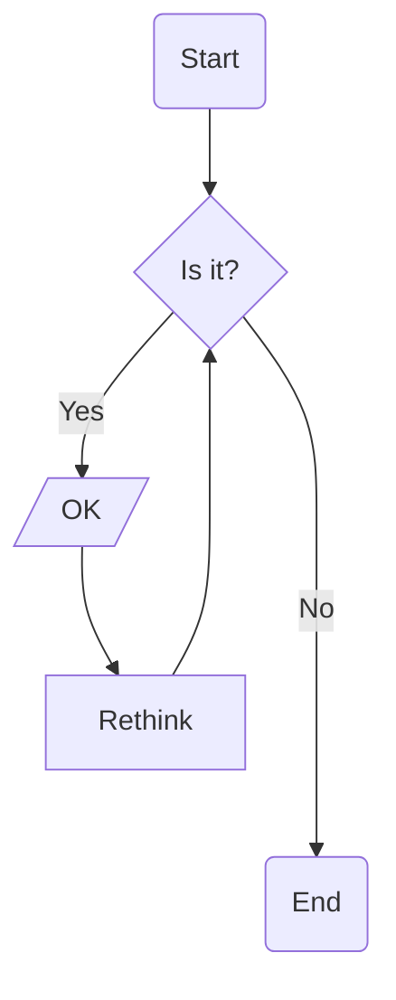

# Algorithm Design

### Definition

**Variable (flowchart and pseudo-code):**

- Named storage space for a value that can be changed while the algorithm is running

**Initialise:**

- To store or assign a value to a variable for the first time.

**Update:**

Updating a variable.

### Storing values in variables

In an algorithm, we use = or ← to store a value in a variable

e.g. 

```python
x = 5
```

word ← “banana”

> [!NOTE]
>
> Characters starting with a letter enclosed in quotation marks are taken as a string
>
> Characters starting with a letter without quotation marks are taken as a variable name
> 
> numerical characters without quotation marks are taken as integers or floating numbers

### List variables

```python
teachers = ['Aurelius', 'Robin', 'Samuel']
```

Each value is identified by a position number **starting from 0**. We can access each entry or element in the list by using the variable name followed by its position number in **square brackets.**

```python
teachers[0], teachers[1], teachers[2]
```

We can change the value of an individual element in the list.

```python
teachers[0] = 'Jovita'
```

### What is a flowchart?

| Step 1: Leave home.     |
| ---                     |
| Step 2: Check the time. |
| …                       |

### Symbols



### Three Semantics of Programming

- Sequences
- Selections
- Iterations

## Pseudo-Code

Depends on organisation.

### Sequence Constructs

code → code → code (top to bottom, left to right)

### Selection Constructs

```python
IF condition AND/OR condition THEN

ELSEIF condition THEN

ENDIF
```

```python
IF condition AND/OR condition THEN

ELSE
	INPUT a
	IF a ... THEN
	
	ENDIF

ENDIF
```

### Iteration Constructs

```python
WHILE... ENDWHILE
FOR... NEXT
```
## Revision: Flowcharts

### Common Symbols

- __Pill:__ Terminator
- __Rectangle:__ Process
- __Rhombus:__ Decision

### Rules

- Don't let the flow lines cross.
- Write conditions as a question.
