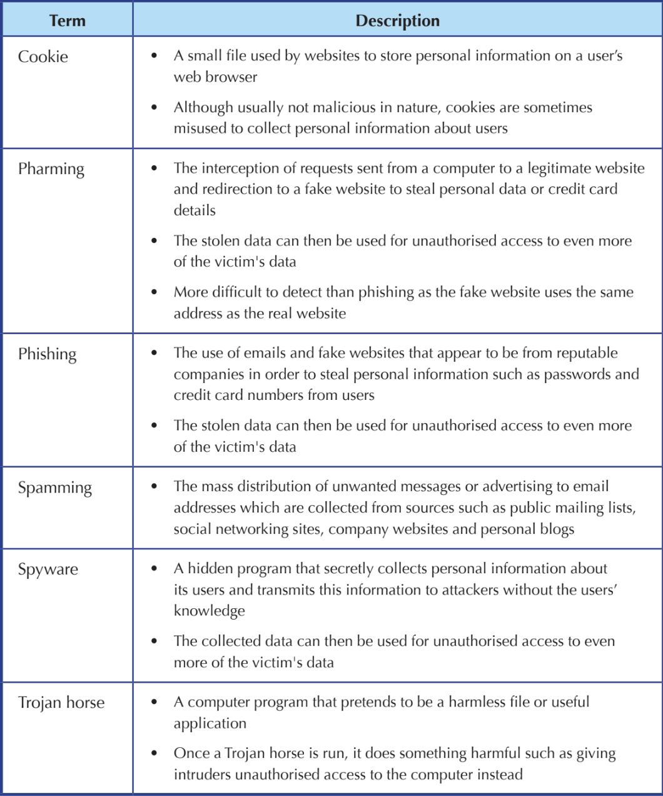
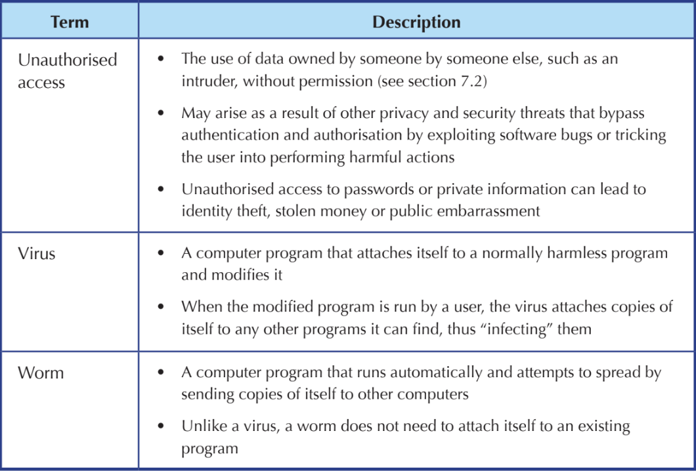

# Ethical, Social and Economic Issues in Computing

## Data Corruption

__Data corruption__ occurs when computer data is made unstable by errors or alterations. This can happen during the reading, writing or transmission of data.

If the corrupted data cannot be recovered / replaced, this results in __data loss__.

### Effects of Corruption and Data Loss

The effects vary depending on the amount of corrupted data and type of data that is represented.

If the corrupted data is not needed to read other data, only that data itself is lost. This is more likely if the amount of corrupted data is small.

However, if the corrupted data is related to other data in the computer, then both itself and its related data may be lost, as it may contain information required to read/interpret the related data. This is more likely if the amount of corrupted data is large.

### Causes and Ways to Prevent Data Corruption and Loss

In all cases, making regular __backups__ (copies of data made in case the original data is damaged or lost) of data will help to prevent the loss of data.

Causes of data corruption and loss include:

- __Human Error__
    - Storage devices may be damaged during transport.
    - Multiple users working on the same file may accidentally overwrite each other.
    - __Preventive Measures__
        - Make regular backups of data
        - Use adequate protection when transporting storage devices.
        - Set up rules when collaborating with multiple users to prevent them from writing to the same file at the same time.
- __Power Failure__
    - If the power supply to a computer fails, data in the process of being written to a storage device may become corrupted and data stored in volatile memory and not yet written to a storage device will become lost.
    - __Preventive Measures__
        - Regular backups
        - Set up a backup power supply, or __uninterruptible power supply (UPS)__ so storage devices can complete any write operations in case of a power failure.
- __Hardware Failure/Damage__
    - All magnetic, optical and solid-state storage devices can fail, either due to overuse, manufacturing defects, or age.
    - __Preventive Measures__
        - Regular backups
        - Check storage device regularly and replace them immediately when signs of failure are detected.

- __Malware/viruses__
    - Some malware may purposely damage and corrupt data as a way of attacking the computer
    - __Preventive Measures__
        - Regular backups
        - Avoid opening emails/attachments or files from unknown sources.
        - Install and configure a firewall to prevent malware from spreading through the network.
        - Install anti-virus and anti-spyware software and perform regular scans and updates

An __uninterruptible power supply__ is a device that provides enough emergency power for a computer to properly shut down in the event of a power failure.

## Authentication

Authentication is the process of verifying the identity of a user. It requires the user to prove their identity by providing evidence from one or more of the following categories:
- Something the user knows (password)
- Something the user owns (mobile phone)
- Something physically unique about the user (thumbprint)

Each category of evidence used for authentication is called an __authentication factor__

### Passwords

Passwords are the most common form of authentication. Some passwords are entered together with a username that identifies who the user claims to be.

They can be a poor form of authentication if they are chosen poorly or not well-kept as a secret. Avoid using birthdates, surnames and other things that can be easily guessed.

Use hard to guess passwords that are a mixture of lowercase, uppercase letters, numbers and symbols.

Avoid re-using passwords or leaving them unchanged for a long time as it makes it easier for an intruder to guess the password. Use unique passwords for each computer and account, and update them at least once every 90 days.

### Unauthorised Access

Some authentication systems require evidence from more than 1 authentication factor. Banks typically issue a device called a security token to users who wish to access their accounts online.

A __security token__ is a device used specifically for authentication purposes, such as mobile phones and one-time passwords (OTPs).

The type of authentication that uses evidence from both something a user knows and owns is called __2-factor authentication__.

2FA is stronger than a singular password as it is more difficult for an intruder to both guess a password and steal the user’s security token. Hence, it is important to keep the security token in a secure location at all times and to report a missing security token as soon as possible.

If an OTP is sent wirelessly to a user’s mobile phone, it may be intercepted and used by an intruder during the transmission process. If the secret algorithm used to generate OTPs is poorly chosen or accidentally revealed, an intruder may find out how to generate OTPs without needing the security token at all.

There is not much a user can do about this type of intrusion attempt.

### Biometrics

__Biometrics__ is a type of authentication that is based on the measurement of
human physical characteristics.

For example, biometrics is used to identify a user by fingerprint or voice. Other characteristics used include the face, iris, retina, and DNA.

The use of biometric identification is more secure as the physical characteristics measured are typically unique to the individual and cannot be easily replicated. Thus, it helps prevent attempts to establish fraudulent identities and __identity theft__.

__Identity theft__ is the impersonation of another person to steal personal details such as name and identity number for fraudulent purposes.

## Authorisation

Once the user is authenticated, the ability of a computer to control the access of data and resources by that user is called __access control/authorisation__.

Computers provide access control through a variety of means.

### File Permissions

Most operating systems have settings to control the ability of users to view or make changes to specific files or folders. These settings are called __permissions__.

An application of file permissions is when a teacher may set a presentation file to be read-only for students, so they do not accidentally (or intentionally) change its contents.

Typically, users can only change the permissions for any file or folder they own. However, most OS's allow for a special user called the __administrator__, who can override the permissions for almost any file or folder.

A normal user may also be given special __administrator rights__ that allow them to override the permissions for certain files or folders, just like an administrator.

Managing permissions and administrative rights can be a complex task, and it is possible to accidentally grant access to a file or administrative rights to an unauthorised user. Such a user can then make use of such mistakes to gain unauthorised access to data and resources.

Authentication for the administrator must be especially strong, as an intruder that successfully claims to be an administrator can bypass file permissions entirely.

File permissions do not prevent an intruder with physical access to a storage device from accessing files or folders directly without going through the operating system. To prevent such access, it is necessary to use encryption.

File permissions can be used as access control for both computers connected to a network and computers that are not connected to a network, but are shared by multiple users.

### Firewalls

Computers connected to a network are naturally more susceptible to intrusion as unauthorised access can occur without the physical presence of an intruder.

Hence, computers connected to a network usually require another layer of access control called a __firewall__

A firewall is a device/network that prevents unauthorised access to or from a private network. It works by monitoring each piece of data transmitted through a network. It then either blocks or allows data to pass based on a set of rules configured by an administrator.

When properly configured, a firewall can protect computers within a network from unauthorised access. They can be configured to block the transmission of data (aka __traffic__) between unauthorised senders and receivers, especially requests for data from anonymous users on the internet. This prevents intruders from gaining access to the computers within a network.

Since firewalls can also block traffic based on the type of application that is transmitting the data, it can also stop certain harmful programs from sending copies of themselves to other computers through the network.

Configuring a firewall correctly can be complex and a misconfigured firewall may have security vulnerabilities that allows intruders to gain unauthorised access.

A properly configured firewall allows for a private network (aka __intranet__) to be set up such that all external traffic is blocked and only authenticated and authorised users are able to access it. Since the users on a private network are generally trusted and expected to keep information on the network confidential, there are usually fewer concerns about unauthorised access when sharing data on a private network.

Conversely, a private network such as the Internet allows anyone to connect to it and share data. Since public networks have little-to-no restrictions, users need to be wary of possible security and privacy risks when accessing it.

## Encryption

__Encryption__ is the process of encoding data so that a secret key is required to read the data. Like passwords, the secret key is usually provided as a sequence of bytes.

Before the encrypted data is decoded using the secret key, it appears as random and meaningless data.

Encryption is often used to protect data from unauthorised access by allowing only authorised users to have the secret key. It can be used in combination with file permissions so an unauthorised user who bypasses file permissions would still be unable to use the accessed data without knowing the secret key.

## Understanding of Privacy Policies

Unauthorised access can occur indirectly due to the actions of 3rd-party users or services.

For example, a user alters file permissions to let a classmate access some private files. That classmate in turn shares those files with others without the original user's knowledge.

- __Privacy__ - The ability to keep specific data or resources from being known by others.
    - In many countries, organisations are required by law to publicise or make available a privacy policy about the rules and practices they follow regarding the collection, protection and use of personal or private data provided by users.
    - __Example__: Organisations in Singapore are required by the Personal Data Protection Act (PDPA) to make their privacy policies available upon request.

An increasing number  of users share personal information such as photos and location data using online services, many of them are unfamiliar with the relevant privacy policies or how such sharing habits may indirectly result in unauthorised access. A poor understanding of the privacy policies of these services can often result in unauthorised access.

### Social Networking Sites

Social networking sites such as Twitter, Instagram and TikTok allow users to share photographs and information quickly with their families or friends. They can also be used to promote businesses or raise awareness of campaigns or causes.

However, these sites can pose many privacy concerns because most users do not read or consider the repercussions of the privacy policies used by these sites regarding personal information such as status updates, notes, photographs and location data.

The privacy policies for many social networking sites do not guarantee that personal data collected will never be exposed to unauthorised users and may even require that your personal data be shared with advertisers in order to use their sites. Hence, personal data can potentially be harvested for spam and other threats to privacy that users did not authorise directly.

Remember: Once data is digitised and uploaded to a public network such as the Internet, it can potentially remain there forever, since it can be easily copied and republished in ways no longer under the control of the original uploader.

Oh, and also some privacy policies for some social networking sites don’t guarantee that their personal data will be deleted from the site completely or immediately even after their account is closed, deleted, or has all personal data removed from it.

Personal data is sensitive and should not be shared publicly. Some companies may reject candidates after reviewing the information and photographs posted on their social networking accounts, even if this was posted while they were still at school.

## Summary

### Preventing Unauthorised Access

- Read and fully understand the privacy policy of the social networking site.
- Set sharing settings to "private" so only people you know in real life can read your posts.
- Think twice before posting personal photographs or information that you may feel uncomfortable sharing.
- Accept friend requests wisely. Make sure you know everyone in your friends list.

## Threats to Privacy and Security

### Defensive Measures Against Privacy and Security Threats

#### Installing anti-virus and anti-spyware programs

- __Anti-Spyware__ - Software to detect, remove and stop spyware and other malware from running.
- __Anti-virus__ - Software to detect, remove and stop viruses and other malware from running.

Counters viruses, worms, spyware and Trojan horses, since they need to run on a user's computer in order to perform their respective attacks.

These programs can be used to scan a user's storage and email to detect and remove malware. If a program has been infected by a virus, it may also try to restore the original program.

Although powerful, most rely on a list of __signatures__, unique evidence used to detect a known version of some malicious software. This list has to be updated regularly to ensure protection provided continues to be effective against new malware. Most programs update the list automatically through the Internet.

Some especially devious Trojan horses appear to be anti-virus and anti-spyware programs. Only trust programs provided by reputable companies, or as part of the computer's __operating system__.

### Operating System

An __operating system__ is software designed to support a computer's basic functions, such as Windows and MacOS.

### Update Software Regularly

Most malware require human interaction to activate, but worms can run automatically by exploiting bugs in otherwise legitimate programs already running on a computer.

For example, a flawed web browser may have a bug that allows websites to run malicious programs without the user's knowledge.

To prevent this, update software regularly so bugs that were discovered since the last update can be fixed. This is especially important for software used to interact with public networks like the Internet, as data from public networks is more likely to be malicious and designed to take advantage of known bugs.

### Identity Phishing

Phishing emails should be ignored and deleted. There are several telltale signs to identify phishing emails.
- Claims to be from a company/bank asking for confidential information. Most companies and banks never ask for such information via email. If in doubt, call the company or bank to verify.
- Generic greeting such as "Dear User", it is a sign that the email was sent automatically and not by a person.
- Inaccurate logos and grammatical or spelling errors.
- Sender's email address or contact does not match the supposed source of email.
- Email has hyperlinks with destinations that do not match what the hyperlink text says or is otherwise unexpected. Place mouse cursor over the hyperlink and its destination should appear as a popup or on the status bar.
- Excessively urgent or threatening tone, a scare tactic to make victims act before they can think through their actions properly.
- Email promises offers that are too good to be true, tempting victims into revealing personal information.

### Identity Pharming

Pharming is like phishing V2. The attacker attempts to intercept requests sent from a computer to a legitimate website and redirects the user to a fake website to steal personal data.

For example, a victim of pharming may log into their bank account, and are presented with a website that looks like the bank, but isn't. The attacker can now retrieve your account details to access your bank account on the actual website, stealing your money.

For pharming to be successful, the attacker must either have malware running on the victim's computer or has taken control of a network device such as a router or server. This can occur as the software that runs on such devices is also susceptible to bugs.

It is harder to detect as everything seems to be normal while the attack takes place. Measures include:
- Ensure encryption is used when submitting sensitive information via the internet. Check if there's a padlock icon at the address bar.
- Regularly check bank, debit/credit card and other statements to ensure all transactions are legitimate.
- Regularly update web browsers and the software running on the network hardware so that all known bugs are fixed.
- Enable 2FA for all bank transactions. This means even if the attacker is able to access the bank account, no unauthorised transactions can occur as the attacker would not be able to provide the required OTP.

### Manage Spam

