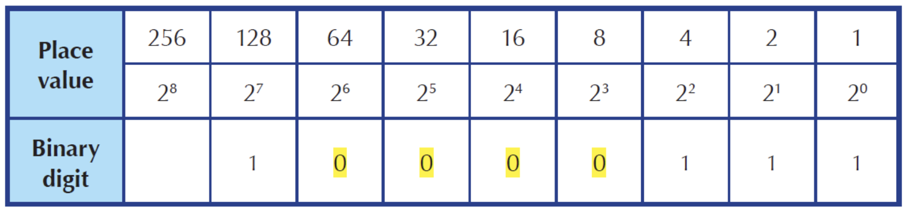
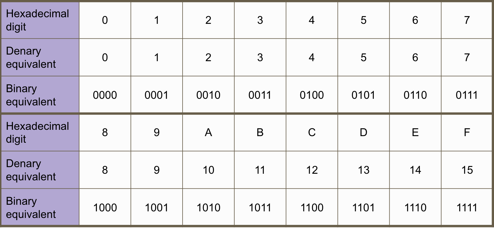

# Number Systems

## Denary Number System

### Definition
A number system that is made up of __10 unique digits__.
- Uses place values of powers of 10.

## Binary Number System

### Definition
A number system that is made up of __2 unique digits__.
- Uses place values of powers of 2.

## Notation
To distinguish binary numbers from denary numbers, they can be written in any of the following ways:
- $1101$
- $(1101)_2$
- $0b1101$

Leading zeros are sometimes also shown when using binary numbers in computer systems to show all 8 binary bits in a byte:

e.g. $0000 \space  1101$

## Denary to Binary

### Algorithm 1: Dividing by 2

1. Draw a table with three columns - one column for denary numbers, one column for the quotients and one column for the remainders.
2. Fill in the denary number in the first row.
3. Divide the denary number by 2 and fill in its quotient and remainder in the same row.
4. If the quotient is 0, proceed to step 5. Otherwise, copy the quotient to the denary number column of the next row and repeat step 3.
5. The equivalent binary number is the remainder column read from the bottom up.

#### Example: Converting 135 to binary

| Denary | Quotient | Remainder |
|--------|----------|-----------|
| 135    | 67       | 1         |
| 67     | 33       | 1         |
| 33     | 16       | 1         |
| 16     | 8        | 0         |
| 8      | 4        | 0         |
| 4      | 2        | 0         |
| 2      | 1        | 0         |
| 1      | 0        | 1         |

$\therefore (135)_{10} = (10000111)_2$

### Algorithm 2: Sum of Place Values

E.g. Convert 135 to binary

## Hexadecimal Number System

### Definition
Number system that is made up of 16 unique digits.

### Denary equivalents of the hexadecimal

| Hexadecimal digit | Denary equivalent |
|-------------------|-------------------|
| 0                 | 0                 |
| 1                 | 1                 |
| 2                 | 2                 |
| 3                 | 3                 |
| 4                 | 4                 |
| 5                 | 5                 |
| 6                 | 6                 |
| 7                 | 7                 |
| 8                 | 8                 |
| 9                 | 9                 |
| A                 | 10                |
| B                 | 11                |
| C                 | 12                |
| D                 | 13                |
| E                 | 14                |
| F                 | 15                |

### Example of Hexadecimal Number

$$ 1C6A $$

$$1C6A_{16} = 1 \times 16^3 + 12 \times 16^2 + 6 \times 16^1 + 10 \times 16^0$$

To distinguish hexadecimal numbers from denary numbers, they can be written in any of the following ways:
- $1C6A_{16}$
- $(1C6A)_{16}$
- $0x1C6A$

### Denary to Hexadecimal

#### Algorithm 1: Divide by 16

1. Draw a table with three columns - one column for denary numbers, one column for the quotients and one column for the remainders.
2. Fill in the denary number in the first row.
3. Divide the denary number by 16  and fill in its quotient and remainder in the same row.
4. If the quotient is 0, proceed to step 5. Otherwise, copy the quotient to the denary number column of the next row and repeat step 3.
5. The equivalent denary number is the remainder column read from the bottom up.

#### Example

Convert 1899 to hexadecimal

| Denary | Quotient | Remainder     |
|--------|----------|---------------|
| 1899   | 118      | $11 = B_{16}$ |
| 118    | 7        | $6 = 6_{16}$  |
| 7      | 0        | $7 = 7_{16}$  |

### Hexadecimal to Binary, or Vice Versa

