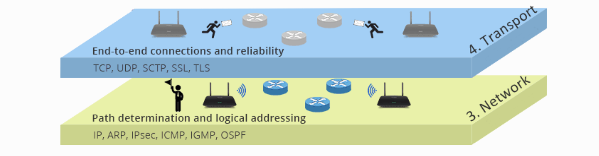

# Introduction to Networking

* [Computer Network](#computer-network)
* [Advantages](#advantages)
* [Disadvantages](#disadvantages)
* [Types of Computer Networks](#types-of-computer-networks)
    * [Geographical Location](#geographical-location)
* [Network Protocols](#network-protocols)
* [OSI Physical Layer](#osi-physical-layer)
* [OSI Data Link Layer](#osi-data-link-layer)
* [OSI Network Layer](#osi-network-layer)
    * [ARP](#arp)
        * [What is ARP?](#what-is-arp)
* [OSI Transport Layer](#osi-transport-layer)
    * [TCP](#tcp)
    * [UDP](#udp)
* [OSI Session Layer](#osi-session-layer)
* [OSI Presentation Layer](#osi-presentation-layer)
* [OSI Application Layer](#osi-application-layer)
* [Transmission Mediums](#transmission-mediums)
* [VoIP](#voip)
        * [Advantages of VoIP include:](#advantages-of-voip-include)
    * [Organisation (Client - Server Network)](#organisation-client---server-network)
    * [Client-Server Network](#client-server-network)
        * [Advantages](#advantages-1)
        * [Disadvantages](#disadvantages-1)
    * [Peer-To-Peer (P2P) Network](#peer-to-peer-p2p-network)
        * [Advantages](#advantages-2)
        * [Disadvantages](#disadvantages-2)
* [Identifiers](#identifiers)
    * [Identifiers](#identifiers-1)
        * [IPv4 Addresses](#ipv4-addresses)
            * [Example of an IPv4 address](#example-of-an-ipv4-address)
            * [Example of IPv6 address](#example-of-ipv6-address)
        * [Public vs Private IP Addresses](#public-vs-private-ip-addresses)
        * [Network Address Translation](#network-address-translation)
            * [Example of a MAC address](#example-of-a-mac-address)
        * [Why have we not run out of IPv4 Addresses?](#why-have-we-not-run-out-of-ipv4-addresses)
        * [Why are we still using IPv4 when there is a better IPv6?](#why-are-we-still-using-ipv4-when-there-is-a-better-ipv6)
        * [IP Address in Singapore](#ip-address-in-singapore)
        * [IP Address in USA](#ip-address-in-usa)
        * [Port Number](#port-number)
        * [Service Set Identifier (SSID)](#service-set-identifier-ssid)
            * [Did you know?](#did-you-know)
        * [Service Set Identifier (SSID)](#service-set-identifier-ssid-1)

# Computer Network

A computer network is a system of two or more computers (or devices) that are connected together by a transmission medium for the exchange of data.

## Advantages

- **Shared Resources**
    - A network allows a group of computers to make use of shared resources such as printers or files
- **Shared Internet Access**
    - Depending on the network’s configuration, every user who logs on to the network may have access to the internet
- **Shared software: Software**
    - Can be stored on the central server of a network and deployed to other computers over a network
- **Shared Storage**
    - Data files can be stored on a central server for ease of access and backup purposes
- **Communication**
    - Computers in the same network are often able to share instant messages and emails for communication

## Disadvantages

- Initial Costs
    - Installing a network could be costly due to the high setup and equipment costs.
- Maintenance Costs
    - There are also subsequent costs associated with administering and maintaining the network
- Security Risks
    - As files are shared through a network, there is the risk of virus or worm attacks spreading throughout the network even with just one infected computer.
- Risk of data loss
    - Data may just become lost due to hardware failures or errors. Using a network means regular data backups are needed.
- Server outage
    - If the server fails, the network will not be able to function, thus affecting work processes.

# Types of Computer Networks

## Geographical Location

- Local Area Network (LAN) - Network of connecting devices connected within a small geographical area, typically within the same building, such as a home, school or office.
- Metropolitan Area Network (MAN) - Network of computing devices typically spanning across two or more buildings within the same
- Wide Area Network (WAN) - Network of computing devices covering a large-scale geographical area, typically across multiple geographical locations.

#  Network Protocols
Set of standards and rules that govern how two or more devices communicate over a network. 

OSI stands for **Open Systems Interconnection**. The OSI model is a conceptual model created by the International Organisation for Standardisation which enables diverse communication to communicate using standard protocols.

The OSI model does not perform any functions in the networking process. It divides network communication into seven layers. The OSI Model can be seen as a universal language for computer networking. It is based on the concept of splitting up a communication system into seven abstract layers, each one stacked upon the last.

**Open Systems Interconnection (OSI)**. In this model, layers 1-4 are considered the lower layers and mostly concern themselves with moving data around.

Layers 5-7 called the upper layers, contain application-level data. It's basically 7 layers of Networking.

> **All People Seem To Need Data Processing**
# OSI Physical Layer
The lowest layer of the OSI Model is concerned with electrically or optically transmitting raw unstructured data bits across the network from the physical layer of the sending device to the physical layer of the receiving device. It can include specifications such as voltages, pin layout, cabling, and radio frequencies. At the physical layer, one might find "physical" resources such as network hubs, cabling, repeaters, network adapters or modems. E.g. RS-232, RJ45, 100ASE-TX.

# OSI Data Link Layer
**Physical Addressing**

At the data link layer, directly connected nodes are used to perform node-to-node data transfer where data is packaged into frames. The data link layer also corrects errors that may have occurred at the physical layer.

The data link layer encompasses two sub-layers of its own. The first media access control (MAC), provides flow control and multiplexing for device transmissions over a network. The second, the logical link control (LLC), provides flow and error control over the physical medium as well as identifies line protocols E.g. Ethernet, 802.11, WiFi 7, Fibre Channel, Frame Relay, Token Ring.

# OSI Network Layer

**Path Determination and Logical Addressing**

The network layer is responsible for receiving frames from the data link layer, and delivering them to their intended destinations among based on the addresses contained inside the frame. The network layer finds the destination by using logical addresses, such as IP (internet protocol). At this layer, routers are a crucial component used to quite literally route information where it needs to go between networks e.g. IP, ARP, IPSEC, ICMP, IGMP, OSPF

## ARP
### What is ARP?
Address Resolution Protocol (ARP) is a protocol or procedure that connects an ever-changing Internet Protocol (IP) address to a fixed physical machine address, also known as a media access control (MAC) address.

# OSI Transport Layer
**End to End Connection and Reliability**

The transport layer manages the delivery and error checking of data packets. It regulates the size, sequencing, and ultimately the transfer of data between systems and hosts. One of the most common examples of the transport layer is TCP or the Transmission Control Protocol E.g. TCP, UDP, SCTP, SSL, TLS.

TCP/IP (Transmission Control Protocol/Internet Protocol; also known as the internet protocol suite) is the set of protocols used over the internet. It organises how data packets are communicated and make sure packets have the following information:
- **Source** - which computer the message came from.
- **Destination** - where the message should go
- **Packet Sequence** - The order the message data should be re-assembled
- **Data** - the data of the message
- **Error Check** - The check to see that the message has been sent correctly.

TCP/IP Protocol includes:
- __HTTP__ - transfers web pages from web servers to the client. All web page addresses start with http. An https address is a secure web address which has been encrypted. An https address is used for sites holding bank details and secure information.
- __FTP__ - used to transfer large files. It is often used for organising files on a web server for a website. You can have private access to download the documents that you have shared.
- __UDP__ - User Datagram Protocol - Similar to TCP, but because messages are sent instead of packets - chunks - it is often faster, allowing for gaming or video calls over the internet.
- __SMTP__ - Simple Mail Transfer Protocol - governs the sending of emails over a network to a mail server.
- __IMAP/POP3__ - Internet Message Access Protocol - governs retrieving emails from email servers.
- __VOIP__ - is a set of protocols that enables people to have voice conversations over the internet.

## TCP
- Slower but more reliable transfers
- Typical Applications:
    - File Transfer Protocol (FTP)
    - Web Browsing
    - Email

## UDP
- Faster but not guaranteed transfers ("best effort")
- Typical Applications:
    - Live streaming
    - Online games
    - VoIP

The reason why FTP uses only TCP (Transmission Control Protocol) is that TCP provides a __reliable__, connection-oriented, byte-stream service, which is ideal for transferring files.

Additionally, FTP uses TCP's flow control and congestion control mechanisms to ensure that the network is not overloaded with too much traffic.

# OSI Session Layer
**Interhost Communication**

The session layer controls the conversations between different computers. A session or connection between machines is set up, managed and terminated at layer 5. Session layer services also include authentication and reconnections. E.g. Session establishment in TCP, SIP, RTP.

# OSI Presentation Layer
**Data Representation and Communication**

The presentation layer formats or translates data for the application layer based on the syntax or semantics that the application accepts. Because of this, it is also at times is also called the syntax layer. This layer can also handle the encryption and decryption required by the application layer. E.g. HTML, DOC, JPEG, MP3, M4V, Sockets 

# OSI Application Layer
**Network process to Application**

At this layer, both the end user and the application layer interact directly with the software application. This layer sees network services provided to end-user applications such as a web browser or Office 365. The application layer identifies communication partners, resources availability and synchronises communication.
E.g. DNS, WWW/HTTP, P2P, EMAIL/POP, SMTO, Telnet FTP.

TCP is slower but more reliable it makes sure the data is safely passed. UDP on the other hand does not care and yeets the data hoping it works.

UDP uses time-sensitive transmissions. It speeds up transmissions by enabling the transfer of data before an agreement is provided by the receiving party. Basically 2fast4u.

# Transmission Mediums
A **wired network** is a network of devices connected by a physical medium, such as cables.
The Ethernet is the most widely used wired network protocol in LANs and MANs.

A **wireless network** is a network of devices in which signals are transmitted without the use of a physical medium. The most common wireless network protocol is Wi-Fi, which uses radio waves to transmit data. 

A **Wireless Access Point** (WAP) is a network device that provides a connection between wireless devices up to 100 metres away and can connect to wired networks.

| Factor                            | Wired                                                                                                                                      | Wireless                                                                                                                                                       |
|-----------------------------------|---------------------------------------------------------------------------------------------------------------------------------------------------------------------------------|---------------------------------------------------------------------------------------------------------------------------------------------------------------------|
| Cost                              | Initially cheaper but becomes more expensive as network grows in size due to the cost of cables                                            | Initially expensive due to the cost of wireless networking equipment but becomes more cost-effective as network grows in size                                  |
| Speed of transmission / bandwidth | Faster and higher bandwidth as cables provide dedicated connection                                                                         | Generally slower and lower bandwidth due to possible interference from radio-waves or microwaves; varies according to user location in relation to network |
| Reliability                       | More reliable as data transmission is unaffected by radio interference.                                                                    | Less reliable due to potential interference from radio waves and microwaves or blockage from physical obstructions.                                            |
| Security                          | More secure as the network is less susceptible to interception and hacking.                                                                | Less secure due to possible intrusion by hackers sniffing the wireless signals.                                                                                |
| Mobility of users                 | Lower as network connections such as LAN points are fixed at specific spots and users cannot move to other locations.                      | Higher as users can move about freely within the range of the wireless network.                                                                                |
| Scalability                       | More cumbersome to add new devices to the network as physical constraints and the running of cables and LAN points need to be considered. | Easier to add new devices to the network as the router can be easily configured for each new device.                                                           |
| Physical Organisation             | Tend to look more disorganised due to cables running across floors                                                                         | More organised without cables                                                                                                                                  |

To get 1m, talk about both Wired and Wireless.

# VoIP
### Advantages of VoIP include:
- Lower cost
- Completely portable
- Advanced features
- More scalable

## Organisation (Client - Server Network)
## Client-Server Network
- A **client** is a computer that initiates a connection to a server to request for resources and services to perform operations. E.g. Employees in offices or students in schools would normally use client computers to do their work.

- A **server** is a computer that shares resources and responds to requests from devices and other servers on the network. It usually has a higher capacity and is more powerful than a client as it needs to manage resources and services. E.g. Providing central storage of files, sharing hardware such as printers, controlling logins and network access.

### Advantages
- Centralised control of data and resources
- Easy to schedule backups of all shared files at regular intervals
- Security may be enhanced with the use of specialised software or operating system features that are designed for servers.

### Disadvantages
- Higher initial cost due to the need for a server
- Administrative costs needed for the maintenance of server and clients.

## Peer-To-Peer (P2P) Network
- All computers are considered as equals and the load is distributed among all computers. Each computer in the network is able to act as both a client and a server, communicating directly with other computers

### Advantages
- Cheaper to set up as there is no cost related to dedicated servers 
- Easy to set up as no specialised or operating system features are needed.

### Disadvantages
- More effort is required to access and backup resources as they are stored locally within each computer instead of centrally in a server.
- Security is an issue as access rights are not administered by a central server

| Factor                   | Client-Server                                                                                                            | Peer-to-Peer                                                                                                                                                                                                                                                                  |
|--------------------------|--------------------------------------------------------------------------------------------------------------------------|---------------------------------------------------------------------------------------------------------------------------------------------------------------------------------------------------------------------------------------------------------------------------------------------------------|
| Function                 | Data and resources are shared using one or more dedicated servers; each computer has a distinct role — client or server. | Data and resources are shared directly between computers; each computer acts as both a client and a server.                                                                                                                                                                   |
| Organisation of Hardware | Each client is connected to one or more dedicated servers.                                                               | Each computer in the network can serve as a client and a server at the same time.                                                                                                                                                                                             |
| Bandwidth                | Typically high but limited by the capability of the server                                                               | Varies depending on how data needs to be transmitted; bandwidth may be reduced if a single computer must handle a large request, but may be increased if a large request can be divided into smaller requests that are handled by multiple computers simultaneously. |
| Security                 | High as access rights can be controlled centrally at a server                                                            | Low as security is handled by each computer and not by a central server.                                                                                                                                                                                                      |
| Setup Cost               | High as the use of specialised high-performance servers would be needed.                                                 | Low as basic computers can act as servers to share resources.                                                                                                                                                                                                                 |
| Storage                  | Centralised and carried out only at the server; usually managed by a network administrator                               | Decentralised and can be carried out by individual users at each computer.                                                                                                                                                                                                    |
| Application              | Found in businesses or organisations with a large number of users.                                                       | Found in homes or small businesses where there are few users.                                                                                                                                                                                                                 |
# Identifiers

## Identifiers

- IPv4 Address
- IPv6 Address
- MAC Address
- Port Number

### IPv4 Addresses

#### Example of an IPv4 address

#### Example of IPv6 address

### Public vs Private IP Addresses

- Each network will share the same public IP address. Other networks will be able to see your public IP address.
- When data meant for you is sent from another network to yours, it will be sent to your public IP address (which is your router's IP address)
- Your router keeps track of requests for data from each device by noting the private IP address down in a routing table. When it receives the data, it is able to route it to the correct device which requested for it.

### Network Address Translation

#### Example of a MAC address

### Why have we not run out of IPv4 Addresses?
- This is largely because of technologies like the __Network Address Translation (NAT)__, which maps many private IP addresses onto one public IP. There are also markets that sell and reallocate old IPv4 addresses for reuse.

### Why are we still using IPv4 when there is a better IPv6?
- IPv4 is still the dominant internet protocol. A key benefit of IPv4 is its __ease of deployment and widespread use__. Because IPv4 is used so broadly, network administrators and other internet developers can assume it is everywhere because everyone is compelled to support it.

### IP Address in Singapore
- Singapore has a total of ±20,297,984 IP address assigned.
- Population of SG in 2024 is 6.03 million.
- In SG, each home network has its own public IP.

### IP Address in USA
- USA has a total of ± 1,528,537,344 IP addresses assigned.
- Population of USA in 2021 is 341.82 million
- In US, shared public IP by area/town/roads (determined by ISP)
- Each street has its own public IP address.

### Port Number
- Used in combination with an IP address to identify a program that is running on a network
- All port numbers are assigned in a range from 0 to 65,535.

### Service Set Identifier (SSID)

- A string of up to 32 bytes that identifies a Wireless Access Point (WAP) and all the devices connected to it.
- All wireless devices connected to the same WAP must use the same SSID.

#### Did you know?
You can list all the port numbers that are in use on your computer by entering `netstat -na` in the command prompt.

### Service Set Identifier (SSID)

- A string of up to 32 bytes that identifies a wireless access point (WAP) and all the devices connected to it.
- All wireless devices connected to the same WAP must use the same SSID.

## Network Hardware and their Functions

- Network Interface Card
- Network Hub
- Network Bridge
- Network Switch
- Router
- Modem

### Network Interface Controller (NIC)

- Provides the hardware interface to __enable the transfer of data__ between __a device and a network__. An NIC may connect to a network physically or wirelessly.
- Each NIC also has a unique 48-bit MAC address.

### Network Hub

- Device that transmits received packets (even ones from within the network) to all connected devices.

### Network Bridge

- Device that constructs a single network by connecting two similar networks together.
- Uses MAC addresses to keep track of devices that are connected to each side of the bridge. This lets the bridge intelligently decide whether it should drop or forward the packets that it receives.
- Suppose the bridge receives a packet from computer A. The bridge first examines the destination MAC address stored in the packet's header and devices whether to forward or drop the packet.

### Network Switch

- A network bridge that connects multiple similar networks together.

### Router

- Device that forwards packets between separate networks.
- The networks may use different protocols.
- In order for a router to forward packets between different networks using Internet protocols, both the device sending the packet and the device receiving the packet must be identified using IP addresses.

### Modem

- Device for connecting devices over a long range, usually used by Internet Service Providers (ISPs).
- But long-range transmission media are typically not designed for transferring digital data (i.e. 0 and 1 bits) that are used by computers. The digital data must be converted to a form suitable for transmission (modulation) and back again (demodulation).
- __Modem__ = __mo__ dulator + __demo__ dulator

