# Problem Analysis

## Algorithm

__Definition:__ An __algorithm__ is a solution that solves a problem through a set of clearly defined steps. It involves the development of a set of instructions or rules.

## Inputs and Outputs

### Inputs

__Definition:__ An __input__ is any detail that can affect what we require for the output.

#### Specifying Inputs

Good input specifications must:
1. Include only the important data that can affect what we require for the output and exclude any irrelevant details.
2. State the range of valid or acceptable values for these inputs.

#### Example

| Input                      |
| --                         |
| x: a positive whole number |
| y: a positive whole number |

### Outputs

__Definition:__ An output is the result that the algorithm produces.

#### Specifying Outputs

#### Example

| Output             |
| --                 |
| The sum of x and y |

## Problem-Solving Techniques

### Decomposition

Decomposition is a technique of breaking down a complex problem or process into smaller parts (sub-problems) such that each part is more manageable and easier to understand.

#### Two Approaches to Decomposition

1. Incremental approach:
    - Identify quantitative features of the input or output that are causing the problem to be too large to handle. Sometimes, the solution to a small version of the problem with one or more features reduced can be found and gradually extended to larger versions of the problem. Each gradual extension of the solution is a separate sub-problem.
2. Modular approach:
    - Solve simple examples of the problem manually and identify tasks that are of different natures. Usually, these tasks can be separated from each other to become distinct sub-problems. This usually results in sub-problems that are different from each other.

### Generalisation

Generalisation is a technique of replacing two or more similar items with a single, more general item. 

### Pattern Recognition

Pattern recognition is the technique of identifying similarities among two or more items.

# How can Programs Be Used to Solve Problems?

## Stages in Developing a Program

1. Gather Requirements
2. Plan Solutions
3. Write Code
4. Test and Refine Code
5. Deploy Code

### Gather Requirements

To determine the nature of the problem or their expectations. Some of the tasks that can be done during this stage:
1. Interviewing the intended audience of the program to understand the nature of the problem or their expectations
2. Specifying the complete set of outputs that is necessary for the problem and how the inputs can be supplied to the program being developed.
3. Specifying the complete set of inputs that is necessary for the problem and the format for the output

### Plan Solutions

The goal of this stage is to consider the options available before any code is written, and to choose an algorithm based on the resources available (such as manpower and time). Some of the tasks that can be done at this stage:
1. Manually solving different simplified examples of the problem and generalising the steps needed to produce the required output
2. Trying different ways to break down the problem into smaller parts such that the intended output of each part gets closer and closer to what is needed to solve the problem
3. Comparing the problem (or its smaller parts) to other problems that have been solved before and identifying which algorithms can be used
4. Estimating the amount of effort needed to write the code or the time needed to complete the algorithm before making a definite choice
5. Writing possible algorithms using either flowcharts or pseudo-code

### Write Code

The goal of this stage is to write code that performs the algorithm as planned in the previous stage as efficiently as possible.

### Test and Refine Code

After the initial code is written, the resulting program is likely to require further refinement. Some possible reasons for this:
- The programmer may have made mistakes in translating the planned algorithm into code or may have forgotten to consider exceptional cases where the input would need to be treated specially. For example, the programmer may have made a syntax error or forgotten to check for invalid input. These are relatively minor errors that usually would not require a major rewriting of code as simply correcting the syntax error or adding an if statement would usually be sufficient to correct the program.
- The solution-planning stage may not have been performed properly, resulting in an unsuitable or incomplete algorithm. Depending on how serious the mismatch is, it may be possible to keep most of the written code and simply make refinements. Otherwise, it may be necessary to discard the written code and redo the evaluation of algorithms.
- The requirement-gathering stage may have been incomplete, resulting in code that does not actually solve the problem. Depending on how serious the mismatch is, it may or may not be possible to reuse most of the written code.

#### Test Case

A test case usually consists of a set of inputs and the corresponding set of expected outputs.

### Deploy Code

With the code tested and refined, this is the stage where the program is actually “rolled out” and used by its intended audience. Some of the tasks that can be performed under this stage:
- Training users to use the program
- Transitioning from an old program or system to a new program
- Evaluating the effectiveness of the program in solving the problem and considering any changes that might increase its usability or effectiveness

## Finding Check Digits

A __check digit__ is usually an additional digit or letter added in the end of a sequence of digits that is intended to be read by or entered into a computer manually. The check digit is mathematically related to the original sequence of the digits so that simple input errors would break this relationship and hence be detected. If the check digit is a letter, it would usually need to be converted to a number so that it can be used in the algorithm to check the sequence.

Check digits are generally designed to capture human transcription errors.

### Examples of Check Digits

- __UPC, EAN, GLN, GTIN, numbers administered by GS1.__
    * The final digit of a Universal Product Code, International Article Number, Global Location Number or Global Trade Item Number is a check digit.
- __ISBN 10/ ISBN 13__
    * International Standard Book Number

### Notable Algorithms

- Luhn Algorithm (1954) by IBM Scientists Hans Peter Luhn
    * Credit Card number
    * Canadian, Greek, Israeli, South African, Swedish ID.
- Verhoeff Algorithm (1969) by Dutch Mathematician Jacobus Verhoeff
    * The first decimal check digit algorithm which detects all single-digit errors, and all transposition errors involving two adjacent digits.
    * Uses three tables: a multiplication table _d_, an inverse table _inv_, and a permutation table _p_.
- Damm Algorithm (2004) by H. Michael Damm (PhD Dissertation)
    * Similar to the Verhoeff algorithm
    * Does not have the dedicated constructed permutations and its position-specific powers of the Verhoeff scheme.


```python
# UPC-A Practice

def check_digit(code: str):
    result = 0
    sum_odd = sum([int(k) for k in code if code.index(k) % 2 == 0])
    result = sum_odd * 3
    sum_even = sum([int(k) for k in code if code.index(k) % 2 != 0])
    result += sum_even
    result = str(result)
    if result[-1] == '0':
        return 0
    else:
        return 10 - int(result[-1])

def validate_code(code: str):
    if int(code[-1]) != check_digit(code):
        return False
    else:
        return True
```

# How Do I Ensure That a Program Works as Intended

## Validation Checks

1. Length check
2. Range check
3. Presence check
4. Format check

## Errors

1. Syntax errors
    - Errors that are due to incorrect source code that does not follow the rules of the language
    - Detected when the compiler or interpreter translates the source code into machine code
    - Caused by spelling mistakes or the incorrect sequence of symbols in source code
2. Runtime errors
    - Errors that are detected while a program is running, usually causing the program to crash or hang
    - While the program is being run
    - Incorrect use of commands, input data that has not been properly validated or conditions occurring outside the program's control (such as running out of memory)
3. Logic errors
    - Errors that usually do not cause the program to crash or hang immediately; instead the program does not give the expected output.
    - While the program is being run
    - Use of an incorrect or incomplete algorithm.

## Debugging Techniques

1. Using intermittent print statements
2. Walking through a program
3. Testing program in small chunks or by parts

## Test Cases for Conditions

1. Normal Conditions
2. Boundary Conditions
    - Situations where the input data is at the limit of what the program is designed for, or where special handling of the input data is required.
3. Error Conditions
    - Situations where the input data would normally be rejected by the program.

# Ethical, Social and Economic Issues in Computing

* [Data Corruption](#data-corruption)
    * [Effects of Corruption and Data Loss](#effects-of-corruption-and-data-loss)
    * [Causes and Ways to Prevent Data Corruption and Loss](#causes-and-ways-to-prevent-data-corruption-and-loss)
* [Authentication](#authentication)
    * [Passwords](#passwords)
    * [Unauthorised Access](#unauthorised-access)
    * [Biometrics](#biometrics)
* [Authorisation](#authorisation)
    * [File Permissions](#file-permissions)
    * [Firewalls](#firewalls)
* [Encryption](#encryption)
* [Understanding of Privacy Policies](#understanding-of-privacy-policies)
    * [Social Networking Sites](#social-networking-sites)
* [Summary](#summary)
    * [Preventing Unauthorised Access](#preventing-unauthorised-access)
* [Threats to Privacy and Security](#threats-to-privacy-and-security)
    * [Defensive Measures Against Privacy and Security Threats](#defensive-measures-against-privacy-and-security-threats)
        * [Installing anti-virus and anti-spyware programs](#installing-anti-virus-and-anti-spyware-programs)
    * [Operating System](#operating-system)
    * [Update Software Regularly](#update-software-regularly)
    * [Identity Phishing](#identity-phishing)
    * [Identity Pharming](#identity-pharming)
    * [Manage Spam](#manage-spam)
    * [Manage Cookies](#manage-cookies)
* [Intellectual Property](#intellectual-property)
    * [Types of Software Licenses](#types-of-software-licenses)
    * [Software Piracy](#software-piracy)
    * [Plagiarism](#plagiarism)
* [Impact of Technology on Daily Life](#impact-of-technology-on-daily-life)
    * [Communication](#communication)
    * [Finance](#finance)
    * [Healthcare](#healthcare)
    * [Transportation](#transportation)
    * [Entertainment](#entertainment)

## Data Corruption

__Data corruption__ occurs when computer data is made unstable by errors or alterations. This can happen during the reading, writing or transmission of data.

If the corrupted data cannot be recovered / replaced, this results in __data loss__.

### Effects of Corruption and Data Loss

The effects vary depending on the amount of corrupted data and type of data that is represented.

If the corrupted data is not needed to read other data, only that data itself is lost. This is more likely if the amount of corrupted data is small.

However, if the corrupted data is related to other data in the computer, then both itself and its related data may be lost, as it may contain information required to read/interpret the related data. This is more likely if the amount of corrupted data is large.

### Causes and Ways to Prevent Data Corruption and Loss

In all cases, making regular __backups__ (copies of data made in case the original data is damaged or lost) of data will help to prevent the loss of data.

Causes of data corruption and loss include:

- __Human Error__
    - Storage devices may be damaged during transport.
    - Multiple users working on the same file may accidentally overwrite each other.
    - __Preventive Measures__
        - Make regular backups of data
        - Use adequate protection when transporting storage devices.
        - Set up rules when collaborating with multiple users to prevent them from writing to the same file at the same time.
- __Power Failure__
    - If the power supply to a computer fails, data in the process of being written to a storage device may become corrupted and data stored in volatile memory and not yet written to a storage device will become lost.
    - __Preventive Measures__
        - Regular backups
        - Set up a backup power supply, or __uninterruptible power supply (UPS)__ so storage devices can complete any write operations in case of a power failure.
- __Hardware Failure/Damage__
    - All magnetic, optical and solid-state storage devices can fail, either due to overuse, manufacturing defects, or age.
    - __Preventive Measures__
        - Regular backups
        - Check storage device regularly and replace them immediately when signs of failure are detected.

- __Malware/viruses__
    - Some malware may purposely damage and corrupt data as a way of attacking the computer
    - __Preventive Measures__
        - Regular backups
        - Avoid opening emails/attachments or files from unknown sources.
        - Install and configure a firewall to prevent malware from spreading through the network.
        - Install anti-virus and anti-spyware software and perform regular scans and updates

An __uninterruptible power supply__ is a device that provides enough emergency power for a computer to properly shut down in the event of a power failure.

## Authentication

Authentication is the process of verifying the identity of a user. It requires the user to prove their identity by providing evidence from one or more of the following categories:
- Something the user knows (password)
- Something the user owns (mobile phone)
- Something physically unique about the user (thumbprint)

Each category of evidence used for authentication is called an __authentication factor__

### Passwords

Passwords are the most common form of authentication. Some passwords are entered together with a username that identifies who the user claims to be.

They can be a poor form of authentication if they are chosen poorly or not well-kept as a secret. Avoid using birthdates, surnames and other things that can be easily guessed.

Use hard to guess passwords that are a mixture of lowercase, uppercase letters, numbers and symbols.

Avoid re-using passwords or leaving them unchanged for a long time as it makes it easier for an intruder to guess the password. Use unique passwords for each computer and account, and update them at least once every 90 days.

### Unauthorised Access

Some authentication systems require evidence from more than 1 authentication factor. Banks typically issue a device called a security token to users who wish to access their accounts online.

A __security token__ is a device used specifically for authentication purposes, such as mobile phones and one-time passwords (OTPs).

The type of authentication that uses evidence from both something a user knows and owns is called __2-factor authentication__.

2FA is stronger than a singular password as it is more difficult for an intruder to both guess a password and steal the user’s security token. Hence, it is important to keep the security token in a secure location at all times and to report a missing security token as soon as possible.

If an OTP is sent wirelessly to a user’s mobile phone, it may be intercepted and used by an intruder during the transmission process. If the secret algorithm used to generate OTPs is poorly chosen or accidentally revealed, an intruder may find out how to generate OTPs without needing the security token at all.

There is not much a user can do about this type of intrusion attempt.

### Biometrics

__Biometrics__ is a type of authentication that is based on the measurement of
human physical characteristics.

For example, biometrics is used to identify a user by fingerprint or voice. Other characteristics used include the face, iris, retina, and DNA.

The use of biometric identification is more secure as the physical characteristics measured are typically unique to the individual and cannot be easily replicated. Thus, it helps prevent attempts to establish fraudulent identities and __identity theft__.

__Identity theft__ is the impersonation of another person to steal personal details such as name and identity number for fraudulent purposes.

## Authorisation

Once the user is authenticated, the ability of a computer to control the access of data and resources by that user is called __access control/authorisation__.

Computers provide access control through a variety of means.

### File Permissions

Most operating systems have settings to control the ability of users to view or make changes to specific files or folders. These settings are called __permissions__.

An application of file permissions is when a teacher may set a presentation file to be read-only for students, so they do not accidentally (or intentionally) change its contents.

Typically, users can only change the permissions for any file or folder they own. However, most OS's allow for a special user called the __administrator__, who can override the permissions for almost any file or folder.

A normal user may also be given special __administrator rights__ that allow them to override the permissions for certain files or folders, just like an administrator.

Managing permissions and administrative rights can be a complex task, and it is possible to accidentally grant access to a file or administrative rights to an unauthorised user. Such a user can then make use of such mistakes to gain unauthorised access to data and resources.

Authentication for the administrator must be especially strong, as an intruder that successfully claims to be an administrator can bypass file permissions entirely.

File permissions do not prevent an intruder with physical access to a storage device from accessing files or folders directly without going through the operating system. To prevent such access, it is necessary to use encryption.

File permissions can be used as access control for both computers connected to a network and computers that are not connected to a network, but are shared by multiple users.

### Firewalls

Computers connected to a network are naturally more susceptible to intrusion as unauthorised access can occur without the physical presence of an intruder.

Hence, computers connected to a network usually require another layer of access control called a __firewall__

A firewall is a device/network that prevents unauthorised access to or from a private network. It works by monitoring each piece of data transmitted through a network. It then either blocks or allows data to pass based on a set of rules configured by an administrator.

When properly configured, a firewall can protect computers within a network from unauthorised access. They can be configured to block the transmission of data (aka __traffic__) between unauthorised senders and receivers, especially requests for data from anonymous users on the internet. This prevents intruders from gaining access to the computers within a network.

Since firewalls can also block traffic based on the type of application that is transmitting the data, it can also stop certain harmful programs from sending copies of themselves to other computers through the network.

Configuring a firewall correctly can be complex and a misconfigured firewall may have security vulnerabilities that allows intruders to gain unauthorised access.

A properly configured firewall allows for a private network (aka __intranet__) to be set up such that all external traffic is blocked and only authenticated and authorised users are able to access it. Since the users on a private network are generally trusted and expected to keep information on the network confidential, there are usually fewer concerns about unauthorised access when sharing data on a private network.

Conversely, a private network such as the Internet allows anyone to connect to it and share data. Since public networks have little-to-no restrictions, users need to be wary of possible security and privacy risks when accessing it.

## Encryption

__Encryption__ is the process of encoding data so that a secret key is required to read the data. Like passwords, the secret key is usually provided as a sequence of bytes.

Before the encrypted data is decoded using the secret key, it appears as random and meaningless data.

Encryption is often used to protect data from unauthorised access by allowing only authorised users to have the secret key. It can be used in combination with file permissions so an unauthorised user who bypasses file permissions would still be unable to use the accessed data without knowing the secret key.


## Understanding of Privacy Policies

Unauthorised access can occur indirectly due to the actions of 3rd-party users or services.

For example, a user alters file permissions to let a classmate access some private files. That classmate in turn shares those files with others without the original user's knowledge.

- __Privacy__ - The ability to keep specific data or resources from being known by others.
    - In many countries, organisations are required by law to publicise or make available a privacy policy about the rules and practices they follow regarding the collection, protection and use of personal or private data provided by users.
    - __Example__: Organisations in Singapore are required by the Personal Data Protection Act (PDPA) to make their privacy policies available upon request.

An increasing number  of users share personal information such as photos and location data using online services, many of them are unfamiliar with the relevant privacy policies or how such sharing habits may indirectly result in unauthorised access. A poor understanding of the privacy policies of these services can often result in unauthorised access.

### Social Networking Sites
	
Social networking sites such as Twitter, Instagram and TikTok allow users to share photographs and information quickly with their families or friends. They can also be used to promote businesses or raise awareness of campaigns or causes.

However, these sites can pose many privacy concerns because most users do not read or consider the repercussions of the privacy policies used by these sites regarding personal information such as status updates, notes, photographs and location data.

The privacy policies for many social networking sites do not guarantee that personal data collected will never be exposed to unauthorised users and may even require that your personal data be shared with advertisers in order to use their sites. Hence, personal data can potentially be harvested for spam and other threats to privacy that users did not authorise directly.

Remember: Once data is digitised and uploaded to a public network such as the Internet, it can potentially remain there forever, since it can be easily copied and republished in ways no longer under the control of the original uploader.

Oh, and also some privacy policies for some social networking sites don’t guarantee that their personal data will be deleted from the site completely or immediately even after their account is closed, deleted, or has all personal data removed from it.

Personal data is sensitive and should not be shared publicly. Some companies may reject candidates after reviewing the information and photographs posted on their social networking accounts, even if this was posted while they were still at school.

## Summary

### Preventing Unauthorised Access

- Read and fully understand the privacy policy of the social networking site.
- Set sharing settings to "private" so only people you know in real life can read your posts.
- Think twice before posting personal photographs or information that you may feel uncomfortable sharing.
- Accept friend requests wisely. Make sure you know everyone in your friends list.

## Threats to Privacy and Security

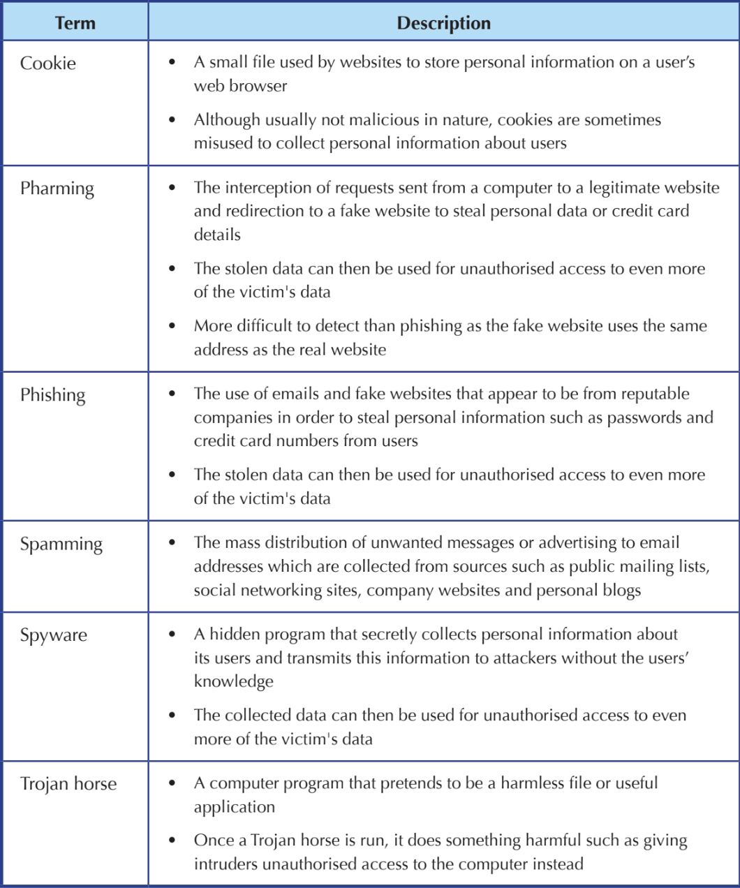
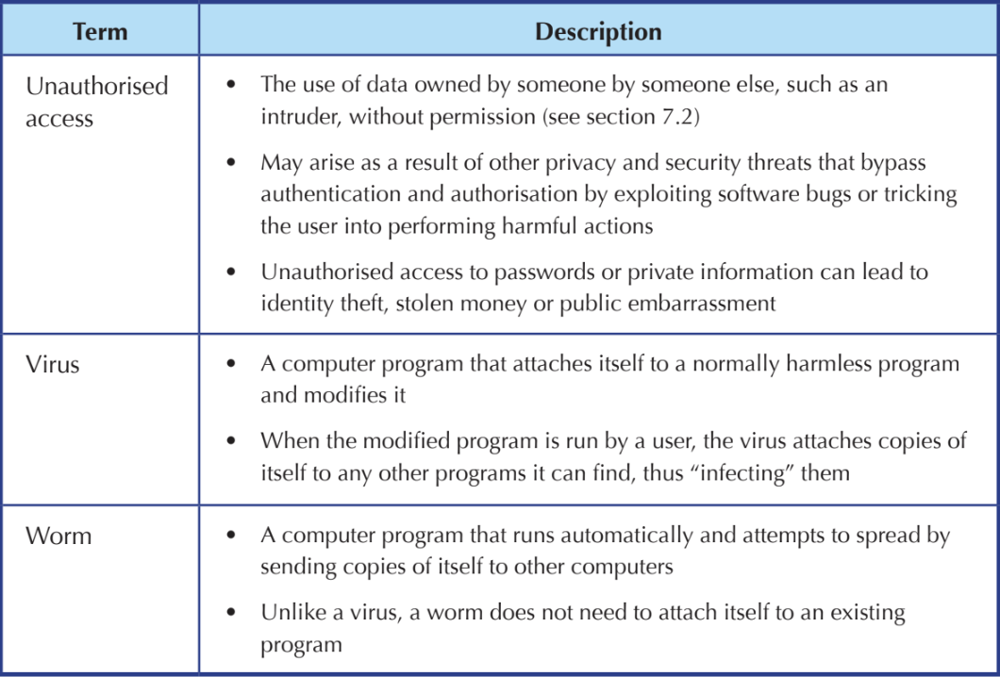

### Defensive Measures Against Privacy and Security Threats

#### Installing anti-virus and anti-spyware programs

- __Anti-Spyware__ - Software to detect, remove and stop spyware and other malware from running.
- __Anti-virus__ - Software to detect, remove and stop viruses and other malware from running.

Counters viruses, worms, spyware and Trojan horses, since they need to run on a user's computer in order to perform their respective attacks.

These programs can be used to scan a user's storage and email to detect and remove malware. If a program has been infected by a virus, it may also try to restore the original program.

Although powerful, most rely on a list of __signatures__, unique evidence used to detect a known version of some malicious software. This list has to be updated regularly to ensure protection provided continues to be effective against new malware. Most programs update the list automatically through the Internet.

Some especially devious Trojan horses appear to be anti-virus and anti-spyware programs. Only trust programs provided by reputable companies, or as part of the computer's __operating system__.

### Operating System

An __operating system__ is software designed to support a computer's basic functions, such as Windows and MacOS.

### Update Software Regularly

Most malware require human interaction to activate, but worms can run automatically by exploiting bugs in otherwise legitimate programs already running on a computer.

For example, a flawed web browser may have a bug that allows websites to run malicious programs without the user's knowledge.

To prevent this, update software regularly so bugs that were discovered since the last update can be fixed. This is especially important for software used to interact with public networks like the Internet, as data from public networks is more likely to be malicious and designed to take advantage of known bugs.

### Identity Phishing

Phishing emails should be ignored and deleted. There are several telltale signs to identify phishing emails.
- Claims to be from a company/bank asking for confidential information. Most companies and banks never ask for such information via email. If in doubt, call the company or bank to verify.
- Generic greeting such as "Dear User", it is a sign that the email was sent automatically and not by a person.
- Inaccurate logos and grammatical or spelling errors.
- Sender's email address or contact does not match the supposed source of email.
- Email has hyperlinks with destinations that do not match what the hyperlink text says or is otherwise unexpected. Place mouse cursor over the hyperlink and its destination should appear as a popup or on the status bar.
- Excessively urgent or threatening tone, a scare tactic to make victims act before they can think through their actions properly.
- Email promises offers that are too good to be true, tempting victims into revealing personal information.

### Identity Pharming

Pharming is like phishing V2. The attacker attempts to intercept requests sent from a computer to a legitimate website and redirects the user to a fake website to steal personal data.

For example, a victim of pharming may log into their bank account, and are presented with a website that looks like the bank, but isn't. The attacker can now retrieve your account details to access your bank account on the actual website, stealing your money.

For pharming to be successful, the attacker must either have malware running on the victim's computer or has taken control of a network device such as a router or server. This can occur as the software that runs on such devices is also susceptible to bugs.

It is harder to detect as everything seems to be normal while the attack takes place. Measures include:
- Ensure encryption is used when submitting sensitive information via the internet. Check if there's a padlock icon at the address bar.
- Regularly check bank, debit/credit card and other statements to ensure all transactions are legitimate.
- Regularly update web browsers and the software running on the network hardware so that all known bugs are fixed.
- Enable 2FA for all bank transactions. This means even if the attacker is able to access the bank account, no unauthorised transactions can occur as the attacker would not be able to provide the required OTP.

### Manage Spam

- Avoid giving your email to unfamiliar contacts or untrusted websites. If you really need to provide one, use a temporary email generator like 10minutemail. Or, set up a secondary email address dedicated to unimportant emails.
- Read and understand the privacy policy of any website, trusted or untrusted, that requests an email address before providing it. Some websites share email addresses with advertisers who spam.
- Look for options to disable email update or participation in mailing
lists when signing up or changing online account settings.
- Most email services have a filter feature that allow users to block specific senders or to only allow emails from specific senders through.
    - Some filtering systems have advanced spam detection algorithms that can be trained by having the user identify examples of spam the filter is not yet able to detect. This lets the filter become more effective in detecting spam over time.

### Manage Cookies

Cookies are small pieces of data stored by the web browser when a user visits a website. Each time a user visits a website that uses cookies, the browser checks whether it has a relevant cookie and if so, it sends the information contained in that cookie back to the website.

The website is thus aware that that the user has visited before and sometimes customises what appears on the page for the user. If no relevant cookie is found, the website may request for a new cookie to be created.

They are generally not malicious and are needed to keep track of authentication information to identify which user is currently logged in. However, they can be used to keep track of user movements and preferences within the websites, such as which pages are most recently visited. Advertising companies with advertisements on multiple websites can also use cookies to keep track of users as they move from one website to another.

Most browsers have settings that allow users to manually delete or prevent cookies from being created by untrusted websites. These settings can also be configured to disable cookies or allow only selected websites to use cookies. 

## Intellectual Property

- __Intellectual Property__ - Creations of the mind that have value but can exist purely as data with no physical form.
- __Copyright__ - The legal right of owners to control the use and distribution of their intellectual property.
- __License__ - Official description of activities that are authorised or forbidden by the owner of intellectual property.

### Types of Software Licenses

There are several types of software licenses in order to avoid infringing copyright laws.

- __Public Domain Software__ - Software where the legal protections that are typically granted to intellectual property have either expired, surrendered or are simply inapplicable.
    - Not protected by copyright, anybody can legally copy, modify and distribute public domain software. It may not always come with source code, though most do.

- __Free and Open Source Software (FOSS)__ - Software where users are given freedom to change, copy, study and share the software and its source code.
    - The term "free" refers to free to use, not free of charge.
    - Similar to public domain software, but is still protected under copyright and the copyright owners may use this protection to require that the software must always be distributed with source code, attribution to the original authors must be provided or any modifications must use a similar license if distributed.
    - Other types of copyrighted works such as books, photographs and music must be licensed in a similar manner using Creative Commons (CC) licenses. Note that CC licenses grant users freedom to copy, modify and distribute copyrighted works, CC licenses are not designed for software and should not be used for this purpose. It can, however, be used to license content that is delivered using software. Higher education course materials such as videos and notes created by
        universities and distributed for free on the Internet, aka __open courseware__ often use CC licenses.
- __Open Courseware__ - Higher-education course materials such as videos and notes created by universities and distributed for free on the Internet.
- __Proprietary Software__ - Commercial software for which most of the legal protections under copyright are retained.
    - Unlike FOSS, it is usually not legal to copy, modify or distribute proprietary software. The terms and conditions for which the proprietary software may or may not be used under copyright protection law are usually communicated by users through an End User License Agreement (EULA) contract that the user must accept to use the software.
    - The source code for proprietary software is usually kept secret.
    - Although it seems super restrictive compared to FOSS, it is important to remember that software is a form of intellectual property and it is the right of the owner to be compensated for the use of the property. An example of proprietary software is Windows OS, where unauthorised copying is illegal and the majority of source code is kept secret.
- __Freeware__ - Proprietary software that is available for use at no cost.
    - Some freeware are "lite" versions of proprietary software, allowing users to try a limited version of the software while promoting the full version
- __Shareware__ - Demonstration software that is distributed for free but a specific evaluation period only.
    - After the evaluation period, the program expires and the user can no longer access the program unless the user pays a registration fee.
    - The source code for freeware and shareware is usually kept secret and modifying the software is usually kept illegal. However, it may be legal to copy and distribute freeware and shareware. Adobe Reader and Skype are examples of freeware, and Camtasia Studio and WinRAR are examples of shareware.

### Software Piracy

__Software piracy__ is the crime of copying, distributing or using proprietary software illegally. Despite being illegal, it is prevalent and can take place in many forms.

Installing multiple copies of proprietary software without purchasing additional licenses or sharing proprietary software with unlicensed users is considered software piracy and can result in similar legal repercussions.

Software piracy causes significant loss of revenue for the owners of intellectual property, which leads to higher prices for legitimate buyers.

__Cracks__ are programs that modify proprietary software so that the software cannot detect that it is being used illegally. Software piracy is an example of __copyright infringement__, which is the use or distribution of copyrighted work without the permission of the copyright owner. While software piracy is specific to software, copyright infringement can occur for any copyrighted materials, such as pictures on the Internet, which is equivalent to theft.

### Plagiarism

__Plagiarism__ is the act of passing off someone else's original work as your own, aka the act of claiming to be the author of a piece of work without providing proper credit or attribution to the actual author.

Unlike copyright infringement, plagiarism may not always be illegal, but it is nevertheless an act of dishonesty and is usually a punishable offense in academia.

Plagiarism can still occur when the original owner of a piece of work consents to letting someone use it as their own.

To avoid plagiarism, you can use __citations__ to give proper credit to the original authors of any reproduced materials in published books, websites and articles.

## Impact of Technology on Daily Life

### Communication

The Internet has enabled diverse cultures to interact and share ideas with each other. Social networking sites have enabled users to remain connected with friends, family and colleagues over long distances.

Artificial intelligence has made it possible for anyone to automatically transcribe and translate speech into different languages with high speed and accuracy.

Some people on the Internet use the Internet to reinforce their existing opinions, or to spread the rumors, misinformation, or propaganda. This is worsened by the use of AI by some news and social and media sites to promote content the reader is likely to be interested in. Most sites promote content based on engagement and not accuracy.

Smart phones have led to an increased focus on mobile devices and mobile applications in the computing industry.

Social media has led to increased use of social media for marketing purposes and helps businesses to better understand buying habits and consumer needs by analysing social media posts.

Improvements in communications technology have also reduced business costs through the use of cheap and effective video conferencing calls instead of face-to-face meetings by cutting the costs of finding suitable venues as well as suitable timeframes to meet in person.

### Finance

Financial technology has enabled consumers to spend, borrow, invest and save money through low-cost and easy-to-use mobile and web applications. There is no need to perform such transactions in person. Individuals have better education on how to make smart financial decisions using freely available information on the Internet.

Threats to privacy and security of data as well as the ease of obtaining false information on the Internet has made some people more vulnerable to financial scams and other get-rich-quick schemes.

Financial technology is currently an area of growth in the financial industry. Numerous companies have been started to make financial services more efficient for both individuals and businesses. These companies typically use technology and software to reduce the time, cost and effort needed for payments, investments, fundraising, trading, and/or data analysis for both businesses and individuals.

With the evolution of technology, the time needed to perform a financial trade has decreased from seconds down to mere microseconds. This has led to the rise of algorithmic trading, which is the study and refinement of algorithms to make trading decisions at speeds not possible by a human being.

Many banks also use AI to analyse transaction data and automatically identify unusual spending patterns or money transfers. This helps them to automatically detect and prevent instances of financial fraud without the need for manual intervention.

### Healthcare

On the positive side, technology has enabled telemedicine, which is the use of video conferencing and other technologies, for doctors to provide medical consultations and diagnoses over the Internet or applications in mobile devices. This gives patients who are located in remote places or have limited mobility better access to healthcare. By analysing medical data, AI can automatically identify warning signs of possible health problems and provide doctors with more accurate
diagnoses.

On the negative side, some patients find the use of robots and other technology in healthcare impersonal and mistrust the ability of machines to provide proper healthcare. Other patients may misuse information from the internet and make potentially dangerous decisions based on incorrect diagnoses. Patients may also be uncomfortable with the collection of medical data necessary to improve the performance of healthcare-related AI.

Technology has created new areas of growth in the healthcare industry, such as the provision of telemedicine solutions to existing healthcare businesses. In particular, many of these solutions provide a way for patients to securely transfer potentially sensitive medical information over the internet.

There is also an increased focus in automating healthcare processes through the use of robots to dispense medicine and other more menial tasks. This may in turn cause such jobs to disappear from the job market.

The rise of 3D-printing technology has also opened up new opportunities in the building and customisation of prosthetic limbs, hearing aids and dental fixtures.

### Transportation

On the positive side, transport has become less stressful and more predictable for travellers due to the availability of detailed maps as well as real-time information on bus frequencies, traffic congestion levels and street-level photographs of neighbourhoods around the world. All this information is also available at low cost through mobile devices. Location data from such mobile devices may also be collected by AI to improve the accuracy and relevance of any map or
traffic data that is displayed.

On the negative side, some people are uncomfortable with how pictures and information about themselves or their home may be used by mapping companies without their permission in order to build more accurate maps for travellers. This is especially true with regards to the collection of location data from mobile devices as this data can reveal personal details such as home and work addresses that users may wish to keep private.

The rise of self-driving vehicles with the use of AI to recognise and adapt to road conditions is likely to open new areas of growth in the travel industry. Singapore is one of the first countries where self-driving cars are being tested, and if successful, the technology will likely revolutionise the motor industry.

There are also multiple new companies that offer on demand rides via mobile applications. These developments have led to sweeping changes in the taxi service industry as well as employment opportunities for taxi drivers.

Mapping technology is also another area of growth with an increased focus on making 3D maps and geospatial data more accessible and useful to travellers.

### Entertainment

On the positive side, technology has enabled more exciting and engaging forms of entertainment. Many computer games have active online communities and mobile games have even managed to bring participants together in the real world through in-game incentives to meet or team up. AI has also made it possible to provide more accurate recommendations for consumers based on collected data of their previous choices of entertainment.

On the negative side, some people may be addicted to computer games or social networking sites. There is an increasing concern that such technology is causing people to become deficient in real-life social skills or abandon their responsibilities. AI has also made it possible for anyone to create doctored images and videos that appear remarkably convincing to the average viewer. While such images and videos have been used mostly for entertainment, they can also be used to cause public alarm or spread damaging falsehoods.

Games, animation and media are areas of strong growth in the entertainment industry with new opportunities being opened up by the rise of high-quality virtual reality, augmented reality and motion- tracking technology.

Many businesses are also using monitoring technology and strategies from game design to provide rewards and incentives for work- related achievements.

# Number Systems

* [Denary Number System](#denary-number-system)
    * [Definition](#definition)
* [Binary Number System](#binary-number-system)
    * [Definition](#definition-1)
* [Notation](#notation)
* [Denary to Binary](#denary-to-binary)
    * [Algorithm 1: Dividing by 2](#algorithm-1-dividing-by-2)
        * [Example: Converting 135 to binary](#example-converting-135-to-binary)
    * [Algorithm 2: Sum of Place Values](#algorithm-2-sum-of-place-values)
* [Hexadecimal Number System](#hexadecimal-number-system)
    * [Definition](#definition-2)
    * [Denary equivalents of the hexadecimal](#denary-equivalents-of-the-hexadecimal)
    * [Example of Hexadecimal Number](#example-of-hexadecimal-number)
    * [Denary to Hexadecimal](#denary-to-hexadecimal)
        * [Algorithm 1: Divide by 16](#algorithm-1-divide-by-16)
        * [Example](#example)
    * [Hexadecimal to Binary, or Vice Versa](#hexadecimal-to-binary-or-vice-versa)
* [Applications of Number Systems](#applications-of-number-systems)
    * [RGB Colour Codes](#rgb-colour-codes)
    * [Network Addresses](#network-addresses)
        * [IPv4](#ipv4)
        * [IPv6](#ipv6)
* [MAC Address](#mac-address)
* [ASCII and Unicode](#ascii-and-unicode)
    * [ASCII](#ascii)
    * [Unicode](#unicode)

## Denary Number System

### Definition
A number system that is made up of __10 unique digits__.
- Uses place values of powers of 10.

## Binary Number System

### Definition
A number system that is made up of __2 unique digits__.
- Uses place values of powers of 2.

## Notation
To distinguish binary numbers from denary numbers, they can be written in any of the following ways:
- $1101$
- $(1101)_2$
- $0b1101$

Leading zeros are sometimes also shown when using binary numbers in computer systems to show all 8 binary bits in a byte:

e.g. $0000 \space  1101$

## Denary to Binary

### Algorithm 1: Dividing by 2

1. Draw a table with three columns - one column for denary numbers, one column for the quotients and one column for the remainders.
2. Fill in the denary number in the first row.
3. Divide the denary number by 2 and fill in its quotient and remainder in the same row.
4. If the quotient is 0, proceed to step 5. Otherwise, copy the quotient to the denary number column of the next row and repeat step 3.
5. The equivalent binary number is the remainder column read from the bottom up.

#### Example: Converting 135 to binary

| Denary | Quotient | Remainder |
|--------|----------|-----------|
| 135    | 67       | 1         |
| 67     | 33       | 1         |
| 33     | 16       | 1         |
| 16     | 8        | 0         |
| 8      | 4        | 0         |
| 4      | 2        | 0         |
| 2      | 1        | 0         |
| 1      | 0        | 1         |

$\therefore (135)_{10} = (10000111)_2$

### Algorithm 2: Sum of Place Values

E.g. Convert 135 to binary

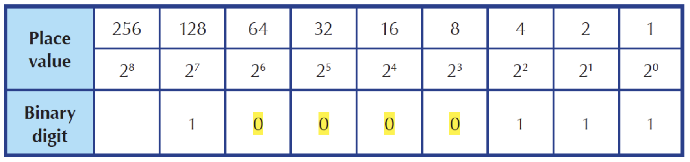

## Hexadecimal Number System

### Definition
Number system that is made up of 16 unique digits.

### Denary equivalents of the hexadecimal

| Hexadecimal digit | Denary equivalent |
|-------------------|-------------------|
| 0                 | 0                 |
| 1                 | 1                 |
| 2                 | 2                 |
| 3                 | 3                 |
| 4                 | 4                 |
| 5                 | 5                 |
| 6                 | 6                 |
| 7                 | 7                 |
| 8                 | 8                 |
| 9                 | 9                 |
| A                 | 10                |
| B                 | 11                |
| C                 | 12                |
| D                 | 13                |
| E                 | 14                |
| F                 | 15                |

### Example of Hexadecimal Number

$$ 1C6A $$

$$1C6A_{16} = 1 \times 16^3 + 12 \times 16^2 + 6 \times 16^1 + 10 \times 16^0$$


To distinguish hexadecimal numbers from denary numbers, they can be written in any of the following ways:
- $1C6A_{16}$
- $(1C6A)_{16}$
- $0x1C6A$

### Denary to Hexadecimal

#### Algorithm 1: Divide by 16

1. Draw a table with three columns - one column for denary numbers, one column for the quotients and one column for the remainders.
2. Fill in the denary number in the first row.
3. Divide the denary number by 16  and fill in its quotient and remainder in the same row.
4. If the quotient is 0, proceed to step 5. Otherwise, copy the quotient to the denary number column of the next row and repeat step 3.
5. The equivalent denary number is the remainder column read from the bottom up.

#### Example

Convert 1899 to hexadecimal

| Denary | Quotient | Remainder     |
|--------|----------|---------------|
| 1899   | 118      | $11 = B_{16}$ |
| 118    | 7        | $6 = 6_{16}$  |
| 7      | 0        | $7 = 7_{16}$  |

### Hexadecimal to Binary, or Vice Versa

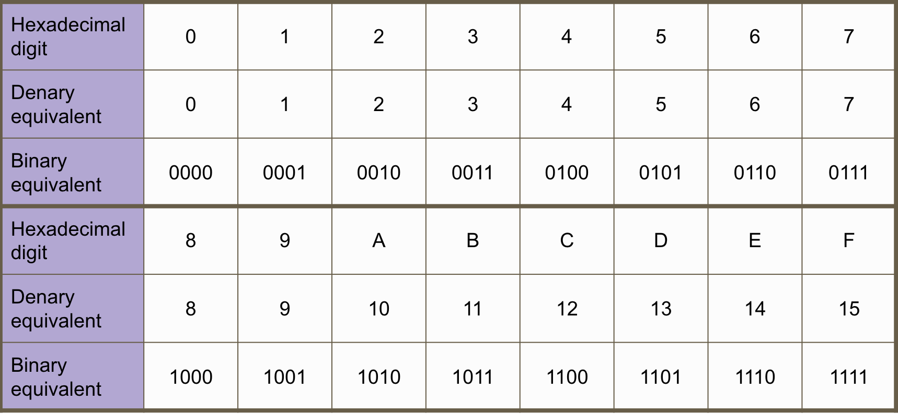

## Applications of Number Systems

### RGB Colour Codes

RGB is an abbreviation of red, green, and blue, which are the primary colours of light and can be combined with varying intensities to create other colours.

The intensity of each colour component is stored as a number, and each value is stored in a single byte, corresponding to $00000000_2$ to $11111111_2$, $00_{16}$ to $FF_{16}$, and 0 to 255 in binary, hexadecimal, and decimal respectively.

When all 3 colour intensities are 0, the result is black. If all intensities are at their maximum, the result is white.

RGB colour codes are displayed in the form of #RRGGBB, where RR, GG and BB are 2-digit hexadecimal numbers that represent each component of the colour. These codes are used to represent colours in websites, typically written in HTML and CSS.

### Network Addresses

For computers to communicate/exchange data over a network, they must be able to locate each other so that transmitted data can be directed to the correct destination.

This is done by giving each computer a unique name in the form of a sequence of bytes called a __network address__.

The Internet as an example of a computer network, each computer on the Internet has an __IP Address__, serving as its network address on the internet.

IP (Internet Protocol) is a standard system of rules used by computers on the Internet to communicate with each other. There are 2 versions of IP used today, IPv4 and IPv6

#### IPv4

- An internet protocol that is made up of 4 bytes (32 bits).
    - Usually shown as a sequence of 4 denary numbers, one for each byte of the address, separated by dots.
    - Since the value of a byte can only vary from 0 to 255, none of the 4 denary numbers can fall out of this range.
    - The maximum number of IPv4 addresses is $2^{32}$, or 4.3 billion. With the rapid growth of the Internet in the 80s and 90s, the number of IPv4 addresses is insufficient.

#### IPv6

- Usually shown as a sequence of 8 hexadecimal numbers, each number being 16 bits. Each group uses 4 hexadecimal digits.
- Hexadecimal is used for representation as using decimal would take up a maximum of $3 \times 16 = 48$, which is inconvenient.

## MAC Address

- __Media Access Control (MAC) address__ - A sequence of bytes (usually permanent in nature) that is used to identify a particular network interface controller.
    - It is a permanent way to locate or identify a specific computer or device, as the IP address of a computer may change each time it connects to the Internet.
    - It is made up of 6 bytes (48 bits), and is shown as a sequence of 6 hexadecimal numbers, one for each byte of the address. They are separated either by colons or hyphens.
    - The format for a MAC address is __NN-NN-NN-DD-DD-DD__, where __NN-NN-NN__ is the manufacturer's identity number; and __DD-DD-DD__ is the device's serial number.

## ASCII and Unicode

### ASCII

- Stands for the American Standard Code for Information Interchange
- Defines how numbers are used to represent common characters that can be typed using a keyboard, such as upper-case and lower-case letters.
- Exactly seven bits long, so only 128 (= 27) distinct characters can be represented.

### Unicode

- Similar function to ASCII, but can be used to represent characters in other languages such as Tamil and Mandarin, and even emojis.
- The number of bits used to represent each character can vary from 8 to 32 bits depending on the encoding scheme used.
- Unicode can be used to represent over a million unique characters from many different written languages all over the world.
- For backward compatibility, the first 128 characters of Unicode are the same as ASCII.

# Introduction to Networking

* [Computer Network](#computer-network)
* [Advantages](#advantages)
* [Disadvantages](#disadvantages)
* [Types of Computer Networks](#types-of-computer-networks)
    * [Geographical Location](#geographical-location)
* [Network Protocols](#network-protocols)
* [OSI Physical Layer](#osi-physical-layer)
* [OSI Data Link Layer](#osi-data-link-layer)
* [OSI Network Layer](#osi-network-layer)
    * [ARP](#arp)
        * [What is ARP?](#what-is-arp)
* [OSI Transport Layer](#osi-transport-layer)
    * [TCP](#tcp)
    * [UDP](#udp)
* [OSI Session Layer](#osi-session-layer)
* [OSI Presentation Layer](#osi-presentation-layer)
* [OSI Application Layer](#osi-application-layer)
* [Transmission Mediums](#transmission-mediums)
* [VoIP](#voip)
        * [Advantages of VoIP include:](#advantages-of-voip-include)
    * [Organisation (Client - Server Network)](#organisation-client---server-network)
    * [Client-Server Network](#client-server-network)
        * [Advantages](#advantages-1)
        * [Disadvantages](#disadvantages-1)
    * [Peer-To-Peer (P2P) Network](#peer-to-peer-p2p-network)
        * [Advantages](#advantages-2)
        * [Disadvantages](#disadvantages-2)
* [Identifiers](#identifiers)
    * [Identifiers](#identifiers-1)
        * [IPv4 Addresses](#ipv4-addresses)
            * [Example of an IPv4 address](#example-of-an-ipv4-address)
            * [Example of IPv6 address](#example-of-ipv6-address)
        * [Public vs Private IP Addresses](#public-vs-private-ip-addresses)
        * [Network Address Translation](#network-address-translation)
            * [Example of a MAC address](#example-of-a-mac-address)
        * [Why have we not run out of IPv4 Addresses?](#why-have-we-not-run-out-of-ipv4-addresses)
        * [Why are we still using IPv4 when there is a better IPv6?](#why-are-we-still-using-ipv4-when-there-is-a-better-ipv6)
        * [IP Address in Singapore](#ip-address-in-singapore)
        * [IP Address in USA](#ip-address-in-usa)
        * [Port Number](#port-number)
        * [Service Set Identifier (SSID)](#service-set-identifier-ssid)
            * [Did you know?](#did-you-know)
        * [Service Set Identifier (SSID)](#service-set-identifier-ssid-1)

# Computer Network

A computer network is a system of two or more computers (or devices) that are connected together by a transmission medium for the exchange of data.

## Advantages

- **Shared Resources**
    - A network allows a group of computers to make use of shared resources such as printers or files
- **Shared Internet Access**
    - Depending on the network’s configuration, every user who logs on to the network may have access to the internet
- **Shared software: Software**
    - Can be stored on the central server of a network and deployed to other computers over a network
- **Shared Storage**
    - Data files can be stored on a central server for ease of access and backup purposes
- **Communication**
    - Computers in the same network are often able to share instant messages and emails for communication

## Disadvantages

- Initial Costs
    - Installing a network could be costly due to the high setup and equipment costs.
- Maintenance Costs
    - There are also subsequent costs associated with administering and maintaining the network
- Security Risks
    - As files are shared through a network, there is the risk of virus or worm attacks spreading throughout the network even with just one infected computer.
- Risk of data loss
    - Data may just become lost due to hardware failures or errors. Using a network means regular data backups are needed.
- Server outage
    - If the server fails, the network will not be able to function, thus affecting work processes.

# Types of Computer Networks

## Geographical Location

- Local Area Network (LAN) - Network of connecting devices connected within a small geographical area, typically within the same building, such as a home, school or office.
- Metropolitan Area Network (MAN) - Network of computing devices typically spanning across two or more buildings within the same
- Wide Area Network (WAN) - Network of computing devices covering a large-scale geographical area, typically across multiple geographical locations.

#  Network Protocols
Set of standards and rules that govern how two or more devices communicate over a network. 

OSI stands for **Open Systems Interconnection**. The OSI model is a conceptual model created by the International Organisation for Standardisation which enables diverse communication to communicate using standard protocols.

The OSI model does not perform any functions in the networking process. It divides network communication into seven layers. The OSI Model can be seen as a universal language for computer networking. It is based on the concept of splitting up a communication system into seven abstract layers, each one stacked upon the last.

**Open Systems Interconnection (OSI)**. In this model, layers 1-4 are considered the lower layers and mostly concern themselves with moving data around.

Layers 5-7 called the upper layers, contain application-level data. It's basically 7 layers of Networking.

> **All People Seem To Need Data Processing**
# OSI Physical Layer
The lowest layer of the OSI Model is concerned with electrically or optically transmitting raw unstructured data bits across the network from the physical layer of the sending device to the physical layer of the receiving device. It can include specifications such as voltages, pin layout, cabling, and radio frequencies. At the physical layer, one might find "physical" resources such as network hubs, cabling, repeaters, network adapters or modems. E.g. RS-232, RJ45, 100ASE-TX.

# OSI Data Link Layer
**Physical Addressing**

At the data link layer, directly connected nodes are used to perform node-to-node data transfer where data is packaged into frames. The data link layer also corrects errors that may have occurred at the physical layer.

The data link layer encompasses two sub-layers of its own. The first media access control (MAC), provides flow control and multiplexing for device transmissions over a network. The second, the logical link control (LLC), provides flow and error control over the physical medium as well as identifies line protocols E.g. Ethernet, 802.11, WiFi 7, Fibre Channel, Frame Relay, Token Ring.

# OSI Network Layer

**Path Determination and Logical Addressing**

The network layer is responsible for receiving frames from the data link layer, and delivering them to their intended destinations among based on the addresses contained inside the frame. The network layer finds the destination by using logical addresses, such as IP (internet protocol). At this layer, routers are a crucial component used to quite literally route information where it needs to go between networks e.g. IP, ARP, IPSEC, ICMP, IGMP, OSPF

## ARP
### What is ARP?
Address Resolution Protocol (ARP) is a protocol or procedure that connects an ever-changing Internet Protocol (IP) address to a fixed physical machine address, also known as a media access control (MAC) address.

# OSI Transport Layer
**End to End Connection and Reliability**

The transport layer manages the delivery and error checking of data packets. It regulates the size, sequencing, and ultimately the transfer of data between systems and hosts. One of the most common examples of the transport layer is TCP or the Transmission Control Protocol E.g. TCP, UDP, SCTP, SSL, TLS.

TCP/IP (Transmission Control Protocol/Internet Protocol; also known as the internet protocol suite) is the set of protocols used over the internet. It organises how data packets are communicated and make sure packets have the following information:
- **Source** - which computer the message came from.
- **Destination** - where the message should go
- **Packet Sequence** - The order the message data should be re-assembled
- **Data** - the data of the message
- **Error Check** - The check to see that the message has been sent correctly.

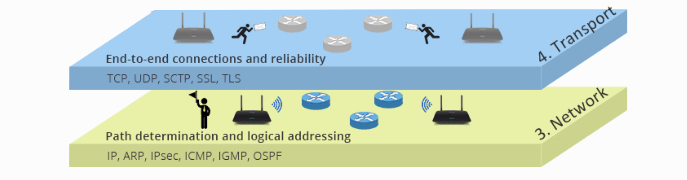

TCP/IP Protocol includes:
- __HTTP__ - transfers web pages from web servers to the client. All web page addresses start with http. An https address is a secure web address which has been encrypted. An https address is used for sites holding bank details and secure information.
- __FTP__ - used to transfer large files. It is often used for organising files on a web server for a website. You can have private access to download the documents that you have shared.
- __UDP__ - User Datagram Protocol - Similar to TCP, but because messages are sent instead of packets - chunks - it is often faster, allowing for gaming or video calls over the internet.
- __SMTP__ - Simple Mail Transfer Protocol - governs the sending of emails over a network to a mail server.
- __IMAP/POP3__ - Internet Message Access Protocol - governs retrieving emails from email servers.
- __VOIP__ - is a set of protocols that enables people to have voice conversations over the internet.

## TCP
- Slower but more reliable transfers
- Typical Applications:
    - File Transfer Protocol (FTP)
    - Web Browsing
    - Email

## UDP
- Faster but not guaranteed transfers ("best effort")
- Typical Applications:
    - Live streaming
    - Online games
    - VoIP

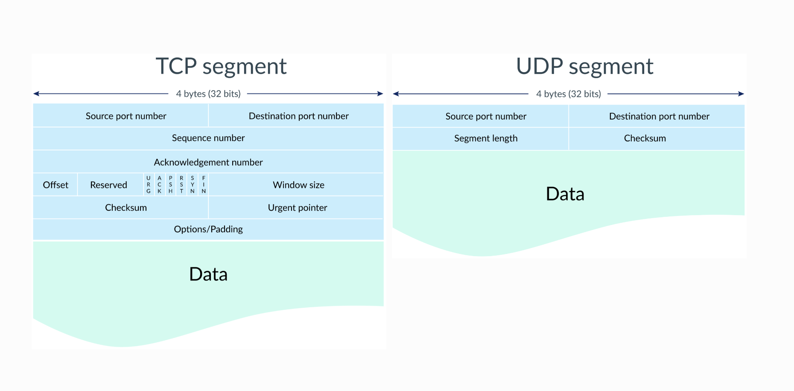

The reason why FTP uses only TCP (Transmission Control Protocol) is that TCP provides a __reliable__, connection-oriented, byte-stream service, which is ideal for transferring files.

Additionally, FTP uses TCP's flow control and congestion control mechanisms to ensure that the network is not overloaded with too much traffic.

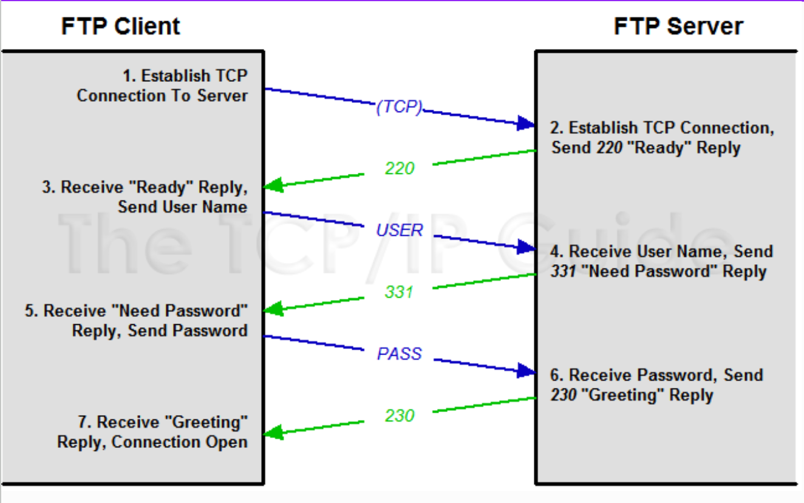

# OSI Session Layer
**Interhost Communication**

The session layer controls the conversations between different computers. A session or connection between machines is set up, managed and terminated at layer 5. Session layer services also include authentication and reconnections. E.g. Session establishment in TCP, SIP, RTP.

# OSI Presentation Layer
**Data Representation and Communication**

The presentation layer formats or translates data for the application layer based on the syntax or semantics that the application accepts. Because of this, it is also at times is also called the syntax layer. This layer can also handle the encryption and decryption required by the application layer. E.g. HTML, DOC, JPEG, MP3, M4V, Sockets 

# OSI Application Layer
**Network process to Application**

At this layer, both the end user and the application layer interact directly with the software application. This layer sees network services provided to end-user applications such as a web browser or Office 365. The application layer identifies communication partners, resources availability and synchronises communication.
E.g. DNS, WWW/HTTP, P2P, EMAIL/POP, SMTO, Telnet FTP.

TCP is slower but more reliable it makes sure the data is safely passed. UDP on the other hand does not care and yeets the data hoping it works.

UDP uses time-sensitive transmissions. It speeds up transmissions by enabling the transfer of data before an agreement is provided by the receiving party. Basically 2fast4u.

# Transmission Mediums
A **wired network** is a network of devices connected by a physical medium, such as cables.
The Ethernet is the most widely used wired network protocol in LANs and MANs.

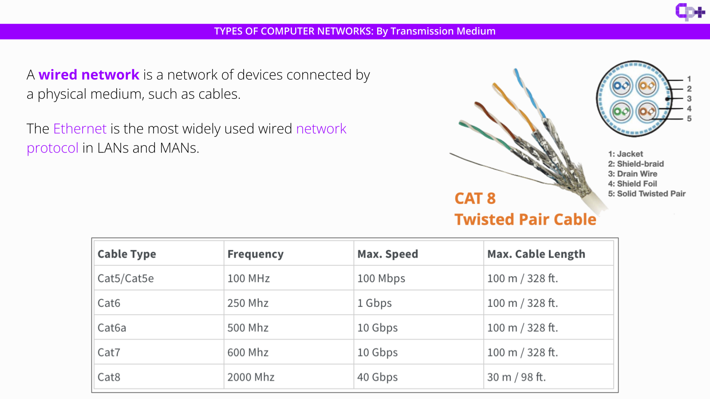

A **wireless network** is a network of devices in which signals are transmitted without the use of a physical medium. The most common wireless network protocol is Wi-Fi, which uses radio waves to transmit data. 

A **Wireless Access Point** (WAP) is a network device that provides a connection between wireless devices up to 100 metres away and can connect to wired networks.

| Factor                            | Wired                                                                                                                                      | Wireless                                                                                                                                                       |
|-----------------------------------|---------------------------------------------------------------------------------------------------------------------------------------------------------------------------------|---------------------------------------------------------------------------------------------------------------------------------------------------------------------|
| Cost                              | Initially cheaper but becomes more expensive as network grows in size due to the cost of cables                                            | Initially expensive due to the cost of wireless networking equipment but becomes more cost-effective as network grows in size                                  |
| Speed of transmission / bandwidth | Faster and higher bandwidth as cables provide dedicated connection                                                                         | Generally slower and lower bandwidth due to possible interference from radio-waves or microwaves; varies according to user location in relation to network |
| Reliability                       | More reliable as data transmission is unaffected by radio interference.                                                                    | Less reliable due to potential interference from radio waves and microwaves or blockage from physical obstructions.                                            |
| Security                          | More secure as the network is less susceptible to interception and hacking.                                                                | Less secure due to possible intrusion by hackers sniffing the wireless signals.                                                                                |
| Mobility of users                 | Lower as network connections such as LAN points are fixed at specific spots and users cannot move to other locations.                      | Higher as users can move about freely within the range of the wireless network.                                                                                |
| Scalability                       | More cumbersome to add new devices to the network as physical constraints and the running of cables and LAN points need to be considered. | Easier to add new devices to the network as the router can be easily configured for each new device.                                                           |
| Physical Organisation             | Tend to look more disorganised due to cables running across floors                                                                         | More organised without cables                                                                                                                                  |

To get 1m, talk about both Wired and Wireless.

# VoIP
### Advantages of VoIP include:
- Lower cost
- Completely portable
- Advanced features
- More scalable

## Organisation (Client - Server Network)
## Client-Server Network
- A **client** is a computer that initiates a connection to a server to request for resources and services to perform operations. E.g. Employees in offices or students in schools would normally use client computers to do their work.

- A **server** is a computer that shares resources and responds to requests from devices and other servers on the network. It usually has a higher capacity and is more powerful than a client as it needs to manage resources and services. E.g. Providing central storage of files, sharing hardware such as printers, controlling logins and network access.

### Advantages
- Centralised control of data and resources
- Easy to schedule backups of all shared files at regular intervals
- Security may be enhanced with the use of specialised software or operating system features that are designed for servers.

### Disadvantages
- Higher initial cost due to the need for a server
- Administrative costs needed for the maintenance of server and clients.

## Peer-To-Peer (P2P) Network
- All computers are considered as equals and the load is distributed among all computers. Each computer in the network is able to act as both a client and a server, communicating directly with other computers

### Advantages
- Cheaper to set up as there is no cost related to dedicated servers 
- Easy to set up as no specialised or operating system features are needed.

### Disadvantages
- More effort is required to access and backup resources as they are stored locally within each computer instead of centrally in a server.
- Security is an issue as access rights are not administered by a central server

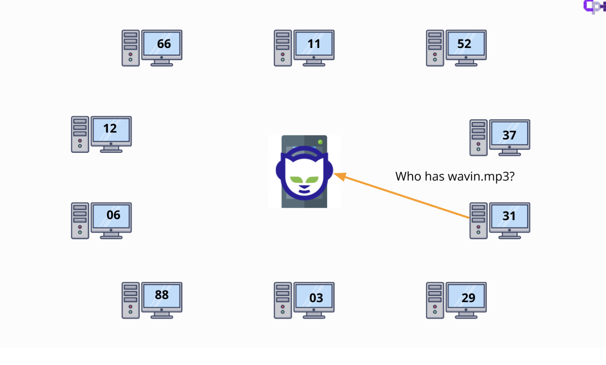
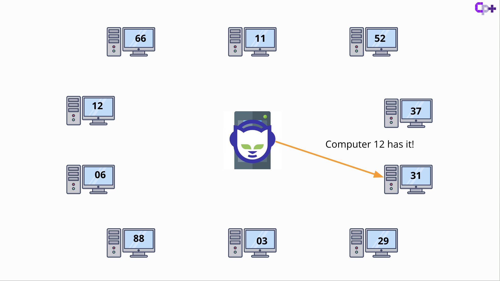
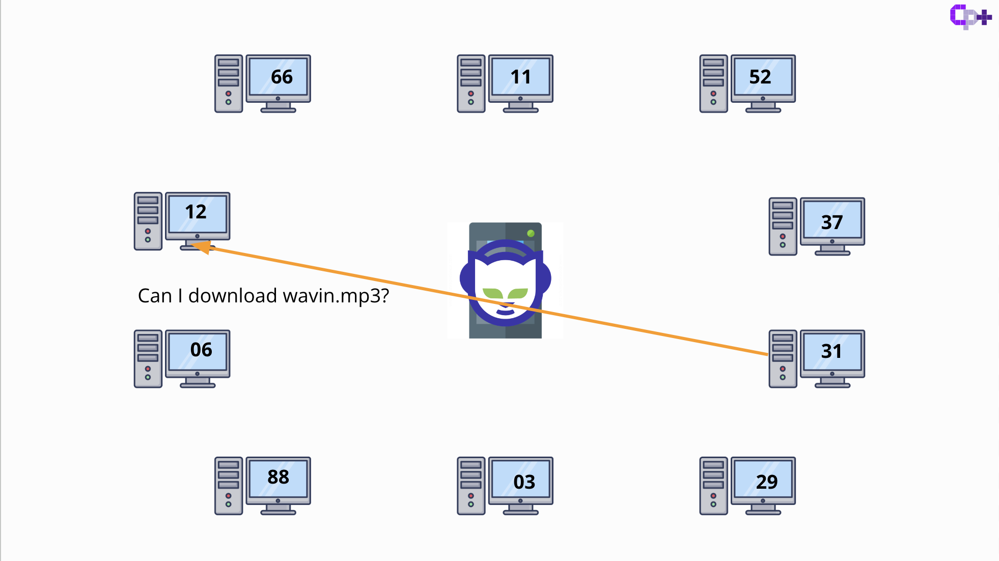
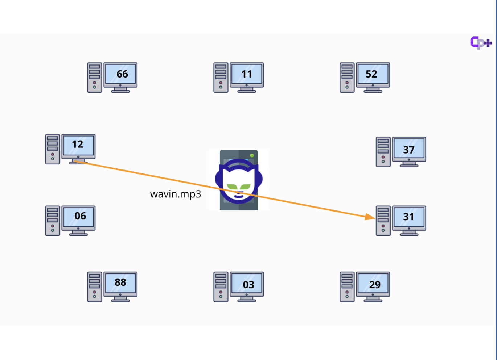
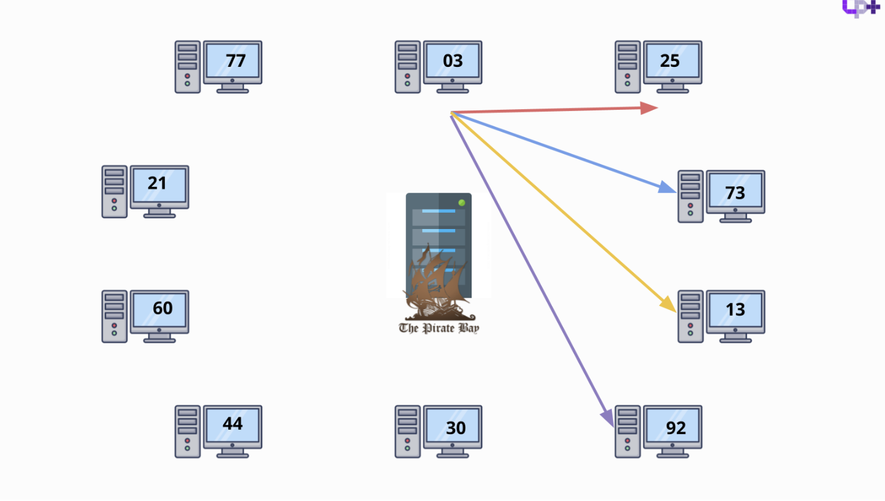

| Factor                   | Client-Server                                                                                                            | Peer-to-Peer                                                                                                                                                                                                                                                                  |
|--------------------------|--------------------------------------------------------------------------------------------------------------------------|---------------------------------------------------------------------------------------------------------------------------------------------------------------------------------------------------------------------------------------------------------------------------------------------------------|
| Function                 | Data and resources are shared using one or more dedicated servers; each computer has a distinct role — client or server. | Data and resources are shared directly between computers; each computer acts as both a client and a server.                                                                                                                                                                   |
| Organisation of Hardware | Each client is connected to one or more dedicated servers.                                                               | Each computer in the network can serve as a client and a server at the same time.                                                                                                                                                                                             |
| Bandwidth                | Typically high but limited by the capability of the server                                                               | Varies depending on how data needs to be transmitted; bandwidth may be reduced if a single computer must handle a large request, but may be increased if a large request can be divided into smaller requests that are handled by multiple computers simultaneously. |
| Security                 | High as access rights can be controlled centrally at a server                                                            | Low as security is handled by each computer and not by a central server.                                                                                                                                                                                                      |
| Setup Cost               | High as the use of specialised high-performance servers would be needed.                                                 | Low as basic computers can act as servers to share resources.                                                                                                                                                                                                                 |
| Storage                  | Centralised and carried out only at the server; usually managed by a network administrator                               | Decentralised and can be carried out by individual users at each computer.                                                                                                                                                                                                    |
| Application              | Found in businesses or organisations with a large number of users.                                                       | Found in homes or small businesses where there are few users.                                                                                                                                                                                                                 |
# Identifiers

## Identifiers

- IPv4 Address
- IPv6 Address
- MAC Address
- Port Number

### IPv4 Addresses

#### Example of an IPv4 address

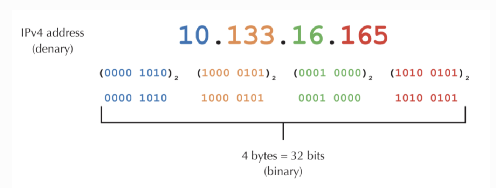
#### Example of IPv6 address

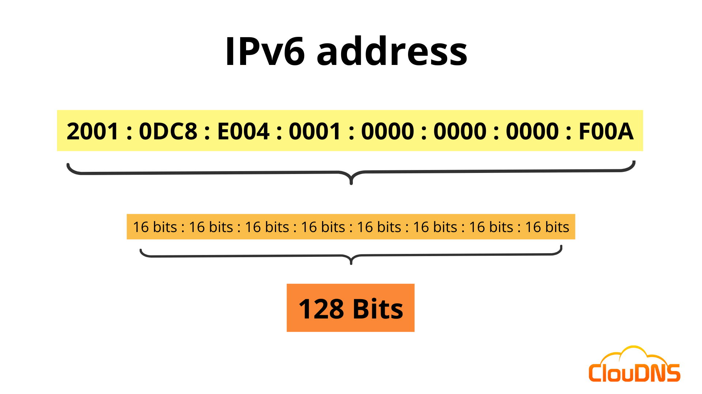

### Public vs Private IP Addresses

- Each network will share the same public IP address. Other networks will be able to see your public IP address.
- When data meant for you is sent from another network to yours, it will be sent to your public IP address (which is your router's IP address)
- Your router keeps track of requests for data from each device by noting the private IP address down in a routing table. When it receives the data, it is able to route it to the correct device which requested for it.

### Network Address Translation

#### Example of a MAC address


### Why have we not run out of IPv4 Addresses?
- This is largely because of technologies like the __Network Address Translation (NAT)__, which maps many private IP addresses onto one public IP. There are also markets that sell and reallocate old IPv4 addresses for reuse.

### Why are we still using IPv4 when there is a better IPv6?
- IPv4 is still the dominant internet protocol. A key benefit of IPv4 is its __ease of deployment and widespread use__. Because IPv4 is used so broadly, network administrators and other internet developers can assume it is everywhere because everyone is compelled to support it.

### IP Address in Singapore
- Singapore has a total of ±20,297,984 IP address assigned.
- Population of SG in 2024 is 6.03 million.
- In SG, each home network has its own public IP.

### IP Address in USA
- USA has a total of ± 1,528,537,344 IP addresses assigned.
- Population of USA in 2021 is 341.82 million
- In US, shared public IP by area/town/roads (determined by ISP)
- Each street has its own public IP address.

### Port Number
- Used in combination with an IP address to identify a program that is running on a network
- All port numbers are assigned in a range from 0 to 65,535.

### Service Set Identifier (SSID)

- A string of up to 32 bytes that identifies a Wireless Access Point (WAP) and all the devices connected to it.
- All wireless devices connected to the same WAP must use the same SSID.

#### Did you know?
You can list all the port numbers that are in use on your computer by entering `netstat -na` in the command prompt.

### Service Set Identifier (SSID)

- A string of up to 32 bytes that identifies a wireless access point (WAP) and all the devices connected to it.
- All wireless devices connected to the same WAP must use the same SSID.

## Network Hardware and their Functions

- Network Interface Card
- Network Hub
- Network Bridge
- Network Switch
- Router
- Modem

### Network Interface Controller (NIC)

- Provides the hardware interface to __enable the transfer of data__ between __a device and a network__. An NIC may connect to a network physically or wirelessly.
- Each NIC also has a unique 48-bit MAC address.

### Network Hub

- Device that transmits received packets (even ones from within the network) to all connected devices.

### Network Bridge

- Device that constructs a single network by connecting two similar networks together.
- Uses MAC addresses to keep track of devices that are connected to each side of the bridge. This lets the bridge intelligently decide whether it should drop or forward the packets that it receives.
- Suppose the bridge receives a packet from computer A. The bridge first examines the destination MAC address stored in the packet's header and devices whether to forward or drop the packet.

### Network Switch

- A network bridge that connects multiple similar networks together.

### Router

- Device that forwards packets between separate networks.
- The networks may use different protocols.
- In order for a router to forward packets between different networks using Internet protocols, both the device sending the packet and the device receiving the packet must be identified using IP addresses.

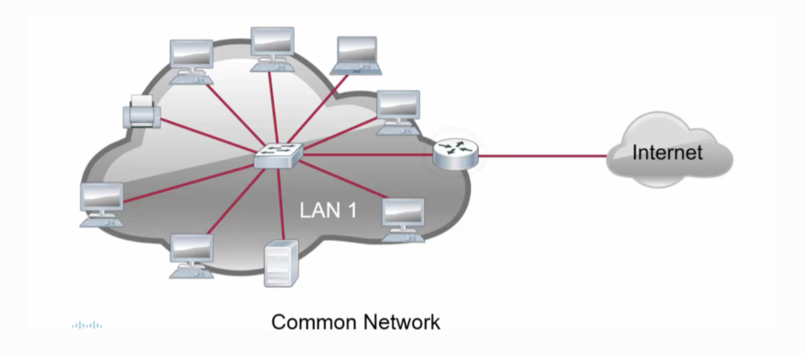

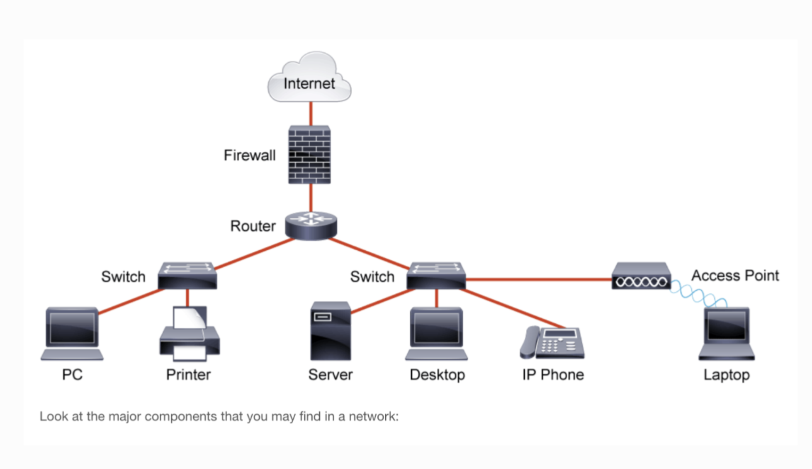

### Modem

- Device for connecting devices over a long range, usually used by Internet Service Providers (ISPs).
- But long-range transmission media are typically not designed for transferring digital data (i.e. 0 and 1 bits) that are used by computers. The digital data must be converted to a form suitable for transmission (modulation) and back again (demodulation).
- __Modem__ = __mo__ dulator + __demo__ dulator

## Network Topologies

- Bus
- Ring
- Star
- Mesh (+)

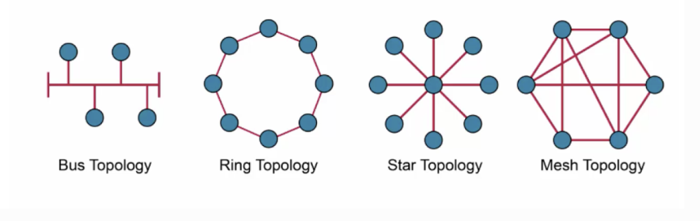

__Topology:__ physical layout of the devices on the network.

- Used for both Client-Server and Peer-to-Peer network organisations.
- Used for both Wired and Wireless networks.

Common topologies include:

- Bus Topology
- Ring Topology
- Ring Topology
- Star Topology
- Mesh Topology

### Bus Topology

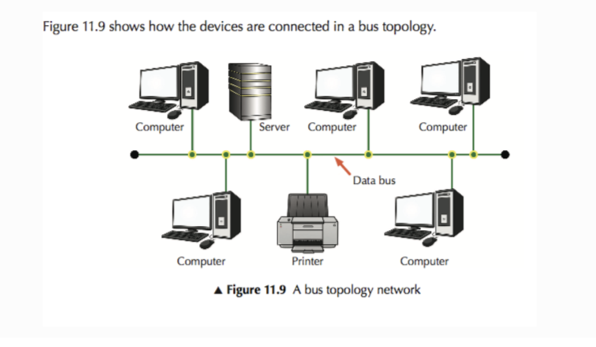

#### Advantages

- Easy and cheap to install as it uses less cabling than other network designs.
- Scalable as new computers can be easily added.
- Can continue to operate even when one of the computers breaks down.
- Works well for small networks.

#### Disadvantages

- A break anywhere along the bus may disable the entire network.
- The size of the network is limited by the capacity and length of the bus.
- A single bus is unsuitable for networks with many computers; performance slows down as the number of computers increase.

### Ring Topology

- Data passed around in only one direction.

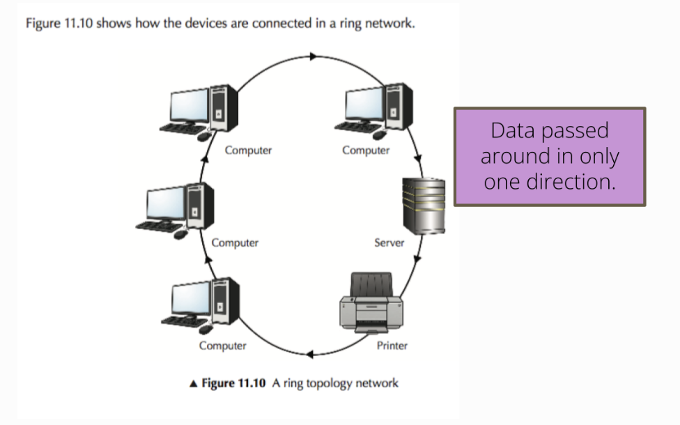

#### Advantages

- Can operate over larger distances and handle more data than a bus topology.
- Data packets that are sent between two computers will pass through intermediate computers, hence a central server is not required to manage the network.

#### Disadvantages

- If a computer or cable in the network fails, the entire network may fail as the data cannot be passed on.
- Adding a new computer to the ring network would mean that the whole communication ring needs to be temporarily interrupted.

### Star Topology

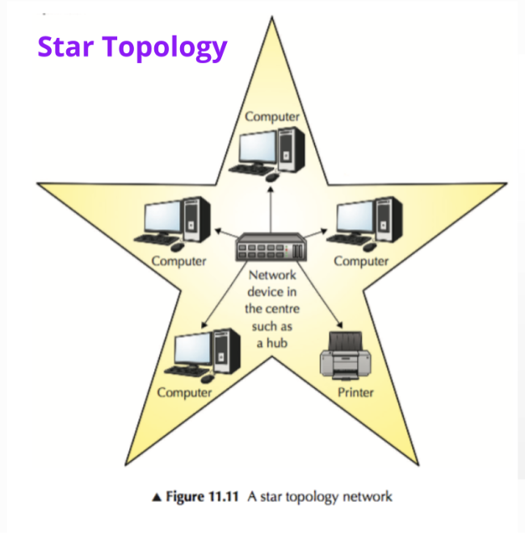

#### Advantages

- The load on each section of cabling is reduced as each computer uses a separate cable from the rest.
- If a fault occurs at a computer or a cable, it is easy to isolate the fault and do a replacement without affecting the rest of the network.

#### Disadvantages

- Uses more cabling than the other topologies (besides mesh) and hence costs more.
- If the central network device fails, the entire network fails (Single Point of Failure).

### Mesh Topology

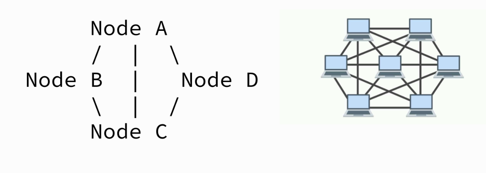

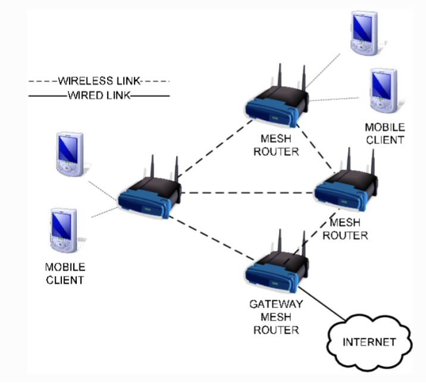

#### Advantages

- Manages high amounts of traffic, because multiple devices can transmit data simultaneously.
- A failure of one device does not cause a break in the network or transmission of data.
- Adding additional devices does not disrupt data transmission between other devices.

#### Disadvantages

- The cost to implement is higher than other network topologies, making it a less desirable option.
- Building and maintaining the topology is difficult and time consuming.
- The chance of redundant connections is high, which adds to the high costs and potential for reduced efficiency.

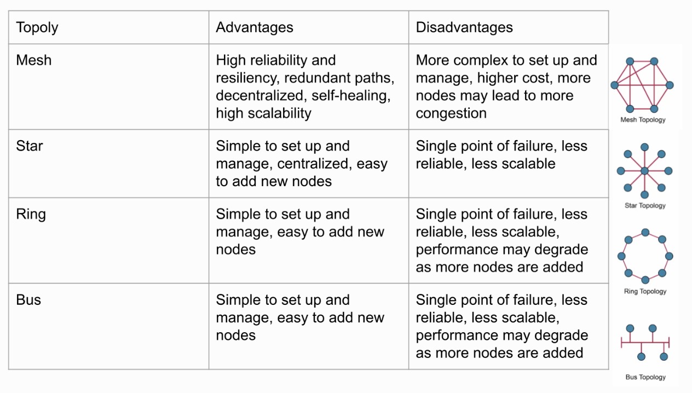

## Task 11.04 Network Topologies

> Jake plans to set up an accountancy consulting business in town. He wants to have a LAN in his office. He has about 100 staff working in the same office while about 20 other staff work from offsite locations such as his clients' offices. The staff needs to share files among themselves and be able to connect to printers. 
> Most of the data being handles is confidential and dates back from 10 years ago to the present. He also has plans to expand his business in the next five years.

Explain why a client-server network is preferred over a P2P network by considering bandwidth, security and storage issues.

## Error Checking Methods (Networks)

- Packets of data sent over a network can become lost or corrupted during transmission.
- Noisy Channel: Disturbance in the path when data is carried forwards from sender to receiver.
- When the data is received at the destination, it needs to be checked for errors. 
- Note: in the examples in this chapter, we will use packets that are 8 bits long. In reality, the packets are usually larger.

### Parity Check

- Error-checking technique which uses a parity bit to detect errors.
- This method is used when transmitting ASCII encoded characters.

### Odd Parity System

- All the bits, including the parity bit, will add up to an __odd__ number.
- E.g. 1001 0010 (Last bit is the parity bit)
    * If 1011 0010 is received instead, the receiver knows that an error has occurred as the sum of bits is not an odd number

### Even Parity System

- All the bits, including the parity bit, will add up to an __even__ number.
- E.g. 1001 1010 (Last bit is the parity bit)
    * If 1011 1010 is received instead, the receiver knows that an error has occurred as the sum of bits is not an even number

### Limitations of Parity Checks

- If two bits are transposed, then the computer could be fooled into thinking the data is correct and not corrupted.
- If two random bits change state then the system could also be fooled.

### Checksum

- A calculated value that is used to determine the integrity of transmitted data.
- Used when transmitting data using the TCP protocol (along with acknowledgements, which safeguard against data that is lost).
- Sum of all bytes in the data is calculated
- If the sum is less than  or equal to $255(2^8 - 1)$, the checksum = sum.
- Else, the checksum = sum mod 256
- If the received data does not match the checksum, then the receiver knows an error has occurred.

## Error Correcting Methods

- Able to detect __AND correct__ errors in transmission, up to a certain number of errors.

### Hamming distance

- The number of bits that differ between two strings
- Used to describe up to how many bits a system is error-detecting/error-correcting
- E.g. '1001  1010' and '1011 1010' have a Hamming distance of 1.
- E.g. '1000 1111' and '0111 0000' have a Hamming distance of 8.

