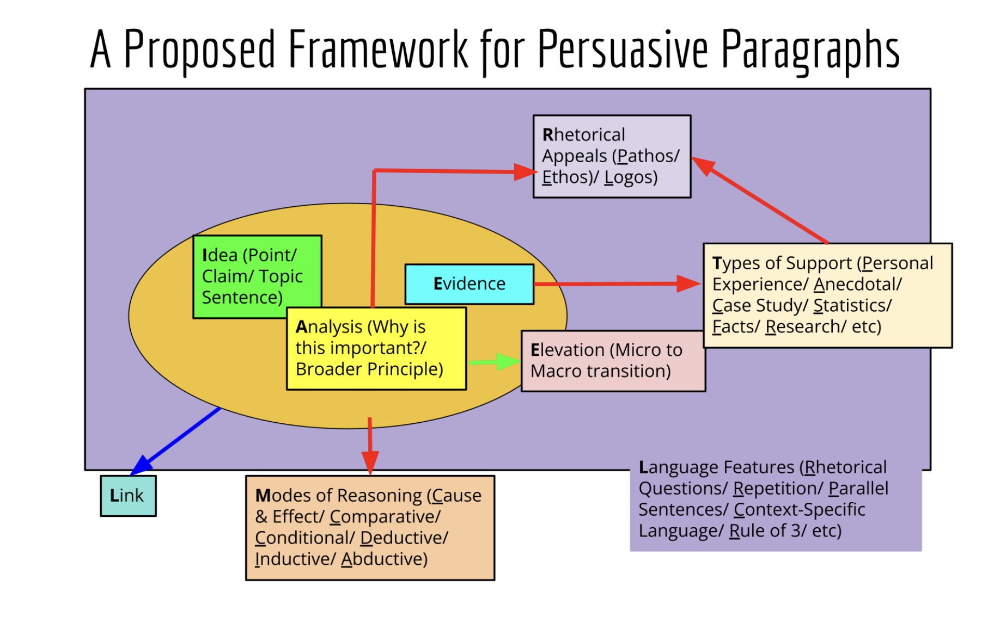

# Argumentative Essay Questions

## Analysing the Question

- __Purpose:__ To understand the points that you must address for your readers to be convinced of your stand.
- __Effect:__ Convinced by the writer's point of view as identified points are addressed by logical, relevant, credible and well-elaborated ideas supported with ideas.

Read the essay prompt twice before identifying:
- The TASK words, which define __what you have to do__
- The TOPIC words, which define __what you should focus on__
- The CONTEXTUAL words, which define __the limits of your discussion__

These three sets of keywords enable you to stay on task, i.e., organised and relevant.

> "How far would you agree?"
> Show extent of your agreement; argument must be balanced

## Brainstorming

### Equality of Opportunity vs Equality of Outcome

- Equality of Opportunity
    * Everybody gets the opportunity
    * Not everybody might have the same resources
- Equality of Outcome
    * Everybody gets the same outcome
    * Not fair to those who work hard, not meritocratic
- Equality ≠ Equity

### STEEEP

- Social
- Technological
- Economical
- Environmental
- Educational
- Political

### Developing a Paragraph

Consists of:
- Idea
    * __Why__ you are taking your stand and shows them the direction of your argument.
- Analysis
    * Explain how or why your __idea__ works / Evaluate how your reasoning connects your idea and evidence in a logical manner.
- Evidence
    * Concrete examples to __substantiate__ your claim.
- Elevation
    * Expand on your evidence and explain how it is true not just on a micro-level but macro level
- Link
    * This last sentence connects your whole paragraph __back to your main thesis.__ How does your paragraph support your thesis?

#### A Proposed Framework for Persuasive Paragraphs

## Dos

- Plan
    * With a pencil

### Planning

- Plan your arguments first
    * Use these to form your thesis statement
- Body Paragraphs
    * x3 IAE 
        + Idea
        + Analysis
        + Examples
    * __Optional__
        + Counter-argument / Rebuttal
            + "Some people would agree that... However, ..."
            + Not your argument, but other people's argument

## Requirements

- Hook
- 3 Body Paragraphs
- 

## Examples

### Question 1: "Technology has given youths more opportunities than ever." Do you agree? Why or why not?

#### Break Down

- Technology, youths
    * The technology has to address that of the youths
- Opportunties
    * Jobs, education
    * Social
        + Social networking avenues
    * Advocacy
        + Campaign for social change

__Loaded Words__
- "more"
    * Comparative word
    * Comparison between past and present
- "has given"
    * Past-continuous tense
        + Past and present
            + Compare

#### Mistakes

- Focusing __only__ on social media
    * Should extend on other forms of technology e.g:
        + Robots, automation
        + Artificial Intelligence (AI)
    * A better response would straddle at least two types of technology.

### Question 3: "Education should only focus on STEM subjects." Do you agree? Why or why not?

#### Break Down

- "only"
    * Paraphrases
        + "Specifically"
        + "Exclusively"

#### Supporting Arguments

    * Unique traits / strengths
        + Chemistry, maths, electronics
        + Would think in a very computational, scientific, logical way
    * Society is more STEM and technology focused
        + Schools have to match the industry's needs
            + Examples: IT, biomedical, pharmaceutical

#### Opposing Arguments

- Education needs to be holistic.
