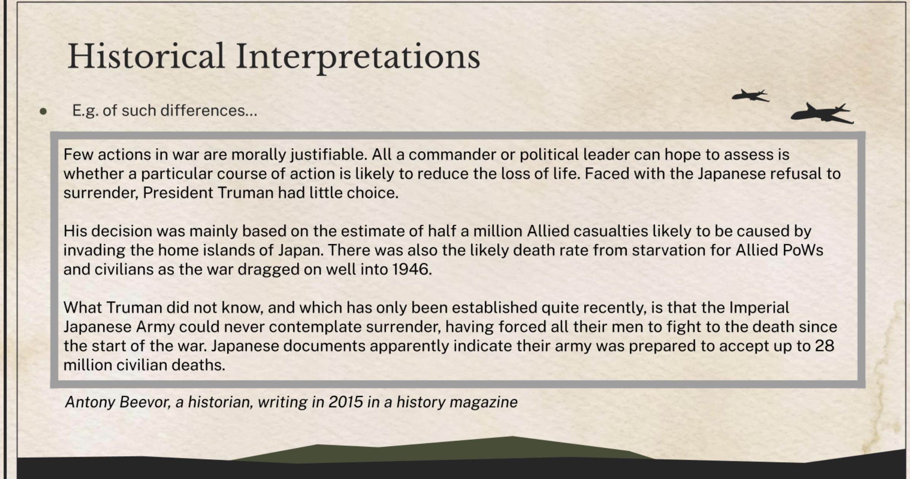

# The End of WW2 in Europe and the Asia-Pacific
# Key Developments: WWII in Europe, 1939-1945

* [Introduction](#introduction)
    * [Overview](#overview)
    * [**Key Developments: WWII in Europe, 1939-1945 - Blitzkrieg**](#key-developments-wwii-in-europe-1939-1945---blitzkrieg)
    * [**Key Developments: WWII in Europe, 1939-1945 - Changing fortunes for Germany**](#key-developments-wwii-in-europe-1939-1945---changing-fortunes-for-germany)
* [Fall of France, 1940](#fall-of-france-1940)
    * [**Fall of France**](#fall-of-france)
* [Battle of Britain, 1940](#battle-of-britain-1940)
    * [Battle of Britain](#battle-of-britain)
* [Operation Barbarossa, 1941](#operation-barbarossa-1941)
* [**Operation Overlord: D-Day, 1944**](#operation-overlord-d-day-1944)
* [Key Developments: WWII in the Asia-Pacific](#key-developments-wwii-in-the-asia-pacific)
* [Strengths of the Allies](#strengths-of-the-allies)
* [Victory in Europe](#victory-in-europe)
* [Turning Points in History](#turning-points-in-history)
* [WWII in Asia-Pacific](#wwii-in-asia-pacific)
    * [Introduction](#introduction-1)
    * [Overview](#overview-1)
    * [Attack on Pearl Harbour,  1941](#attack-on-pearl-harbour--1941)
    * [Battle of Midway, 1942](#battle-of-midway-1942)
    * [Defeat of Japan and the Atomic Bomb](#defeat-of-japan-and-the-atomic-bomb)
        * [Island-hopping](#island-hopping)
        * [The Atomic Bombings, August 1945](#the-atomic-bombings-august-1945)
* [Historical Interpretations](#historical-interpretations)
* [Overview of the War](#overview-of-the-war)

## Introduction

World War 2 began…

- **Europe:** in **September 1939** with the German invasion of Poland
- **Asia-Pacific:** Japan began its expansion in China in  **1937**
- By the time the United States joined the war in the Asia-Pacific in **1941**, it had become a **total war** with fighting on land, at sea and in the air.
    - Total war:
        - War with no limits on weapons used and resources mobilised
        - No differentiation between military and civilian targets
    - Historians estimate that around **75 million people**, mostly civilians, died during the war. Thus, it is considered the most devastating conflict in history.

## Overview

**September 1939: Invasion of Poland**

- Germany invades Poland was divided between Germany and the USSR by the end of the month

**May and June 1940**

- Germany began a six-week “Lightning War” or Blitzkrieg. This results in the **conquest of Belgium, France and the Netherlands.**

**July 1940**

- Germany began intensive bombing, known as the Blitz, in the **Battle of Britain.**

**July 1941**

- German troops invaded the USSR in __Operation  Barbarossa__
    - This used up the main German forces and drew aircraft away from the Battle of the Atlantic.
    - It also drew land forces away from other theatres of war.

**Operation Barbarossa**

- This used up the main German forces and drew aircraft away from the Battle of the Atlantic.
- It also drew land forces away from other theatres of war.

**August 1942–February 1943: The USSR counterattacked German forces at Stalingrad.**

- The Siege of Stalingrad was one of the deadliest battles in history.
- This battle, where the German forces were defeated by the USSR, is regarded as a turning point in WWII.

**July–August 1943: Battle of Kursk**

- Germany launched an attack on the Soviet city of Kursk
- Resulted in one of the largest tank battles in history. Soviet forces were able to halt and counter German attacks.

**June 1944:** 

- The Allies launched **Operation Overlord,** also known as D-Day. Allied troops landed in Normandy (in France) and began a slow advance across France and towards Germany.

**April 1945:** 

- **The Allies enters Berlin** and Hitler committed suicide thereafter.

**May 1945:** 

- **Germany surrenders**

## **Key Developments: WWII in Europe, 1939-1945 - Blitzkrieg**

- Germany quickly extended its control into Europe in the early phases of the war
    - E.g. Shortly after occupying Poland, Germany invaded and occupied Norway, Finland, Belgium, the Netherlands and France by 1940.
- This was largely due to its successful use of blitzkrieg, which means “lightning war”.
    - Blitzkrieg was a swift and focused attack using mobile forces, such as armoured tanks and air support, to overwhelm the enemies
- Germany used blitzkrieg tactics because its economy lacked important resources such as copper, rubber and oil, and could not support long drawn-out campaigns, military stalemates and trench warfare.
    - In trench warfare, troops attack and defend from trenches that are dug into the ground. This type of warfare often resulted in stalemates between both sides, which would prolong the war and lead to a high number of deaths.
- While blitzkrieg brought Germany a lot of initial success, the situation would change.

## **Key Developments: WWII in Europe, 1939-1945 - Changing fortunes for Germany**

- In June 1941, Germany declared war on the USSR.
    - The USSR proved to be a formidable foe, pressuring the Germans from the Eastern Front
        - In military terms, a front refers to the area of conflict between opposing armies engaged in battle.
- To make matters worse, the United States entered the war in late 1941 and bolstered the Allied forces from the Western Front.
- In June 1944, the Allies landed in Normandy (in France) and invaded Germany on March 1945.

# Fall of France, 1940

## **Fall of France**

- In May 1940, the Germans attacked France.
    - The French had a larger army and air force
    - They were further supported by the British Expeditionary Force and Royal Air Force (RAF).
    - Despite this, the French were unable to resist German attack.
- By late May, the British and French were surrounded and facing total defeat.
    - They retreated to the Channel coast in the region around the port of Dunkirk. The Allied armies were highly vulnerable and could have been destroyed.
    - However, some of Hitler’s generals felt that there was a need to slow down to consolidate the German forces to not leave themselves vulnerable to attacks. Thus, Hitler ordered the German forces to stop.
- France surrendered and fell into the hands of Germany in June. It was a massive victory for Germany and revenge for its defeat in 1918.
    - Hitler was delighted when he heard the news of the victory as he had previously fought in the German army against the French during WWI.

# Battle of Britain, 1940

## Battle of Britain

- Having defeated France, Hitler turned his attention to Britain.
- The German air force (Luftwaffe) carried out large-scale attacks against Britain’s RAF to achieve air superiority.
- This lasted from September 1940 to May 1941, although bombing continued throughout the war.
    - The Germans later turned to British cities, bombing them in a campaign known as the Blitz.
- The Blitz caused huge losses of life and great damage to houses, docks, warehouses and factories.
    - Despite the losses, the British kept a grim willingness to carry on with the war effort and did not surrender to the Germans.

# Operation Barbarossa, 1941

- Hitler and Stalin had signed the Nazi-Soviet Non-Aggression Pact in August 1939, agreeing not to go to war and to split Poland between the two of them.
    - However, this agreement would not last.
        - Hitler had always wanted to destroy communism and expand Germany’s territory into Eastern Europe and the USSR.
        - Occupying the USSR would also give Germany access to the USSR’s vast resources such as oil.
- In June 1941, Germany launched Operation Barbarossa.
- Initially, Germany seemed successful. Stalin was on the verge of abandoning Moscow in September 1941.
- However, the Germans were not able to overwhelm the USSR fast enough, and the harsh winter halted the German advance.
    - Stalin used that time to reorganise the Soviet war effort.
    - Coupled with the extensive resources provided by the US Lend-Lease scheme, the reorganisation enabled the USSR to turn around and put up a strong resistance against the Germans on the Eastern Front.
    - E.g. Around 90 percent of German casualties in WWII were on the Eastern Front against the USSR.

# **Operation Overlord: D-Day, 1944**

- As the Germans and the Soviets were engaged in various major battles, the Allies sought to liberate France.
    - However, the Germans had been in France since 1940 and had strong fortifications. i.e. [the Atlantic Wall](https://www.britannica.com/place/Atlantic-Wall)
- It was a high-risk undertaking, but the start of Operation Overlord, also known as D-Day, was nonetheless fixed for 6 June 1944.
    - On this day, the combined Allied forces landed on the heavily fortified coasts of France’s Normandy region.

# Key Developments: WWII in the Asia-Pacific

# Strengths of the Allies

# Victory in Europe

- By 1944, it was clear that Germany was on verge of losing the war in Europe.
    - The Soviets were able to stop the German advance, and they also reversed their fortunes with a huge victory in Stalingrad in early 1943.
    - Operation Overlord had opened a second front that Germany could ill afford
- Although Germany fought back hard
    - E.g. They carried out a counterattack in December 1944 through the Ardennes Forest (located in the southeast of Belgium), they were steadily driven back.
    - E.g. They put some remarkable new equipment into action, including guided missiles and jet aircraft, but none of them could stop the Allies’ advance.
- The Germans were forced to retreat, and by January 1945, the Soviet troops had encircled Berlin.
    - Hitler withdrew to his underground bunker, where he continued meeting his military generals and close subordinates such as Goering, Himmler and Goebbels to give orders to them.
- On 30 April 1945, facing imminent defeat by the Allies, Hitler committed suicide.
- After much fighting, the US and British forces met up with Soviet forces at the River Elbe in Germany, and the war in Europe was over when Germany formally surrendered on 8 May 1945.

# Turning Points in History

**A Why to Weigh Factors**

- A turning point in History would involve a shift in the nature of change. This could be in terms of the:
    - **Pace of Change:** things could start developing at a much faster pace, or slow down to a crawl; or
    - **Direction of Change:** developments could shift from mostly negative to mostly positive, or vice versa, for example.

# WWII in Asia-Pacific

## Introduction

In the Asia-Pacific, Japan had been aggressive in its expansion since its invasion of Manchuria in 1931
- Japan continued its expansion into China in 1937 when it attacked and occupied areas such as Shanghai, Wuhan and Nanjing (also known as the Second Sino-Japanese War).
    - Although Japan was not successful in occupying the whole of China, it was able to exploit the natural resources and manpower of the areas they occupied to support their war efforts.
- From 1941, Japan advanced into parts of the Pacific region. It was a massive conflict, fought over a vast territory and involving millions of allied troops.

## Overview

1. July 1937: Japan launched  a full-scale invasion of China, occupying cities such as Shanghai, Wuhan and Nanjing, after the Marco Polo Bridge Incident
2. September 1940: Occupation of French Indochina by the Japanese after the fall of France. 
3. December 1941: Japan disabled much of the US fleet at Pearl Harbour when it launched a surprise attack.
    1. Simultaneously, Japan launched attacks on Malaya, the Philippines and the Dutch East Indies
    2. The United States declared war on Japan
4. January-May 1942: Japan completed its invasion of Malay, the Dutch East Indies and the Philippines.
5. June 1942: The American fleet destroyed four Japanese aircraft carriers and 300 aircraft in the Battle of Midway and all their experienced aircraft carrier pilots die.
6. August 1942-June 1945: The US forces pushed back the Japanese forces island by island despite fierce resistance in a campaign of island-hopping
7. August 1945
    1. The USSR declares war on Japan and invades Japanese-occupied Manchuria
    2. Atomic bombs dropped on Hiroshima and Nagasaki
    3. Japan surrenders unconditionally thereafter.
- Japan was initially successful after attacking Pearl Harbour in the United States in December 1941.
    - By the start of 1942, Japan had occupied many territories in the Asia-Pacific including Malaya, the Dutch East Indies and the Philippines.
- While the United States had formally entered WWII in 1941, the Allies had agreed to prioritise the defeat of Germany.
    - Nevertheless, the Allies continued to resist the Japanese and from May 1942, the Japanese were gradually driven out of the territories they had conquered.
- When Germany finally surrendered in May 1945, Japan faced the Allies alone and would eventually be defeated by September 1945.

## Attack on Pearl Harbour,  1941

- Japan attacked Pearl Harbour in 1941:
    - It was a devastating attack that ended in near total success for the Japanese
    - US intelligence failed to warn the US forces, and Japanese planes from aircraft carriers achieved almost complete surprise against the American forces.
- The attack lasted around 90 minutes
    - 2000 military personnel lost
- Three days after Pearl Harbour, Japanese forces sank the most powerful British battleships in the Pacific region, the Prince of Wales and the Repulse.
    - As a result…
        - “There were no British or American capital ships in the Indian Ocean or the Pacific. Over this vast expanse of waters, Japan was supreme and everywhere we were weak and naked.”
- However, in the long run, Pearl Harbour did not prove to be as decisive as the Japanese thought
    - The United States was able to recover quickly within a few months and retaliate against Japan
        - The outrage over the surprise attack allowed US President Roosevelt to rally the country. The United States was now probably more united and organised than it has ever been to declare war on Japan.
        - Now the country’s huge resources were directed towards the war
            - E.g. The US shipyards quickly constructed new ships, especially aircraft carriers
    - On a tactical level, there was also some comfort for the US navy, as its aircraft carriers during the attack.
        - Japan had made a massive error: they failed to hunt down and destroy the carriers, which the United States continued to use throughout 1942.
        - This meant that Japan did not gain control of the Pacific as they had hoped.

## Battle of Midway, 1942

- The decisive battle came at Midway in June 1942
    - During this battle, the Japanese lost four of their Japanese carriers and nearly three-quarters of their experienced pilots
        - This negatively affected their naval and air defence capabilities for the rest of the war
        - Furthermore, Japan remained weakened as it could not match the output of the US shipyards and aircraft factories.

## Defeat of Japan and the Atomic Bomb

### Island-hopping

- After the battle of Midway, the United States and its allies gradually drove the Japanese back across the Pacific from the territories they had taken. They used a strategy known as **island-hopping**
    - The US island-hopping strategy led to several key victories between 1942 and 1945, such as in the battle to regain the Philippines, which continued to weaken the Japanese military
    - Japan’s resources became severely overstretched and it was not able to defend the entire empire.
    - The Japanese fought fanatically for each island in the Pacific and each territory in China and Burma
    - Soon, the war reached a pivotal stage in 1945, with US air raids on Japanese soil, such as the bombing of Tokyo.
- In April 1945 British and US forces took the island of Okinawa
    - The Allies had to kill or capture every one of the 100,000 Japanese soldiers defending the island - none of them would surrender
    - Allied ships had also been badly damaged by Japanese kamikaze suicide bombers, who crashed their planes deliberately into them.
    - These attacks were used as a last resort by the Japanese
    - Although Japan was being pushed back, it came at great cost for the Allies

### The Atomic Bombings, August 1945

- By May 1945, the United States was confident of winning the war eventually.
    - Nonetheless, after Roosevelt’s death in April 1945, the new president, Harry Truman, was faced with the prospect of a year or more of heavy casualties. US troops would have to beat back the Japanese island by island, and then invade Japan itself.
    - However, there was an alternative. An international team of scientists in the United States, working on what was known as the Manhattan Project, had just perfected the world’s first atomic bomb
- In the end, Truman decided to use the bombs without warning.
    - He accepted military advice to drop two bombs in quick succession. This was to convince the Japanese that the United States had a large stockpile of the weapons, which it did not.
- On 6 August 1945, the American bomber, Enola Gay, dropped a five-ton atomic bomb, nicknamed “Little Boy” over the city of Hiroshima
- On 9 August 1945, the United States dropped a second atomic bomb, nicknamed "Fat Man", over the city of Nagasaki.
- Both instances of dropping the atomic bombs caused appalling damage and horrific casualties, and reduced the cities of Hiroshima and Nagasaki to ruins.
    - They also left a legacy of cancer and other radiation-related diseases among the survivors.

|                      | Hiroshima | Nagasaki |
|----------------------|-----------|----------|
| Total Population     | 255,000   | 195,000  |
| Dead                 | 66,000    | 39,000   |
| Injured              | 69,000    | 25,000   |
| **Total Casualties** | 135,000   | 64,000   |

- Japanese Emperor Hirohito and most of his government told the army to surrender after the Nagasaki bomb.
    - However, some of the military leaders disagreed with the Emperor's proposed actions and attempted to overthrow the Emperor and continue the war instead.
        - This proved to many people on the Allied side that the decision to use the bombs was right.
    - The Emperor's will prevailed, and Japan surrendered on <u>14 August 1945</u>. 

# Historical Interpretations

- Historians can have different interpretations of the past, even though they may be examining the same historical event or period.
- **Factors can Explain Differences in Historical Interpretations**
    - These factors include:
        - Differences in the questions historians ask about the past
        - The different sources that historians can draw upon to help them reach their interpretations and
        - Differences in the way historians make sense and meaning of the past
- To make sense of differing interpretations and decide which are acceptable, and which one we prefer, you can consider the following:
    - What claims are being made in the interpretations?
    - What evidence is being used to support these claims?
    - What the context in which these interpretations were made is?

# Overview of the War
- Most historians looking back at WWII tend to agree on the broad picture of the war.
    - Germany, Japan and Italy were important nations, but they were not as strong as the leading powers - Great Britain, the USSR and above all, the United States.
    - The Allies not only and superior resources but also managed to mobilise and utilise them in a manner suited to help them win the war.
- While the Axis powers were seemingly successful at the start of WWII, they did not have the capability both militarily and economically to fight a prolonged war.
