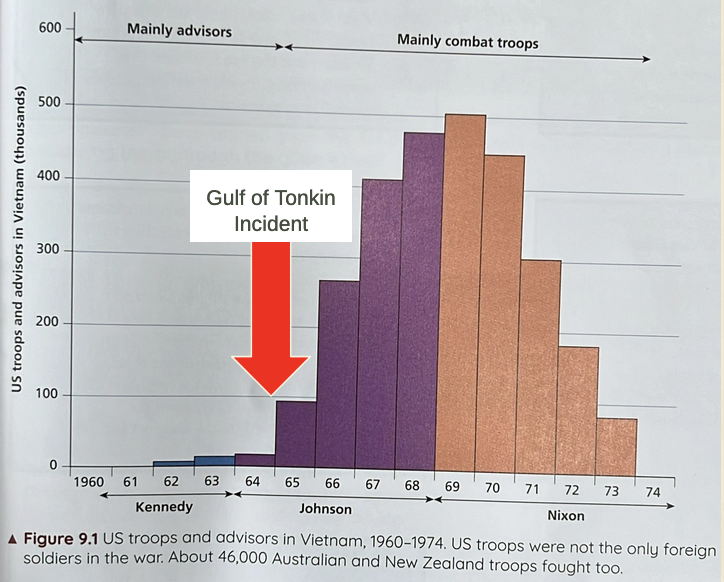

# Case Study of the Vietnam War, 1954 - 1975

## Vietnam before WW2

- The modern state of Vietnam was part of the French-ruled area known as Indochina
    - It was conquered and controlled by the French Empire progressively between 1862 and 1904.
- As part of French rule…
    - Local forms of government were replaced with French systems of governance, led by French officials
    - Western education and healthcare
- French rule was largely characterised by….
    - Resource exploitation
    - Heavy local taxes
    - A colonial monopoly on the trade of salt, opium, rice and alcohol.
- Thus, there were several attempts to rebel and overthrow French rule from the 1890s to the 1940s.
    - However, none of them succeeded.

## Vietnam during WW2

- After WWII broke out in Europe in 1939, France was defeated by Germany a year later in 1940.
- Japan, which was an ally of Germany, wanted access to French Indochina for its resources and strategic position.
    - As a result, Japanese forces invaded the northern region of French Indochina in September 1940 before coming to an armistice and agreement with the French Indochina colonial government.
- The French colonial government was aligned with Vichy France.
    - Vichy France was the new government set up after the defeat of France in 1940, and was aligned to Nazi Germany.
    - Vichy France allowed the Japanese to station troops in Indochina.
    - The French colonial government was often reduced to a puppet of the Japanese during this period.
- French colonial rule and the subsequent Japanese rule in French Indochina were both harsh.
- As a result, various groups emerged to resist French and Japanese rule.
- The most important of these resistance groups was the Viet Minh, led by Ho Chi Minh.
    - The Viet Minh, short for the League for the Independence of Vietnam (Viet Nam Doc Lap Dong Minh), was a nationalist movement that aimed to achieve independence.
    - It was an umbrella movement made up of two main groups:
        - Non-communists who simply wanted to drive the Japanese out of Vietnam in favour of self-rule
        - Communists who wanted to establish an independent communist state in Vietnam.
- During WWII, the Viet Minh received money, weapons and supplies from the United States, the USSR and the Guomindang (GMD) government in China.
    - Even though the GMD government in China was anti-communist, they supported the Viet Minh against the common enemy that was Japan.

## The First Indochina War

- When WWII ended in 1945, the French and the Allied forces moved to re-occupy Vietnam and accept the surrender of Japanese soldiers in Vietnam.
- The French came back wanting to rule Vietnam again, but quickly faced serious resistance.
    * To the Viet Minh, they had not fought the Japanese only to hand power back to the French.
    * They were determined to take control of the whole country.
    * In response, the Viet Minh entered the city of Hanoi on 2 September 1945 and declared Vietnamese independence.
- Over the course of 1946, tensions between the French and the Viet Minh intensified.
- __The First Indochina War broke out on 16 December 1946.__
- The Viet Minh used the same underground warfare tactics they had used against the Japanese during WWII.
    * They retreated to the mountains and forests and carried out surprise raids against the French.
- At the same time, shifting international relations and increased tensions influenced the way the First Indochina War played out.
- __Chinese Influence__
    * Initially, the anti-communist GMD government in China did not want a pro-communist Viet Minh to take power.
    * However, after the defeat of the GMD at the hands of the Chinese communists, China continued to support the Viet Minh.

### China

- Communist China started to support the Viet Minh by:
    * Supplying food, medical supplies and Soviet-made weapons.
    * Mao also supported Ho's forces with military advisors and training.

### Stalemate and French Defeat

- In response to the growing strength of the Viet Minh, the French launched a propaganda campaign warning people that the Viet Minh was simply the agent of communist China and the USSR.
- The First Indochina War began to escalate, and larger battles were fought.
- __By 1951, the French and Viet Minh forces were at a stalemate.__
- Two separate Vietnamese states emerged by 1954.
    * A communist North
    * A French-backed South

### American Influence

- After WWII, it had to make the choice between supporting the colonial ambitions of France, and supporting the largely communist Viet Minh.
- Hoping to win the sympathies of anti-colonial United States, Ho cleverly kept quiet about wanting a communist Vietnam, and instead portrayed it as a struggle against French colonial rule.
- However, the possibility of winning US support vanished when the communists took power in China.
    * Against the backdrop of the Cold War, the United States believed that Ho and the Viet Minh were controlled by the USSR.
- Therefore, it withdrew its support for the Viet Minh and supported the French, providing weapons and supplies in their fight against the Viet Minh.
- From the United States' point of view, communist China supporting the Viet Minh was a disaster and the start of a communist plan to dominate all of Southeast Asia, a belief known as the __domino theory__.
    * Domino Theory - The belief that if one country fell to communism, the others would fall too, just like a row of dominoes.
- To prevent this, the United States began to pour $500 million a year into the French war effort.
- Meanwhile, the French set up a non-communist government in the south of Vietnam, headed by former Emperor Bao Dai to win local support.

### French Defeat

- As the war dragged on to the early 1950s, the French attempted to lure the Viet Minh out into open battle against strongly defended bases where French superiority in firepower could be used.
    * One such French base was __Dien Bien Phu__
- __13 March - 7 May 1954: Battle of Dien Bien Phu__
    * In 1954, a large well-armed force of French troops was thoroughly defeated by the Viet Minh.
    * The Viet Minh was able to cut off the French army's supply lines, depriving them of food, medical supplies and ammunition.
    * French defeat by the Viet Minh leading to the overall French defeat in the war.

## The Geneva Conference, 1954

- After the defeat of Dien Bien Phu, the French government and public lost interest in retaining Vietnam as a colony as the cost of the conflict outweighed the benefits.

### The Geneva Conference

- An international conference, attended by France, the Viet Minh, the USSR, China, the United States, and Britain, was held in Geneva, Switzerland.
- The Viet Minh demanded the recognition of the Democratic Republic of Vietnam and the removal of French troops.
- After weeks of talks, Vietnam was divided into two along the 17th parallel:
    * A communist-dominated North Vietnam under Ho;
    * And a non-communist South Vietnam under Prime Minister Ngo Dinh Diem
- Part of the agreement was that elections would be held by 1956 to establish a single government for a unified Vietnam.
- The agreements brought peace but not stability.
    * With the peace agreement and withdrawal of the French by 1956, the Viet Minh was disbanded.
    * Neither side was happy for the partition, but the only realistic alternative was further fighting.
    * This unhappiness lead to tensions between North Vietnam and South Vietnam that would contribute to the eventual outbreak of the Vietnam War.

# A Divided Vietnam

## Introduction

- The two governments in Vietnam had different visions for an independent and reunified Vietnam, which lef to conflict and instability in both Vietnams.
- Even though the two Vietnams subscribed to differing ideologies, both governments were attempting consolidate their power through authoritarian means.

## North Vietnam in the 1950s

- __Immediately after the Geneva Conference__, Ho worked quickly to consoildate his hold on North Vietnam.
    * In the early months of the regime, thousands fled from North Vietnam in fear of communist rule.
    * At the same time, many Viet Minh soldiers and supporters in South Vietnam fled northwards.
        + This strengthened the regime as it got rid of potential opponents.
- Ho and the communists had much support in North Vietnam for two reasons:
    * Ho was recognised as a great leader who had fought the Japanese invaders and the French colonial rulers.
    * Sweeping land reforms were introduced which ensured that land was confiscated from larger landowners and redistributed to the peasant farmers.
        + During this redistribution policy, manhy landlords were placed on show trials.
            + Show trials - a public trial of a political offender where there are no proper legal processes. Often, the objective is to make an example of the offender rather than ensuring justice.

## South Vietnam in the 1950s

### Early Stages of Ngo Din Diem's Regime

- By the end of the Geneva Conference, Ngo Dinh Diem was the Prime Minister of South Vietnam
- While a fervent anti-communist, Diem was also a patriot who hoped to modernise Vietnamese economy and society to strengthen the country against interference by foreign powers.
- Early in his presidency, Diem implemented some modernisation programmes.
- Examples:
    * Construction of universities and the expansion of agriculture. 
    * Attempts to transform the countryside with the aims of creating a national identity and localised democracy.
- Despite these attempts, Diem's regime proved to be increasing unpopular as the 1950s progressed due to the use of authoritarian methods. The regime frequently imprisoned and sometimes executed opponents.

### A Rigged Referendum

- In July 1955, Diem announced that the Vietnam-wide elections agreed at the Geneva Conference would not be held.
- In October, he held a referendum on a proposal to remove Head of State Bao Dai, the last Emperor of Vietnam, and install himself as President.
    * The results showed that 98% of voters approved the proposal
    * But the referendum was rigged.
        + In some areas, the votes approving of Diem outnumbered the registered voters.
    * Diem's actions had the support and involvement of the United States
        + South Vietnam depended heavily on US financial and military support
        + This thus allowed it to be deeply involved in the political affairs of South Vietnam
        + The United States supported Diem because he was strongly anti-communist.

### Diem's Unpopular and Corrupted Regime

#### Nepotism

- Diem blatantly practised __nepotism__
    * Nepotism - the practice of those in power of favoring relatives e.g. giving them jobs or other preferential treatment, often without merit.
- He appointed his brothers as key officials and diplomats.

Diem also __refused to hold elections__, even for local councils.

#### Protests

- There were widespread protests against his regime.
- They were often led by well-organised, well-educated and influential Buddhist monks, whom the regime showed little respect for.
    * Some Buddhist monks protested by setting themselves on fire - an act known as self-immolation
        + The graphic images of these acts of self-immolation made Diem even more unpopular among the people.

#### American Frustrations

- The United States was concerned and frustrated by Diem's actions but could not find anyone better.
- In the 1950s, the United States supported his regime with around $1.6 billion.
- Despite the US support, the regime was weak and unable to prevent a communist insurgency in the countryside.

## South Vietnam Insurgency, 1954-1960

### Beginnings

- Besides the Buddhist monks, various groups opposed Diem's regime throughout the 1950s.
    * Most of them were former members of the Viet Minh who believed in unification of North and South Vietnam.
- After Diem's cancellation of the promised 1956 reunification elections, many former Viet Minh members started to wage a low-level campaign of disruption and harrassment against his regime.

### Diem's Response to the Insurgency

- Thousands of suspected communists were locked up, with many tortured and executed. 
- He also tried to strike at the insurgents military bases and had some success between 1954 and 1957.
- However, this did not stem the insurgency.

### Support from South Vietnam

- In __May 1959,__ the North Vietnam Communist party approved the setting up of Group 559, a specialised unit of the North Vietnam Army.
    * Its job was to transport weapons, ammunition and other equipment to the insurgents.

### The Viet Cong

- By 1960, the insurgents had formally organised themselves into the Viet Cong.
- Also known as the National Liberation Front for South Vietnam, the Viet Cong included South Vietnamese opponents of the government.
- Like the preceding Viet Minh, it comprised large numbers of communist North Vietnamese taking orders from Ho.
- Between 1957 and 1960, they carried out around 1,700 assassinations.
    * These attacks could be on anyone associated with the South Vietnamese government, including police officers, officers of the law courts and administrators.
    * The insurgents also assassinated anyone suspected of collaborating with the government.
- In addition, they staged hundreds of attacks on government forces.
- The group later created a supply route, known as the __Ho Chi Minh Trail__. It would become a central resource in the conflict which was about to escalate.

By the early 1960s, the insurgency showed no signs of being suppressed and was in fact growing in intensity.
- This threatened Diem's regime
- It contributed to the conflict escalating into a full blown conflict/the Vietnam War.

# Escalation of Tensions

## Local Agent: The Viet Cong

- In the early 1960s, supplied by North Vietnam, the Viet Cong stepped up the guerilla war against the South Vietnamese government.
- E.g. Using the Ho Chi Minh Trail, the Viet Cong sent reinforcements and supplies to guerilla fighters, including around 40,000 North Vietnamese Army troops between 1961 and 1963.
    * The fighters attacked South Vietnamese government forces, officials and buildings.
- Furthermore, the Viet Cong often chose to avoid well-defended South Vietnamese positions in urban areas, but instead focused on making the countryside unsafe for government forces.
- They also attacked the US Air Force supply bases.

## Local Agent: South Vietnam

- South Vietnam responded with a policy called the Strategic Hamlet programme where peasants were relocated (sometimes by force) to fortified villages away from the control and influence of the Viet Cong.
    * The Strategic Hamlets also supported Diem's vision of transforming the countryside to create a national identity and localised democracy.
    * Removing civilians also allowed the superior firepower of the US Air Force and South Vietnamese Army to destroy the Viet Cong without civilians being caught in the crossfire.

## External Player: China

- After the communist victory in China in 1949, Mao saw the United States as his greatest threat.
    * He was especially concerned about a possible invasion by US allies, backed by US forces.
    * Mao believed that if Vietnam became a non-communist country that was allied with the United States, China was potentially vulnerable to attack from South Korea, Vietnam and the GMD government in Taiwan.
    * Thus, he was eager to support any state or group that created an anti-US buffer in Vietnam, especially if it was a communist one.
- Another reason why Mao wanted to help North Vietnam was to show support for another communist state. In addition, he felt a bond of loyalty to Ho.
- It is also probable that Mao believed involvement in the Vietnam War could help unite the Chinese people under his leadership.
    * He had done the same in the Korean War and it had strengthened his position, particularly when Chinese forces pushed US troops back in Korea.

## External Player: The USSR

- However, in the mid-1960s, the Soviets began to show more interest in Vietnam.
    * Due to the Sino-Soviet Split, the USSR was also in contest with China over leadership of the communist world.
    * Showing support for another communist state which was standing up to the United States was important in asserting the USSR's leadership.
    * The Soviets steadily provided more and more arms and other essential supplies to North Vietnam.
- By the late 1960s, the USSR was providing more support to North Vietnam than China, particularly in the form of aircraft and air defences such as surface-to-air missiles.

## External Player: The USA

- The United States was convinced that China and the USSR was planning to spread communism to countries in Asia.
    * Due to __domino theory__, it believed that if Vietnam fell under the control of China and the USSR, other countries would also fall under Communism like a row of dominoes.
The United States was so determined to resist communism that it would support anti-communist governments, including Diem's.
    * It did pretty much the same thing in many states in Central and South America.
        + This foreign policy pursued by the United States to prevent the spread of communism abroad was known as __containment.__
- In 1961, __John F. Kennedy__ took over from Eisenhower as US President
    * At this time, the possibility of a communist victory in Vietnam remained.
        + If that happened, it could result in a Southeast Asia being lost to the communists, as suggested by the __domino theory__
    * Kennedy was cautious as he did not want the United States to, in his own words, "blunder into war, unclear about aims or how to get out again"
- Under Kennedy:
    * Military advisors were sent to train the South Vietnamese Army, and military equipment continued to be supplied.
        + These support efforts of the United States were organised under the Military Assistance Command Vietnam (MACV)
- In 1963, Kennedy was assassinated.
- His successor, __Lyndon B. Johnson__, faced the same challenge: to avoid a full US military commitment to Vietnam while pursuing a containment policy to prevent the communists from coming into power.
- However, Johnson was more convinced and prepared than Kennedy to commit the United States to a full-scale conflict in Vietnam to contain communism
- Under Johnson:
    * Diem was assassinated by South Vietnamese military commanders in 1963
        + This heightened political instability combined with the lack of a strong leader as replacement, to make the situation seem to favour a communist takeover.
    * Tensions between the United States and the communist bloc increased due to various international developments such as:
        + China exploding its first atomic bomb in October 1964
        + The USSR showing little interest in peaceful co-existence with the West
    * Committed to preserving the independence of South Vietnam as an anti-communist state, the United States increased the number of military advisors and economic assistance.

## Outbreak of the Vietnam War

### Gulf of Tonkin Incident

- By August 1964, North and South Vietnam were already in a de facto state of conflict.
- On __2 August 1964, __North Vietnamese patrol boats attacked the USS Maddox, a US destroyer, in the Gulf of Tonkin.
- The Gulf of Tonkin incident led the United States Congress to take decisive action.
    * It passed the Gulf of Tonkin Resolution, giving Johnson the power to take all necessary measures to prevent further aggression and achieve peace and security.
    * This marked the beginning of US military intervention.
        + Instead of only deploying advisors, the United States sent troops to fight in Vietnam.
        + US allies such as Australia, Britain, New Zealand and South Korea also contributed soldiers over the course of the war.
- __This phase of direct American involvement in the war is often called the Vietnam War, or the Second Indochina War.__
    * Thus, the Gulf of Tonkin incident directly led to the outbreak of the Vietnam War.

# Developments of the Vietnam War, 1964-1976

## Changing Scale of US Involvement

After the Gulf of Tonkin incident, the number of US troops deployed in Vietnam increased dramatically.

## The progress of the war, 1965-1967

- From March 1965 to the end of 1967, US and South Vietnamese forces fought a series of battles along the border between North and South Vietnam.
- The first major battle was in November 1965, in the la Drang Valley
    * It was estimated that the US casualties numbered 234 dead, while North Vietnam lost between 1,500 and 2,000 troops.
- As a whole, while the United States had superior firepower, the North Vietnamese and Viet Cong were battle-hardened and effective at fighting a stronger enemy.
    * Even though US forces killed large numbers of Viet Cong, they failed to achieve a clear victory.
    * However, the Viet Cong and North Vietnamese could not drive out the United States either.
    * The war developed into a stalemate.

## How North Vietnam Fought the War

### Overall Strategy

- Due to an inferiority in military equipment, the Viet Cong and the North Vietnamese turned to __guerilla warfare__ in order to avoid large-scale battles that were not in their favour.
    * They did not wear uniforms and were hard to tell apart from the peasants.
    * They attacked and then disappeared into the jungles, villages or tunnels, e.g. __Cu Chi tunnels__

### Support from its Civilian Population

- North Vietnam knew how important it was to win over the population.
- The Viet Cong were expected to respect and help the peasants.
- That said, they were prepared to kill those who opposed them or cooperated with their enemies.
    * Between 1966 and 1971, the Viet Cong killed an estimated 27,000 civilians.

### Morale

- One million Viet Cong and North Vietnamese are estimated to have died in the war, far exceeding US losses.
    * This loss was a price that Ho was prepared to pay as the war was seen as a war of national liberation.
- The greatest strength of the Viet Cong was the refusal to give into anything less than the complete removal of the United States from Vietnam.

## How US Fought the War

### Overall Strategy

- The United States used its superior air power to engage in strategic bombing to disrupt North Vietnamese supply lines.
    * For example, during Operation Rolling Thunder in 1965, North Vietnamese cities, factories and army bases, Viet Cong strongholds in South Vietnam and the Ho Chi Minh Trail were bombed.
        + It resulted in thousands of civilian casualties.

### Support from its Civilian Population

- The United States lacked the same level of popular support as North Vietnam did.
- The frequent "Search and Destroy" missions to hunt down the Viet Cong forces often resulted in many civilian deaths. The use of defoliants such as __Agent Orange__ and __napalm__ as weapons also resulted in long-term health problems for civilians
    * This led to low support for the United States.

### Morale

- Although morale among the US troops was high at the beginning of the war, it fell as the war intensified.
- Following the introduction of conscription, many US troops sent to Vietnam over the course of the war were young and inexperienced.
    * They did not understand why they were conscripted to fight a war in a faraway country, for a people they knew nothing about.
- The low morale was worsened by the media's portrayal of the US involvement in the war as an unjust one.

## The progress of the war, 1965-1967

- Overall, the Viet Cong controlled the countryside while the US controlled the major towns, cities and its own bases.
- The United States could stay as long as it had political will.

## The Tet Offensive, January 1968

- From 1965 to 1967, the official view in the United States was that the war was going reasonably well.
    * As the fight against the Viet Cong insurgency had no clear territorial goals to capture, the US and South Vietnamese forces used "body count" as a means of measuring success.
        + The goal was to kill as many Viet Cong soldiers as possible so as to wear the enemy down.
- This confidence was shattered by the Tet Offensive in January 1968
- During the Vietnamese New Year (Tet) holiday, Viet Cong fighters attacked over 100 cities and other military targets
- Leading up to the attack, the Viet Cong used the Ho Chi Minh Trail to move war material and fighters from North Vietnam to the South
- The Tet Offensive involved around 80,000 Viet Cong and North Vietnam Army troops.
- There was particularly bitter fighting over the city of Hue and around the US military base at Khe Sanh in the northern part of South Vietnam.
    * __Note: This is different from the battle from the 1st Indochina War previously discussed. That took place in Hanoi.__
- The Offensive was costly for the communists, with the Viet Cong being badly weakened, having lost around 10,000 experienced fighters.
- Furthermore, the people of South Vietnam did not rise up and join the Viet Cong as hoped.

### Aftermath of the Tet Offensive - Shifting Sentiments in the US

- Despite its failure to achieve military objectives, the Tet Offensive proved to be a turning point in the war as it raised hard questions in the United States
    * The United States had nearly 500,000 troops in Vietnam and was spending $520 billion a year on the war. So why had the communists been able to launch a major offensive that took US forces completely by surprise?
    * The US and South Vietnamese forces quickly retook the towns captured in the offensive. However, in order to do so, they required large amounts of artillery and air power. Many civilians were killed and the ancient city of Hue was destroyed. Considering these casualties was the war really justified?

#### Role of Media

- Widely and graphically covered in the media, the Vietnam War is often called the "first television war".
- At first, the relationship between the US government and the media was relatively good as the government wanted to win domestic support for the Vietnam War.
    * For example, journalists accredited by MACV (Military Assistance Command Vietnam) would get access to war zones, interviews and regular reports. In return, they were expected to not reveal any information which would help the enemy
- <ins>However, the Tet Offensive changed the way the war in Vietnam was reported to the American public</ins>
    * During the Tet Offensive, the journalists abandoned their restraint.
    * The Tet Offensive convinced many journalists that the United States could not win the war.
        + For example, Walter Cronkite of CBS News, an American television station, was one such journalist
            + He publicly criticised the US war effort in Vietnam on national television.
            + Though hotly debated, some believed that this swung public opinion on the US involvement in the Vietnam War.

#### Rising Anti-War Sentiments

- Additional media coverage and revelations of US atrocities in the Vietnam War.
    * For example, the My Lai Massacre
        + US soldiers murdered between 347 and 504 unarmed South Vietnamese civilians, shocked the American public.
    * Many people began to demonstrate and protest the US involvement in the Vietnam War.
- The anti-war sentiments were fuelled by graphic images that were publicised in the mainstream media.
    * An example of this was the iconic image of a Viet Cong captain being held at gunpoint and later executed by a South Vietnamese general.
        + This photograph - named "Saigon Execution" - turned the American public against the war effort, with some calling it "the picture that lost the war".

#### The US Looks to Withdraw

- In January 1973, all parties signed the Paris Peace Accords to "end the war and restore peace to Vietnam".
    * With the Paris Peace Accords ending direct US military intervention in Vietnam, Nixon described it as "peace with honour"
- Nixon had promised continuing financial aid and military support to Vietnam, but the US Congress refused to allow it.
    * Nixon himself was in big political trouble over the Watergate scandal.
        + In 1972, he authorised an illegal break-in at the Watergate Complex to place listening devices in the offices of politicians who opposed him.
            + As a result, he was impeached in 1973.
- These political developments made it difficult for Nixon to gain the support of the Congress when it comes to the Vietnam War.
    * Congress also believed that the United States should not continue its involvement in the war, especially given the corruption of the South Vietnamese regime.

#### The US Withdraws

- By 29 March 1973, the last US forces had left Vietnam.
    * Ho had died in 1969 - he did not get to see the US forces leave and his country reunified a few years later.
- Even with the withdrawal of US forces, the new US President, Gerald Ford, wanted to continue providing financial aid to South Vietnam.
    * The request was made in January 1975, and was rejected by Congress,m signaling the lack of support for the Vietnam War.

### The Fall of Saigon, April 1975

- Without US air power or military back-up and without the support of the population, the South Vietnamese government could not survive for long.

#### The Communist Advance

- In December 1974, the North Vietnamese launched a major military offensive against South Vietnam.
- In April 1975, amid the chaos, South Vietnamese President Nguyen Van Thieu resigned and fled the capital city, Saigon.
- Saigon fell to the rapidly advancing communist forces and the remaining South Vietnamese government had no choice but to surrender to the North Vietnamese forces.

#### Last Ditch Effort to Flee

- One of the bleakest symbols of Us failure in Vietnam was the televised news images of desperate Vietnamese men, women and children trying to clamber abord helicopters taking off from the US embassy in Saigon.
- This was part of Operation Frequent Wind - the final evacuation of US civilians and Vietnamese from 29 to 30 April 1975, as communist forces swarmed through Saigon

## Aftermath and Conclusion

### Communist Victory

- With the withdrawal of the United states and the surrender of the South Vietnamese government, North Vietnamese forces declared victory in Saigon, which was subsequently renamed to Ho Chi Minh City.
- Finally, after 30 years of constant conflict, the struggle for control of Vietnam had been settled.
    * The __communists had won__, and Vietnam reunified as a communist state.
- After seizing power:
    * The communist government in Vietnam also sought to establish an iron-fisted rule.
        + They rounded up hundreds of thousands of South Vietnamese and put them in supposed "re-education camps".
            + These camps were, in reality, prison camps where former supporters and collaborators of the South Vietnamese government were subjected to indoctrination, torture and forced labour.
    * In 1976, Vietnam became known as the Socialist Republic of Vietnam, under the leadership of Communist Party Chairman Le Duan.
        + The communist state aligned itself closely with the USSR, from which it continued to receive aid in order to secure and control the new nation.

### The Cost to Vietnam

- An estimated over two million Vietnamese perished in the war, and another three million were wounded.
- The use of chemical weapons by the United States also created health problems for subsequent generations of Vietnamese
- The defeat of South Vietnam also triggered a refugee crisis in 1975, in which an estimated 800,000 Vietnamese fled Vietnam by small boats.
    * These refugees braved hunger, disease and pirates at sea in order to reach the safety of neighbouring countries.

## Damage to US Cold War Foreign Policy

| Impact of the Vietnam War      | Description                                                                                                                                                                                                                                                                                                                                                                                                     |
|--------------------------------|-----------------------------------------------------------------------------------------------------------------------------------------------------------------------------------------------------------------------------------------------------------------------------------------------------------------------------------------------------------------------------------------------------------------|
| A bankrupt ideology            | The campaign against communism was portrayed by the United States as a moral crusade. However,   - The Vietnam War had demonstrated that the ideology of the West was not morally superior.   - The atrocities committed by US soldiers and the use of chemical weapons had damaged its reputation                                                                                                |
| Failure of containment         | The United States had failed to enact containment in Southeast Asia despite its military strength.   - As feared by the proponents of the domino theory, after the fall of South Vietnam, Laos and Cambodia also turned communist by 1975.                                                                                                                                                 |
| Weakening of the US Presidency | The United States Congress had traditionally supported the Presidents in their conduct of foreign policy. However, towards the end of the Vietnam War, Congress exercised greater oversight of presidential actions.   - For example, Congress forbade US military aid to Cambodia in 1970. In 1973, it introduced the War Powers Act, limiting the ability of the President to go to war. |

## The Association of Southeast Asian Nations (ASEAN), 1967

- The inability of the United States to win the Vietnam War and contain communism in Vietnam stoked fears of the spread of communism in Southeast Asia.
    * This fear contributed to the formation of __the Association of Southeast Asian Nations (ASEAN)__ in 1967.
- ASEAN also declared Southeast Asia as a Zone of Peace, Friendship, and Neutrality in 1971.
    * This was aimed towards keeping ASEAN free from the interference of any outside powers.

## Detente

- These failures influenced the United States into trying to improve its relations with the communist world.
- The United States sought greater understanding with the USSR in this period which was known as detente ("reduction of tension")

### Examples

- In 1972, the United States and the USSR signed the Anti-Ballistic Military Treaty to reduce nuclear weapons.
    * This was the result of a series of successful bilateral negotiations known as the Strategic Arms Limitation Talks.
    * In 1975, the two parties met again in Helsinki, Finland, to discuss borders and human rights.
- At the same time, the United States also sought greater understanding with the People's Republic of China
    * It ended its block on the issue of China's representation at the United Nations.
    * Nixon made visits to China to improve diplomatic relations.

## Conclusion

- The Vietnam War's importance and influence can still be felt today.
    * Whenever the United States became involved in a situation outside its borders, there was a constant fear of "another Vietnam"
    * When the USSR invaded Afghanistan in 1979, many commented that this was the USSR's version of Vietnam.
- The war demonstrated that the ideologies could not be imposed through unpopular governments if there was enough will to resist those governments and if the resisters had sufficient support.
- The Vietnam War was an example of a Cold War proxy conflict.
- The cost of the Vietnam War led to the pursuit of mutual co-existence between the superpowers - marked by treaties limiting nuclear weapons, and the re-establishment of diplomatic relations between communist China and the United States

