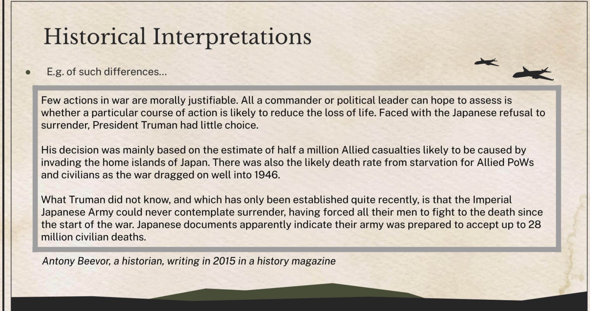
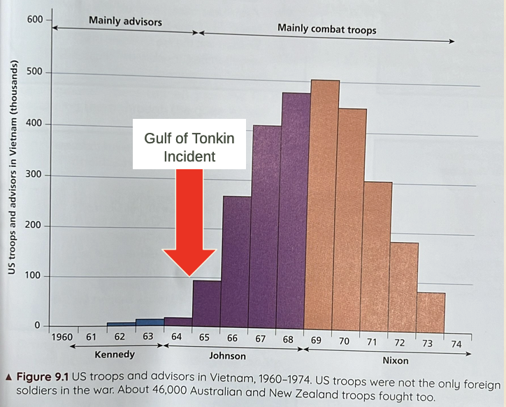

# Attempts to Make and Keep Peace - The Paris Peace Conference and The League of Nations

## World War 1

### Why did World War 1 Occur?

- Alliances
- Arms and naval race
- Clash over __Austro-Hungarian annexation of Bosnia in 1908__ 
- Assassination of Archduke Franz Ferdinand of Austria-Hungary

### Impacts of the War

| Country                  | Impact of the Country                                                                                                                                                                                                                                                                                                                             | Mindset of People                                                                                                                                     |
|--------------------------|------------------------------------------------------------------------------------------------------------------------------------------------------------------------------------------------------------------------------------------------------------------------------------------------------------------------------------------------------------------|----------------------------------------------------------------------------------------------------------------------------------------------------------------------------------------------------------------------|
| Germany                  | The Kaiser's government lost control of the country. The Kaiser was overthrown in a revolution.                                                                                                                                                                                                                                                   | Did not believe their army lost the war                                                                                                               |
| Austria-Hungary          | Austria-Hungary collapsed and broke up into many different countries.                                                                                                                                                                                                                                                                             | People in their new countries developed a new sense of nationalism                                                                                    |
| Britain                  | WW1 had been costly in terms of lives and money                                                                                                                                                                                                                                                                                                   | Wanted to focus on rebuilding its economy and strengthening its empire.                                                                               |
| France                   | Most was affected by the war. Lost many lives. Large parts of its industrial regions were devastated.                                                                                                                                                                                                                                   | Wanted revenge on Germany. Ensure Germany could not threaten France again.                                                                            |
| Russia                   | Tsar was overthrown in March 1917 and replaced by a Provincial Government. In November 1917, Provincial Government was overthrown by the Communist, Bolshevik Party, as led by Vladimir Lenin. Civil war breaks out between the Bolsheviks and its opposition, collectively known as the Whites. In 1922, the USSR wins the Civil War. | Sought increased equality, hence the revolutions. Tired of war. Desire to spread communism.                                                           |
| United States of America | Became the world's greatest power due to the sale of weapons during the war. Lost many lives.                                                                                                                                                                                                                                                     | Did not believe the lost American lives were worth it. Developed isolationist mindset.                                                                |
| Japan                    | Did not take part in the major fighting. Did not suffer damage from the war and was able to focus on allowing it to increase its wealth and power                                                                                                                                                                                               | Increasing power made them feel that Japan was the equal of the European powers. Felt Japan deserved an empire just like the European powers. |

## Paris Peace Conference

### Context for the Paris Peace Conference

- Public Sentiment of Allies in 1919
- The Treaty of __Brest-Litovsk__

### Aims of the Big Three

#### Woodrow Wilson

- 14 Points
- Germany
- Self-Determination

#### Lloyd George

- Protect Britain
- Rebuild the British economy
- Maintain the British Empire

#### Clemenceau

- Ensure Germany could not wage war against France again
    * Wanted to break up Germany

### Compromises

- No German breakup, reparations instead
- Self-determination

### Key Terms of the Treaty of Versailles

- War Guilt Clause
- Reparations
- Territory Changes
- Limit on armed forces/Disarmament
- Formation of League of Nations

### Germany's Reaction

- Saw it as a diktat
- Sources of resentment
    * War Guilt Clause
    * Reparations
    * Territory Changes
    * Limit on armed forces/Disarmament
    * Formation of League of Nations

### Impact of the Treaty of Versailles

#### Short Term

- Fostered the *Dolchstoss*/"stabbed in the back" theory
- Bitterness against the new democratic system

#### Medium Term

- Political crisis
- Economic Crisis 
    * Hyperinflation in the early 1920s

#### Long Term

- Became a lingering source of resentment

### Impact of other treaties

- Four other treaties were signed at the Paris Peace Conference
    * The Treaty of Saint-Germain-en-Laye reinforced the Treaty of Versailles prohibition on *Anschluss*

## Judgments on the Paris Peace Conference and the Treaty of Versailles

### Was the Treaty of Versailles Too Harsh on Germany?

#### Yes

- Disarmament
    * Left it unable to protect itself
- Territorial
    * Brest-Litvosk was harsher to Russia than the TOV was on Germany &rarr; The Big 3 was kinder to Germany than it was to Russia
- War Guilt Clause
    * Unfair because Germany was only responding to Russian mobilisation when it did so at the start of WW1
- Reparations
    * Leads to hyperinflation in 1920s
    * Leads to greater suffering during the Great Depression
- Built resentment towards the Big 3
    * Rise of Hitler

#### No

- Leadership
    * Leadership was not removed/executed/tried &rarr; Experience (especially of military leaders) was retained
- Territorial
    * It is relatively characteristic of treaties of that time
        + But times had changed thanks to ideas like the 14 points and nationalism
            + Germans believed that it was too harsh
    * Germany was not split apart

## League of Nations

### Aims of the League

#### Collective Security

- "An attack against one is an attack against all"
- To achieve world peace through __international cooperation__
- League members would bind themselves to the League's Covenant and would...
    * Disarm
    * Bring disputes to the League and accept its decisions
- If a member broke the Covenant
    * Economic sanctions
    * Military action

#### Disarmament

- Aim: to __reduce the ability of countries to wage war__
- To be achieved through international agreements
- E.g. TOV required Germany and her allies to disarm; Allied Powers also required to disarm.

#### Other Aims

- Promote open, fair and honourable relations between nations (prevent alliance systems / secret treaties)
- Lay out system of international law
- Maintain, modify treaties between nations

### Structure of the League

- General Assembly
    * Parliament
    * Met once annually
- The Council
    * 4 Permanent Members (Britain, France, Italy and Japan)
    * 4 (later 9) temporary members elected by GA
- Agencies and Commissions
    * Means through which the League tackled medical, economic and humanitarian issues.
- The Secretariat
    * Handled day-to-day operations
    * Prepared agendas and published meeting minutes
- Permanent Court of Justice
    * 15 Judges in the Hague, Netherlands
    * Settled international disputes

### League of Nations tried to Influence:

- Aid
    * Special commissions were set up to consider giving aid to developing nations.
- Health issues
    * Special commissions worked to fight disease worldwide. First big success was against leprosy. Commissions also worked against drug abuse.
- Minorities
    * Special commissions worked to ensure fairness for all minorities - racial, national and sexual.
- Human Rights
    * Special commissions worked to solve the problems faced by refugees and to abolish slavery.
- Collective Security
    * The General Assembly and the Court of Justice worked to solve disputes between nations, to avoid the threat of war. The League also tried to implement a programme of disarmament worldwide.
- The Mandates
    * Special commissions worked to make sure the mandates were properly run.
- Labour issues
    * The ILO advised on working conditions and wages

## Concerns about the League

 - Concerns by Britain and France
     * Lloyd George
         + Wanted a simpler organisation like the Conference of Ambassadors
             + Conference of Ambassadors
                 + Non-League organisation
                 + Informal meeting of the League's permanent members
             + Wanted to maintain Britain's ability to act independent of the League
     *  Clemenceau
         + Also wanted to maintain French independence to act
     *  Ability to achieve disarmament
         + The League expected members to disarm
         + However, this only worked if all members disarmed
         + If not, countries would be left themselves unable to protect their territories and interests
         + Members were thus resistant to disarm.
     *  Ability to stop aggressor countries
         + Peacekeeping Steps
             + A commission of enquiry determines if a nation was guilty of aggression
                 + __Concern:__ Takes time. Time that a country under attack might not have
             + Hold talks with the guilty party (Arbitration and use of moral persuasion)
                 + __Concern:__ Guilty party might not be open to persuasion and/or arbitration
             + League encourages members to impose economic sanctions collectively (thus cutting off trade ad financial relations)
                 + __Concern:__ Members might be concerned of the economic impact on their own countries
             + Take military action to protect them
                 + __Concern:__ The League had no army of its own.
     *  Membership of the League
         + Limited Membership
             + USA did not join because of its non-interventionist policy
                 + The League lacked the USA's economic and military support to enforce its will &rarr; Aggressor countries could continue to trade with US and did not fear one of the strongest militaries in the world
         + Germany denied from joining until 1926
         + USSR denied from joining until 1934
     *  All these thus greatly weakened the League

## Successes and Failures of the League in the 1920s

| Year | Incident                                                                      | Resolution                                                                                                                                                                             | Success/Failure |
|------|--------------------------------------------------------------------------------------------------------------------------------------------------|-----------------------------------------------------------------------------------------------------------------------------------------------------------------------------------------------------------------------------------------------------------|-----------------|
| [1925](01-League-of-Nations/03_The_Greek_Bulgarian_Border_1925.md) | Border dispute between Greece and Bulgaria. Greece then invaded Bulgaria. | The LON made Greece withdraw. Britain and France supported the League's decision.                                                                                                 | Success         |
| [1920](01-League-Of-Nations/01_Vilna_1920.md) | Poland seized Vilna, the former capital of Lithuania.                         | The League could not make Poland withdraw. Britain and France were reluctant to act.                                                                                                  | Failure         |
| [1923](01-League-of-Nations/04_Corfu_1923.md) | Italy took over the Greek island of Corfu.                                    | The LON could not make Italy withdraw until Greece gave in on the dispute. Britain wanted to act, but France was distracted with dealing with dispute with Germany in the Ruhr. | Failure         |
| [1921](01-League-of-Nations/02_Upper_Silesia_1921.md) | Both Germany and Poland wanted __Upper Silesia.__                             | The LON let the people of Upper Silesia vote; a huge majority wanted to join Germany. The LON split it into 2 instead.                                                           | Ambiguous       |

### Other attempts to keep the peace outside the League

#### 1922: Rapollo Treaty

- The USSR and Germany re-established diplomatic relations

#### 1924: The Dawes Plan

- Represented by USA, Britain, Italy and France
- helped Germany's economy
    * Restructured Germany reparations
    * USA offered Germany huge loans that helped support its economy and fight hyperinflation
- French and Italian troops withdrawn from Ruhr

#### 1925: The Locarno Treaty

- Sought to maintain peace between Germany, France, Britain, Italy and Belgium
- Germany accepted Western borders outlined in TOV
- Reassured France and facilitated Germany's entry into the LON

#### 1928: The Kellogg-Briand Pact

- Agreement between 65 nations to not use force to settle disputes

#### 1929: The Young Plan

- Plan by WW1 to support Germany's economy
    * Designed to ensure they could pay reparations
- Reduced reparations
- Extended reparation periods.

### Successes

__Significant progress was made after World War 1 in several areas:__
- The League helped millions of refugees to return home after the war.
- The Health Commission of the League helped to reduce the spread of contagious diseases through international vaccination programmes and helped to reduce fatalities from such diseases.
- The League also worked to reduce the smuggling of cheap labour, opium and dangerous chemicals across international borders.

# Germany

## German Political System before WW1

- Germany was a great power
- Power and authority lay with the Kaiser, his ministers and the army
- The Reichstag (German parliament) was largely ignored

## Impact of WW1 on Germany

- By 1918, Germany was facing defeat
- In 1918, 300,000 Germans died from malnutrition
    - British Royal Navy blockaded supplies
- German economy was in ruins
- The Kaiser and army commanders began to involve members of the Reichstag in decision-making
    - They were attempting to shift blame
- Waves of untrust followed Germany’s defeat in November 1918
    - This ultimately led to the Kaiser abdicating on 9 November 1918

## What is the Weimar Republic?

- The new government that ruled Germany after its emperor, Kaiser Wilhelm II,
- It was declared in the town of Weimar in February 1919, hence its name
- It had a:
    - President that led the country
    - Parliament that made the laws.

## Weimar Constitution

- The new Weimar Republic needed a new constitution (i.e. the highest law of the land) and it was approved by a majority of the Reichstag (the German parliament) in July 1919
- It introduced significant changes:
    - All Germans over the age of 20 could vote, including for the first time, women
    - Party representation would be determined by proportional representation
    - Article 48
- The political structure of the Weimar Government
    
    
    

### Proportional Representation

Thanks to the Weimar Constitution, the Weimar Republic operated under a system known as proportional representation where people voted for a party rather than specific candidates and parties gained seats based on the number of votes won.

The Weimar Constitution required that all laws be approved by the Reichstag

**Why was this the biggest weaknesses of the Weimar Republic?**

Proportional representation made it hard for any political party to get a majority during elections. Hence coalition governments were formed.

- **For example,** Friedrich’ Ebert’s Social Democratic Party won the most votes and gained the most seats in the Reichstag following the January 1919 elections and he became President. However, he did not have enough seats to form a government on his own and had to form a coalition with the Catholic Centre Party and the German Democratic Party

As laws needed to be approved by the Reichstag as well, governments had to balance the interests of the various parties that made up its coalitions or risk the collapse of their governments. This made the passing of laws challenging and governments weak and often short-lived.

### Article 48

Allowed the country to be directly ruled by the President without needing to consult the Reichstag during times of crisis.

**Why was this the biggest weaknesses of the Weimar Republic?**

In the hands of a President dedicated to the preservation of democracy, Article 48 could be viewed as a powerful tool in protecting democracy. However, under a president with a different view towards democracy, it could be misused and exploited to bring it down instead, as was the case in the 1930s.

<aside>
💡 As the Weimar Constitution had weaknesses such as proportional representation and Article 48 that undermined the ability of the Weimar Republic’s governments to operate well and how ultimately Article 48 played a key role in the Republic’s collapse, it is the biggest weakness of the Weimar collapse

</aside>

## Unpopularity of the Republic due to the Treaty of Versailles

Majority of Germans believed the Germany army ended WW1 undefeated. 

- They were not told if the war continued that Germany would be invaded.

They thus expected a negotiated treaty where they were treated as equals/fairly

- They thus saw the Treaty of Versailles as a diktat
- Ebert (the German Chancellor at that time) was reluctant to sign the treaty but had no choice but to do so.

In the minds of many Germans

- Ebert and the other politicians were to blame for the Treaty
    - They were branded the “November Criminals”
- Believed in the *Dolchstoss/*”stabbed in the back” theory and also blamed socialist and liberal politicians for the Treaty.

**Why was this the biggest weaknesses of the Weimar Republic**

It meant that whatever government that came to power in the Weimar Republic would struggle to gain support from the German people.

## Threat to the Republic from the Left-Wing

### The Spartacist Uprising, 1919

One such group were the Spartacists: communists with similar beliefs as the Russian bolsheviks.

- They wanted Germany to be ruled by Soviets where the state owned all industries

Early in 1919, the Spartacists staged a revolt

- They were joined by rebel soldiers and sailors
- They set up soviets in many towns
- They were opposed by other groups of Germans like the Freikorps (an anti-communist band of WW1 veterans)
- Ebert used the army and the Freikorps to put down the rebellion

Ebert again used the army and the Freikorps to crush other communist uprisings in 1919 and 1920.

**Weakness**

- The need for the Weimar Republic to use the Freikorps to put down the communist rebellions was a sign of its inability to maintain control of the country on its own
- This weakness emboldened and encouraged other groups to challenge its power.

## Threat to the Republic from the Right Wing (e.g. the Kapp Putsch, 1920)

The German right-wing during the Weimar Republic consisted of people from all classes of society such as:

- Poor workers and farmers
- Wealthy aristocrats
- Former soldiers (including the Freikorps)

**March 1920, Kapp Putsch**

- Wolfgang Kapp led 5,000 Freikorps into Berlin
- He planned to overthrow the Weimar Republic and install a more authoritarian system
- The German army refused to act
- Germany’s trade unions declared a general strike and civil servants refused to cooperate with Kapp
    - This forced Kapp to give up
    - Kapp was hunted down after he fled the country but died while awaiting trial
    - Besides Kapp, no other rebels were punished.

**Weaknesses**

- The need for the Weimar Republic to rely on the trade unions to stop the Kapp Putsch was a sign of its inability to maintain control of the country on its own. This weakness emboldened and encouraged other groups to challenge its power.
- Right-wing largely escaped punishment and thus continued their political violence.

## Occupation of the Ruhr and Hyperinflation

### The Occupation of the Ruhr

- In January 1923, Germany failed to make one of its reparation payments
- In response, France and Belgium occupied the Ruhr (Germany’s most important and valuable industrial region) and forcibly took what was owed to them in the form of raw materials and goods
- The German government continued to print banknotes, causing them to become worthless as hyperinflation set in
- Prices of daily needs rose rapidly
    - E.g. The price of a loaf of bread in 1923 could have bought a house in 1921
- Personal savings were wiped out
- Unemployment was widespread

### Hyperinflation

- It affected the middle-class most harshly
- Gave the Weimar Republic’s opponents another problem to blame on it
    - Many tied it to the Treaty of Versailles
        - Enhanced resentment towards “November Criminals”

### Resolution

- Gustav Stresemann (new Chancellor) negotiated the reorganisation of reparations (Dawes Plan, 1924 and Young Plan, 1929)
- In November 1925, he replaced the German mark with the Rentenmark
- These measures reduced German debt and ended hyperinflation

### Why was this the biggest weakness of the Weimar Republic

- It undermined support for the Weimar Republic among the German middle-class
- The hardships it brought about made the Germans lose confidence in the Weimar Republic’s ability to cope with future economic crises

# Appeal of Hitler and the Nazi Party

# Background

Whilst the Weimar Republic was struggling to run Germany, a right-wing movement was slowly building in Bavaria (in South Germany)

One of the key groups was the **German Workers’ Party** *(Deutsche Arbeiterpartei/DAP)* founded by Anton Drexler in January 1919.

Adolf Hitler (then an army intelligence officer aka a spy) was sent to investigate the DAP.

- He found he agreed with their ideas
- In September 1919, he joined the DAP

Hitler was an excellent speaker and began to build a personal following.

- He argued that the party needed more nationalist policies to get more support

In February 1920, the DAP was renamed into the National Socialist German Workers’ Party (Nazis)

At the same time, they set out the Nazis’ main beliefs in the 25-point programme.

Nazi’s main beliefs in the 25-point programme:

- Abolition of the Treaty of Versailles
- Anschluss (union) between Germany and Austria
- Only “true” Germans to be allowed to live in Germany.
    - Jews in particular to be excluded
- Generous provision for old-age pensioners
- Nationalisation of large industries and businesses
- Creation of a strong central government

## Hitler becomes Leader of the Nazi Party

In July 1921, Hitler overthrew Drexler and becomes leader of the Nazi party

- Appointed allies to key roles
    - E.g. Hermann Goering was put in charge of the Stormtroopers (Sturmabteilung/SA/Brownshirts)

**Who were the Brownshirts?**

- Ex-soldiers who were members of the Nazi party
- Started as an informal group that provided security at Nazi events
- Hitler transformed them into a private army with uniforms and a command structure
- Hitler used them against rivals both within and outside the party.

By November 1923, there were around 50,000 members of the Nazi Party.

- Many of these were from the thousands of Germans who turned up to hear Hitler speak at Nazi meetings
    - Many were impressed by Hitler and the energy and commitment of the Nazis

On November 1923, Hitler launched the Munich Putsch

- Why?
    - By then the Weimar Republic had experienced years of problems
    - Hitler was popular and well known in Munich
    - He had support of important figures e.g. Erich Ludendorff
- What happened?
    - Hitler and his followers marched on the city of Munich
    - He expected the local government, police and troops to support him
    - They were instead met by armed police and a battle broke out
    - 16 Nazis and 4 policemen were killed
- Aftermath
    - Nazi Party was banned
    - Key Nazi leaders escaped harsh punishment
        - Ludendorff faced no punishment
            - Was elected to the Reichstag in 1924
    - Hitler escaped but was arrested 2 days later
        - Was allowed by the judge and used his trial to make long speeches criticising the Weimar Republic and setting out his ideas
        - The trail was covered extensively and Hitler became a national celebrity
        - Eventually sentenced to 5 years in Landsberg Prison
            - He only served 9 months
            - Conditions for him in the prison were very comfortable
                - He had visitors and access to books
            - He spent the time writing *Mein Kampf*
        - Powerful groups (e.g. judges) held similar views/were influenced by the Nazis
        - After the Munich Putsch, Hitler concluded that the Nazis could not seize power by force
            - They had to work within the democratic system
        - As soon as he was released from prison, Hitler rebuilt the Nazi Party towards the above goal
            - He did so based on the ideas he outlined in *Mein Kampf*
    - Key ideas in Mein Kampf
        - Total loyalty to the leader (Fuehrer aka Hitler)
        - Loyalty to Germany, racial purity, equality and state control
        - Aryans (Blond, blue-eyed, tall and of Nordic origin and descent) were the master race
            - All other races, especially the Jews, were inferior
        - War and struggle were essential to the development of a healthy Aryan race
        - Germany needed Lebensraum (living space)
            - It would mainly achieved through expansion into Russia and Poland

## Winning Support for the Nazi Party

Hitler was charming and persuasive

- He was a powerful and confident speaker
- He was good at gauging the mood of the audience and appearing to them as sincere
- He focused his speeches on addressing his audience’s concerns

He was able to win over many important business owners and industrialists

- Many of them agreed with his anti-communist and anti-trade union views
- They contributed to Nazi Party finances

Hitler created a network of local Nazi Parties

The Nazis targeted propaganda and recruitment efforts at rural communities

- Praised them as “true” Aryan Germans
- Attacked the Weimar Republic for not looking after their interests

These efforts yielded results

- Reichstag elections in May 1924: Nazis won 32 seats
- By 1929, the Nazi Party had 100,000 members

## Nazi Party’s Hurdles

- Nazis were less successful in winning support in the towns
    - Most industrial workers supported the SPD or the communists

The Weimar Republic was stable between 1924 - 1929

- Loans and investments from the US had helped stabilize the economy
    - Plenty of jobs
- Government provided generous welfare benefits e.g. old age pensions and housing

In 1928, despite their hard work, the Nazi Party was still a small minority party

- It had support from <3% of the population
- It also did not have much electoral success i.e. gaining seats in the Reichstag
    
    
    

# Impact of The Great Depression

## Background

- In 1923 - 1929, the Weimar Republic enjoyed a golden age
- However, in October 1929, the US economy crashed. As a result..
    - US bankers and businessmen asked German banks to repay their loans and removed their investments in Germany
    - This results in economic collapse in Germany
        - Businesses went bankrupt
        - Unemployment skyrocketed

By 1932, unemployment was at 6 million or 40% of the population. 

- Most of society was affected

Many small businesses went bankrupt

Between 1929 - 1932: The income of the average Germany fell by 40%

- This led to hunger and illness
- Many germans could not pay rent
    - Many were evicted from their homes
- Makeshift shelters and slums appeared in most cities.
- When the crisis struck in October 1929, Germany was ruled by a coalition government led by the SPD (Social Democratic Party of Germany)
    - They wanted to increase welfare for the unemployed
    - Their coalition partners refused
    - The coalition government collapsed in 1930
- President Hindenberg used Article 48 to appoint Heinrich Brüning as the new chancellor
    - Cut spending on welfare
    - Cut wages of civil servants and most government employees
    - Could not get Reichstag approval
    - Had to get Hindenberg to use emergency powers to get it passed
- From this point, the Weimar Republic effectively failed
    - The parties were so divided it was impossible to form a coalition with a majority in the Reichstag
    - Hindenberg ruled by decree as he was forced to use Article 48 to…
        - Decide who became chancellor
        - Pass laws

## The Rise in Communism

Many workers began to feel that the Weimar Republic was not managing the economic crisis well and failed them

- The political parties
    - Seemed to care more about their own positions
    - Were unable to gain a majority in the Reichstag and get welfare measures passed

Hindenburg ruled the country by decree and supported Brüning.

- This had a devastating impact on millions of ordinary Germans
- To the extent, Brüning became called the “hunger chancellor”

Some have turned towards the Nazi Party.

Most have turned towards the German Communist Party (Kommunistische Partei Deutschlands / KPD)

- They had rebuilt their organisation during the 1920s.
    - They had local party branches, a youth party movement and a very effective publicity machine.

Between 1929 - 1932, ~1 million workers turned towards the KPD.

- Reichstag representation rose from 10% to 15%.

The rise of communists frightened many Germans

- Business leaders
    - Feared the communists would seize control of their businesses
    - They were also concerned about the growing strength of the trade unions
- Middle Class
    - Communists were hostile to their class
- Landowners
    - Feared the communists would seize their land, kill and imprison them.
- All of which were what the communists did in the USSR when they came to power.

Many Germans turned to the Nazi Party

- Because they seemed willing and able to take control of the situation and face the communists

## Growth in Support for the Nazis

While the communists gained supporters from the economic crisis, the Nazis gained even more

- By 1933, membership rose to >800,000
- In the 1930 elections, the Nazi got 107 seats

This was due to a number of factors

1. The Hitler Factor
    1. He was a powerful and persuasive speaker
    2. His profile was raised by his failed presidential campaign against Hindenburg in 1932.
    3. He was able to spread his message to millions of people
        1. He used film, radio and print
        2. He travelled by plane on a hectic tour of rallies across Germany
    4. He appeared to be a dynamic man of the moment / the leader of a modern party with modern ideas
2. Use of Propaganda
    1. Joseph Goebbels, who was in charge of Nazi propaganda by 1929, exploited the effects of the Depression
        1. Leaflets, newspapers and radio broadcasts
            1. Blamed…
                1. The problems on the TOV, particularly the reparations
                2. The Weimar politicians for being too selfish and divided to do what is needed to get people back to work
            2. Promised…
                1. Rebuild the German military which would create millions of jobs
                2. Sympathy and support for workers (in the Nazi 25 points)
            3. Offered…
                1. Culprits to blame for the problems, particularly the Jews.
    2. Hitler promised…
        1. to end ineffective democratic coalition governments
        2. to restore the glory days of the Kaiser and authoritarian rule
        3. Return to traditional German values
        4. Fight the communists (in elections, in the Reichstag, and on the streets, etc.)
    3. These appealed to Germans as they addressed their fears
        1. Large numbers of Germans gave Nazis their support
            1. Wealthy industrialists provided funds
            2. They, middle class and rural Germans started voting for the Nazis
3. The SA and the SS
    1. At the time, there were frequent street battles
        1. Large unruly groups of unemployed workers gathered on street corners
        2. In contrast, the SA and SS gave the impression of discipline and order
            1. The SA were better organised than the communists
                1. They often had the support of the police and the army
                2. Attacked Nazi opponents
        3. Many felt the country needed order
            1. Hence, they welcomed… 
                1. The impression that the SA and SS portrayed
                2. The SA’s willingness to fight the communists

# Hitler becomes Chancellor

## Remaining Barriers to Hitler and the Nazis

- Between 1929 and 1932, the Nazis’ support and representation in the Reichstag had increased massively
- However, Presdient Hindenburg remained a barrier to Hitler and the Nazis’ ascent to power
    - He was a national hero and well respected by the people because he was the senior commander in WW1
    - He did not really like democracy but served as President (1925-1929) to serve as a force of stability for the sake of the country
        - He was even convinced to stand for elections again in 1932 even though he wanted to retire and **won** it
            - This was a problem for the Nazis because he disliked Hitler, believing he would destabilize Germany.

## Hitler’s Rise to Chancellor

In June 1932, Hindenburg appoints Franz von Papen as chancellor

- Hindenburg had wanted a chancellor who had the support of the Reichstag
    - Allow him to take measures without having to call elections and deal with disputes

In July 1932, Hindenburg calls elections hoping von Papen would get enough support in the new Reichstag to create a functioning government

- The plan failed
    - The nazis became the single largest party in the Reichstag with 230 seats (but still not a majority)
        - Hitler demanded to be chancellor
    - von Papen was still able to form a government

In November 1932, Hindenburg called another election

- The Nazis remained the largest party in the Reichstag, but their vote share fell by >2 million and they lost 38 seats

In December 1932, Hindenburg appointed Kurt von Schleicher as Chancellor

- He was a former army general and an old army friend of Hindenburg
- He tried and failed to get Nazi support and was forced to resign.

Throughout 1933, a desperate Hindenburg and von Papen met with industrialists, army leaders and politicians in a bid to create a new functional government

Ultimately, on 30 January 1933, they offered Hitler the post of Chancellor

- von Papen was to be vice-chancellor and there would only be a few other Nazis in senior positions in the new Cabinet
- Despite these limits, public opinion was mixed on the appointment
- They were confident they could control Hitler
    - They believed they could work with Nazi opponents to curb his influence and, if need be, unseat him.
    - They were more concerned with the support of Nazis to restore stability and creating a functional government.

## The Nazi Party’s Rise to Power - Summary

There are three key factors leading to the Nazi Party’s rise to power:

1. Weaknesses of the Weimar Republic
2. Economic Challenges in Germany
3. Appeal of the Nazi Party

| Factors                           | Examples                                                                                                | Explanations                                                                                                                                                                                                                                                                                                                                                                                                               | Link                                                                                                                                    |
| ---                               | ---                                                                                                     | ---                                                                                                                                                                                                                                                                                                                                                                                                                        | ---                                                                                                                                     |
| Weaknesses of the Weimar Republic | - Weak constitution of the Weimar Republic. Unpopularity of the Weimar Republic with the German people. | This led to the Nazi Party’s rise to power because… the Weimar Republic was formed based on the Weimar Constitution, subjecting the government to the weaknesses of the constitution. The people were unhappy with the government for accepting the Treaty of Versailles which they thought punished Germany unfairly. It became an unpopular government faced with opposition from both the left and right wing. | This drove people to support the Nazis who seemed to be a strong political party and were strongly opposed to the Treaty of Versailles. |
| Economic Challenges in Germany    | The Great Depression. High unemployment rate in the early 1930s. | This led to the Nazi Party’s rise to power because… the Great Depression led to economic collapse in Germany and unemployment skyrocketed. The economic crisis hit the middle-class the hardest and many workers felt that the crisis had not been well-managed by the government. This caused them to turn away from democracy and look towards other forms of government. | This provided a favourable climate for Hitler’s Nazi Party to rise to power. |
| Appeal of Hitler and the Nazi Party | - Fear of Communism. Hitler’s charisma and oratorical skills. The SA and the SS. Success of Nazi political campaigns | This led to the Nazi Party’s rise to power because… business leaders and farmers looked to the Nazi Party to oppose the Communists. In addition, Hitler was a powerful speaker and the Nazis seemed to be the answer to various problems faced by the German people. Nazi political campaigns were also clever and effective in winning the support of the Germans, with heavy use of propaganda | All these led to a surge in support for the Nazis, allowing them to rise to power. |

# Consolidation of Nazi Rule in Germany

## Background

### Challenges to Hitler as Chancellor

- The Socialist SPD and Communist KPD
    - Were ideologically opposed to Hitler and the Nazis
- The Nazi Party lacked a majority in Reichstag
    - Needed majority to pass laws on its own
- von Papen and the Elites
    - Loyal to Hindenburg
- von Schleicher and the Army
    - Loyal to Hindenburg
- Hindenburg
    - Held more loyalty and respect among the German people

### Determination to Establish a Dictatorship

- Sought to have the Nazi party gain a 2/3 majority in the Reichstag
    - This would allow him to change the constitution and thus grant him dictatorial powers.
- To that end, he called for elections in 1933
    - By this time, the Nazis had control of police, radio stations and most newspapers
    - Held massive rallies
    - Spent a fortune on the Nazi campaign
    - Dismissed officials who opposed Hitler
        - Opponents (e.g. SPD and KPD) had their campaigns disrupted by the SA and SS…
            - Use uniformed followers to break up meetings of other parties and beat up opponents (SA and SS)
            - Extreme Nazi violence throughout the election campaign, especially against the communists.

## Reichstag Fire

On 27 February 1933, the Reichstag building was burnt down.

- This was in the middle of the campaigning for the 1933 elections
    - Many Germans thought the Nazis were responsible
        - The fire was almost certainly started by the Nazis but the Germans did not know this then
- Hitler claimed that it was started by a lone and mentally unwell communist, Marinus van der Lubbe
    - Hitler declared that it was the start of a communist uprising
    - He thus persuaded Hindenburg to pass an emergency law, the Decree for the Protection of People and State

### The Decree for the Protection of People and State

- Gave Hitler sweeping powers
- Removed freedoms promised by the Weimar Republic
    - Right to a free trial
    - Free press
- The police, SA and SS arrested 4k communists on the night of the fire alone.
- Opposition party meetings, newspapers and radio broadcasts banned.
    - This made it difficult for the opposition to campaign in the 1933 elections
- As a result, the Nazis gained 288 seats
    - With the support of a further 52 DNVP (Deutschnationale Volkspartei / German National People’s Party) delegates, they had a majority (52%) in the Reichstag

## The Enabling Act

Hitler now had a majority

- But not quite the 2/3 majority needed to change the constitution

Hence, he wanted to introduce a new measure called the Enabling Act

- This was aimed to allow him to make and pass laws without consulting the Reichstag

When the Enabling Act came up for a vote, the Nazis employed the following 4 methods to ensure it passed….

1. Used SA and SS to intimidate the Reichstag
2. Banned (and arrested) communist delegates from coming to the Reichstag so they could not vote
3. Persuaded the Central Party to vote for the Act by giving vague promises e.g. not to interfere in Catholic Church/schools
4. Using the votes of his allies

When the Enabling Act came up for a vote, only the SPD voted against it

- The Communists (KPD) were in prison
- The Catholic Centre Party cooperated with the Nazis
- Many delegates did not vote
    - They were injured or intimidated by the SA and SS
- The Enabling Act was passed on 24 March.

With the passing of the Enabling Act, Hitler was not effectively a **dictator**

- For the **next four years,** if he wanted a new law he could pass it without needing to consult the Reichstag or President Hindenburg
- This effectively ended democracy in Germany.

## Gleichschaltung (Coordination)

- A response to how the civil service, judiciary, the army and other groups had undermined the Weimar Republic
- To prevent this and consolidate his power, Hitler introduced the Gleichschaltung (Coordination) process
    - This involved bringing all aspects of the Nazi under Nazi control
- In April 1933, Hitler passed a law which…
    - Banned Jews from civil service
    - Almost impossible to be promoted if not part of the Nazi Party
    - All local councils and state assemblies had to have a Nazi majority
        - Over 400 locally elected council members and 70 locally elected mayors lost their positions
- By July 1933, Hitler passed another law which…
    - Banned all other political parties
    - Germany became a **one-party state**

## The End of Democracy in Germany

- Other factors that signaled the end of democracy in Germany
    - Trade unions taken over by the Nazis
    - Press, radio and cinema placed under total Nazi control
    - Opponents arrested, imprisoned or killed
    - Concentration camps and forced labour camps were opened
    - SS and Gestapo (secret police) struck terror into many Nazi opponents
    - Many fled the country e.g. Albert Einstein and the writer, Thomas Mann

## The Night of the Long Knives

- By 1934, Hitler began to see the SA, particularly its leader, Ernst Röhm, as a threat
    - Röhm was an ally of Hitler
        - Hitler had asked him to lead SA in 1930
    - But by 1933, there was growing tension between them
        - Not given an important role in the new government
- Sources of tension
    - SA was ~3 million strong
        - All of whom were fiercely loyal to Rohm
            - They supported his calls to tax industrialists and landowners to help the unemployed
            - However, these very groups helped Hitler come to power
                - (awkward)
    - Army commanders also suspicious of Rohm
        - They thought the SA was a disreputable force (aka thugs)
        - Unsettled by Rohm’s talk of making the SA into a second German army
- On the weekend of 29-30 June 1934 (the main event)
    - Hitler called the leaders of the SA to a special conference
    - Squads of SS men arrested Rohm and other SA leaders both at the conference and throughout Germany
        - Hitler accused Rohm of plotting to overthrow and murder him
        - Rohm and ~400 were executed.
    - Hitler also targeted his old rivals
        - E.g. von Papen is placed under house arrest
            - Hitler offers him a post as an ambassador to Austria and he accepts, probably a decision that saved his life
- Aftermath
    - No public protests - this demonstrated Hitler’s power and the people’s fear
    - SA was disbanded shortly afterwards
    - Many of its members were absorbed into the army and SS

## The Army and the Oath of Allegiance

- On 2 August 1934, shortly after the Night of Long Knives, Hindenburg died.

**Why was Hindenburg’s Death Important?**

With his death, the only figure who could rival Hitler’s power was gone. In response, Hitler merged the offices of President, Chancellor and the commander in chief of the armed forces and became the Fuehrer (Supreme Leader)

- To further consolidate his power, the oath that all German soldiers swore, was changed to become an oath of personal loyalty to Hitler
    - The army agreed to stay out of politics and to serve him
    - In return, Hitler introduced pro-military policies..
        - He spent vast sums on rearmament
        - Reintroduced conscription
        - Generally made plans to make Germany a great military power again.

# Life under Nazi Rule (1933 - 1938)

# Nazi Economic Policies

## Economic Recovery - Germany’s Finances

- In 1933…
    - Worst of the Great Depression had passed
    - ~5 million unemployed

**The Nazis acted with energy and commitment**

- Organised Germany finances
- In March 1933, Hitler appointed Hjalmar Schacht as president of the Reichsbank
    - In August ‘34, he became Economics Minister
- Under him…
    - Germany engaged in deficit financing i.e. borrowing from the public through loans
- Impact: This stabilised German finances and provided funds for other programmes

## Economic Recovery - Unemployment

- Reorganised German finances to facilitate a huge work creation programme
    - The **Reich Labour Service** sent men on public works projects and conservation programmes
    - E.g.
        - Built a network of autobahns (highways)
        - Built/extended railways
        - Worked in major house-building programmes
        - Built new public buildings e.g. the Reich Chancellery
    - Impact: These measures were **effective** and unemployment **declined.**

## Rearmament and the Move to a War Economy

- 1935: Reintroduction of conscription
- 1936: Four-year plan under Goering
    - Ready Germany for war in 4 years
    - Priority give to rearmament and **autarky**

<aside>
💡 **Autarky -** Germany to be in self-sufficient as possible in terms of food and industrial production

</aside>

- Economy to be managed through regulations controlling most aspects of labour, prices and raw materials
    - E.g. industries had to meet targets.
- **Impact**
    - Conscription and rearmament created jobs
        - E.g.
            - Conscription gave the unemployed jobs as soldiers
            - Rearmament led to an expansion of industry which created jobs
            - Luffwaffe (new German air force) provided opportunities for engineers and designers
    - Boosted Hitler’s popularity by renewing German national pride
        - Germans felt they were finally escaping the humiliation of WW1 and ToV
        - They were a great power again.

## Living Standards in Nazi Germany

- Big businesses benefitted
    - No longer had to worry about trade unions and strikes
    - Companies like Siemens, Mercedes and Volkswagen made massive profits due to government contracts
    - As a result, managers’ income rose
        - This rise was much faster than the average worker
- Farmers remained poor
    - During the Great Depression, many farmers took loans from banks to survive
    - The Nazis introduced the **Reich Entailed Farm Law** which prevented banks from taking the lands of indebted farmers
    - However, this just meant that the state took on the debt and ownership of the land
- Middle classes saw a mixed picture
    - Many were pleased at the crushing of the communists
    - Owners of businesses connected to rearmament benefitted from government contracts
    - Owners of small businesses continued to struggle
    - **Impact**
        - Whether one’s living standards improved or declined under Nazi rule depended on which class you belonged to.

## Working Conditions in Nazi Germany

Lower unemployment brought about by Nazi policies

- Boosted their support among workers

**Propaganda**

- Praised workers
- Associated Hitler with them e.g. calling him Germany’s “First Worker”

**Other measures also sought to win their loyalty**

- **Strength Through Joy (Kraft durch Freude / kdF)**
    - Gave workers cheap theatre and cinema tickets
    - Organised events e.g. courses, trips, sports
    - Offered discounted cruises on luxury liners
    - By 1939, >50 million Germans had been on a KdF holiday
- **Beauty of Labour (Schonheit der Arbeit)**
    - Improved working conditions
        - Introduced washing facilities and low-cost canteens
    - **Programme to help workers buy a Volkswagen Beetle**
        - Became symbolic of a prosperous new Germany
        - But no worker ever received one by 1939 when the war ended all car production

### Impact

Workers lost…

- Their main political party i.e. the SDP
- Their trade unions
- Bred resentment

All workers had to join the German Labour Front (Deutsche Arbeitsfront/DAF) which…

- Prevented strikes for better pay and conditions

Wages remained comparatively low

- Though prices of goods were also kept low

**By the late 1930s, many workers’ living standards were still lower than before the Great Depression**

# Nazi Social Policies

## Role of Women in Nazi Germany

### In the Weimar Republic, women…

- Had the right to vote
- Equal in areas of marriage and civic matters

### Hitler’s Beliefs of Women’s Roles

Hitler believed a woman’s role is:

- To be a good mother
- To look after children
- To marry young
- To stay at home while the husband works
- To produce as many babies as possible

To force women to adhere to this belief, the Nazi regime…

- Introduced policies that excluded women from politics and academics
    - Women were not allowed to vote
    - They were discouraged from pursuing university studies.
- Funneled girls into the **League of German Girls (Bund Deutscher Madel/BDM)** where they received vigorous training in domestic tasks
- Introduced policies that limited employment opportunities for women
    - E.g. discrimination against women applicants for jobs was encouraged
- Pushed his beliefs via mass media - posters, radio broadcasts, news <nitb>
- In order to boost population, incentives were given <nitb>:
    - 1933 - Law for the Encouragement of Marriage (provided 1000 marks loan for newly married couples)
    - August 12th - Motherhood Cross

### Reaction of German Women

Most women actually agreed with Hitler’s views even though it meant that women’s rights were restricted. E.g.

- Women employed as teachers, lawyers, doctors and civil servants were sacked
- Married women coudl not wear make-up / trousers
- No dyeing of hair color / perms
- Wear flat shoes
- No slimming/dieting - bad for child birth
- No smoking - un-German behaviour

### Impact

- Boost in birth rate and pregnancies outside marriage
- During WW2…
    - Roles of women had to change, despite Nazi reluctance
    - Female workers employed in arms industries because the supply of unemployed men needed for factory work had dried up
    - However, stereotype of women’s role was mostly maintained e.g. no German women allowed in the armed forces

## Youth - Education and the Hitler Youth

- Hitler was especially keen to win over the minds of young people
- Education was carefully controlled
    - Teachers were tightly regulated
        - Teachers had to join the National Socialist Teachers’ League
        - Made to attend training courses stressing Nazi ideology and physical education
    - Curriculum was changed to reflect a greater emphasis on Nazi values
    - E.g.
        - Infusing Nazi idaes in subjects such as history and biology
        - Production of Nazi textbooks
        - Introduction of Race Studies as a new subject <nitb>
        - Lessons taught included <nitb>:
            - Germany army betrayed in WWI
            - Jews responsible for problems
            - Germans belonged to Aryans race
            - Other races were sub-human
    - A sample from Nazi Math textbook <nitb>:
        - “The Jews are aliens in Germany. In 1933, there were 66,060,000 citizens in German Reich. 499,862 were Jews. What was the % of aliens in Germany?”
- In addition to the school system, German youths were indoctrinated with Nazi ideology through Hitler Youth movements
    - Hitler Youth - a paramilitary organisation of the Nazi Party that groomed German youths to be future Nazi leaders
    - Divided into different sections according to age and gender
        - Little Fellow (6 - 10)
        - German Young People (10 to 14)
        - Hitler Youth (14 to 18)
        - Young Maidens (up to 14)
        - League of Girls (Bund Deutscher Madel / BDM) (14 to 18/21)
    - Membership:
        - 1923: 1,000
        - 1933: 2.3 million
        - Originally, youths were only encouraged to join
            - Those who did not join found it difficult to get in the University or to find jobs after leaving school
            - Compulsory by 1936 for all Aryan Germans
                - Many managed to avoid membership, especailly after they left school
    - Various rival youth groups were set up that the Nazis failed to suppress
    - It organised…
        - Camps
        - Sports
        - Physical training
            - Older boys did a lot of physical exercises to prepare for military service in the German Army
        - All of which was backed up by indoctrination in anti-Semitism and Nazi ideology

### Impact

- Inspired in many German youths…
    - Complete loyalty to Hitler and the Nazis
    - Alienation from parents to a certain extent
- A minority anti-Hitler group developed

## Persecution of Minorities

Anyone not belonging to the Aryan race were persecuted

- They persecuted members of other races and minority groups (e.g. Roma/gypsies), homosexuals and the mentally ill

They also persecuted any group thought to be a challenge to Nazi ideas

E.g.

- 1/3 of Roma in Germany in 1939 were killed

They further sought to ‘improve’ the Aryan race through eugenics and euthanasia

- Over 300,000 men and women were sterilised between 1934 and 1935.
- A “euthanasia programme” of the disabled and mentally ill (even Aryans) began in 1939
    - >5,000 disabled babies killed between 1939-1945
    - 72,000 mentally ill patients killed between 1939 - 1941
        - Stopped when there was a public outcry

## Hitler and the Jews

Hitler hated the Jews

- In his years of poverty in Vienna before WW1, he obsessed over the fact that Jews ran many of the most successful businesses
- He blamed Jewish businessmen and bankers for Germany’s defeat in WW1
    - He believed they forced the German surrender

Once in power, the Nazis began a campaign of anti-semitic persecution

- Many forced out of their jobs
    - They were banned from civil service and a variety of public services (e.g. teaching, broadcasting)
    - As the government took control of the legal and journalistic professions and universities, where many Jews worked, they lost their jobs
- Many Jews also owned small businesses
    - Lost contracts
    - Businesses closed due to intimidation
- Nazi propaganda bombarded Germans with anti-Jewish messages
- Segregation was encouraged
    - In schools, Jewish children were segregated and humiliated
    - Many shops hung “Jews Not Welcome” signs
- SS and SA targeted Jews
    - Jews were arrested and beaten up
    - Jewish shops had slogans painted over their windows (e.g. marked with the Star of David)
    - People were discouraged from buying their goods
- Many left Germany but most stayed
    - They had nowhere else to go

**The Nuremberg Laws**

- Passed in 1935
- Jews were stripped of their German citizenship
- Forbidden to marry pure-blooded Germans

**Kristallnacht/ the Night of Broken Glass**

- In November 1938, a young Jew killed a German diplomat in Paris
- In response, the Nazis proceeded to launch Kristallnacht
    - Plain-clothed SS are given the addresses of Jewish businesses
        - They smashed them up
    - 91 Jews murdered
    - 100s of synagogues burned
    - 20,000 Jews were taken to concentration camps
    - 1000s more left Germany
- Nazi-controlled media painted it as a spontaneous reaction of ordinary Germans against Jews
    - Most Germans did not believe this
- Many Germans were alarmed and concerned
    - But hardly anyone protested
    - The few who did were brutally murdered

**The Final Solution**

- Germany was very successful in the early stages of WW2
    - They captured large areas of Eastern Europe
    - Many Jews lived in these areas
- From 1941 onwards, Jews were subjected to the Final Solution to the Jewish Question
    - Used as slave labour
    - Forced to live in ghettos
    - Systematically killed in death camps
    - **~6 million Jews killed by 1945**
- Historians generally agree that Hitler and SS were responsible for the death camps, though others were responsible too
    - E.g.
        - The genocide would not have been possible without cooperation of the German civil service and police in Germany and occupied lands
        - Others (the German army, major industry leaders and managers) either cooperated with or did nothing to stop the genocide
        - Many historians also believe the German people as a whole also holds some responsibility

# Nazi Political Policies

## The SS (Schutzstaffel)

- To maintain control of Germany, Hitler and the Nazis employed the SS
    - They were highly trained and fiercely loyal to Hitler
    - Destroyed opposition and carried out racial policies
    - Had various subdivisions that assisted in maintaining Nazi control
        - The Sicherheitsdienst (SD)
            - Monitored political opponents
            - Countered attempts to infiltrate the Nazi Party
        - Secret State Police (Geheime Staatspolizei/Gestapo)
            - Could arrest citizens and send them to concentration camp without trial
            - Among the most feared organisations in Nazi Germany
            - By 1939, ~160,000 people were sent to Concentration Camps by the Gestapo
        - 
- Such camps were set up to “correct” opponents of the regime
    - Prisoners…
        - Were forced to do hard labour
        - Given limited food
        - Suffered harsh discipline, beatings and random executions
    - Opponents consisted of…
        - Jews
        - Socialists
        - Communists
        - Trade Unionists
        - Churchmen
        - Critics of the Nazi Regime, etc.
- In total, between **1933 and 1939, 1.3 million Germans, 1/2 million Roma, political prisoners, Jehovah’s Witnesses, homosexuals, as well as WW2 POWs** spent at least some time in such camps
- The concentration camps were not the same as the death camps during WW2
    - However by the late 1930s, deaths in the camps were increasingly common
        - Very few came out of the camps alive.

## The Legal System

- Judges
    - Had to belong to the Nazi-approved Nationalist Socialist League for the Maintenance of the Law
        - Created self-imposed control
            - Judges knew what they were expected to do and carried it out
- Courts
    - Trial by jury was abolished
        - Combined with the changes to judges, Nazi opponents rarely faced fair trials.
- Police
    - By 1936,
        - Police forces were controlled by regional governments
            - The regime made sure high-ranking Nazis headed these forces
        - Heinrich Himmler, the leader of the SS, was made the chief of police Germany
            - This effectively made the police a part of the SS

## Propaganda

The Nazis had a very effective propaganda machine

- Minister of Enlightenment and Propaganda, Joseph Goebbels
- It controlled…
    - Magazines
    - Books
    - Music
    - Film
    - Art
    - Radio Broadcasts
    - Posters
    - Portraits
- Sought to brainwash the German people with…
    - Appealing to order
    - Nationalistic sentiments
        - Sense of belonging
        - German expansion
        - Emphasized German power and strength
        - Promoted a vision of success for Germany’s future
    - Anti-communist feelings
    - Racist ideas, particularly anti-semitism
        - Superiority of the Aryans
        - Inferiority of the Jews
- Aimed to…
    - Impress Germans and win them over
        - E.g.
            - Every year, the Nazis held spectacular rallies, marches and meetings in Nuremberg
            - Invested heavily in the film industry
            - In 1936, the Olympics were held in Berlin
    - Remind Germans of the power of the state
        - E.g.
            - Local parties held regular marches at least once a week, often handing out leaflets
            - Hitler Youth also marched regularly
            - Such activities created the impression that the state was everywhere

### Censorship

The Nazi propaganda also imposed heavy censorship by limiting German access to information and ideas

- No books, paintings, or any other art could be produced without Nazi approval
- Heavy censorship of newspapers
- All films had to carry a pro-Nazi message
- Newsreels played along with films proclaimed Nazi achievements
- Cheap radios made available so that all Germans could buy one and listen to aired Nazi propaganda
- Harsh penalties for anyone listening to unauthorised stations
- All restrictions were strictly enforced by the Gestapo and informers
    - The police, Sicherheitsdienst (SD), and Gestapo would arrest any offenders and send them to concentration camps.

## Resistance and Opposition

### Political Opposition

Some socialists and communists remained active who…

- Continued to send reports to their exiled leaders
- Encouraged workers to resist by striking and engaging sabotage
- E.g. in 1936, the Gestapo claimed that it broke up 1,000 opposition meetings

### Military Resistance

Some aristocratic and conservative military officers who opposed the Nazi regime

- They…
    - Many were suspicious of Hitler and Nazism
    - Grew increasingly concerned by Hitler’s aggressive foreign policy
- Several officers even went as far as to attempt to assassinate Hitler
    - E.g. the failed July 1944 Bomb Plot

### Refusal to Conform

Some simply refused to accept Nazi ideals

- The most common form of resistance
    - E.g. the Gestapo reported a lot of complaining in public spaces

Key groups who resisted the Nazis were…

- Criticism by Churches
    - Germany was a Christian country
        - Most Germans were Protestants and Roman Catholics
    - The Nazis disliked the churches
        - Feared they had too much influence over the people
            - Did not like the idea that people were more loyal to the churches than to him
        - But could not close them down without undermining their own support
    - Early on, Nazis allowed church autonomy
        - In return, churches accepted alignment of Nazi goals
        - Hitler tried to bring the churches under his control
            - Created a new Reich Church with a Nazi bishop in charge
    - Eventually…
        - Promoted alternative religion that glorified Nazis and Hitler
        - Curbed all Christian activities and education
    - In the end, many clergy criticised the Nazis
    - Many clergy ended up in concentration camps
        - E.g. 400 Catholic priests ended up int he clergy block of the Dachau concentration camp
- Anti-Nazi Youth Groups
    - Some youths rejected the Hitler Youth and formed groups that rejected the Nazis
    - E.g.
        - The White Rose
            - Youths attending University of Munich
            - Secretly distributed leaflets revealing Nazi atrocities
            - They were eventually arrested in 1943.
        - The Edelweiss Pirates
            - Made up of working-class teenagers
            - Earliest groups appeared in 1934
                - By 1939, there were ~2,000 members
            - Mocked the Nazis and got in fights with Hitler Youth
            - Nazis persecuted them brutally
                - In 1944, 13 Edelweiss Pirate leaders in Cologne were executed.

# Conclusion

- However, most historians agree that there was limited resistance to Nazi
- This is was a result of a combination of factors based on the Nazi’s economic, social, political policies:
    - The Nazis took control of many segments of society
    - The Nazis gave advantages to supporters
    - Offered Aryan Germans benefits
    - The Nazis ruthlessly persecuted opponents
    - Germans feared the SS and Gestapo
- Many Germans actually disliked the Nazis but respected Hitler
    - They did not blame him for many unpleasant or unfair things that the Nazis did
    - This did not change until the later stages of WW2 by which point the Nazis had already carried out numerous atrocities

| Groups | Beneficials | Not Beneficial |
| --- | --- | --- |
| Communists and other political parties |  | All other political parties were banned. The communists and other political opponents were jailed, executed or driven out of the country. Control and fear were used to win the support of the people and limit the people’s access to information and ideas. |
| The army | The army’s main rival, the SA was purged in the Night of the Long Knives. Many SA members were absorbed into the army. Hitler started rearmament and re-introduced conscription after the Army swore allegiance to him, rebuilding the strength of the Army. |  |
| Farmers | The Reich Entailed Farm Law saved many farmers from losing their land to the banks. | However, many farmers remained poor and their farms became state-owned. |
| Middle Class | The crackdown on the communists removed one threat to the middle class Owners of businesses related to rearmament benefitted from government contracts | Many small business owners continued to struggle. |
| Workers | The Reich Labour Service sent men on public works projects and conservation programmes, reducing unemployment while improving standard of living.
Conscription and rearmament helped to further reduce unemployment, creating jobs in the coal mines, steel and textile mills. | Working and living conditions improved only superficially with new initiatives such as Strength Through Joy and Beauty of Labour |
| Women |  | Women were expected to stay at home and focus on child-rearing. They were excluded from many aspects of life, such as politics, higher education and work. |
# The Appeal of Hitler and the Nazi Party

# Background

Whilst the Weimar Republic was struggling to run Germany, a right-wing movement was slowly building in Bavaria (in South Germany)

One of the key groups was the **German Workers’ Party** *(Deutsche Arbeiterpartei/DAP)* founded by Anton Drexler in January 1919.

Adolf Hitler (then an army intelligence officer aka a spy) was sent to investigate the DAP.

- He found he agreed with their ideas
- In September 1919, he joined the DAP

Hitler was an excellent speaker and began to build a personal following.

- He argued that the party needed more nationalist policies to get more support

In February 1920, the DAP was renamed into the National Socialist German Workers’ Party (Nazis)

At the same time, they set out the Nazis’ main beliefs in the 25-point programme.

Nazi’s main beliefs in the 25-point programme:

- Abolition of the Treaty of Versailles
- Anschluss (union) between Germany and Austria
- Only “true” Germans to be allowed to live in Germany.
    - Jews in particular to be excluded
- Generous provision for old-age pensioners
- Nationalisation of large industries and businesses
- Creation of a strong central government

## Hitler becomes Leader of the Nazi Party

In July 1921, Hitler overthrew Drexler and becomes leader of the Nazi party

- Appointed allies to key roles
    - E.g. Hermann Goering was put in charge of the Stormtroopers (Sturmabteilung/SA/Brownshirts)

**Who were the Brownshirts?**

- Ex-soldiers who were members of the Nazi party
- Started as an informal group that provided security at Nazi events
- Hitler transformed them into a private army with uniforms and a command structure
- Hitler used them against rivals both within and outside the party.

By November 1923, there were around 50,000 members of the Nazi Party.

- Many of these were from the thousands of Germans who turned up to hear Hitler speak at Nazi meetings
    - Many were impressed by Hitler and the energy and commitment of the Nazis

On November 1923, Hitler launched the Munich Putsch

- Why?
    - By then the Weimar Republic had experienced years of problems
    - Hitler was popular and well known in Munich
    - He had support of important figures e.g. Erich Ludendorff
- What happened?
    - Hitler and his followers marched on the city of Munich
    - He expected the local government, police and troops to support him
    - They were instead met by armed police and a battle broke out
    - 16 Nazis and 4 policemen were killed
- Aftermath
    - Nazi Party was banned
    - Key Nazi leaders escaped harsh punishment
        - Ludendorff faced no punishment
            - Was elected to the Reichstag in 1924
    - Hitler escaped but was arrested 2 days later
        - Was allowed by the judge and used his trial to make long speeches criticising the Weimar Republic and setting out his ideas
        - The trail was covered extensively and Hitler became a national celebrity
        - Eventually sentenced to 5 years in Landsberg Prison
            - He only served 9 months
            - Conditions for him in the prison were very comfortable
                - He had visitors and access to books
            - He spent the time writing *Mein Kampf*
        - Powerful groups (e.g. judges) held similar views/were influenced by the Nazis
        - After the Munich Putsch, Hitler concluded that the Nazis could not seize power by force
            - They had to work within the democratic system
        - As soon as he was released from prison, Hitler rebuilt the Nazi Party towards the above goal
            - He did so based on the ideas he outlined in *Mein Kampf*
    - Key ideas in Mein Kampf
        - Total loyalty to the leader (Fuehrer aka Hitler)
        - Loyalty to Germany, racial purity, equality and state control
        - Aryans (Blond, blue-eyed, tall and of Nordic origin and descent) were the master race
            - All other races, especially the Jews, were inferior
        - War and struggle were essential to the development of a healthy Aryan race
        - Germany needed Lebensraum (living space)
            - It would mainly achieved through expansion into Russia and Poland

## Winning Support for the Nazi Party

Hitler was charming and persuasive

- He was a powerful and confident speaker
- He was good at gauging the mood of the audience and appearing to them as sincere
- He focused his speeches on addressing his audience’s concerns

He was able to win over many important business owners and industrialists

- Many of them agreed with his anti-communist and anti-trade union views
- They contributed to Nazi Party finances

Hitler created a network of local Nazi Parties

The Nazis targeted propaganda and recruitment efforts at rural communities

- Praised them as “true” Aryan Germans
- Attacked the Weimar Republic for not looking after their interests

These efforts yielded results

- Reichstag elections in May 1924: Nazis won 32 seats
- By 1929, the Nazi Party had 100,000 members

## Nazi Party’s Hurdles

- Nazis were less successful in winning support in the towns
    - Most industrial workers supported the SPD or the communists

The Weimar Republic was stable between 1924 - 1929

- Loans and investments from the US had helped stabilize the economy
    - Plenty of jobs
- Government provided generous welfare benefits e.g. old age pensions and housing

In 1928, despite their hard work, the Nazi Party was still a small minority party

- It had support from <3% of the population
- It also did not have much electoral success i.e. gaining seats in the Reichstag
    
    # Impact of the Great Depression

## Background

- In 1923 - 1929, the Weimar Republic enjoyed a golden age
- However, in October 1929, the US economy crashed. As a result..
    - US bankers and businessmen asked German banks to repay their loans and removed their investments in Germany
    - This results in economic collapse in Germany
        - Businesses went bankrupt
        - Unemployment skyrocketed

By 1932, unemployment was at 6 million or 40% of the population. 

- Most of society was affected

Many small businesses went bankrupt

Between 1929 - 1932: The income of the average Germany fell by 40%

- This led to hunger and illness
- Many germans could not pay rent
    - Many were evicted from their homes
- Makeshift shelters and slums appeared in most cities.
- When the crisis struck in October 1929, Germany was ruled by a coalition government led by the SPD (Social Democratic Party of Germany)
    - They wanted to increase welfare for the unemployed
    - Their coalition partners refused
    - The coalition government collapsed in 1930
- President Hindenberg used Article 48 to appoint Heinrich Brüning as the new chancellor
    - Cut spending on welfare
    - Cut wages of civil servants and most government employees
    - Could not get Reichstag approval
    - Had to get Hindenberg to use emergency powers to get it passed
- From this point, the Weimar Republic effectively failed
    - The parties were so divided it was impossible to form a coalition with a majority in the Reichstag
    - Hindenberg ruled by decree as he was forced to use Article 48 to…
        - Decide who became chancellor
        - Pass laws

## The Rise in Communism

Many workers began to feel that the Weimar Republic was not managing the economic crisis well and failed them

- The political parties
    - Seemed to care more about their own positions
    - Were unable to gain a majority in the Reichstag and get welfare measures passed

Hindenburg ruled the country by decree and supported Brüning.

- This had a devastating impact on millions of ordinary Germans
- To the extent, Brüning became called the “hunger chancellor”

Some have turned towards the Nazi Party.

Most have turned towards the German Communist Party (Kommunistische Partei Deutschlands / KPD)

- They had rebuilt their organisation during the 1920s.
    - They had local party branches, a youth party movement and a very effective publicity machine.

Between 1929 - 1932, ~1 million workers turned towards the KPD.

- Reichstag representation rose from 10% to 15%.

The rise of communists frightened many Germans

- Business leaders
    - Feared the communists would seize control of their businesses
    - They were also concerned about the growing strength of the trade unions
- Middle Class
    - Communists were hostile to their class
- Landowners
    - Feared the communists would seize their land, kill and imprison them.
- All of which were what the communists did in the USSR when they came to power.

Many Germans turned to the Nazi Party

- Because they seemed willing and able to take control of the situation and face the communists

## Growth in Support for the Nazis

While the communists gained supporters from the economic crisis, the Nazis gained even more

- By 1933, membership rose to >800,000
- In the 1930 elections, the Nazi got 107 seats

This was due to a number of factors

1. The Hitler Factor
    1. He was a powerful and persuasive speaker
    2. His profile was raised by his failed presidential campaign against Hindenburg in 1932.
    3. He was able to spread his message to millions of people
        1. He used film, radio and print
        2. He travelled by plane on a hectic tour of rallies across Germany
    4. He appeared to be a dynamic man of the moment / the leader of a modern party with modern ideas
2. Use of Propaganda
    1. Joseph Goebbels, who was in charge of Nazi propaganda by 1929, exploited the effects of the Depression
        1. Leaflets, newspapers and radio broadcasts
            1. Blamed…
                1. The problems on the TOV, particularly the reparations
                2. The Weimar politicians for being too selfish and divided to do what is needed to get people back to work
            2. Promised…
                1. Rebuild the German military which would create millions of jobs
                2. Sympathy and support for workers (in the Nazi 25 points)
            3. Offered…
                1. Culprits to blame for the problems, particularly the Jews.
    2. Hitler promised…
        1. to end ineffective democratic coalition governments
        2. to restore the glory days of the Kaiser and authoritarian rule
        3. Return to traditional German values
        4. Fight the communists (in elections, in the Reichstag, and on the streets, etc.)
    3. These appealed to Germans as they addressed their fears
        1. Large numbers of Germans gave Nazis their support
            1. Wealthy industrialists provided funds
            2. They, middle class and rural Germans started voting for the Nazis
3. The SA and the SS
    1. At the time, there were frequent street battles
        1. Large unruly groups of unemployed workers gathered on street corners
        2. In contrast, the SA and SS gave the impression of discipline and order
            1. The SA were better organised than the communists
                1. They often had the support of the police and the army
                2. Attacked Nazi opponents
        3. Many felt the country needed order
            1. Hence, they welcomed… 
                1. The impression that the SA and SS portrayed
                2. The SA’s willingness to fight the communists# Hitler Becomes Chancellor

## Remaining Barriers to Hitler and the Nazis

- Between 1929 and 1932, the Nazis’ support and representation in the Reichstag had increased massively
- However, Presdient Hindenburg remained a barrier to Hitler and the Nazis’ ascent to power
    - He was a national hero and well respected by the people because he was the senior commander in WW1
    - He did not really like democracy but served as President (1925-1929) to serve as a force of stability for the sake of the country
        - He was even convinced to stand for elections again in 1932 even though he wanted to retire and **won** it
            - This was a problem for the Nazis because he disliked Hitler, believing he would destabilize Germany.

## Hitler’s Rise to Chancellor

In June 1932, Hindenburg appoints Franz von Papen as chancellor

- Hindenburg had wanted a chancellor who had the support of the Reichstag
    - Allow him to take measures without having to call elections and deal with disputes

In July 1932, Hindenburg calls elections hoping von Papen would get enough support in the new Reichstag to create a functioning government

- The plan failed
    - The nazis became the single largest party in the Reichstag with 230 seats (but still not a majority)
        - Hitler demanded to be chancellor
    - von Papen was still able to form a government

In November 1932, Hindenburg called another election

- The Nazis remained the largest party in the Reichstag, but their vote share fell by >2 million and they lost 38 seats

In December 1932, Hindenburg appointed Kurt von Schleicher as Chancellor

- He was a former army general and an old army friend of Hindenburg
- He tried and failed to get Nazi support and was forced to resign.

Throughout 1933, a desperate Hindenburg and von Papen met with industrialists, army leaders and politicians in a bid to create a new functional government

Ultimately, on 30 January 1933, they offered Hitler the post of Chancellor

- von Papen was to be vice-chancellor and there would only be a few other Nazis in senior positions in the new Cabinet
- Despite these limits, public opinion was mixed on the appointment
- They were confident they could control Hitler
    - They believed they could work with Nazi opponents to curb his influence and, if need be, unseat him.
    - They were more concerned with the support of Nazis to restore stability and creating a functional government.

## The Nazi Party’s Rise to Power - Summary

There are three key factors leading to the Nazi Party’s rise to power:

1. Weaknesses of the Weimar Republic
2. Economic Challenges in Germany
3. Appeal of the Nazi Party

| Factors | Examples | Explanations | Link |
| --- | --- | --- | --- |
| Weaknesses of the Weimar Republic | - Weak constitution of the Weimar Republic
- Unpopularity of the Weimar Republic with the German people. | This led to the Nazi Party’s rise to power because… the Weimar Republic was formed based on the Weimar Constitution, subjecting the government to the weaknesses of the constitution. The people were unhappy with the government for accepting the Treaty of Versailles which they thought punished Germany unfairly. It became an unpopular government faced with opposition from both the left and right wing. | This drove people to support the Nazis who seemed to be a strong political party and were strongly opposed to the Treaty of Versailles. |
| Economic Challenges in Germany | - The Great Depression 
- High unemployment rate in the early 1930s. | This led to the Nazi Party’s rise to power because… the Great Depression led to economic collapse in Germany and unemployment skyrocketed. The economic crisis hit the middle-class the hardest and many workers felt that the crisis had not been well-managed by the government. This caused them to turn away from democracy and look towards other forms of government. | This provided a favourable climate for Hitler’s Nazi Party to rise to power. |
| Appeal of Hitler and the Nazi Party | - Fear of Communism
- Hitler’s charisma and oratorical skills
- The SA and the SS
- Success of Nazi political campaigns | This led to the Nazi Party’s rise to power because… business leaders and farmers looked to the Nazi Party to oppose the Communists. In addition, Hitler was a powerful speaker and the Nazis seemed to be the answer to various problems faced by the German people. Nazi political campaigns were also clever and effective in winning the support of the Germans, with heavy use of propaganda | All these led to a surge in support for the Nazis, allowing them to rise to power. |# The Consolidation of Nazi Rule in Germany

## Background

### Challenges to Hitler as Chancellor

- The Socialist SPD and Communist KPD
    - Were ideologically opposed to Hitler and the Nazis
- The Nazi Party lacked a majority in Reichstag
    - Needed majority to pass laws on its own
- von Papen and the Elites
    - Loyal to Hindenburg
- von Schleicher and the Army
    - Loyal to Hindenburg
- Hindenburg
    - Held more loyalty and respect among the German people

### Determination to Establish a Dictatorship

- Sought to have the Nazi party gain a 2/3 majority in the Reichstag
    - This would allow him to change the constitution and thus grant him dictatorial powers.
- To that end, he called for elections in 1933
    - By this time, the Nazis had control of police, radio stations and most newspapers
    - Held massive rallies
    - Spent a fortune on the Nazi campaign
    - Dismissed officials who opposed Hitler
        - Opponents (e.g. SPD and KPD) had their campaigns disrupted by the SA and SS…
            - Use uniformed followers to break up meetings of other parties and beat up opponents (SA and SS)
            - Extreme Nazi violence throughout the election campaign, especially against the communists.

## Reichstag Fire

On 27 February 1933, the Reichstag building was burnt down.

- This was in the middle of the campaigning for the 1933 elections
    - Many Germans thought the Nazis were responsible
        - The fire was almost certainly started by the Nazis but the Germans did not know this then
- Hitler claimed that it was started by a lone and mentally unwell communist, Marinus van der Lubbe
    - Hitler declared that it was the start of a communist uprising
    - He thus persuaded Hindenburg to pass an emergency law, the Decree for the Protection of People and State

### The Decree for the Protection of People and State

- Gave Hitler sweeping powers
- Removed freedoms promised by the Weimar Republic
    - Right to a free trial
    - Free press
- The police, SA and SS arrested 4k communists on the night of the fire alone.
- Opposition party meetings, newspapers and radio broadcasts banned.
    - This made it difficult for the opposition to campaign in the 1933 elections
- As a result, the Nazis gained 288 seats
    - With the support of a further 52 DNVP (Deutschnationale Volkspartei / German National People’s Party) delegates, they had a majority (52%) in the Reichstag

## The Enabling Act

Hitler now had a majority

- But not quite the 2/3 majority needed to change the constitution

Hence, he wanted to introduce a new measure called the Enabling Act

- This was aimed to allow him to make and pass laws without consulting the Reichstag

When the Enabling Act came up for a vote, the Nazis employed the following 4 methods to ensure it passed….

1. Used SA and SS to intimidate the Reichstag
2. Banned (and arrested) communist delegates from coming to the Reichstag so they could not vote
3. Persuaded the Central Party to vote for the Act by giving vague promises e.g. not to interfere in Catholic Church/schools
4. Using the votes of his allies

When the Enabling Act came up for a vote, only the SPD voted against it

- The Communists (KPD) were in prison
- The Catholic Centre Party cooperated with the Nazis
- Many delegates did not vote
    - They were injured or intimidated by the SA and SS
- The Enabling Act was passed on 24 March.

With the passing of the Enabling Act, Hitler was not effectively a **dictator**

- For the **next four years,** if he wanted a new law he could pass it without needing to consult the Reichstag or President Hindenburg
- This effectively ended democracy in Germany.

## Gleichschaltung (Coordination)

- A response to how the civil service, judiciary, the army and other groups had undermined the Weimar Republic
- To prevent this and consolidate his power, Hitler introduced the Gleichschaltung (Coordination) process
    - This involved bringing all aspects of the Nazi under Nazi control
- In April 1933, Hitler passed a law which…
    - Banned Jews from civil service
    - Almost impossible to be promoted if not part of the Nazi Party
    - All local councils and state assemblies had to have a Nazi majority
        - Over 400 locally elected council members and 70 locally elected mayors lost their positions
- By July 1933, Hitler passed another law which…
    - Banned all other political parties
    - Germany became a **one-party state**

## The End of Democracy in Germany

- Other factors that signaled the end of democracy in Germany
    - Trade unions taken over by the Nazis
    - Press, radio and cinema placed under total Nazi control
    - Opponents arrested, imprisoned or killed
    - Concentration camps and forced labour camps were opened
    - SS and Gestapo (secret police) struck terror into many Nazi opponents
    - Many fled the country e.g. Albert Einstein and the writer, Thomas Mann

## The Night of the Long Knives

- By 1934, Hitler began to see the SA, particularly its leader, Ernst Röhm, as a threat
    - Röhm was an ally of Hitler
        - Hitler had asked him to lead SA in 1930
    - But by 1933, there was growing tension between them
        - Not given an important role in the new government
- Sources of tension
    - SA was ~3 million strong
        - All of whom were fiercely loyal to Rohm
            - They supported his calls to tax industrialists and landowners to help the unemployed
            - However, these very groups helped Hitler come to power
                - (awkward)
    - Army commanders also suspicious of Rohm
        - They thought the SA was a disreputable force (aka thugs)
        - Unsettled by Rohm’s talk of making the SA into a second German army
- On the weekend of 29-30 June 1934 (the main event)
    - Hitler called the leaders of the SA to a special conference
    - Squads of SS men arrested Rohm and other SA leaders both at the conference and throughout Germany
        - Hitler accused Rohm of plotting to overthrow and murder him
        - Rohm and ~400 were executed.
    - Hitler also targeted his old rivals
        - E.g. von Papen is placed under house arrest
            - Hitler offers him a post as an ambassador to Austria and he accepts, probably a decision that saved his life
- Aftermath
    - No public protests - this demonstrated Hitler’s power and the people’s fear
    - SA was disbanded shortly afterwards
    - Many of its members were absorbed into the army and SS

## The Army and the Oath of Allegiance

- On 2 August 1934, shortly after the Night of Long Knives, Hindenburg died.

**Why was Hindenburg’s Death Important?**

With his death, the only figure who could rival Hitler’s power was gone. In response, Hitler merged the offices of President, Chancellor and the commander in chief of the armed forces and became the Fuehrer (Supreme Leader)

- To further consolidate his power, the oath that all German soldiers swore, was changed to become an oath of personal loyalty to Hitler
    - The army agreed to stay out of politics and to serve him
    - In return, Hitler introduced pro-military policies..
        - He spent vast sums on rearmament
        - Reintroduced conscription
        - Generally made plans to make Germany a great military power again.# Life under Nazi Rule (1933 - 1938)

# Nazi Economic Policies

## Economic Recovery - Germany’s Finances

- In 1933…
    - Worst of the Great Depression had passed
    - ~5 million unemployed

**The Nazis acted with energy and commitment**

- Organised Germany finances
- In March 1933, Hitler appointed Hjalmar Schacht as president of the Reichsbank
    - In August ‘34, he became Economics Minister
- Under him…
    - Germany engaged in deficit financing i.e. borrowing from the public through loans
- Impact: This stabilised German finances and provided funds for other programmes

## Economic Recovery - Unemployment

- Reorganised German finances to facilitate a huge work creation programme
    - The **Reich Labour Service** sent men on public works projects and conservation programmes
    - E.g.
        - Built a network of autobahns (highways)
        - Built/extended railways
        - Worked in major house-building programmes
        - Built new public buildings e.g. the Reich Chancellery
    - Impact: These measures were **effective** and unemployment **declined.**

## Rearmament and the Move to a War Economy

- 1935: Reintroduction of conscription
- 1936: Four-year plan under Goering
    - Ready Germany for war in 4 years
    - Priority give to rearmament and **autarky**

<aside>
💡 **Autarky -** Germany to be in self-sufficient as possible in terms of food and industrial production

</aside>

- Economy to be managed through regulations controlling most aspects of labour, prices and raw materials
    - E.g. industries had to meet targets.
- **Impact**
    - Conscription and rearmament created jobs
        - E.g.
            - Conscription gave the unemployed jobs as soldiers
            - Rearmament led to an expansion of industry which created jobs
            - Luffwaffe (new German air force) provided opportunities for engineers and designers
    - Boosted Hitler’s popularity by renewing German national pride
        - Germans felt they were finally escaping the humiliation of WW1 and ToV
        - They were a great power again.

## Living Standards in Nazi Germany

- Big businesses benefitted
    - No longer had to worry about trade unions and strikes
    - Companies like Siemens, Mercedes and Volkswagen made massive profits due to government contracts
    - As a result, managers’ income rose
        - This rise was much faster than the average worker
- Farmers remained poor
    - During the Great Depression, many farmers took loans from banks to survive
    - The Nazis introduced the **Reich Entailed Farm Law** which prevented banks from taking the lands of indebted farmers
    - However, this just meant that the state took on the debt and ownership of the land
- Middle classes saw a mixed picture
    - Many were pleased at the crushing of the communists
    - Owners of businesses connected to rearmament benefitted from government contracts
    - Owners of small businesses continued to struggle
    - **Impact**
        - Whether one’s living standards improved or declined under Nazi rule depended on which class you belonged to.

## Working Conditions in Nazi Germany

Lower unemployment brought about by Nazi policies

- Boosted their support among workers

**Propaganda**

- Praised workers
- Associated Hitler with them e.g. calling him Germany’s “First Worker”

**Other measures also sought to win their loyalty**

- **Strength Through Joy (Kraft durch Freude / kdF)**
    - Gave workers cheap theatre and cinema tickets
    - Organised events e.g. courses, trips, sports
    - Offered discounted cruises on luxury liners
    - By 1939, >50 million Germans had been on a KdF holiday
- **Beauty of Labour (Schonheit der Arbeit)**
    - Improved working conditions
        - Introduced washing facilities and low-cost canteens
    - **Programme to help workers buy a Volkswagen Beetle**
        - Became symbolic of a prosperous new Germany
        - But no worker ever received one by 1939 when the war ended all car production

### Impact

Workers lost…

- Their main political party i.e. the SDP
- Their trade unions
- Bred resentment

All workers had to join the German Labour Front (Deutsche Arbeitsfront/DAF) which…

- Prevented strikes for better pay and conditions

Wages remained comparatively low

- Though prices of goods were also kept low

**By the late 1930s, many workers’ living standards were still lower than before the Great Depression**

# Nazi Social Policies

## Role of Women in Nazi Germany

### In the Weimar Republic, women…

- Had the right to vote
- Equal in areas of marriage and civic matters

### Hitler’s Beliefs of Women’s Roles

Hitler believed a woman’s role is:

- To be a good mother
- To look after children
- To marry young
- To stay at home while the husband works
- To produce as many babies as possible

To force women to adhere to this belief, the Nazi regime…

- Introduced policies that excluded women from politics and academics
    - Women were not allowed to vote
    - They were discouraged from pursuing university studies.
- Funneled girls into the **League of German Girls (Bund Deutscher Madel/BDM)** where they received vigorous training in domestic tasks
- Introduced policies that limited employment opportunities for women
    - E.g. discrimination against women applicants for jobs was encouraged
- Pushed his beliefs via mass media - posters, radio broadcasts, news <nitb>
- In order to boost population, incentives were given <nitb>:
    - 1933 - Law for the Encouragement of Marriage (provided 1000 marks loan for newly married couples)
    - August 12th - Motherhood Cross

### Reaction of German Women

Most women actually agreed with Hitler’s views even though it meant that women’s rights were restricted. E.g.

- Women employed as teachers, lawyers, doctors and civil servants were sacked
- Married women coudl not wear make-up / trousers
- No dyeing of hair color / perms
- Wear flat shoes
- No slimming/dieting - bad for child birth
- No smoking - un-German behaviour

### Impact

- Boost in birth rate and pregnancies outside marriage
- During WW2…
    - Roles of women had to change, despite Nazi reluctance
    - Female workers employed in arms industries because the supply of unemployed men needed for factory work had dried up
    - However, stereotype of women’s role was mostly maintained e.g. no German women allowed in the armed forces

## Youth - Education and the Hitler Youth

- Hitler was especially keen to win over the minds of young people
- Education was carefully controlled
    - Teachers were tightly regulated
        - Teachers had to join the National Socialist Teachers’ League
        - Made to attend training courses stressing Nazi ideology and physical education
    - Curriculum was changed to reflect a greater emphasis on Nazi values
    - E.g.
        - Infusing Nazi idaes in subjects such as history and biology
        - Production of Nazi textbooks
        - Introduction of Race Studies as a new subject <nitb>
        - Lessons taught included <nitb>:
            - Germany army betrayed in WWI
            - Jews responsible for problems
            - Germans belonged to Aryans race
            - Other races were sub-human
    - A sample from Nazi Math textbook <nitb>:
        - “The Jews are aliens in Germany. In 1933, there were 66,060,000 citizens in German Reich. 499,862 were Jews. What was the % of aliens in Germany?”
- In addition to the school system, German youths were indoctrinated with Nazi ideology through Hitler Youth movements
    - Hitler Youth - a paramilitary organisation of the Nazi Party that groomed German youths to be future Nazi leaders
    - Divided into different sections according to age and gender
        - Little Fellow (6 - 10)
        - German Young People (10 to 14)
        - Hitler Youth (14 to 18)
        - Young Maidens (up to 14)
        - League of Girls (Bund Deutscher Madel / BDM) (14 to 18/21)
    - Membership:
        - 1923: 1,000
        - 1933: 2.3 million
        - Originally, youths were only encouraged to join
            - Those who did not join found it difficult to get in the University or to find jobs after leaving school
            - Compulsory by 1936 for all Aryan Germans
                - Many managed to avoid membership, especailly after they left school
    - Various rival youth groups were set up that the Nazis failed to suppress
    - It organised…
        - Camps
        - Sports
        - Physical training
            - Older boys did a lot of physical exercises to prepare for military service in the German Army
        - All of which was backed up by indoctrination in anti-Semitism and Nazi ideology

### Impact

- Inspired in many German youths…
    - Complete loyalty to Hitler and the Nazis
    - Alienation from parents to a certain extent
- A minority anti-Hitler group developed

## Persecution of Minorities

Anyone not belonging to the Aryan race were persecuted

- They persecuted members of other races and minority groups (e.g. Roma/gypsies), homosexuals and the mentally ill

They also persecuted any group thought to be a challenge to Nazi ideas

E.g.

- 1/3 of Roma in Germany in 1939 were killed

They further sought to ‘improve’ the Aryan race through eugenics and euthanasia

- Over 300,000 men and women were sterilised between 1934 and 1935.
- A “euthanasia programme” of the disabled and mentally ill (even Aryans) began in 1939
    - >5,000 disabled babies killed between 1939-1945
    - 72,000 mentally ill patients killed between 1939 - 1941
        - Stopped when there was a public outcry

## Hitler and the Jews

Hitler hated the Jews

- In his years of poverty in Vienna before WW1, he obsessed over the fact that Jews ran many of the most successful businesses
- He blamed Jewish businessmen and bankers for Germany’s defeat in WW1
    - He believed they forced the German surrender

Once in power, the Nazis began a campaign of anti-semitic persecution

- Many forced out of their jobs
    - They were banned from civil service and a variety of public services (e.g. teaching, broadcasting)
    - As the government took control of the legal and journalistic professions and universities, where many Jews worked, they lost their jobs
- Many Jews also owned small businesses
    - Lost contracts
    - Businesses closed due to intimidation
- Nazi propaganda bombarded Germans with anti-Jewish messages
- Segregation was encouraged
    - In schools, Jewish children were segregated and humiliated
    - Many shops hung “Jews Not Welcome” signs
- SS and SA targeted Jews
    - Jews were arrested and beaten up
    - Jewish shops had slogans painted over their windows (e.g. marked with the Star of David)
    - People were discouraged from buying their goods
- Many left Germany but most stayed
    - They had nowhere else to go

**The Nuremberg Laws**

- Passed in 1935
- Jews were stripped of their German citizenship
- Forbidden to marry pure-blooded Germans

**Kristallnacht/ the Night of Broken Glass**

- In November 1938, a young Jew killed a German diplomat in Paris
- In response, the Nazis proceeded to launch Kristallnacht
    - Plain-clothed SS are given the addresses of Jewish businesses
        - They smashed them up
    - 91 Jews murdered
    - 100s of synagogues burned
    - 20,000 Jews were taken to concentration camps
    - 1000s more left Germany
- Nazi-controlled media painted it as a spontaneous reaction of ordinary Germans against Jews
    - Most Germans did not believe this
- Many Germans were alarmed and concerned
    - But hardly anyone protested
    - The few who did were brutally murdered

**The Final Solution**

- Germany was very successful in the early stages of WW2
    - They captured large areas of Eastern Europe
    - Many Jews lived in these areas
- From 1941 onwards, Jews were subjected to the Final Solution to the Jewish Question
    - Used as slave labour
    - Forced to live in ghettos
    - Systematically killed in death camps
    - **~6 million Jews killed by 1945**
- Historians generally agree that Hitler and SS were responsible for the death camps, though others were responsible too
    - E.g.
        - The genocide would not have been possible without cooperation of the German civil service and police in Germany and occupied lands
        - Others (the German army, major industry leaders and managers) either cooperated with or did nothing to stop the genocide
        - Many historians also believe the German people as a whole also holds some responsibility

# Nazi Political Policies

## The SS (Schutzstaffel)

- To maintain control of Germany, Hitler and the Nazis employed the SS
    - They were highly trained and fiercely loyal to Hitler
    - Destroyed opposition and carried out racial policies
    - Had various subdivisions that assisted in maintaining Nazi control
        - The Sicherheitsdienst (SD)
            - Monitored political opponents
            - Countered attempts to infiltrate the Nazi Party
        - Secret State Police (Geheime Staatspolizei/Gestapo)
            - Could arrest citizens and send them to concentration camp without trial
            - Among the most feared organisations in Nazi Germany
            - By 1939, ~160,000 people were sent to Concentration Camps by the Gestapo
        - 
- Such camps were set up to “correct” opponents of the regime
    - Prisoners…
        - Were forced to do hard labour
        - Given limited food
        - Suffered harsh discipline, beatings and random executions
    - Opponents consisted of…
        - Jews
        - Socialists
        - Communists
        - Trade Unionists
        - Churchmen
        - Critics of the Nazi Regime, etc.
- In total, between **1933 and 1939, 1.3 million Germans, 1/2 million Roma, political prisoners, Jehovah’s Witnesses, homosexuals, as well as WW2 POWs** spent at least some time in such camps
- The concentration camps were not the same as the death camps during WW2
    - However by the late 1930s, deaths in the camps were increasingly common
        - Very few came out of the camps alive.

## The Legal System

- Judges
    - Had to belong to the Nazi-approved Nationalist Socialist League for the Maintenance of the Law
        - Created self-imposed control
            - Judges knew what they were expected to do and carried it out
- Courts
    - Trial by jury was abolished
        - Combined with the changes to judges, Nazi opponents rarely faced fair trials.
- Police
    - By 1936,
        - Police forces were controlled by regional governments
            - The regime made sure high-ranking Nazis headed these forces
        - Heinrich Himmler, the leader of the SS, was made the chief of police Germany
            - This effectively made the police a part of the SS

## Propaganda

The Nazis had a very effective propaganda machine

- Minister of Enlightenment and Propaganda, Joseph Goebbels
- It controlled…
    - Magazines
    - Books
    - Music
    - Film
    - Art
    - Radio Broadcasts
    - Posters
    - Portraits
- Sought to brainwash the German people with…
    - Appealing to order
    - Nationalistic sentiments
        - Sense of belonging
        - German expansion
        - Emphasized German power and strength
        - Promoted a vision of success for Germany’s future
    - Anti-communist feelings
    - Racist ideas, particularly anti-semitism
        - Superiority of the Aryans
        - Inferiority of the Jews
- Aimed to…
    - Impress Germans and win them over
        - E.g.
            - Every year, the Nazis held spectacular rallies, marches and meetings in Nuremberg
            - Invested heavily in the film industry
            - In 1936, the Olympics were held in Berlin
    - Remind Germans of the power of the state
        - E.g.
            - Local parties held regular marches at least once a week, often handing out leaflets
            - Hitler Youth also marched regularly
            - Such activities created the impression that the state was everywhere

### Censorship

The Nazi propaganda also imposed heavy censorship by limiting German access to information and ideas

- No books, paintings, or any other art could be produced without Nazi approval
- Heavy censorship of newspapers
- All films had to carry a pro-Nazi message
- Newsreels played along with films proclaimed Nazi achievements
- Cheap radios made available so that all Germans could buy one and listen to aired Nazi propaganda
- Harsh penalties for anyone listening to unauthorised stations
- All restrictions were strictly enforced by the Gestapo and informers
    - The police, Sicherheitsdienst (SD), and Gestapo would arrest any offenders and send them to concentration camps.

## Resistance and Opposition

### Political Opposition

Some socialists and communists remained active who…

- Continued to send reports to their exiled leaders
- Encouraged workers to resist by striking and engaging sabotage
- E.g. in 1936, the Gestapo claimed that it broke up 1,000 opposition meetings

### Military Resistance

Some aristocratic and conservative military officers who opposed the Nazi regime

- They…
    - Many were suspicious of Hitler and Nazism
    - Grew increasingly concerned by Hitler’s aggressive foreign policy
- Several officers even went as far as to attempt to assassinate Hitler
    - E.g. the failed July 1944 Bomb Plot

### Refusal to Conform

Some simply refused to accept Nazi ideals

- The most common form of resistance
    - E.g. the Gestapo reported a lot of complaining in public spaces

Key groups who resisted the Nazis were…

- Criticism by Churches
    - Germany was a Christian country
        - Most Germans were Protestants and Roman Catholics
    - The Nazis disliked the churches
        - Feared they had too much influence over the people
            - Did not like the idea that people were more loyal to the churches than to him
        - But could not close them down without undermining their own support
    - Early on, Nazis allowed church autonomy
        - In return, churches accepted alignment of Nazi goals
        - Hitler tried to bring the churches under his control
            - Created a new Reich Church with a Nazi bishop in charge
    - Eventually…
        - Promoted alternative religion that glorified Nazis and Hitler
        - Curbed all Christian activities and education
    - In the end, many clergy criticised the Nazis
    - Many clergy ended up in concentration camps
        - E.g. 400 Catholic priests ended up int he clergy block of the Dachau concentration camp
- Anti-Nazi Youth Groups
    - Some youths rejected the Hitler Youth and formed groups that rejected the Nazis
    - E.g.
        - The White Rose
            - Youths attending University of Munich
            - Secretly distributed leaflets revealing Nazi atrocities
            - They were eventually arrested in 1943.
        - The Edelweiss Pirates
            - Made up of working-class teenagers
            - Earliest groups appeared in 1934
                - By 1939, there were ~2,000 members
            - Mocked the Nazis and got in fights with Hitler Youth
            - Nazis persecuted them brutally
                - In 1944, 13 Edelweiss Pirate leaders in Cologne were executed.

# Conclusion

- However, most historians agree that there was limited resistance to Nazi
- This is was a result of a combination of factors based on the Nazi’s economic, social, political policies:
    - The Nazis took control of many segments of society
    - The Nazis gave advantages to supporters
    - Offered Aryan Germans benefits
    - The Nazis ruthlessly persecuted opponents
    - Germans feared the SS and Gestapo
- Many Germans actually disliked the Nazis but respected Hitler
    - They did not blame him for many unpleasant or unfair things that the Nazis did
    - This did not change until the later stages of WW2 by which point the Nazis had already carried out numerous atrocities

| Groups | Beneficials | Not Beneficial |
| --- | --- | --- |
| Communists and other political parties |  | All other political parties were banned. The communists and other political opponents were jailed, executed or driven out of the country.

Control and fear were used to win the support of the people and limit the people’s access to information and ideas. |
| The army | The army’s main rival, the SA was purged in the Night of the Long Knives. Many SA members were absorbed into the army.

Hitler started rearmament and re-introduced conscription after the Army swore allegiance to him, rebuilding the strength of the Army. |  |
| Farmers | The Reich Entailed Farm Law saved many farmers from losing their land to the banks. | However, many farmers remained poor and their farms became state-owned. |
| Middle Class | The crackdown on the communists removed one threat to the middle class

Owners of businesses related to rearmament benefitted from government contracts | Many small business owners continued to struggle. |
| Workers | The Reich Labour Service sent men on public works projects and conservation programmes, reducing unemployment while improving standard of living.

Conscription and rearmament helped to further reduce unemployment, creating jobs in the coal mines, steel and textile mills. | Working and living conditions improved only superficially with new initiatives such as Strength Through Joy and Beauty of Labour |
| Women |  | Women were expected to stay at home and focus on child-rearing. They were excluded from many aspects of life, such as politics, higher education and work. |
# Overview of Japan before 1912

# Tokugawa Shogunate (1600 - 1868)

- The Emperor ruled
- Tokugawa shoguns held true power
- Japan was agrarian society (cultivate land)
- It was organised in a strict hierarchy
- Japan was isolationist
    - Very few foreigners allowed into the country (only the Dutch and the Chinese)

# Meiji Period (1868 - 1912)

## Background

Throughout the 1800s (i.e. before the Meiji Period), Japan observed European powers taking advantage of China due to its political instability.

- The Europeans forced China to sign unfair treaties
- Japan viewed this with concern

By the 1850s, Japan was forced to open up by the USA as warships of its Navy sailed into Tokyo Bay

- Specifically when on July 8 1853, Commodore Matthew Perry of the United States Navy sailed into Tokyo harbour

The US demanded that Japan sign treaties that would give it more opportunties for trade

- Recognising that the US would use force and they could not defeat them, the Japanese signed the treaties.

The easy capitulation of the Shogunate ultimately led to rebellion.

By 1868, the rebellion concluded with the Shogun losing his power and Emperor Meiji took control of the government.

This marked the start of the Meiji Period / Meiji Restoration.

- This was an era of modernisation.
- They did not want to repeat the encounter with the US or end up like China.
- To facilitate this, in 1871, the Meiji government sent academics and other officials to the USA and Europe to learn how the Western nations ran their governments, economies and militaries.

### Economic Modernisation

- Following the principle of *Fukoku Kyohei* (Enrich the country, Strengthen the Army)
    - Sought to strengthen Japan’s economic foudations to facilitate the strengthening of its military to allow it to better defend against foreign invaders
- Industrialised its economy
- Using Western techonology, its production rapidly increased.
- Infrastructure (e.g. banking systems, railroads, etc.) were setup to support its increased production
- Powerful megacorporations known as zaibatsu were established.
- Japan also began to open up
- It engaged in foreign trade
- Started to export goods to the rest of the world.

### Political Change

- 1889: Japan received a new constitution
    - Became a constitutional monarchy
        - Japanese Emperor had to rule according to a set of laws outlined in the constitution
    - He had to share power with a government.
- Even though the Emperor shared power, the Meiji government encouraged loyalty to and reverence to the Emperor
    - He was characterised as divine and almost God-like
- The power of the PM, Cabinet and Diet were limited.
- 1900 - 1912: Capable leaders (Emperor, PMs and Genro) were able to balance interests of different groups.
- Created relative political stability.

### Social Change

**Urbanisation**

- E.g. Tokyo
    - 1873: ~600,000
    - 1913: ~2,000,000
- Many new urbanites were young people migrating for work.
- Created a divide, with rural people tending to hold more traditionalist views.

**Social Hierarchy**

- Social hierarchy began to change
    - The samurai were no longer an elite class
    - Their role as Japan’s military were replaced by the new national army and navy that was made up of civilian conscripts.

### Education

**The Education System**

- It adopted a Western-style curriculum and vocational schools to support its industrialisation
- It also reinforced loyalty to the Emperor, the state, family, and community.
- Alongside media, it also encouraged nationalism.
    - Stressed that Japan was never colonised
    - Highlighted its economic developments
    - Celebrated its stability and unity
- Praised military
    - Military drills were part of the curriculum
    - Stressed the military’s
        - Importance in protecting Japan from enemies, particularly the western powers
        - victories during the sino-japanese war and russo-japanese war
    - led to the military becoming highly respected
        - contributed to the rise of militarism

### Japan and the World, 1868 - 1912

- Some Meiji leaders believed Japan should become a major important player in international politics, especially in Asia.
    - They felt that they should build a colonial empire
        - They felt that it was important for Japan to control lands with natural resources to grow and strengthen the economy.
- This determination was demonstrated in:
    - 1894 - 1895: 1st Sino-Japanese War
    - 1904 - 1905: Russo-Japanese War

**1st Sino-Japanese War (1894 - 1895)**

- Japan went to war with China over Korea
- China was outclassed by Japan’s modern and well-trained Japanese army and navy
- Ended in a stunning victory for Japan
- Japan gained…
    - Increased influence over Korea
    - Gained Taiwan and Liaodong Peninsula from China

**Russo-Japanese War (1904 - 1905)**

- Japanese territorial gains after the 1st Sino-Japanese War alarmed Russia
    - Felt Japanese borders were too close to their own
- Japanese won a spectacular victory
    - It was the first time that an Asian power had defeated a major European power.
- Japan replaced Russia as key power in Manchuria.
- Japan annexed Korea
- Japan became a major power in the Region.
# Challenges for Japan (1912 - 1923)

# Background

- Emperor Meiji died in 1912
- He was succeeded by Emperor Yoshihito, also known as Emperor Taisho
    - Hence, the period of his reign, 1912 - 1926, is known as the Taisho period
- The Taisho period was not politically stable

# Political Challenges in Japan’s Government

- Emperor Taisho was sickly and too weak to exercise his authority.
- Many of the Genro who advised the Emperor had left politics due to their age.
- Divisions between the court officials, the civilian politicians and the military worsened.

## The Military

- Opposed internationalist diplomatic and trade policy pursued by the civilian government (PM and Cabinet)
- Resented cuts to its budget
- Began to disregard the civilian government
    - Emperor Taisho could not enforce much control over them either.

## Civilian Government or Politicians

- Divided by emergence of political parties
    - E.g. Seiyukai and Minseito were political rivals which wrestled for power and influence in the government.
- Division between the parties made it difficult for the PM to gain support for their decisions
    - Many Taisho-period PMs and Cabinets were unable to remain in power
    - Some cabinets could not even be formed when the military refused to supply ministers for the army and the navy.

# Economic Challenges

Although the Japanese economy made remarkable advances in the early 1900s, it repeatedly swung from boom to recession.

### World War 1, 1914 - 1918

Without competition from European countries involved in the war, Japanese exports benefitted (e.g. Overseas sales of Japanese cotton cloth rose by 185%)

### Inflation and Unemployment in Japan in the 1920s

However, by the early 1920s…

- Severe inflation set in and made Japanese goods very expensive (E.g. Rice increased 174% in price)
- There was high unemployment as a result of layoffs resulting from a decline in demand for Japanese goods
- Growing resentment towards the civilian government

Situation was worsened by the 1923 Great Kanto earthquake

## Challenges in the Countryside

- Industrial growth led to increased living standards for most Japanese
    - E.g. Access to cheaper and better goods; improved services and infrastructure
    - However, the countryside did not enjoy such benefits as urbanites
        - Insufficient land due to large population growth
            - Majority of farmers were tenant farmers
                - Had to pay most of their harvest to landlords, leaving little for themselves
            - Many farmers who owned their land, owned only small plots and often had poor harvests
        - By 1920s, technological advances in farming began to be unable to spread through the countryside quickly enough.
            - The productivity of the farmers stagnated

## Tensions in Japanese Society

- The rapid economic and social changes of the Meiji period caused a number of societal divisions

### Rich-poor divide

- Government support of the zaibatsu
    - Built cooperation and trust between the government and big businesses
    - Concentrated wealth in the hands of the big businesses

### Rural-urban divide

- Richest landlords did not work on the farms and made up only ~2-3% of the population, but lived on rent from tenant farmers
- Landlords lived in luxury in sharp contrast to the poverty of the tenant farmers
- Unhappiness of the poor led to uprisings such as the **Rice Riots of 1918**
    - These riots were led by angry workers and triggered by sudden increase in commodities, especially rice.

### Changing role of women

Traditionalists who worried about Japan losing its identity, one common complaint was that young women were abandoning their traditional roles.

- During the 1920s, many young women found jobs (e.g. in cafes, restaurants, silk mills and factories)
- Conditions were harsh but wages were reasonable
- Many young women found greater independence
    - Some even became active in politics
- They were seen as a threat to traditional Japanese society and values
    - They were accused of serving their own interests instead of the needs of their families

## Impact of the Banking Crisis of 1927

### Background

- In 1926, Emperor Showa / Emperor Hirohito became Emperor
- Many of Japan’s political, economic and social problems continued and worsened
    - E.g. the banking crisis of 1927
- Led to increasing resentment among the Japanese people towards the civilian government
- In the 1920s, Japan had many small banks
    - They focused on small no. of borrowers who borrowed large sums of money
    - Such borrowers tended to be from the same few industries
    - This made banks vulnerable
        - If the industries in question did not do well, the banks would have difficulty collecting their loans
- Government response
    - Introduced new policies to stabilise the banks
    - By 1929, most banks were stable and profitable again
        - It seemed the crisis was over
    - Until the Wall Street Crash in October 1929 / the Great Depression
- Japan was not spared by the Great Depression
- It caused Japanese exports, in particular its main export, silk, to fall drastically
- Japan’s economy fell by 20% between 1929 - 1931
- Public resentment towards the civilian government grew.

## Impact of the Great Depression

### On Farmers

- As exports fell, it led to reduced demand for farmers’ produce
- On average, incomes of the farmers fell 43% between 1929-1931
- Tenant farmers tried to get landowners to reduce rents
    - Landowners refused and even tried to evict their tenants who could pay their rent
    - Tenant farmers organised themselves into unions
        - They held protest meetings
        - They took landowners to court
        - Some disputes turned violent

### On Small Business Owners

- Small business owners = owners of shops, restaurants, small factories, etc.
- They struggled to attract customers
    - E.g. 1930: 2x as many small business closures as an average year.
- Many small business owners joined protest movements
    - e.g. Imperial Middle Class Federated Alliance
        - Claimed that the political parties were favouring landowners, banks and zaibatsu whilst not helping small businesses.

### Unemployment

- Caused mass unemployment
    - E.g. Between 1930 and 1932, ~15-20% of Japan’s workforce lost their jobs
- Difficulty of the unemployed were made harder by Japan’s labour laws
    - Most workers were only entitled to 14 days’ pay when they were dismissed
- Desperate workers protested, sometimes violently.

### Fear of Communism

- With increasing unemployment, workers began attracted to communism
    - However, the Japanese Communist Party was very small
- Nevertheless, the government feared the threat of communism
    - This fear was fostered by the USSR
        - It was close to Japan, with Japanese colonies in Korea and Manchuria directly bordering the Communist state

### Growing Distrust in Government

- Due to combined effects of the existing economic problems and the Great Depression, the Japanese believed that the civilian government only cared about the elites (banks, landowners, zaibatsu)
- A strong feeling of distrust towards the civilian politicians
    - They believed they were either working with the zaibatsu/elites or were receiving money and benefits from them.

| Factor                                           | Short-Term/Long-term | Explanation                                                                                                                                                                                                                                                                                        |
| ---                                              | ---                  | ---                                                                                                                                                                                                                                                                                                |
| Role of the zaibatsu                             | Long-term factor     | This factor is a long-term factor because… the centralisation of economic power under the zaibatsu and thus political influence fostered resentment among the Japanese people who increasingly saw the civilian government as working in the interests of said corporations at their expense. |
| The role of the Emperor                          | Long-term factor     | This factor is a long-term factor because… the centralisation of political power within the office of the Emperior meant that should he prove an incapable leader, periods of political instaibility were inevitable.                                                                         |
| The role of the military                         | Long-term factor     | This factor is a long-term factor because… the disproportionate influence over the political system possessed by the military meant that it was a persistent threat to civilain rule.                                                                                                             |
| The weak authority of the Prime Minister         | Long-term factor     | This factor is a long-term factor because… this had been a challenge faced by the Prime Minister since the Meiji restoration and severely weakened his position as he was unable to exert his authority.                                                                                        |
| The divide between the rich and the poor         | Short-term factor    | This factor is a short-term factor because… it was a phenomenon that led to resentment between the increasing wealthy zaibatsu and the poor peasants which undermined the authority of the civilian government.                                                                                   |
| Inflation and unemployment in Japan in the 1920s | Short-term factor    | This factor is a short-term factor because… the inability of the civilian government to effectively deal with this economic crisis resulted in growing resentment towards it.                                                                                                                     |
| The 1927 Banking Crisis                          | Short-term factor    | This factor is a short-term factor because… although government interventions eventually stabilised the situation, many Japanese had suffered the lost of their savings and thus had grown resentful towards the government’s slow response.                                               |
| The Great Depression, 1929                       | Short-term factor    | This factor is a short-term factor because… it led to the resentment among the Japanese as the Japanese government proved itself unable to resolve the economic problems the Great Depression of 1929 brought to Japan.                                                                          |
# Rise of Military Influence in the Government

## Background

### Civilian Politicians

- By the 1920s, the civilian politicians lost their strong position within the government as they lost the trust of the people due to their failure to deal with challenges in the 1920s.

### Military

- Its victories allowed it to prominence and popularity
- This prompted them to act on its own disregarding the civilian politicians in the government.

### Discontent from the Military

- In the 1920s, there was a growing feeling among some Japanese military officers that political parties and the zaibatsu were corrupt
    * They believed they were not interested in serving Japan but themselves.
    * Many of them were young and from families from poorer rural farming communities and new urban classes.
        + Both were badly affected by the economic challenges in the 1920s.
    * Generally felt that the civilian government no longer respected the military due to cuts to the military budget.
        + Felt that the politicians favored the zaibatsu rather than the military.

### Naval Restrictions

- Washington Naval Conference, 1922
    * In 1922, Japan signed agreements with Britain, France and the USA at the Washington Naval Conference to limit the total number of warships built.
    * Compared to the Western powers, Japan was restricted to a smaller fleet.
        + The countries agreed to the ratio of warship tonnage to be:
            + United States: 5
            + Britain: 5
            + Japan: 3
            + France: 1.75
            + Italy: 1.75
        + The navy felt that the civilian leaders had agreed to unfavourable terms.
- London Naval Conference, 1930
    * A conference to review the treaty signed by the Washington Naval Conference
    * Japan's demands to build more warships were rejected.
        + The countries agreed to the ratio for warship tonnage to be:
            + United States: 10
            + Britain: 10
            + Japan: 7
    * Japan was forced to sign the new London Naval Treaty of 1910.
        + Japan was not ready to confront the Western powers.
    * Aftermath
        + Several Cabinet ministers refused to agree to the Treaty and resigned in protest.
        + Was presented in the press (newspapers, radio, etc.) and navy commanders as a betrayal of the government
        + As a result, people's trust in the democratic government was further undermined.

## Manchuria

### Background

- Another discontented group in the military was the Kwantung Army stationed in Manchuria
    * It had been created in 1906 to protect Japan's Manchurian assets.
- Manchuria was seen as a solution to Japan's lack of natural resources as it was rich in natural resources (e.g. iron and coal)
- From 1916, China was divided into regions ruled by various warlords who fought each other for power
    * Initially, Manchuria's warlord, Zhang Zuolin, developed friendly relations with Japan and the Kwantung Army.
    * Over the years, Zhang's inability to defend Japan's interests frustrated the Kwantung Army.
- Assassination of Zhang Zuolin, 1928
    * The Kwantung Army assassinated Zhang to attempt to replace him with a more cooperative leader
    * Planned to:
        + Blame it on his rivals among the other Chinese warlords
        + Create a reason to force the Japanese government to take over Manchuria to better protect Japanese interests.
    * Aftermath
        + The Emperor criticised the Kwantung Army's actions and demanded the PM to discipline them.
        + Without the authority to do so, the PM was unable to force the military to punsih those responsible for the asassination.
        + This revealed:
            + The Emperor's inability to control the military
            + The Military's ability to defy the civilian government.
- Mukden Incident, 1931
    * Background
        + Radical elements of the military especially in the Kwantung Army were emboldened by the assassination of Zhang Zuolin
            + E.g. Ishiwara Kanji
        + Ishiwara:
            + Was convinced that Japan should prepare for an inevitable war with the USA
            + Had plans to turn Manchuria into a colony and settle Japanese farmers there
            + Wanted to rebuilt Japanese society into one where all Japanese worked for each other and the Emperor, not themselves or corporations.
        + Although, they did not say so publicly, many top Japanese military leaders supported Ishiwara's views.
        + In September 1931, the Kwantung Army blew up a section of the railway at Mukden
            + They blamed it on the Chinese government
            + Used it as an excuse to take over Manchuria
        + By December, the Kwantung Army was in control of most of the region
        + In March 1932, the Japanese renamed it Manchukuo
    * Manchukuo
        + Theoretically independent, in practice was a Japanese colony
    * Aftermath
        + Military in Japan supported the Kwantung Army's actions
            + Civilian government could do nothing
        + Showed the limited control of the civilian government over the military and that the military had a greater say in Japanese foreign policy.
        + The invasion of Manchuria proved extremely popular with the Japanese people
            + Many saw Manchuria as a solution to Japan's economic problems
            + The victory was celebrated throughout Japan
            + It brought a unity to the Japanese people who had been divided in recent years due to the economic challenges of the 1920s.

## Growing Opposition to the Civilian Government

- By the 1930s, a network of ultranationalistic and anti-democratic activists began to form and grow
    * Included junior military oficers
    * Likely had secret backing of senior military commanders
    * They were against civilian political leaders and the zaibatsu, who they saw as self-serving
- Examples
    * The Showa Restoration Faction
        + Sought to remove all aspects of the democratic government
        + Restore direct rule of the Emperor
    * Sakurakai (Cherry Blossom Society)
    * Kodoha (Imperial Way Faction)
    * All shared opposition to democracy

### Showa Restoration 

Ultranationalist groups that wanted to remove all aspects of democratic government and restore direct rule to the Emperor

#### Sakurakai

Secret society established by officers from the Imperial Army. It wanted to set up a militaristic state, via a coup d'etat if necessary.

#### Kodoha (Imperial Way Faction)

A faction in the Imperial Japanese Army that wanted to set up a militarist government that promoted expansionistic ideals.

#### Ketsumeidan (League of Blood)

It wanted to overthrow the political and economic elites through assassination. It was responsible for the 1932 League of Blood incident.

### Assassinations

These groups began to resort to assassinations to achieve their goals.

#### Assassinations in 1930s Japan

__November 1930__

- A right wing fanatic that Prime Minister Hamaguchi Osachi

__February 1932__

- The League of Blood murdered the former Finance Minister

__March 1932__

- The League of Blood assassinated the head of the Mitsui Corporation

__May 1932__

- Prime Minister Inukai Tsuyoshi was shot dead by the League of Blood.

The assassinations intimidated the civilian politicians
- They dropped opposition to the military

Created a sense of instability
- Military exploited this atmosphere to give the impression that they were the only force that could "restore order"

Things that came to a head in 1932 with the 1932 with the May 15 Incident.

### May 15 Incident, 1932

- On 15 May, 1932, a group of naval officers from the League of Blood and other activists assassinated PM Inukai Tsuyoshi 
    * Inukai had angered extremists by:
        + Opposing the actions of the military in Manchuria
        + Refusing to give official government acceptance of Manchukuo when it was announced in February 1932.
    * On the same day of hte assassination, the attackers also attacked:
        + Mitsubishi Bank
        + The Seiyukai HQ
        + Several power stations
        + Other government officials
    * It was an attempted coup d'etat
        + The attackers had hoped that the people would rise up and support them in their attempt to overthrow the democratic government
        + However, the people did not rise up
    * Aftermath
        + The League of Blood activists were arrested and put on trial
            + However, the military commanders:
                + Did not condemn the rebellion
                + They issued a statement that accused the officers for their actions and demanded political reform.
        + Although the military did not spell it out, they were declaring that they wanted control of the government
        + In response, talks were carried out with military leaders
            + The Seiyukai party was prevented from forming a new Cabinet despite having a majority of representatives in the Diet
        + On 26 May 1932, the Emperor appointed a navy admiral as Japan's new PM.
            + His Cabinet had 15 members
                + Only 5 were elected civilian party representatives
                + The remaining 10 were military officers and government officials
                + This effectively brought Japan under militarist rule.
# Japan under Militarist Rule

# Characteristics

- No equivalent to the single strong leader like Fascist Italy’s Mussolini or Nazi Germany’s Hitler
- However, still saw…
    - A failure of democracy
    - Power yielded by a small group of leaders

# Political Consolidation

From the formation of the majority military cabinet in 1932, the military increasingly consolidated their control.

## Increased Military Influence

### By 1934,

- The civilian politicians were too divided by party differences to stop the growing influence of the military.
- At the same time, the Japanese people increasingly supported the military
    - Military successes since the Meiji period, especially in Manchuria, had become a source of pride.
- As a result, these factors emboldened the military to expand their influence and tighten their control over the Japanese government
    - Military officers could now take civil positions originally reserved for non-military politicians
    - Supervision of Manchuria was handed over to the military

### From 1935…

- The military controlled government conducted a campaign of “electoral purification” which it claimed aimed to remove corrupt practices in the government
    - In truth, it was aimed at individuals and groups who held views that the military government found unacceptable (e.g. socialism and communism)
- With the military increasingly in control, the political parties and even elections became less important
    - Few Japanese bothered to vote

### Emergence of Control Faction

While the military was getting strong, it was not united.

- It was divided between the Imperial Way Faction and the Control Faction
- This feud between the two factions was a bitter and a turning point in their relationship was the **February 26 Incident in 1936.**

### The Imperial Faction

- Made up of some military commanders with more radical views, such as Araki Sadao, junior officers and some civilian supporters
- Believed that Japan should put less emphasis on modernising its economy and military, and put more emphasis on the Bushido spirit and developing personal qualities such as honour, loyalty, obedience and patience.
- Wanted Japan to be freed from corrupt government officials and greedy zaibatsu, and to be run directly by Emperor Hirohito

### Control Faction

- Made up of very senior commanders in the army with more moderate views, including the powerful and influential General Tojo Hideki
- Thought that war with the West, especially the United States, was inevitable, and wanted to mobilise and prepare Japan for such a war.
- Believed that the government should collaborate with the heads of the zaibatsu and give them control of key industry sectors or important construction projects

## February 26 Incident (1936)

- Young officers in the Imperial Way Faction led a military coup. They attempted to assassinate key government leaders and demanded for a new government.
- This was part of their call for a Showa Restoration, which aimed to restore Japan’s glory by honouring the Emperor, defending the empire and improving the life for ordinary people.
- The coup failed and the Emperor condemned their actions. Nineteen leading figures in the Imperial Way Faction were arrested, tried in a secret military court, and executed.

## Loss of Political Power by the Civilian Politicians

- The growing influence of the military caused the civilian politicians’ power to diminish. The Japanese people supported the military officers and their expansionist plans.
- In July 1937, Prince Konoe Fuminaro was appointed as Prime Minister. In the same month that he was appointed, the military led an invasion into China.
- In October 1937, he also permitted the formation of a Cabinet Planning Office made up of mostly military officers. Japan’s finances was now controlled by a military rather than a civilian politician.
- In October 1941, the army minister, General Tojo Hideki, took over the role of the Prime Minister. This signalled the military’s total control over the Japanese government.

# Economic Consolidation

- Under the militarist government, measures were put in place to strengthen the economy and tighten its control.
    - This enabled Japan’s economy to improve, especially after 1932, as evident in the graph.
    - In fact, its economic recovery in the 1930s was far quicker than those of Western powers.

## Japan’s Industrialisation

- The militarist government continued to promote Japan’s industrialisation.
- It was encouraged by its new emphasis on expanding the empire and preparing for war.
    - It shifted from developing consumer industries to heavy industries and chemical production
    - This led to the production of weapons and big infrastructure projects like roads, railways and bridges.
- The government also increased spending to stimulate the economy
    - More money was set aside for heavy industries, expanding the manufacturing industries and strengthening Japan’s economy.
- The set-up of these new industries gave rise to new zaibatsu.
    - E.g. Nissan, Nichitsi and Mori
    - They were, at that time, closely linked to and influenced by the military.
    - They played a key role in developing Japan’s empire economically and exploiting the resources in Korea and Manchuria
    - The military hoped that this would enable Japan to develop into a self-sufficient and industrially strong state.

### Control of Industry - Formation of Cartels

- The government also began to exercise control over Japan’s industry, especially the zaibatsu.
    - The government believed that competition between the zaibatsu was wasteful, and feared that they would seek to make profits, sometimes at the expense of the country.
        - For example, they might choose not to build a railway because it was unprofitable, even though it would have improved Japan’s transport network.
    - To manage the zaibatsu, the government passed the **Principal Industries Control Law in 1931.**

### Principal Industries Control Law

**Intended Outcome**

- To form cartels that would control prices and production across the various zaibatsu so as to limit competition and regulate the production and prices of the products they sold.
- The zaibatsu chiefs would manage these cartels.

**Actual Outcome**

- Over time, the government became more directly involved in the cartels and even controlled the cartels.
    - For example, in 1936, the officials and military commanders in the Cabinet brought the electric power industry under direct government control.
- The zaibatsu chiefs were furious at this law but were unable to resist the government.
- In 1937, the government introduced the Five-Year Plans setting targets for production in various industries.

### Control of Labour Unions

- In the 1920s, the government had encouraged the formation of labour unions as it could bring stability to the country.
- However, by 1936, the militarist government had a different attitude towards labour unions.
    - It no longer favoured unions and forced thousands of workers to withdraw from the union of government employees

### Improving Conditions in Japan’s Countryside

- The Great Depression hit Japanese farming and farmers hard. By 1932, many farmers were heavily in debt. They struggled to pay their rent, taxes and feed their families.
- To address this, the government introduced a range of measures to help farmers pay off their debts.
    - For example, the government increased public works in the countryside to provide jobs for people living there.
- In 1932, the Ministry of Agriculture launched the **Campaign for Economic Revitalistation**

### Campaign for Economic Revitalisation

- The campaign was a mix of propaganda and practical proposals aimed to strengthen the countryside.
    - The campaign stressed the need to revive the spirit of cooperation in rural areas
    - It also encouraged farmers to utilise scientific farming methods instead of traditional ones.
    - Farmers received guidance on how to better manage crops and finances on their farms.

**Outcome**

- Many farmers signed up for the campaign.
- Helped farmers to increase their income
- The government presented success stories to motivate more farmers to take part.
- **However,** conditions did not improve significantly because the government was more focused on industrialisation

## Control of Japanese Thought

- The government took action to promote loyalty to the state and the Emperor, as well as a strong military spirit.

### Controlling the countryside: The Campaign for Economic Revitalisation.

- In addition to improving the conditions in Japan’s countryside, it emphasised the traditional values seen in the lives of the peasant in rural Japan.
    - It contrasted the peaceful, hardworking rural peasant communities with the chaotic and corrupting influence of the cities.
    - The campaign also praised women in rural Japan for their traditional roles in working on the farm and managing the home.

### Controlling Workplaces

The government began to search for strategies to manage workers and increase productivity. In 1937, the government implemented a network of “discussion councils”in all workplaces. 

- These councils were made up of worker and manager representatives
- They were to cooperate to prevent conflict in the workplaces.
- Workers were told that companies were like families, where every member was equally valuable before the Emperor.

### Censorship

- There was censorship of ideas that did not conform with the government’s beliefs or were seen as threats to Japanese national identity.
    - The **Publications Monitoring Department** published guidelines for all publishing companies and scrutinised all media, including fictional books.
    - In 1936, the government also formed the **Information and Propaganda Committee**
        - It worked with the Publications Monitoring Department to further control the media and promote their militarist ideas.
- Materials that presented the military or Emperor in a bad light were considered inappropriate and censored.

### Eliminating Opposition

- Individuals who promoted ideas that did not conform to the governmentwre also silenced.
    - This included individuals with socialist beliefs, such as political leaders, intellectuals and university students. They were imprisoned or dismissed from their positions.
- These individuals were silenced or imprisoned by a special police force in Japan and the military police or the Kempeitai in the Japanese empire.

### Control of Education

- Even before the militarist government came into power, Japan’s education system already had a strong emphasis on national pride and the importance of Japanese traditions. It also stressed Shinto beliefs, loyalty to the Emperor and the community over the individual.
- In 1937, the Ministry of Education published a document called **Fundamentals of Our National Policy** (Kokutai no Hongi) and used it as a basis for Japan’s education system.
    - This document was distributed to the officials and educators, and was intended to guide teachers in inculcating Japanese traditional ethics in their students.

## Conclusion

- By the mid 1930s, Japan had come under an authoritarian rule with the military completely in control of the government.
    - It had tightened its control over Japan’s politics, economy and society.
    - National pride was championed through military successes and education.
        - This pride would embolden the military to pursue expansionist policies, despite the increasing international pressure from the West. All of these would set the stage for Japan’s role in the outbreak of WWII in the Asia-Pacific.

| Event/Development                    | Details of Event/Development                                                                                                                                                                                                                                                                                                                                | How did this enable the military establish greater control?                                                                                                                                                                                                                                                                                                                                                                                                                                                          | Did this have a political, economic or social impact on Japan?                                                                                                                                                                                                                                                                                                                      |
| ---                                  | ---                                                                                                                                                                                                                                                                                                                                                         | ---                                                                                                                                                                                                                                                                                                                                                                                                                                                                                                                  | ---                                                                                                                                                                                                                                                                                                                                                                                 |
| 26 February 1936 Coup                | A group of young officers from the revolutionist ‘Imperial Way’ faction of the army unsuccessfully tried to instigate a military coup and assassinate key government leaders. The failure allowed the conservative ‘Control’ faction of the army to seize control of the military and reunify it as a cohesive political force.                         | The military leadership was able to regain control over most of its soldiers and officers, increasing their strength. The new strength of the military leadership over the cabinet allowed them to appoint an active general as the Minister of War, a previously civilian post.                                                                                                                                                                                                                                  | The conservative military leadership now had more direct power in the Cabinet and influence over the remaining government, which enabled them to holistically shape Japan for war. Therefore it impacted Japan politically                                                                                                                                                      |
| Japan’s Industrialisation            | New industrialisation efforts shifted the emphasis from consumer industries to heavy industries that would promote self-sufficiency, while increasing the production of military goods.                                                                                                                                                                   | The military leadership’s strong and generous support for these new productions led to the new emergence of new zaibatsus that were closely allied with the military government. The close cooperation ensured tha the military had key resources and production facilities, as well as capability to better exploit the raw resources of Korea and Manchuria                                                                                                                                                      | This impacted Japan economically as the dominance of pro-militarist zaibatsus meant that Japan’s economy was repurposed for war preparation while under increased state control.                                                                                                                                                                                                   |
| Formation of Cartels                 | To minimise competition between the zaibatsus, the military government implemented the Principal Industries Control Law of 1931 which allowed zaibatsus to form cartels. These cartels limit competition by regulating price and production share across the industry. Soon, the government would play a direct role in influencing these cartels. | The virtual elimination of competition from key heavy industries created an environment that was more conducive for the military government’s goal to coordinate and direct economic activity in Japan. The cartels created a platform for the military government to later control the production activities of wartime industries.                                                                                                                                                                   | With the military’s direct intervention in cartels, the military leadership had gained a virtual monopoly over production and resource extraction across the growing Japanese empire.                                                                                                                                                                                         |
| Increased Control of Labour Unions   | In 1936, the military government began to oppose labour unions; thousands of workers were forced to withdraw from government employee unions.                                                                                                                                                                                                               | Workers in Japan were less able to negotiate or campaign for more favourable working conditions or contracts; the military government now could more easily ‘silence’ the country’s economic manpower.                                                                                                                                                                                                                                                                                                            | Besides increasing government control over the economy, the opposition towards labour unions led to a repression of individual rights in Japan. Society had less avenues to oppose the imposition of the military government’s values and goals onto them.                                                                                                                      |
| Campaign for Economic Revitalisation | This initiative was a mix of propaganda and practical proposals to improve the crop yield in rural areas while increasing the incomes of farmers                                                                                                                                                                                                        | The initiative was successful in addressing the agricultural issues that hindered Japan’s industrialisation, therefore enabling the military government to better manage resources and production. Moreover, the success of the campaign helped to increase the military government’s popularity with the rural population, especially with the campaign espousing the merit of reviving traditional values. This enabled the government’s values and goals to be more deeply entrenched among the farmers. | The success of the campaign increased the political influence of the military government over the rural countryside in Japan. Furthermore, the improvement of the farmer’s situations helped to improve the social stability and cohesion in rural society.                                                                                                                       |
| Censorship                           | In 1936, the military government formed the Information and Propaganda Committee that censored material which either painted the military or the emperor in a bad light. Furthermore, the military police detained and silenced individuals espousing undesirable political or social views.                                                            | The legal control of information helped the military government maintain a positive public image in the eyes of the public, while making their values and beliefs increasingly persuadable. In short, the military government could now police the circulation of opinions among Japanese individuals.                                                                                                                                                                                                      | The censorship of alternative views repressed the Japanese individual’s ability to express contrarian thoughts, while shaping society to become more rigid and dictated by the authoritarian government.                                                                                                                                                                        |
| Increased Control of Education       | The Japanese curriculum sought to instil a sense of patriotism, ultranationalism, and militarism in youths. In particular, youths were shaped to disregard individualism for their nation.                                                                                                                                                            | Education proved to be potent in shaping society’s values and beliefs to be increasingly aligned and subservient to the goals of the military government. Moreover, individual youths are nurtured to become more conforming to ideological and military expectations than to develop their own individualism.                                                                                                                                                                                           | Socially, an education system that inducts youths into a militarist system led to a more regimented and ultranationalistic society. Politically, alternative and more moderate political views became less common as the new generation of youths were limited by a militarist mindset. Support for aggressive foreign policy became increasingly unanimous as a result. |
# Outbreak of World War 2

# Background: The Great Depression

- During the 1920s, after the 1919 Paris Peace Conference was a period that held that promise of new beginnings and lasting peace and cooperation bewteen nations
- However, by 1929 events led to a rise in tensions in both Europe and the Asia-Pacific
    - One of first such events was the **Great Depression in 1929**

# The Great Depression

### Trade Boom (1920s)

World trade boomed in the 1920s.

- This brought prosperity and reduced international tensions
    - E.g. The Occupation of the Ruhr after US loans helped to stabilise the German economy
- However, this period of prosperity came to a end in October 1929 when the US stock market collapsed

### October 1929

In October 1929, the US stock market crashed and the US economy entered a prolonged period of economic downturn.

- As a result, international trade declined sharply and many countries, including Europe, was also affected badly.
    - American bankers and businessmen recalled their loans in Europe, the economic crisis spread to Europe.
    - The United States also imported less European products, and therefore the income of European countries also decreased.

### Examples of Impacts of the Great Depression

**USA**

- Top priority - sort out US economy
- Low priority - help sort out international disputes
- The Depression made the USA even more unwilling to support League of Nations sanctions because economic sanctions would make its own economy even worse.

**Britain**

- Top priority - protect the economy
- Low priority - international co-operation
- Adopted a policy of protectionism. This was achieved through tariffs (taxes on imports) in order to protect its own economy from foreign competition.
- Britain was one of the leaders of the League of Nations. But due to the Depressionm was unwilling to help sort out international disputes. For example, when Japan invaded Manchuria it did nothing.

**France**

- Top priority - protection from Germany
- Low priority - international co-operation
- Like most European countries, France was hit hard by the depression. Its own exports of food, wine, cars nad other goods declined.
- Became very concerned about the rise of Nazism in Germany. It began to rearm on a large scale and built a line of fortifications along the border between France and Germany (e.g. the Maginot Line)

**Italy**

- Top priority - resources and prestige
- Low priority - international co-operation
- Italy exported wine and food produce to the USA. Italy also produced cars and other manufactured goods. People in the USA cut back on fancy imported food during the Depression. All over the world, people stopped buying expensive goods like cars. Other states which imported Italian goods also cut back.
- As a result, Italy’s economy suffered and unemployment rose
    - Italians found that their wages would buy less
- Their leader, Mussolini, had promised to make Italy a great power and build a colonial empire in Africa. By the early 1930s, many Italians believed that owning a colonial empire would be economically beneficial to the country.

**Germany**

- Top priority - tackle unemployment and reverse Treaty of Versailles
- Low priority - international co-operation
- Germany suffered terrible economic problems in the early 1920s. It recovered after 1924 because American banks gave loans to German businesses had to pay up.
- They began to collapse and unemployment soared to over 6 million. This was a major crisis
- Germany’s democratic politicians just couldn’t save the economy
    - Workers faced the humiliation of queuing up for food handouts
    - Many feared that they might starve.
    - Many middle class people were ruined
    - Banks collapsed and they lost their savings
    - Big business leaders worried that there might be a revolution in Germany.
- Almost everybody blamed the Treaty of Versailles and the reparations bill for Germany’s problems
- Some German political parties (such as the Nazi party), started advocating for the expansion of German territory as a solution to some of the economic problems. These parties became popular in the wake of the Great Depression.

## General Responses to the Great Depression

- The international cooperation of the 1920s was replaced by **economic nationalism.**

<aside>
💡 **Economic Nationalism -** Implementation of economic policies which protected themselves but might harm other countries.

</aside>

### Protectionism

- Some countries (e.g. Britain, France and the USA) introduced tariffs to protect their own industries or stop imports.
    - This led to their trading partners to follow suit in retaliation
    - Overall trade volume fell.

### Calling in Loans

- As the US economy struggled, US banks recalled loans
    - This led to the collapse of banks and businesses (both within the USA and other countries)
        - Caused mass unemployment

### Rearmament

- Many countries (e.g. Britain, France, Italy, German, Japan, etc.) began remarming to boost industry and create jobs.

### Radicalism

- In some countries, the Great Depression helped radical regimes come to power (e.g. the Nazi Party)
- In other countries, the Depression helped existing regimes to adapt more extreme and aggressive policies.

## Emergence of Authoritarian Regimes

- Partially saw as a result of the Great Depression, the 1930s saw the rise of the Nazis in Germany and the Fascists in Italy

### Germany

- The already weak Germany was destabilised by the Depression
    - Helped the Nazis rise to power
- The new Nazi regime wanted not only economic recovery but also…
    - Reclaim land lost under the Treaty of Versailles
    - Claim lebensraum for Germans in Eastern Europe
    - Destroy communism not only in Germany but wherever else it could be found.

### Italy

- Mussolini used the Depression as an excuse to tighten his control over the country
    - Took over banks and industries
- Possessed long-held ambitions to build an Italian empire around the Eastern Mediterranean and North Africa
- Seeing commonality with Nazi Germany, Mussolini increasingly sought an alliance with them
    - Alliance was formalised in 1939
- The desire of Germany and Italy to redraw their borders increased tensions and made peace fragile in the 1930s.

# The Failures of the League of Nations in the 1930s

### Failure of Disarmament

- One of the key aims of the League was to encourage countries to reduce their armaments.
- From as early as the 1920s, the League, along with other prominent state actors, led international talks to promote disarmament among all countries.

### Washington Naval Conference, 1921

- Negotiated outside the League to limit the size and number of warships held by Britain, France, Japan, and the United States.
- Organized by the United States, which was not a League member.
- Ratio of tonnage of capital ships of Britain, the United States, Japan, France, and Italy set at 5:5:3:1:1.67:1.67.

| Britain | United States | Japan | France | Italy |
| --- | --- | --- | --- | --- |
| 5 | 5 | 3 | 1.67 | 1.67 |
- Success.

### Locarno Treaties, 1925

- Negotiated outside the League among Britain, Germany, France, Italy, Belgium, Poland, and Czechoslovakia.
- Germany accepted its western borders, including the demilitarization of the Rhineland.
- Weimar government agreed to settle any disputes with the above-mentioned countries through the League.
- Partial Success.

### League Commission to prepare for World Disarmament Conference, 1926

- Britain and France refused to cooperate.
- Failure.

### Kellogg-Briand Pact, 1928

- Negotiated outside the League among 15 countries, including the United States, France, Germany, Britain, Italy, and Japan.
- Agreement that force should not be used to settle disputes.
- No clear way to enforce the pact.
- Failure.

### The World Disarmament Conference, 1932-1934

- Overall progress on disarmament was limited in the 1920s.
- By the early 1930s, increasing tensions in the world made world leaders more focused on and open to an arms race.
- The League managed to persuade the United States and almost 60 other states to attend the World Disarmament Conference in February 1932.
- The Conference focused on two agendas:
    - Limiting Offensive Weapons and
    - Dealing with Germany.

### Limiting Offensive Weapons

- The Conference concentrated on trying to control the destructive power of offensive weapons.
- Resolutions were produced to prohibit the bombing of civilian populations and chemical warfare, as well as limit the size of artillery and the tonnage of tanks.
- Despite the positive start, the leaders could not agree on several matters.
- Difficulty in classifying offensive and defensive weapons.
- The resolutions passed did very little to ensure how the limitations on weapons would be achieved.
    - For example, the bombing of civilians was to be banned, but all attempts to agree to abolish planes capable of bombing were unsuccessful. Even the proposal to ban the manufacture of chemical weapons was unsuccessful.
- Individual countries used the Conference to raise their own particular issues.
    - For example, Italy demanded to have a navy the same size as that of France.

### Dealing with Germany

- The biggest issue at the Conference was what to do with Germany, which had been in the League for six years.
- Most countries shared the view that the terms set out in the Treaty of Versailles should be fairer to Germany, particularly the terms limiting the size of Germany's military.
- There was disagreement on how a fairer arrangement should be achieved.
- There were two options discussed on how to make things fairer for Germany:
    1. The first option was for every country to disarm to a level that Germany had been forced to.
    2. The second option was to allow Germany to rearm to a level closer to that of the other powers.
- There was a lot of reluctance to allow either option. The experience of the disarmament attempts in the 1920s had shown that most countries would not disarm.

---

- France, which was wary of Germany due to its painful experience from WWI, pressured the League against taking up the second option.
    - **The French demanded that either France continue to have a much larger armed forces than Germany, or Britain and the United States would guarantee to fight alongside France if a war ever broke out between France and Germany.**
- The disagreements continued.
    - **Britain and the United States were reluctant to commit themselves to guaranteeing France's future security.**
    - **At the same time, Germany accused France and the other major powers of hypocrisy.**
        - In July 1932, Germany put forward proposals for all countries to disarm down to its level.
        - When in October 1933, the Conference failed to agree on the principle of "equality", the **Germans walked out and the Conference broke up**.

### The Conference Reconvenes

- Although the Conference had broken up, the League's officials continued to work behind the scenes with Germany and the other powers.
- In December 1932, the other powers agreed to discuss equality for Germany.
    - **Germany agreed to return to discussions and the Disarmament Conference reconvened in February 1933.**
- By this time, Hitler had come to power in Germany
    - **Hitler agreed to attend the Conference and appeared to be genuinely interested in making progress on disarmament.**
    - **In reality, Hitler was pretending to engage with the other powers on the issue of disarmament while his military commanders were secretly making plans for rearmament.**
    - **In May 1933, Hitler promised not to rearm Germany if all other nations agreed to disarm in five years.**
- He was clearly trying to put pressure on the other powers, particularly France.
- The discussions continued throughout 1933 but there was little progress.

### The Abyssinian Crisis, 1934-1936

- In 1935, the Italian dictator, Benito Mussolini, invaded Abyssinia (present-day Ethiopia).

### Background: Fascist Italy

- Italy had been under the control of the Fascists led by Mussolini since 1922.
    - He had long held ambitions to build an Italian empire, to bring back the glory days of the Roman Empire.
    - His view that established powers such as Britain and France were in decline was strengthened when the Nazis took power in Germany in 1933.
    - Mussolini felt that Italy had more to gain from friendship with Hitler's Germany and started to discuss an alliance.
        - **With this alliance, Mussolini became more aggressive with Italy's foreign policies.**

### The Crisis Begins

- In 1896, Italian troops tried to invade Abyssinia but were defeated by a poorly equipped army of tribesmen.
    - Mussolini wanted revenge for this humiliating defeat.
- He also wanted…
    - The fertile lands and mineral wealth of Abyssinia.
    - Most importantly, he wanted glory and conquest.
        - **His style of leadership clamoured for military victories.**
    - The Abyssinian Emperor, Haile Selassie, appealed to the League for help, but was unsuccessful.
        - On the surface, Britain had the influence and resources to act decisively on Abyssinia’s behalf.
        - In addition, the location of Britain's and France's colonies almost meant that both countries could send troops to defend Abyssinia.
        - However, they chose not to do so.

### The Development of the Abyssinian Crisis

- In January 1935, Mussolini agreed to negotiate with the League over Abyssinia.
    - At the same time, he began moving his armed forces into Italian bases in Eritrea (in Africa) next to Abyssinia.
- While tensions between Italy and Abyssinia were escalating, Britain, France and Italy signed an agreement called the Stresa Front in April 1935.
    - It was a coalition formed to oppose Hitler's announced intention to rearm Germany, which violated the terms of the Treaty of Versailles.
- In October 1935, Mussolini's army was ready and he launched a full-scale invasion of Abyssinia.
    - Despite brave resistance, the Abyssinians were no match for the modern Italian army equipped with tanks, aeroplanes and poison gas.
- The League immediately set up a committee to discuss what sanctions to impose against Mussolini.
    - Sanctions would only work if they were imposed quickly and decisively.
    - Each delay would allow Mussolini to build up his stockpile of raw materials.
- Eventually, the League banned arms sales and all loans, as well as the export of rubber, tin and metals, to Italy.
    - It also banned all imports from Italy.
    - In February 1936, the League concluded that stopping oil sales to Italy would exhaust its supplies in two months.
        - **However, the League's delay in committing to a decision meant that it was all too late.**
        - **The United States refused to support a ban on oil sales and, instead, increased its supplies of oil to Italy.**
    - More importantly still, the Suez Canal, which was owned by Britain and France, remained open to Italy's supply ships.
- Both Britain and France were afraid that closing the canal would result in war with Italy.
    - This failure was fatal for Abyssinia.
- Only six countries officially protested against Mussolini's actions.
- **In May 1936, Italy finally conquered Abyssinia**.
    - The Abyssinian Emperor, Haile Selassie, went into exile.

### The League of Nations' Loss of Credibility

- As the year wore on, there was public outcry in Britain against Mussolini.
    - Under pressure, the British Foreign Secretary, Samuel Hoare, made a speech to the League supporting collective security and the rights of small nations.
- Britain and France were anxious not to upset Mussolini because they saw him as a potential ally against Hitler's Germany.
    - As a result, there was no serious action taken by these two great powers or the League of Nations against Mussolini.
- On 4 September, after eight months of deliberation, **a committee reported to the League that neither side could be held responsible for the Wal-Wal Incident**.
    - The League put forward a plan that would give Mussolini some parts of Abyssinia.
        - **Mussolini rejected it.**
- Fearful of driving Italy into the arms of Germany, the foreign ministers of Britain and France, Samuel Hoare and Pierre Laval, secretly discussed the **Hoare-Laval Pact** with Mussolini in December 1935.
    - They wanted to give Mussolini two-thirds of Abyssinia. In return, Mussolini would call off the invasion.
    - This pact was made while the League was still discussing sanctions against Italy.
        - **Hence, when the details of the Hoare-Laval Pact were leaked to the French press, the people of France and Britain regarded the plan as an act of treachery against the League.**
- **Both Hoare and Laval were sacked and the plan was dropped.**

### Outcome

- **The Abyssinian Crisis damaged the global confidence in the League for good.**
    - The leak of the Hoare-Laval Pact details damaged its reputation.
    - The failure to impose sanctions on Italy decisively led to the Italian takeover of Abyssinia.
- **Hitler was convinced that the League would not be able to hinder Germany's plan of expansion.**
- In the midst of the Abyssinian Crisis, German troops marched into the dematerialised **Rhineland in March 1936**.
- This was an act against the Treaty of Versailles but the League did nothing to stop it.
- By **November 1936, the Rome-Berlin Axis** was signed between Italy and Germany
    - The League also could do nothing
    - Its lack of authority in enforcing peacekeeping measures resulted in the collapse of collective security. This eroded its credibility and showed its ineffectiveness in resolving conflicts and maintaining world peace

| Event | Impact on International Relations | Link |
| --- | --- | --- |
| The World Disarmament Conference (1932-1934) | Damaged peace, collective security and the credibility of the League. Caused a lack of trust between Britain and France | The failure of the League to encourage disarmament and collective security damaged its credibility. The Conference also showed that France and Britain's interests were not fully aligned. Britain's refusal to put down guarantees for France's security further caused a lack of trust. |
| Abyssinian Crisis (1934-1936) | Damaged peace, collective security and the credibility of the League. Suggested Britain and France would not stand up to Hitler | The inaction of the League's two leading members to take decisive action against an aggressor reduced the League's credibility. It also showed that the League's members were interested in their own national interests instead of collective security. The reluctance of Britain and France to sanction Italy or take military action, such as the closing of the Suez Canal to Italian military shipping, emboldened Hitler as he believed that Britain and France would not intervene in any acts of aggression. |
| Anschluss (1938) | Suggested Britain and France would not stand up to Hitler. Challenged the Treaty of Versailles | - Britain and France did not take any action against Anschluss and enforce the Treaty of Versailles. It suggested that Britain and France will not take action against German expansionism. The Treaty of Versailles prohibited a union between Germany and Austria. Anschluss, which resulted in Austria joining Germany, directly broke these terms of the Treaty of Versailles. |
| Munich Agreement (1938) | Worried the USSR. Caused Britain and France to be seen as untrustworthy allies | - The Munich Agreement allowed Germany to annex parts of Czechoslovakia. As the USSR was immediately to the east of Czechoslovakia, the expansion of Germany eastwards was seen as a threat to the USSR. Instead of defending the independence of Czechoslovakia, Britain and France traded Czechoslovakian land in return for peace, without consulting the Czechoslovakians. This made Britain and France appear untrustworthy. |
| Nazi-Soviet Non-Aggression Pact (1939) | Challenged the Treaty of Versailles. Damaged peace, collective security and the credibility of the League | - The Pact enabled Hitler to invade Poland, which was against the Treaty of Versailles. The decision to sign the Pact further undermined the idea of collective security, as the USSR attempted to ensure its own safety. |

| Historical Development | Description | How this Development Caused the League to Lose Credibility |
| --- | --- | --- |
| Non-membership of key states such as the USSR and the United States | The US Congress refused to allow the United States to join the League of Nations, while the USSR was not included in the League because it was Communist. | This meant that two of the world’s major powers, the United States and the USSR, were not part of the League. Along with this, a large proportion of the world’s population was also not represented in the League. Without the United States in the League, economic sanctions would be difficult to enforce. Before the 1935 Neutrality Act, the United States could potentially continue to supply weapons and goods to aggressive countries even if the League imposed military or economic sanctions. The absence of the United States’ military also made it difficult to take strong action against aggressive countries even if the League chose to do so as the other member states like Britain and France, severely weakened from WWI, had to bear a significant burden of being the world's policemen.  |
| Kellogg-Briand Pact (1928) | This was an agreement between 65 nations not to use force to settle disputes. | There was no clear way on how to enforce the pact. It was also negotiated outside of the League of Nations, thereby undermining the League's authority and prestige as the guarantor of peace in the worle.  |
| World Disarmament Conference (1932–1934) | The Conference was convened to deal with the issue of limiting offensive weapons and Germany. This was in response to the concerns over the increasing tensions in the world. The United States and almost 60 other states attended the Conference held at the League's headquarters. The Conference failed to come to any agreement over disarmament. Nations such as France, Poland, and Czechoslovakia refused to disarm due to fears of a potential German invasion. Other powers refused to disarm to the same level that Germany faced under the Treaty of Versailles. Conversely, many nations present were also reluctant to agree to German rearmament. Germany withdrew from the League of Nations while the Conference was ongoing. | The deadlock in negotiations showed that nations were more keen on putting their national interests ahead of world disarmament and collective security, thereby undermining the credibility of the League of Nations. |
| Abyssinian Crisis (1934–1936) | Italy launched an invasion of Abyssinia. Abyssinia appealed to the League for help. | The Abyssinian Crisis damaged global confidence in the League for good. The leak of the Hoare-Laval Pact damaged the reputation of the League to be able to act against aggressor countries. Furthermore, the failure to impose sanctions on Italy decisively led to the Italian takeover of Abyssinia. As a result, Hitler was convinced that the League would not be able to hinder Germany’s plan of expansion.  |

# Nazi Germany’s Aggressive Foreign Policy

### Hitler’s Aims and Beliefs

- Nazi Party solutions to Germany’s economic problems:
    - A massive rearmament programme
    - State control of industry and state investment in projects (e.g., road-building)
    - Overturning Treaty of Versailles (TOV) to end reparations and reclaim territories
- Hitler's foreign policy aims as outlined in Mein Kampf:
    - Abolish the TOV
    - Get lebensraum for Aryans
    - Destroy Communism
    - Enforce militarism (have the military dominate all aspects of the state)

### Germany’s Increasing Aggression, 1933-1937

- 1933: Leaving the League of Nations
- 1933-1935: Secret rearmament, no longer hidden by 1935
    - • By 1935, Hitler no longer bothered to hide rearmament e.g. Freedom to Rearm Rally in Berlin
- 1934: Leaving the League of Nations' Disarmament Conference
- 1935: Saar Plebiscite, leading to the region's return to Germany
    - Under the terms of Versailles, the coal-mining Saar region on the French and German border could hold a plebiscite on 13th January, 1935 after 15 years of League of Nations rule on who should control the region - Germany or France.
    - Hitler wanted the Saar plebiscite for 2 key reasons:
        - He wanted to show the world that German-speaking people wanted to unite together under the Nazi regime.
        - The area was rich in coalfields, which was a vital resource for industrial production and to build weaponry.
    - The result of the plebiscite was that 90 percent of the people voted to rejoin Germany.
    - Significance
        - The plebiscite was significant as it provided Hitler an excellent propaganda victory in justifying his actions in uniting all German-speaking people
        - Gained key resources to build German industry and weapons as preparation for war
- 1936: Remilitarization of the Rhineland, a gamble that went unopposed
    - The Rhineland was demilitarized by the TOV
    - In March 1936, Hitler sent troops into the Rhineland
        - It was a gamble as Germany was unprepared to face the French
        - However, France (as well as Britain and the League) were too preoccupied with the Abyssinian Crisis to intervene
- 1936: The Spanish Civil War, supported by Germany and Italy
    - A civil war between the Nationalists and the Republicans (largely leftists)
    - The Nationalist leader, General Franco, had a similar ideology as Hitler and Mussolini
        - Germany and Italy supported him
            - Germany got to test out his army and the Luftwaffe
    - Britain and France refused to intervene
        - Hitler increasingly believed Britain and France would not go to war to stop his aggression
        - The USSR (who supported the Republicans) increasingly felt the same
- 1936: The Anti-Comintern Pact with Japan against the Communist International
    - An agreement between Germany and Japan to oppose the Communist International (Comintern)
        - Comintern had been set up by the USSR with the goal of spreading communism by promoting uprisings
    - The signatories also agreed to not sign treaties with the USSR
- 1937: The Axis Alliance with Italy
    - Italy also signed the Anti-Comintern Pact
    - This marked the creation of the Axis Alliance

### Factors Affecting Britain and France’s Decision-Making in the 1930s

- **US isolationism in the 1920s and 1930s**
    - They could not count on US support against Hitler
- **Sympathy for Germany**
    - Many people in Europe (especially voters in Britain and France) thought that…
        - That TOV was too harsh
        - It was unfair that Germany had to disarm while other countries were unwilling to do so
- National Interest:
    - Britain
        - For most of the 1930s, more worried about USSR
            - Saw Germany as an buffer/ally against the USSR
            - E.g. In 1935, signed the Anglo-German Naval Agreement in violation of the TOV
                - Allowed Germany to build a navy up to 35% of the British navy
    - France
        - Worried about Germany because of their shared border
            - Sought an alliance with Britain to counter this threat
        - Britain was unresponsive, forcing them to turn to the USSR in 1936 with the Treaty of Mutual Assistance
            - Alarmed the British and caused them to feel greater sympathy for Germany
- Misjudgment of Hitler
    - Could not see the real threat that Hitler and his ideology represented
    - Could not foresee the events that he caused (see below/pg. 135 of your textbook)
        
        
        

# Policy of Appeasement in the 1930s

## Background

Instead of “getting tough” on Hitler in the 1930s, Britain and France adopted a policy known as appeasement, which involved giving in to Hitler's demands.

- In 1937, the new British PM, Neville Chamberlain, continued to pursue a policy of appeasement towards Hitler.
    - He was well aware of the threat of Hitler
    - However, realised that Britain was not yet prepared for war
        - Authorised massive spending on rearmament
        - Recognised Britain and France needed to support each other to face Hitler
            - Worked to strengthen their cooperation with each other

## Anschluss with Austria, 1938

### Background

- Hitler moved to unite the Germans of Austria with Germany
    - This was specifically forbidden by the TOV
    - Many Austrians wanted to be part of Hitler’s new and successful Germany

### What happened?

- In 1938, Hitler encouraged the Austrian Nazi Party to create disorder and agitate for union between Germany and Austria/Anschluss
- Proceeded to convince Austrian Chancellor, Kurt Schuschnigg, that only German troops could restore order
- Schuschnigg appealed to Britain and France for help
    - They did nothing
- In March 1938, Hitler moved troops into Austria
- In April 1938, Hitler held a plebiscite on Anschluss
    - 99.75% of votes were in favor
        - This was the result of voter intimidation and fraud

### Consequences

- Germany’s size and stature strengthened
    - Absorbed Austria’s population, industry, and natural resources
    - Gained access to Austria’s gold reserves
- Increased Hitler’s power and standing
    - Violated TOV, but Britain and France did nothing
        - E.g. British Foreign Secretary, Lord Halifax, even suggested to Hitler before the Anschluss that Britain would not oppose it
- Demonstrated that Britain and France found it hard to deal with a politician/government who simply did not care about the rules and traditions of international diplomacy
- They misunderstood and underestimated Hitler/Nazi Germany

## Sudetenland and the Munich Agreement, 1938

### Background

- Czechoslovakia’s leader, Edvard Beneš, was horrified by the Anschluss
    - Feared his country would be Hitler’s next target
    - Asked for *and received* promises from Britain and France that they would protect his country against Hitler
- His fears were warranted
    - The population of the Sudetenland region of Czechoslovakia was majority German
    - There was a small and active Nazi party
        - Similar to what happened in Austria, Hitler encouraged them to stir up trouble and demand Sudetenland be allowed to unite with Germany
- In May 1938, Hitler claimed that he would protect the Sudeten Germans
    - Threatened to invade Czechoslovakia if it did not hand over Sudetenland

### Munich Agreement, September 1938

- Beneš was prepared to fight the Germans
    - He had a modern army
    - Had the support of Britain and France
- Neither Hitler nor Beneš were willing to back down
    - There were strong fears that war would break out
        - Examples
            - The British prepared for war by digging air raid shelters
            - Magazines carried advertisements for air raid protection, gas masks, etc.
            - Cards were distributed with instructions about how people could protect themselves from air raids
- By mid-September, the situation had reached a crisis point
- Chamberlain made on last effort to avoid war

**Timeline**

- **15 September**
    - Chamberlain flew to meet Hitler in Bavaria
    - Hitler moderated his demands
        - Only claimed parts of the Sudetenland with a German majority
    - Chamberlain convinced Hitler would be satisfied if his demands were met
- **19 September**
    - Britain and France convinced Czechoslovakia to meet Hitler’s demands
- **22 September**
    - Hitler increased his demands. He now wanted the whole of the Sudetenland
    - Chamberlain said Hitler was being unreasonable and requested a conference with him
- **29 September**
    - Leaders of Britain, France, Italy, and Germany met in Munich for a four-power summit (the **Munich Conference**)
    - Came up with the Munich Agreement
        - Gave in to Hitler’s demands
        - Czechoslovakia and USSR not consulted
        - Hitler only had to give a pledge of peace
- **30 September**
    - The next morning, Chamberlain and Hitler published a joint declaration in which Chamberlain claimed that the Agreement would bring “peace for our time”

### Reactions

- +ve
    - Media (newspapers, newsreels, etc.) presented the Agreement prevented war
    - Chamberlain was greeted by cheering crowds
- ve
    - Opinion polls in September 1938, showed that a majority of the British people did not think appeasement would stop Hitler

## Invasion of Czechoslovakia, March 1939

- In October 1938, Hitler moved his troops into the Sudetenland
    - Aimed it was the end of his demands
- On 15 March 1939, German troops took over the rest of Czechoslovakia
- Reactions
    - For Chamberlain, it was a step too far
        - Unlike the Sudeten Germans, the Czechs were not separated from their homeland by the TOV
    - Believed if left unchecked, Hitler would target Poland next
- Britain and France threatened to declare war on Germany if Hitler invaded Poland

# The Nazi-Soviet Non-Aggression Pact (1939)

## Hitler’s Concerns

- Hitler wanted to reclaim the Polish Corridor ([Further reading](https://www.britannica.com/place/Polish-Corridor)) and the city of Danzig
    - Confident that the Polish forces could be defeated
- Hitler thought Britain and France would not go to war over Poland
- Hitler worried that USSR would oppose a German invasion of Poland
    - Poland bordered the USSR
    - If the USSR opposed it, there was a chance it might trigger Britain and France to do so as well
        - This would lead to a two-front war which would be disadvantageous for Germany

## Stalin’s Concerns

- Stalin's concerns over Hitler had grown over the 1930s.
- The USSR took steps to balance out Hitler’s growing power:
    - In 1934, they joined the League of Nations (LON).
    - In 1936, they signed a Mutual Assistance Pact with France.
- Stalin saw that Britain, France, and the League had not resisted Hitler.
- His concerns spiked after the Munich Agreement.
    - He had not been consulted
    - Seemed like Britain and France were allowing Hitler to take over Eastern Europe

## Signing of the Nazi-Soviet Non-Aggression Pact

- Stalin continued to attempt to negotiate an alliance with Britain and France in the first half of 1939
- However, at the same time, Stalin was also negotiating an alliance with Germany
- **On 23 August 1939, the USSR and Germany signed the Nazi-Soviet Pact**
    - Agreed not to attack each other
    - Secretly…
        - Divide Poland between them
        - USSR allowed to conquer Baltic states (Lithuania, Latvia, and Estonia)
- In truth, neither Hitler or Stalin had any faith in the agreement
    - Stalin was just playing for time to get his armies ready to fight Hitler
        - Decided that Britain and France were too weak to help him against Hitler
    - Hitler got the guarantee he needed to invade Poland

# The Invasion of Poland (1939)

## Invasion of Poland

- Hitler’s interest in the Polish Corridor and Danzig was due to…
    - Large German population in the area
    - Desire for a transportation line across the Polish Corridor that separated East Prussia from the rest of Germany
- Since April 1939, Germany had demanded the return of the Polish Corridor and Danzig
    - The Polish leaders rejected these demands
    - They did not trust Hitler and were even concerned about a German invasion
- Negotiations between them broke down
- **On 1 September 1939, Hitler invaded Poland**
    - Hitler was confident the USSR would not oppose him because of the Nazi-Soviet Non-Aggression Pact
    - However, Hitler miscalculated Britain and France’s response
        - On 3 September 1939, Britain and France declared war on Germany
            - **World War 2 in Europe had begun**

# Outbreak of WW2 in Asia-Pacific

## Background

### Asia and the Western Powers

- From about 1700, the Western European powers (especially Britain, France, and the Netherlands) embarked on a phase of colonisation in Asia
- By the mid-1800s…
    - Britain controlled India
    - The Netherlands and France had trading posts, military bases and colonies in Asia
    - They and the USA began eyeing China for its untapped economic potential

### The Modernisation of Japan

- To avoid being exploited like other Asian countries, Japan began a programme of modernisation in 1868 known as the Meiji Restoration
    - Introduced a new Meiji Constitution
        - Provided a limited form of democracy
        - Kept the Emperor in charge
    - Japan’s industry underwent rapid expansion
    - Quickly transformed Japan into an important Asian power by the early 1900s.
- Gained military might which allowed Japan to win…
    - 1894-1895: 1st Sino-Japanese War
    - 1904-1905: Russo-Japanese War
    - Result…
        - Annexed Korea and gained control over parts of Manchuria
- Developed alliance with Britain
    - Guarded its territories in WW1 in the 1920s.
- **Japan was a well-respected on the international stage**
    - Full member of the League of Nations
    - Participant in the post-WW1 disarmament process.
- In 1921, Japan signed the **Washington Naval Treaty**
    - All signatories agreed to the ratio for warship tonnage to be:
        - United States: 5
        - Britain: 5
        - Japan: 3
        - Italy: 1.75
        - France: 1.75
    - Japan had to reduce their naval strength more than the USA and Britain.
        - Many Japanese saw this as an unfair treaty
        - Fueled desire by Japan to establish itself as an equal to the West.
- At the same time, signed trade deals with Britain and the USA and expanded trade with the rest of Asia

### Japan’s Ambition

- Japan wanted to be an equal with the Western powers that had empires
- As a result, **ultranationalism** began to grow within Japan
    - Examples
        - Approved conquest of Korea in 1910
        - Supported the idea of Japan expanding its empire
    - These beliefs were driven by Japan’s natural limitations
        - Japan is covered by high mountains
            - Had little land to grow food to feed its rapidly growing population
        - Japan did not have raw materials such as iron ore and coal
        - In the 1920s, Japan depended on importing raw materials and food from China
- As a result of its limitations, many ultranationalists argued that Japan had to expand to get access to the raw materials that a modern nation needed

### Divide between Civilian Politicians and Military Leaders

- From the early to mid-1920s, the more moderate civilian politicians was in control
    - They preferred to advance Japanese interests by peaceful means (e.g. trade and int’l cooperation)
    - They also cut the military budget
        - Angered military leaders that it showed a lack of respect for the military
- Military leaders believed that other countries could not be trusted
    - They also believed that a war between Japan and the Western powers was inevitable

## Japan’s Expansionist Foreign Policy

### Rise of Japanese Militarism

- Tensions between civilian politicians and military leaders worsened as the ultranationalist military commanders (which many of them were) grew in influence thanks to the military victories in the early 1900s
- Ultranationalist military commanders believed…
    - Military service was an honor and noble calling
    - Many of them believe that Japan’s destiny was to remove the Western powers from Asia and expand its rule over it
- Such beliefs became extremely popular, especially after the annexation of Manchuria
- On the other hand, the civilian politicians increasingly lost the trust of the people who they saw it as weak
- By 1936, the military was effectively in control of Japan

### Japan and the Western Powers

- From the Meiji period till the 1930s, Japan had used propaganda to encourage…
    - A strong sense of nationalist pride
    - Wariness towards foreigners, especially the colonial powers
- **The Japanese saw Britain, Russia/USSR, and the US as rivals and obstacles to its ambitions**
    - **US:**
        - **Seen to have** already turned against them with its economic policies against Japan in the 1930s as they had left 1000s of Japanese workers in unemployment when it stopped importing Japanese goods
        - Banned Asian workers from moving to the USA.
    
    ---
    
    - **Britain:**
        - Cooperated under the Anglo-Japanese Alliance, 1902-1923 to prevent the USSR from advancing in the Far East
        - But by the 1930s, the relationship had deteriorated
            - British criticised Japan over the invasion of Manchuria
            - Britain was on friendly terms with the US who was increasingly in conflict with Japan
            - Japan increasingly seen as a rival power
                - British controlled colonies throughout Asia such as Hong Kong and Malaya
    
    ---
    
    - **USSR:**
        - Communism was against rule by an Emperor
            - Japanese believed in loyalty to their Emperor
        - Japan saw Communism as a ideology to be combated
        - USSR border had a border with the Japanese Empire in Manchuria
            - E.g. In 1936, Japan signed the Anti-Comintern Pact with Italy and Germany
        - Fear of USSR served to further motivate Japan to expand into Asia
            - Wanted more buffer territories against the USSR
            - Gain resources for a potential fight against the USSR

### The Great Depression and Japan’s Search for Self-Sufficiency

- The Great Depression damaged Japan’s economy due to its heavy reliance on foreign trade, which led to major political implications
    - The terrible unemployment and the other effects of the Depression increased the pressure on the civilian politicians
        - The economic crisis convinced the ultranationalist politicians and military commanders that democracy was failing as it could not solve the people’s problem
    - The introduction of a range of tariffs by the US in the 1930s to protect its own economy, terribly hurt Japan’s export trade
        - Examples
            - Electric light bulbs = 25%
            - Fish = 50% tariffs
            - Clothing = 75% tariffs
        - **US actions convinced the ultranationalists that other countries could not be relied upon and that Japan needed to be self-sufficient**

## **The Manchurian Crisis and the response of the League of Nations**

### Japanese Public Opinion

- With the changes in domestic politics, worsening relations with the Western powers and the economic problems, Japan began to see building an empire as a means to protect their economy.
    - For the great majority of these commanders and politicians, the obvious place for Japan to expand was through the conquest of China’s territory, particularly in Manchuria.
- By 1931, the idea that influence and control should be extended over Manchuria had gained a lot of ground in Japan.
    - Manchuria was rich in coal and iron and was seen as the perfect solution to Japan’s lack of natural resources.
- Such opinions even extended to civilian politician with moderate views
    - E.g. Shidehara Kijuro, Foreign Minister in 1931
        - had taken part in the negotiations to limit arms and was a firm supporter of the League of Nations
        - Even he believed that it was right and justifiable for Japan to expand into Manchuria

### Instability in China

- This view of extending control to Manchuria was strengthened by what was happening in China.
    - At that point in time, China was ruled by the Chinese Nationalist Party, also known as Guomindang (GMD, also known as Kuomintang) under Chiang Kai-shek.
        - Chiang faced serious threats to his rule. On the borders with Manchuria, many local warlords did not fully accept his authority.
            - Some were prepared to collaborate with the Japanese in return for economic and military support.
    - At the same time, Chiang was locked in an intense rivalry with the small but growing Chinese Communist Party (CCP).
        - China’s troubles and instability seemed to provide the perfect opportunity for Japan

### Conquest of Manchuria

- These views became reality in **September 1931**. Ishiwara’s (a ultranationalist colonel in the Kwantung Army, who believed Japan should rule Manchuria) forces blew up part of a railway track at Mukden (known as the Mukden Incident).
- Japan blamed the explosion on the Chinese government and used it as an excuse to take over Manchuria.
- **By December they controlled most of the region.**
- There was very little opposition in Japan to the invasion and the military commanders felt encouraged to continue.
    - In February 1932, they set up a puppet government in Manchuria, Manchukuo
    - Later in 1932, Japanese aeroplanes and gunships moved down south and bombed Shanghai.
        - The civilian government in Japan ordered the army to withdraw, but was ignored.
        - This signalled that the army, not the government, was assuming control of Japanese foreign policy.

### Response of the League of Nations

- When Japan invaded Manchuria, China appealed to the League of Nations for international support.
    - In October 1931, the League’s Council passed a resolution by 13 votes to 1 calling on Japan to withdraw its troops.
        - The only vote against the resolution, unsurprisingly, was cast by Japan.
        - The Japanese claimed they were not invading China, but simply acting in self-defence to keep peace since China was in a state of anarchy.
- A commission was sent by the League to Manchuria to evaluate Japan’s actions
- The League presented the Lytton Report ([further reading](https://digitalrepository.trincoll.edu/cgi/viewcontent.cgi?article=1083&context=moore)) on the Manchurian Incident a year after the invasion.
    - The conclusion was clear – Japan had acted unlawfully and Manchuria should be returned to the Chinese.
- In February 1933, instead of withdrawing from Manchuria, the Japanese announced they intended to occupy more of China.
    - They maintained that this was necessary to defend their territories.
- On 24 February, the Lytton Report was approved by 42 votes to 1 in the League’s General Assembly.
    - Again, only Japan voted against it.
    - **Japan rejected the Lytton Report and withdrew from the League on 27 March.**
- The League’s economic sanctions were powerless without the support of the United States, Japan’s main trading partner.
    - Britain also did not sanction Japan as it seemed more interested in maintaining a good relationship with Japan.
    - The League could not ban arms sales to Japan because the member countries could not agree on that.
        - They were worried that Japan would retaliate, and escalate the situation.
- Britain and France would not risk their navies or armies in a war to stop Japan.
    - Only the United States and the USSR would have had the resources to remove the Japanese from Manchuria by force, but they were not League members.
    - The USSR even sold a railway line in northern Manchuria to the Japanese.

### Consequences of the Manchurian Crisis

**International Relations**

- It tarnished the prestige of the League.
    - It demonstrated that the League was helpless in the face of aggressor nations such as Japan.
    - It undermined the confidence of League officials to tackle future crises.
- It encouraged Japan to further expand into Asia in the following years as Manchuria’s location placed it in a strong position for expansion into China.
- The Manchurian Crisis was important in the events leading up to war in the Asia-Pacific.
    - Japan now had access to the raw materials and resources available in Manchuria needed for its growing industries.

**Japanese Politics**

- The annexation of Manchuria was extremely popular in Japan as many of them saw Manchuria as a solution to Japan’s economic problems.
- This increased the prominence and influence of the ultranationalists and military and resulted in the weakening of democratic politics in Japan.
    - The military continued to challenge the civilian politicians’ authority, and gained more positions of power and influence in the government by 1932.
- From this point, Japanese policies were increasingly driven by ideas which promoted expansion.

## **Japanese aggression towards China, 1933-1940**

### **Extension of Japanese Influence in the Region**

- Encouraged by the success of Manchuria, Japan soon sought to extend its power and influence in the region.
- The death of GMD founder Sun Yat-sen in 1925 escalated the conflict between the GMD and the CCP.
    - This infighting created a great deal of instability in China, which the Japanese were keen to exploit to their own advantage.
- They came up with a strategy of getting their warlord allies to stir up trouble in a region and then invite the Japanese troops in to restore order.
    - It was not long before this led to an all-out war.

---

1. **1933:** took control of Jehol province by forcing China to sign the Tanggu Truce
2. Tried to cite conflict between warlords in Inner Mongolia and the Chinese government
3. **1935:** invaded Chahar province
    - Established control by 1937
4. **July 1937:** Marco Polo Bridge Incident
    - **Start of the Sino-Japanese War (1937-1945)**
5. **November 1937:** after a long and bitter battle, Shanghai captured
6. **December 1936:** Nanjing taken ([further reading](https://www.britannica.com/event/Nanjing-Massacre))
7. **October 1938:** Wuhan and Guangdong province captured
8. **1939-1940:** Stalemate sets in

### **The Impact of World War II in Europe on Asia and the Pacific**

- In 1939, war broke out in Europe as well in response to the German invasion of Poland.
    - **Britain, France and the Netherlands all had vast territories in Southeast Asia but were not able to defend them while fighting Germany.**
- In June 1941, Hitler broke his pact with Stalin and invaded the USSR. This meant that the USSR had to defend itself from Germany’s attack.
- These events were advantageous from Japan’s point of view.
    - The USSR became less of a threat
    - Japan had a golden opportunity to take over the colonies of the Western powers in Asia-Pacific.
        - By 1941 it had taken control of French Indochina (present-day Vietnam, Laos and Cambodia). Things were going well for Japan, but its leaders were still concerned

## Japan-US Relations

### **Different Considerations of the United States about Japan’s Potential Threat**

**Sources of tension**

- As a result of the Great Depression, the United States introduced a range of tariffs in 1930 to protect its own economy.
- In 1937, tensions between Japan and the United States rose with Japan’s invasion of China.
    - The United States condemned Japan’s actions and provided financial and military aid to the Chinese leader, Chiang Kai-shek.

**Dilemma faced by the US**

- On one hand…
    - The United States disapproved of Japan’s expansionist actions and imposed economic sanctions.
    - Japan was both an military, economic and political rival that challenged its interests in Asia-Pacific.
        - **Military:** Japan’s powerful navy competed with the US for control of the Pacific
        - **Economic:** Japanese companies competed with US companies to sell goods in Asian markets
        - **Political:** Japanese views about keeping Asia for Asians threatened US interests in Asia
- On the other hand…
    - Japan was strongly anti-communist and would be able to help the United States to hold back the spread of communism in Asia.
    - After the signing of the Nazi-Soviet Non-Aggression Pact, the US was wary of upsetting Japan and pushing it closer to Germany and the USSR

### **US Economic War on Japan**

- The 1937 invasion of China prompted the US government to take a progressively harder line on Japan.
    - President Roosevelt was worried about Japan’s growing ambitions and wanted to keep its expansion in check.
    - Thus, he announced a series of financial and economic measures designed to halt Japan’s aggressive foreign policy.
- The initial sanctions by the United States proved to be ineffective.
    - Japan subsequently occupied French Indochina in 1940.
        - This was an attempt by Japan to gain an inroad into Southeast Asia to obtain resources to continue its war efforts against China.
        - In response, an embargo was placed on raw materials such as steel and iron in October 1940.
- After the failure of negotiations between the United States and Japan, and Japan's refusal to withdraw from China and Indochina, an oil embargo was imposed in August 1941.
    - Roosevelt resurrected a law from WWI - 'Trading with the Enemy Act', which seized Japanese assets in the United States, making it unable to buy essential goods.
- The United States policy was an attempt to strangle Japan financially.
    - Roosevelt’s measures would cut off almost 90% of Japan’s oil supplies.
        - This was damaging for a modern economy
        - For a modern army, air force and navy, this was crippling; ships, planes and tanks were useless without fuel.
- The United States demanded that Japanese troops withdraw from China and promise not to threaten any territories belonging to the United States or its allies (particularly Britain)

### **Japan’s Dilemma over the United States**

- The US demands were completely unacceptable to the Japanese.
    - It would mean Japan could be bullied and intimidated by the United States.
    - But the only alternative seemed to be a conflict with the United States.
        - The United States was an economic giant.
        - Its resources were estimated to be six times greater than Japan’s.
        - Accounts from the time show the different perspectives of leading Japanese politicians and military commanders with regard to engaging the United States in a war.

### Japan’s Response

**Background**

- Japan’s leaders gambled that they could take on the United States.

**The Greater East Asia Co-Prosperity Sphere**

- The first stage was to develop Japan’s empire in the hope of rivalling US economic strength.
- In 1940, Japan launched a programme called the Greater East Asia Co-Prosperity Sphere.
    - Aimed primarily at the people in the various Asian territories which Japan controlled.
    - The emphasis was on the goal of ridding Asia of the influence of the United States and other Western powers.
    - The message was that the people of Asia should unite behind Japan, which would lead this campaign to drive foreigners out of Asia, and that Japan would protect the people of Asia and rule them fairly as a fellow Asian country.

## **The Attack on Pearl Harbor**

### Rationale

- Even with the increased output of Manchuria, Korea and all its other territories, Japan could not challenge the power of the United States outright.
- In September 1940, Japan signed the Tripartite Pact, which made it an ally of Germany and Italy.
    - The pact was meant to be insurance against US intervention.
- The Japanese commanders also decided that they needed to deliver a quick knockout blow to the United States from which the latter would take time to recover.
    - In that time, Japan would be able to conquer new territories, build up its economic resources and match US power.
- Admiral Yamamoto Isoroku devised a preemptive strike against the United States. The strategy targeted the powerful US Pacific Fleet base at Pearl Harbor which protected US and other Western interests in Asia.
    - This would destroy the US Pacific Fleet so that Japan could keep control of the Pacific without US interference.

### The Attack

On the morning of 7 December 1941, some 300 planes took off from Japanese aircraft carriers to launch their attack on Pearl Harbor.

### Aftermath

- While the attack caused widespread destruction, Japan failed to destroy…
    - American repair shops
    - Fuel-oil tanks
    - Other crucial naval installations.
    - All three of the US Pacific Fleet’s aircraft carriers
        - They were not present at Pearl Harbor.
- Furthermore, with this attack, the United States declared war on Japan triggering the outbreak of World War II in Asia-Pacific.
    - President Roosevelt called 7 December 1941 “a date which [would] live in infamy”.
- The Pearl Harbor attack severely crippled US naval and air strength in the region, allowing Japan to continue its expansion to the rest of Southeast Asia.
- By 1942, Japan controlled most of Southeast Asia, including Indochina, Indonesia, Malaya, Singapore and the Philippines.
- But the fall of Pearl Harbor was not the knockout punch that Japan had intended.
    - The day after the attack, the US Congress declared war on Japan.
    - The United States recovered rapidly from the setback in 1941.
# The End of WW2 in Europe and the Asia-Pacific
# Key Developments: WWII in Europe, 1939-1945

* [Introduction](#introduction)
    * [Overview](#overview)
    * [**Key Developments: WWII in Europe, 1939-1945 - Blitzkrieg**](#key-developments-wwii-in-europe-1939-1945---blitzkrieg)
    * [**Key Developments: WWII in Europe, 1939-1945 - Changing fortunes for Germany**](#key-developments-wwii-in-europe-1939-1945---changing-fortunes-for-germany)
* [Fall of France, 1940](#fall-of-france-1940)
    * [**Fall of France**](#fall-of-france)
* [Battle of Britain, 1940](#battle-of-britain-1940)
    * [Battle of Britain](#battle-of-britain)
* [Operation Barbarossa, 1941](#operation-barbarossa-1941)
* [**Operation Overlord: D-Day, 1944**](#operation-overlord-d-day-1944)
* [Key Developments: WWII in the Asia-Pacific](#key-developments-wwii-in-the-asia-pacific)
* [Strengths of the Allies](#strengths-of-the-allies)
* [Victory in Europe](#victory-in-europe)
* [Turning Points in History](#turning-points-in-history)
* [WWII in Asia-Pacific](#wwii-in-asia-pacific)
    * [Introduction](#introduction-1)
    * [Overview](#overview-1)
    * [Attack on Pearl Harbour,  1941](#attack-on-pearl-harbour--1941)
    * [Battle of Midway, 1942](#battle-of-midway-1942)
    * [Defeat of Japan and the Atomic Bomb](#defeat-of-japan-and-the-atomic-bomb)
        * [Island-hopping](#island-hopping)
        * [The Atomic Bombings, August 1945](#the-atomic-bombings-august-1945)
* [Historical Interpretations](#historical-interpretations)
* [Overview of the War](#overview-of-the-war)

## Introduction

World War 2 began…

- **Europe:** in **September 1939** with the German invasion of Poland
- **Asia-Pacific:** Japan began its expansion in China in  **1937**
- By the time the United States joined the war in the Asia-Pacific in **1941**, it had become a **total war** with fighting on land, at sea and in the air.
    - Total war:
        - War with no limits on weapons used and resources mobilised
        - No differentiation between military and civilian targets
    - Historians estimate that around **75 million people**, mostly civilians, died during the war. Thus, it is considered the most devastating conflict in history.

## Overview

**September 1939: Invasion of Poland**

- Germany invades Poland was divided between Germany and the USSR by the end of the month

**May and June 1940**

- Germany began a six-week “Lightning War” or Blitzkrieg. This results in the **conquest of Belgium, France and the Netherlands.**

**July 1940**

- Germany began intensive bombing, known as the Blitz, in the **Battle of Britain.**

**July 1941**

- German troops invaded the USSR in __Operation  Barbarossa__
    - This used up the main German forces and drew aircraft away from the Battle of the Atlantic.
    - It also drew land forces away from other theatres of war.

**Operation Barbarossa**

- This used up the main German forces and drew aircraft away from the Battle of the Atlantic.
- It also drew land forces away from other theatres of war.

**August 1942–February 1943: The USSR counterattacked German forces at Stalingrad.**

- The Siege of Stalingrad was one of the deadliest battles in history.
- This battle, where the German forces were defeated by the USSR, is regarded as a turning point in WWII.

**July–August 1943: Battle of Kursk**

- Germany launched an attack on the Soviet city of Kursk
- Resulted in one of the largest tank battles in history. Soviet forces were able to halt and counter German attacks.

**June 1944:** 

- The Allies launched **Operation Overlord,** also known as D-Day. Allied troops landed in Normandy (in France) and began a slow advance across France and towards Germany.

**April 1945:** 

- **The Allies enters Berlin** and Hitler committed suicide thereafter.

**May 1945:** 

- **Germany surrenders**

## **Key Developments: WWII in Europe, 1939-1945 - Blitzkrieg**

- Germany quickly extended its control into Europe in the early phases of the war
    - E.g. Shortly after occupying Poland, Germany invaded and occupied Norway, Finland, Belgium, the Netherlands and France by 1940.
- This was largely due to its successful use of blitzkrieg, which means “lightning war”.
    - Blitzkrieg was a swift and focused attack using mobile forces, such as armoured tanks and air support, to overwhelm the enemies
- Germany used blitzkrieg tactics because its economy lacked important resources such as copper, rubber and oil, and could not support long drawn-out campaigns, military stalemates and trench warfare.
    - In trench warfare, troops attack and defend from trenches that are dug into the ground. This type of warfare often resulted in stalemates between both sides, which would prolong the war and lead to a high number of deaths.
- While blitzkrieg brought Germany a lot of initial success, the situation would change.

## **Key Developments: WWII in Europe, 1939-1945 - Changing fortunes for Germany**

- In June 1941, Germany declared war on the USSR.
    - The USSR proved to be a formidable foe, pressuring the Germans from the Eastern Front
        - In military terms, a front refers to the area of conflict between opposing armies engaged in battle.
- To make matters worse, the United States entered the war in late 1941 and bolstered the Allied forces from the Western Front.
- In June 1944, the Allies landed in Normandy (in France) and invaded Germany on March 1945.

# Fall of France, 1940

## **Fall of France**

- In May 1940, the Germans attacked France.
    - The French had a larger army and air force
    - They were further supported by the British Expeditionary Force and Royal Air Force (RAF).
    - Despite this, the French were unable to resist German attack.
- By late May, the British and French were surrounded and facing total defeat.
    - They retreated to the Channel coast in the region around the port of Dunkirk. The Allied armies were highly vulnerable and could have been destroyed.
    - However, some of Hitler’s generals felt that there was a need to slow down to consolidate the German forces to not leave themselves vulnerable to attacks. Thus, Hitler ordered the German forces to stop.
- France surrendered and fell into the hands of Germany in June. It was a massive victory for Germany and revenge for its defeat in 1918.
    - Hitler was delighted when he heard the news of the victory as he had previously fought in the German army against the French during WWI.

# Battle of Britain, 1940

## Battle of Britain

- Having defeated France, Hitler turned his attention to Britain.
- The German air force (Luftwaffe) carried out large-scale attacks against Britain’s RAF to achieve air superiority.
- This lasted from September 1940 to May 1941, although bombing continued throughout the war.
    - The Germans later turned to British cities, bombing them in a campaign known as the Blitz.
- The Blitz caused huge losses of life and great damage to houses, docks, warehouses and factories.
    - Despite the losses, the British kept a grim willingness to carry on with the war effort and did not surrender to the Germans.

# Operation Barbarossa, 1941

- Hitler and Stalin had signed the Nazi-Soviet Non-Aggression Pact in August 1939, agreeing not to go to war and to split Poland between the two of them.
    - However, this agreement would not last.
        - Hitler had always wanted to destroy communism and expand Germany’s territory into Eastern Europe and the USSR.
        - Occupying the USSR would also give Germany access to the USSR’s vast resources such as oil.
- In June 1941, Germany launched Operation Barbarossa.
- Initially, Germany seemed successful. Stalin was on the verge of abandoning Moscow in September 1941.
- However, the Germans were not able to overwhelm the USSR fast enough, and the harsh winter halted the German advance.
    - Stalin used that time to reorganise the Soviet war effort.
    - Coupled with the extensive resources provided by the US Lend-Lease scheme, the reorganisation enabled the USSR to turn around and put up a strong resistance against the Germans on the Eastern Front.
    - E.g. Around 90 percent of German casualties in WWII were on the Eastern Front against the USSR.

# **Operation Overlord: D-Day, 1944**

- As the Germans and the Soviets were engaged in various major battles, the Allies sought to liberate France.
    - However, the Germans had been in France since 1940 and had strong fortifications. i.e. [the Atlantic Wall](https://www.britannica.com/place/Atlantic-Wall)
- It was a high-risk undertaking, but the start of Operation Overlord, also known as D-Day, was nonetheless fixed for 6 June 1944.
    - On this day, the combined Allied forces landed on the heavily fortified coasts of France’s Normandy region.

# Key Developments: WWII in the Asia-Pacific

# Strengths of the Allies

# Victory in Europe

- By 1944, it was clear that Germany was on verge of losing the war in Europe.
    - The Soviets were able to stop the German advance, and they also reversed their fortunes with a huge victory in Stalingrad in early 1943.
    - Operation Overlord had opened a second front that Germany could ill afford
- Although Germany fought back hard
    - E.g. They carried out a counterattack in December 1944 through the Ardennes Forest (located in the southeast of Belgium), they were steadily driven back.
    - E.g. They put some remarkable new equipment into action, including guided missiles and jet aircraft, but none of them could stop the Allies’ advance.
- The Germans were forced to retreat, and by January 1945, the Soviet troops had encircled Berlin.
    - Hitler withdrew to his underground bunker, where he continued meeting his military generals and close subordinates such as Goering, Himmler and Goebbels to give orders to them.
- On 30 April 1945, facing imminent defeat by the Allies, Hitler committed suicide.
- After much fighting, the US and British forces met up with Soviet forces at the River Elbe in Germany, and the war in Europe was over when Germany formally surrendered on 8 May 1945.

# Turning Points in History

**A Why to Weigh Factors**

- A turning point in History would involve a shift in the nature of change. This could be in terms of the:
    - **Pace of Change:** things could start developing at a much faster pace, or slow down to a crawl; or
    - **Direction of Change:** developments could shift from mostly negative to mostly positive, or vice versa, for example.

# WWII in Asia-Pacific

## Introduction

In the Asia-Pacific, Japan had been aggressive in its expansion since its invasion of Manchuria in 1931
- Japan continued its expansion into China in 1937 when it attacked and occupied areas such as Shanghai, Wuhan and Nanjing (also known as the Second Sino-Japanese War).
    - Although Japan was not successful in occupying the whole of China, it was able to exploit the natural resources and manpower of the areas they occupied to support their war efforts.
- From 1941, Japan advanced into parts of the Pacific region. It was a massive conflict, fought over a vast territory and involving millions of allied troops.

## Overview

1. July 1937: Japan launched  a full-scale invasion of China, occupying cities such as Shanghai, Wuhan and Nanjing, after the Marco Polo Bridge Incident
2. September 1940: Occupation of French Indochina by the Japanese after the fall of France. 
3. December 1941: Japan disabled much of the US fleet at Pearl Harbour when it launched a surprise attack.
    1. Simultaneously, Japan launched attacks on Malaya, the Philippines and the Dutch East Indies
    2. The United States declared war on Japan
4. January-May 1942: Japan completed its invasion of Malay, the Dutch East Indies and the Philippines.
5. June 1942: The American fleet destroyed four Japanese aircraft carriers and 300 aircraft in the Battle of Midway and all their experienced aircraft carrier pilots die.
6. August 1942-June 1945: The US forces pushed back the Japanese forces island by island despite fierce resistance in a campaign of island-hopping
7. August 1945
    1. The USSR declares war on Japan and invades Japanese-occupied Manchuria
    2. Atomic bombs dropped on Hiroshima and Nagasaki
    3. Japan surrenders unconditionally thereafter.
- Japan was initially successful after attacking Pearl Harbour in the United States in December 1941.
    - By the start of 1942, Japan had occupied many territories in the Asia-Pacific including Malaya, the Dutch East Indies and the Philippines.
- While the United States had formally entered WWII in 1941, the Allies had agreed to prioritise the defeat of Germany.
    - Nevertheless, the Allies continued to resist the Japanese and from May 1942, the Japanese were gradually driven out of the territories they had conquered.
- When Germany finally surrendered in May 1945, Japan faced the Allies alone and would eventually be defeated by September 1945.

## Attack on Pearl Harbour,  1941

- Japan attacked Pearl Harbour in 1941:
    - It was a devastating attack that ended in near total success for the Japanese
    - US intelligence failed to warn the US forces, and Japanese planes from aircraft carriers achieved almost complete surprise against the American forces.
- The attack lasted around 90 minutes
    - 2000 military personnel lost
- Three days after Pearl Harbour, Japanese forces sank the most powerful British battleships in the Pacific region, the Prince of Wales and the Repulse.
    - As a result…
        - “There were no British or American capital ships in the Indian Ocean or the Pacific. Over this vast expanse of waters, Japan was supreme and everywhere we were weak and naked.”
- However, in the long run, Pearl Harbour did not prove to be as decisive as the Japanese thought
    - The United States was able to recover quickly within a few months and retaliate against Japan
        - The outrage over the surprise attack allowed US President Roosevelt to rally the country. The United States was now probably more united and organised than it has ever been to declare war on Japan.
        - Now the country’s huge resources were directed towards the war
            - E.g. The US shipyards quickly constructed new ships, especially aircraft carriers
    - On a tactical level, there was also some comfort for the US navy, as its aircraft carriers during the attack.
        - Japan had made a massive error: they failed to hunt down and destroy the carriers, which the United States continued to use throughout 1942.
        - This meant that Japan did not gain control of the Pacific as they had hoped.

## Battle of Midway, 1942

- The decisive battle came at Midway in June 1942
    - During this battle, the Japanese lost four of their Japanese carriers and nearly three-quarters of their experienced pilots
        - This negatively affected their naval and air defence capabilities for the rest of the war
        - Furthermore, Japan remained weakened as it could not match the output of the US shipyards and aircraft factories.

## Defeat of Japan and the Atomic Bomb

### Island-hopping

- After the battle of Midway, the United States and its allies gradually drove the Japanese back across the Pacific from the territories they had taken. They used a strategy known as **island-hopping**
    - The US island-hopping strategy led to several key victories between 1942 and 1945, such as in the battle to regain the Philippines, which continued to weaken the Japanese military
    - Japan’s resources became severely overstretched and it was not able to defend the entire empire.
    - The Japanese fought fanatically for each island in the Pacific and each territory in China and Burma
    - Soon, the war reached a pivotal stage in 1945, with US air raids on Japanese soil, such as the bombing of Tokyo.
- In April 1945 British and US forces took the island of Okinawa
    - The Allies had to kill or capture every one of the 100,000 Japanese soldiers defending the island - none of them would surrender
    - Allied ships had also been badly damaged by Japanese kamikaze suicide bombers, who crashed their planes deliberately into them.
    - These attacks were used as a last resort by the Japanese
    - Although Japan was being pushed back, it came at great cost for the Allies

### The Atomic Bombings, August 1945

- By May 1945, the United States was confident of winning the war eventually.
    - Nonetheless, after Roosevelt’s death in April 1945, the new president, Harry Truman, was faced with the prospect of a year or more of heavy casualties. US troops would have to beat back the Japanese island by island, and then invade Japan itself.
    - However, there was an alternative. An international team of scientists in the United States, working on what was known as the Manhattan Project, had just perfected the world’s first atomic bomb
- In the end, Truman decided to use the bombs without warning.
    - He accepted military advice to drop two bombs in quick succession. This was to convince the Japanese that the United States had a large stockpile of the weapons, which it did not.
- On 6 August 1945, the American bomber, Enola Gay, dropped a five-ton atomic bomb, nicknamed “Little Boy” over the city of Hiroshima
- On 9 August 1945, the United States dropped a second atomic bomb, nicknamed "Fat Man", over the city of Nagasaki.
- Both instances of dropping the atomic bombs caused appalling damage and horrific casualties, and reduced the cities of Hiroshima and Nagasaki to ruins.
    - They also left a legacy of cancer and other radiation-related diseases among the survivors.

|                      | Hiroshima | Nagasaki |
|----------------------|-----------|----------|
| Total Population     | 255,000   | 195,000  |
| Dead                 | 66,000    | 39,000   |
| Injured              | 69,000    | 25,000   |
| **Total Casualties** | 135,000   | 64,000   |

- Japanese Emperor Hirohito and most of his government told the army to surrender after the Nagasaki bomb.
    - However, some of the military leaders disagreed with the Emperor's proposed actions and attempted to overthrow the Emperor and continue the war instead.
        - This proved to many people on the Allied side that the decision to use the bombs was right.
    - The Emperor's will prevailed, and Japan surrendered on <u>14 August 1945</u>. 

# Historical Interpretations

- Historians can have different interpretations of the past, even though they may be examining the same historical event or period.
- **Factors can Explain Differences in Historical Interpretations**
    - These factors include:
        - Differences in the questions historians ask about the past
        - The different sources that historians can draw upon to help them reach their interpretations and
        - Differences in the way historians make sense and meaning of the past
- To make sense of differing interpretations and decide which are acceptable, and which one we prefer, you can consider the following:
    - What claims are being made in the interpretations?
    - What evidence is being used to support these claims?
    - What the context in which these interpretations were made is?

# Overview of the War
- Most historians looking back at WWII tend to agree on the broad picture of the war.
    - Germany, Japan and Italy were important nations, but they were not as strong as the leading powers - Great Britain, the USSR and above all, the United States.
    - The Allies not only and superior resources but also managed to mobilise and utilise them in a manner suited to help them win the war.
- While the Axis powers were seemingly successful at the start of WWII, they did not have the capability both militarily and economically to fight a prolonged war.
# Why did the Allies win WW2?

## Strengths of the Allies

### Importance of the United States - Economic and Military Strengths of the United States (Europe and the Asia-Pacific)

#### Example and Explanation
After the attack on Pearl Harbor, the United States’ vast resources were mobilised within a short time. Its people, factories, shipyards, farms and even Hollywood and the movie industry joined in the war effort. For example, by 1944, the United States was producing almost half of the weapons being made globally – more than twice the production of Germany and Japan combined. In total, between 1941 and 1945, US factories produced 250,000 aircraft, 90,000 tanks, 350 naval destroyers, 200 submarines and 5,600 merchant ships.

#### Link
This massive production derived from American economic strength translated into military strength as it supplied it and the other Allied powers with a vast amount of military equipment and other resources essential for the war effort. Resources that the Axis powers simply could not match, thus giving the Allies a overwhelming advantage that allowed them to win the war

### Importance of the United States - Battle of the Atlantic (Europe)

#### Example and Explanation
Control of the Atlantic was vital to the Allied war effort as it was only control of the shipping routes across the Atlantic that vital American supplies could shipped to to Britain and to the USSR. This control was only achieved through a bitter struggle and at a high cost by the Allies. German submarines (U-boats) were very effective early in the Battle of the Atlantic. In 1940, the Germans sank over 1,000 ships, a quarter of Britain’s merchant fleet. In 1941, 1,300 Allied ships were lost, and in 1942, 1,661 ships. As a result, in January 1943, the British navy had only two months’ supply of oil left. The tide began to turn through 1943. British intelligence was able to break the secret codes used by the U-boats. This allowed the Allied convoys to steer clear of the U-boats, hence ensuring Britain and the USSR had the resources to fend off the Axis powers. New weapons and tactics were also developed to counter the U-boats.

#### Link
This victory allowed the much needed American supplies to reach Britain and to the USSR, allowing them to continue the fight against the Axis that would ultimately conclude in an Allied victory in World War 2.

### Importance of the United States - Island-Hopping Strategy in the Asia-Pacific (The Asia-Pacific)

#### Example and Explanation
To avoid a potentially lengthy and costly campaign against the Japanese forces which had dug themselves into island strongholds across the vast empire they had built from 1937-1941, the Allies came up with the strategy of island-hopping.  It involved using air attacks and submarines to isolate Japanese-held areas, instead of trying to capture them. The Allies would then conquer the islands, which were poorly defended, and use them to further cut off ships that supplied the well-defended islands. The idea was to cut off some areas from their supplies of food, ammunition and other essentials.

#### Link
This approach proved to be successful. It allowed the Allies to incur fewer casualties and come within striking distance of Japan itself in just a few years. It thus contributed to Allied victory in World War 2.

### Importance of the United States - Use of the Atomic Bomb (The Asia-Pacific)

#### Example and Explanation
Faced with the strong resistance of the Japanese forces, the United States decided to use its newly developed atomic bombs without warning. On 6 August 1945, the American bomber, Enola Gay, dropped a five-ton atomic bomb, nicknamed “Little Boy”, over the Japanese city of Hiroshima. Following this, on 9 August, the United States dropped a second atomic bomb, nicknamed “Fat Man”, over the city of Nagasaki. In total, the two atomic bombings killed more than 100,000 people and injured another 100,000.

#### Link
The devastation brought about by the two atomic bombs was one of the key reasons for Japan’s surrender, securing Allied victory in World War 2.

### Importance of Britain - British resistance to German invasion (Europe)

### Example and Explanation
A key factor in the defeat of the Axis powers was Britain’s ability to resist the German invasion in 1940–1941. During the Battle of Britain, Britain’s Royal Air Force (RAF) had excellent fighter aircraft such as the Supermarine Spitfire, and the Hawker Hurricane British aircraft were as good as the Germans’. Additionally, the factories were able to keep producing more of such aircraft to replace their losses. Moreover, the British had the new technology of radar which could be used to detect and locate incoming enemy aircraft. Fighting over home ground also gave the British the advantage of tapping large reserves of spare parts for repair work and using less fuel for its war production.

#### Link
Thanks to these advantages, the British were able to win the Battle of Britain and prevent a German invasion of their country. This allowed Britain to become a substantial military base for the Allies. A base that made the D-Day landings of 1944 and the Allied bombing campaigns against Germany possible. Campaigns that ultimately led to the defeat of Germany.

### Importance of Britain - British resistance to the Japanese (The Asia Pacific)

#### Example and Explanation
The British Empire was a major source of the manpower and resources that opposed the Japanese in the Asia‑Pacific. The armies and navies of Britain, Australia, New Zealand and around 120,000 African troops from British colonies fought alongside US troops against the Japanese. The British Empire forces also included the immense manpower and resources of India. India provided over 2.5 million men and women and a staggering 80 percent of its wealth to the Allied war effort. Although Indian troops fought in North Africa and Europe as well, the majority fought in Asia against the Japanese.

#### Link
Thus the British represented a major component of the manpower and resources opposed to the Japanese in the Asia-Pacific. They thus played a vital part in the effort to defeat the Japanese and securing an Allied victory in World War 2.

### Importance of the USSR - Reorganisation and resistance (Europe)

#### Example and Explanation (Reorganisation)

When the German advance was halted by the Russian winter in late 1941, Stalin and his military leaders used this time to reform the Red Army completely. They copied many of the tactics and ideas used by the Germans and added some of their own. For example, the Red Army created specialist tank armies and air forces. At the same time, harsh discipline was enforced, such as, Order 227 of July 1942 which ordered the Soviet Army to fight and die for every bit of Russian soil.

#### Link (Reorganisation)

By taking such steps to reorganize the Red Army, the USSR was able to improve its ability to fight the Germans. An ability that ultimately allowed them to turn the tide and not only push the invaders out of their country but to launch a counterattack that saw them invading and occupying parts of Germany itself, securing victory in World War 2.

#### Example and Explanation (Resistance)

The Soviet Union suffered heavy losses in the early phases of the German invasion. However, it nevertheless continued to fiercely resist. The Germans had advanced again in 1942 towards the city of Stalingrad. Here, the Soviets held them in a fierce battle and, despite suffering heavy casualties, were eventually able to encircle the Germans, forcing them to surrender.

#### Link (Resistance)

This victory raised the morale of the Soviets as they began to drive the Germans back. A counterattack that led to them not only pushing the invaders out of their country but invading and occupying parts of Germany itself, securing victory in World War 2..

### Importance of the USSR - Resources and Production: The Soviet War Economy (Europe)

#### Example and Explanation (Measures taken by the USSR)

To ensure production kept up with the high demand needed by the Red Army in its fight against the Germans, the Soviets enacted harsh measures. For example, adults in the USSR received no food unless they worked in some way for the war effort. This applied to men and women – half of the Soviet workforce was female.  Forced labour was also used and the secret police kept close control of the population.

#### Link (Measures taken by the USSR)

These measures allowed the Soviet Red Army to not only continue to oppose the invading Germans but also steadily grow in strength. Strength that ultimately allowed it to turn the tide and not only push the invaders out of the Soviet Union but to launch a counterattack that saw them invading and occupying parts of Germany itself, securing victory in World War 2.

#### Example and Explanation (Role of the USSR's allies)

The USSR's allies also made important contributions to the campaign. Britain and the United States supplied vast amounts of food, raw materials and industrial equipment via shipping routes despite the U-boat threat from Germany. The United States provided the USSR with over 500,000 motor vehicles and 1,900 locomotives and half of its supply of rubber tyres and copper.

#### Link (Role of the USSR's allies)

This aid allowed the Soviet Red Army to not only continue to oppose the invading Germans but also steadily grow in strength. Strength that ultimately allowed it to turn the tide and not only push the invaders out of the Soviet Union but to launch a counterattack that saw them invading and occupying parts of Germany itself, securing victory in WW2.

### Importance of the USSR - Entry to the Asia-Pacific (The Asia Pacific)

#### Example and Explanation
As agreed at the Tehran Conference and Yalta Conference, the USSR entered the war against Japan three months after the defeat of Germany. Despite being part of the Allied forces, the USSR did not take part in the war against Japan in the Asia-Pacific until 1945. This was because Japan and the USSR had signed the Soviet-Japanese Neutrality Pact in 1941 which was to be upheld for five years. On 8 August 1945, the Soviets declared war against Japan and launched their invasion simultaneously on three fronts of Manchuria.

#### Link
The Soviets were able to defeat the Kwantung Army in Manchuria and occupy northern Korea, which contributed to Japan’s decision to surrender to the Allied forces.

## Weaknesses of the Axis Powers

### Germany’s Military Weaknesses - Hitler’s Mistakes (Europe)

#### Example and Explanation
The Germans made several critical errors in their campaigns, largely due to an inefficient command structure. German commanders constantly had to report back to Hitler, who regularly intervened in military decisions. One example of such is his declaration of war on the United States. Hitler erroneously decided to declare war on the United States four days after the Pearl Harbor attack, despite having no obligation to do so under the terms of the Tripartite Pact signed with Japan and Italy. This move essentially brought the United States, which had been neutral, into the European theatre of war. Germany would now have to contend with the immense amount of resources and military might brought about by the United States, one of the most industrialised countries in the world.

#### Link
While Hitler may have been a shrewd politician, he had never been a senior military commander. He had little military command experience at the highest level. Thus, the mistakes he made as a result of this inexperience contributed to the Axis defeat in World War 2.

### Germany’s Military Weaknesses - The Two-Front War (Europe)

#### Example and Explanation
In WWI, Germany had tried to avoid a war on two fronts – against Russia in the east and against Britain and France in the west. In 1940, Hitler successfully fought a single-front war against Britain and France, but he failed to defeat Britain. When he invaded the USSR in 1941, he placed Germany in a two-front war. This prevented him from concentrating his efforts and resources on a single front. It could even be argued that Germany was fighting on three fronts if we consider the Allied bombing campaign. Besides, Germany was not just facing Britain on the Western Front, but the United States for most of the war.

#### Link
Thus by allowing the war to become a two-front war, the Germans put themselves in the position of being gradually worn down by the Allied forces. This strongly contributed to the Allied victory in World War 2.

### Germany’s Military Weaknesses - Poor Planning (Europe)

#### Explanation and Link (Naval Warfare)
Germany suffered from poor planning in regards to its navy. While the Germans’ use of U-boats was highly effective, their use of surface ships was less so.They put too many resources into building giant battleships, such as Bismarck and Tirpitz, and failed to build aircraft carriers.

#### Link (Naval Warfare)
These weaknesses in its navy led Germany to defeat and the Battle of the Atlantic, which meant it was unable to cut off Britain and the Soviet Union from the vital supply of American resources shipped across the ocean. This failure ultimately contributed to its defeat in World War 2.

#### Explanation and Link (Air Power)
Germany suffered from poor planning in regards to its air force. From 1942 to 1945, the RAF and the US Air Force bombed Germany relentlessly. The Germans never developed heavy bombers like the RAF’s Lancaster or the US’ B-17, which could do severe damage to towns and cities. German bombers were too small and could not carry enough bombs. Also, in the Battle of Britain, the RAF had the advantage of radar, which the Germans had not invested in. The RAF also had plenty of fuel, ammunition and spare parts. On the other hand, shortages in these resources plagued the Luftwaffe.

#### Link (Air Power)
These weaknesses in its air force put it a major disadvantage against the Allies that it could not overcome, ultimately contributed to its defeat in World War 2.

### Japan’s Military Weaknesses - Inter-Service Rivalry (The Asia-Pacific)

#### Example and Explanation
The Japanese army and navy had a long-term conflict with each other since the Meiji period.
In the 1930s, both services of the Japanese military had different strategic goals and ideas for how they wanted to seize territories to obtain resources to sustain Japan’s economy.
When the war broke out, the rivalry between the army and navy prevented both groups from sharing resources and exchanging military intelligence, much less coordinate their attacks and defences against the Allies. For example, in 1942, when the navy asked the army to provide troop support for an invasion of Australia, the army refused. Furthermore, the army remained unresponsive throughout the Pacific War and was late to recognise the threat of the US counteroffensive in late 1942.

#### Link
This rivalry prevented the Japanese from making the best use of its resources, putting it a disadvantage and thus contributing to their defeat by the Allies.

### Japan’s Military Weaknesses - Overstretched Empire (The Asia-Pacific)

#### Example and Explanation
The Japanese were unable to effectively leverage the empire they had expanded from 1931 to 1941. The Japanese empire was very spread out. In many areas, rail and road communications were poor, so it was difficult to deliver raw materials and workers efficiently to the places where they were needed.

#### Link
This inability to effectively allocate its resources due to its size meant that the Japanese empire was a disadvantage and thus contributing to its defeat by the Allies.

### Japan’s Military Weaknesses - Poor Planning (The Asia-Pacific)
#### Example and Explanation
The Japanese failed to understand that the war at sea had changed by 1941. Air power, in the form of aircraft based on carriers, was now far more important than traditional naval power like battleships. Therefore, while the Japanese damaged US battleships during the attack on Pearl Harbor, they did not destroy any US aircraft carriers, as they were not located at the base. This outcome allowed the US Navy to recover from the attack quickly.

#### Link
This failure to recognize that the nature of naval warfare had changed and adapt to a focus on carrier based combat meant that the Japanese empire was a disadvantage and thus contributing to its defeat by the Allies.

### Japan’s Military Weaknesses - Lack of Local Support (The Asia-Pacific)

#### Examples and Explanation
The Japanese were unable to make the best use of their empire because of how brutally they had treated the peoples they conquered. They looted the resources of the conquered lands. They also abused the locals and forced thousands into slave labour. This resulted in millions of civilian deaths  under Japanese rule. As a result, the conquered peoples began to resist in any way they could against the Japanese. For example, in Vietnam, the nationalist leader Ho Chi Minh led the Viet Minh in a guerrilla campaign which gradually wore down the Japanese.

#### Link
This lack of local support within its empire meant that the Japanese could not effectively extract the resources it needed from its the territory it controlled. That said lack of support also often led to outright resistance also drained Japanese military forces as they would be required to be redeployed to suppress such forces. This thus caused the Japanese Japanese empire was put at a disadvantage and contributed to its defeat by the Allies.

# Origins and Development of the Cold War in Europe, 1945-1955

## Impact of WW2 on Europe

### Introduction: At the end of WW2

- The United States and the USSR played important roles in defeating Germany in WW2.
- This cooperation was symbolised by __Elbe Day__.

#### Elbe Day

- On 25 April 1945, a US Army patrol moved into Torgau, a small German town on near Berlin on the banks of the River Elbe.
- Germany was close to defeat in WW2 by then. 
- The US commander became aware that there were Soviet troops on the other side of the river.
- He grabbed a US flag and waved it at them. The Soviet commander saw the flag and realised that the troops across the river were their American allies.
- The two forces met halfway on a damaged bridge across River Elbe and exchanged handshakes and gifts.
- This was publicised by newspapers and radio networks of the allies, which spread the news of the event.
- It also featured the camaraderie between the United States and the USSR far and wide.
- However, relations between the United States and the USSR started worsening after Germany's defeat as things quickly devolved into the __Cold War__

### Impact of WW2 on Europe: Europe in Ruins

- By the time Germany surrendered in May 1945, much of Europe was a devastated war zone.

#### Examples

| Type           | Description                                                                                                                                       |
|----------------|----------------------------------------------------------------------------------------------------------------------------------------------------------------------------------------------|
| Casualties     | __36 million Europeans killed__                                                                                                                   |
| Infrastructure | - Roads, railways, bridges, canals __destroyed__ by fighting or bombing.   - __No gas, electricity, or running water__ in many areas   |
| Health         | __Disease and malnutrition__ were widespread, as there were desperate shortages of food and medicine                                       |
| Homelessness   | __Over 50 million people__ had lost their homes or had been forced to leave their homes                                                           |

This devastation led to difficulty in maintaining and restoring law and order and thus tensions between the USA and the USSR over how to deal with these problems.

This thus contributed to the outbreak of the cold war.

#### Situation in Eastern Europe

- Even more dire
    * Violence between ethnic groups where people killed one another for ethnic reasons.
    * Massive resistance in some areas towards USSR, which had come in and imposed themselves on the region.
- The situation in Eastern Europe would contribute to Cold War tensions as disagreements between the USA and the USSR over how to deal with these problems will arise.

### Decline of Western European Powers

- In 1939, there were three great European powers:
    * Britain
    * France
    * Germany
- By the end of the war, Britain had exhausted its resources during the war and had become virtually bankrupt despite never being invaded or defeated.
- In 1940, France was occupied by Germany. It was liberated in 1944 but was no longer the power it used to be.
- By 1945, Germany lay in ruins, after being defeated in WWII.

In a post-war Europe, Britain, France, and Germany were no longer dominant players on the world stage.
- This created a power vacuum that the USA and the USSR moved to fill, creating competition and tension between the two superpowers that contributed to the cold war.

### Emergence of New Superpowers

- In contrast, both the United States and the USSR emerged from the war as superpowers.

> The term "superpower" was first used in 1944 to describe the two countries being in a different league from the existing major powers.
> This was due to their geographical size and population, as well as the economic output and military strength they continued to possess after the war

Thus, as the USA and the USSR both emerged as superpowers in the wake of WW2, this created competition and tension between the two countries, contributing to the Cold War.

## Early Tensions Between the United States and the USSR

### Early Tensions: Competing Ideologies

Considering the history between the two countries and differences in ideology, it was surprising that there was even a wartime alliance between the United States and the USSR.

> Ideology - A set of beliefs or ideas, usually about politics and government, but it can be about economic and social issues as well.

From the very beginning of communist rule in the USSR, the United States and other democratic countries had opposed communism.

- This was because most politicians and business leaders in the United States hated and feared communist ideas. They felt that communism would threaten their way of life and had supported the Whites in the Russian Civil War against the establishment of communist rule in Russia.

On the other hand, the USSR believed that the United States was acting selfishly to build its own economic empire and political influence in the world.

#### Differences in Ideology

| Beliefs                         | USA                                                                                                                                                                                                                                                                                                                                                                                          | USSR                                                                                                                                                                                                                                                                                                                                                                |
|---------------------------------|----------------------------------------------------------------------------------------------------------------------------------------------------------------------------------------------------------------------------------------------------------------------------------------------------------------------------------------------------------------------------------------------|---------------------------------------------------------------------------------------------------------------------------------------------------------------------------------------------------------------------------------------------------------------------------------------------------------------------------------------------------------------------|
| Democracy                       | - To spread democracy and ensure that individuals have the right to choose their own government   - To create a world where individual liberty in areas such as freedom of speech, religious freedom, freedom of assembly and the right to own property are protected.   - To sustain the capitalist world economy and prevent other countries from being communist. | - To destroy capitalism through class struggles and communist revolutions   - To create an ideal and utopian world where all people are equal, with all property and work shared equally among the people.                                                                                                                                                |
| Control                         | - Government chosen in free elections which could be contested by more than one party                                                                                                                                                                                                                                                                                                       | - A one-party dictatorship   - Elections were held, but all candidates belonged to the Communist Party                                                                                                                                                                                                                                                       |
| Individual vs Societal Interest | - Valued individual freedoms                                                                                                                                                                                                                                                                                                                                                                 | - Regarded individual freedoms as less important than protecting the interests of the society                                                                                                                                                                                                                                                                     |
| Wealth                          | - Wealth was created through the free market, resulting in great inequality between the rich and poor.   - Capitalist with a free-market economy   - Privately owned businesses and properties: people could own businesses and buy and sell goods.                                                                                                                     | - Wealth would be shared through state control, resulting in low inequality and unemployment   - Communist with a command economy   - Believed goods should be allocated to people according to need   - In the command economy, the government would control all resources needed to produce goods, including factories and farms. |

Such perceptions resulted in mistrust and tensions between them, as well as competition, as each believed its ideology should be adopted by other countries, contributing to the outbreak of the cold war.

### Early Tensions: History of Suspicion and Mistrust before 1939

The United States and the USSR had a history of suspicion and mistrust going back to 1917, when Russia became a communist country.

#### Examples

- The USSR's vision called for worldwide communist revolutions to overthrow capitalist states. The United States and Western European democratic countries were alarmed, fearing that communism would spread in their countries and cause similar revolutions.
- At the Paris Peace Conference in 1919, it was decided that Germany would not be broken up. The British and Americans were worried about the possibility of Russia becoming a communist country. They thought Germany could be a barrier to communism, highlighting their suspicion towards Russia.
- Between 1918 and 1921, a bitter civil war was fought in Russia between the communists and their opponents, known as the Whites. US and British troops intervened on the side of the Whites, hoping to prevent communist victory.
- In the 1920s, there was a Red Scare in the United States. The communist flag was red, so communists were often called "Reds". During the period of the Red Scare, there was widespread fear of everything and anything that might be associated with communism and communist-related activities in the United States.
    * This led to the US government to arrest and imprison many people, usually immigrants from Russia, accusing them of being communist agents. Most of those persecuted in this way are innocent.
- In the 1930s, the British and French had a policy of appeasement towards Hitler. To some extent, this policy was driven by the fear that the USSR was trying to spread communism by force. The British hoped that Hitler's Germany would oppose communism. To the USSR, appeasement threatened its security as it seemed to imply that Hitler was allowed to take over Eastern Europe.
- The USSR signed the Nazi-Soviet Non-Aggression Pact with Germany in August 1939, promising not to attack each other. Such a pact surprised the United States and the world because earlier in the year, the USSR was in discussion with Britain and France about the formation of an alliance against Hitler. However, nothing had come out of that discussion.

This history of suspicion and mistrust between the USA and the USSR since the latter's founding created tensions between the two countries that contributed to the outbreak of the Cold War.

### Early Tensions: "Marriage of Convenience"

- Given the history of suspicion between the United States and the USSR, most historians believe the wartime alliance between Britain, the United States and the USSR was a "marriage of convenience".
- Britain, the United States and the USSR had formed their wartime alliance to win WWII by joining forces against a common enemy, Germany.
- However, tensions grew within the alliance even during the war

#### Example

- By August 1942, the Soviet troops had been fighting against a German invasion for more than a year. One of Stalin's major concerns was the immense pressure that his troops faced because of Germany's continuous attacks. He urged the United States and Britain to quickly open a second front in France to relieve this pressure and end the war as quickly as possible.
    * However, the United States and Britain only agreed to open the second front through Operation Overlord in 1944, when they met a year earlier in 1943 during the Tehran Conference in Iran.
    * Stalin felt that the Allies were delaying the opening of the second front to minimise their own losses and even weaken the USSR.
- This deepened his distrust of the United States and Britain.
    * In the Allies' defence, Churchill argued that any attempt to land troops in Western Europe would result in heavy casualties prior to 1944 as a large buildup of forces in Britain was first necessary to ensure success.
        + He therefore wanted a strategy of attacks along the edges of the Axis empire instead, beginning with North Africa and Italy, while preparations took place for the big invasion of northwest Europe.
            
The distrust between the USA and the USSR during their wartime alliance resulted in tensions between them, thus contributing to the outbreak of the Cold War.

## The Wartime Alliance Breaks Down: Yalta and Potsdam

### The Yalta Conference, Feb 1945

- By 1945, the defeat of the Axis powers was imminent. As superpowers, the United States and the USSR had a stake in the preliminary discussions that covered key post-war matters.
    * To facilitate this, the Big Three (Britain, the United States, and the USSR) met in February 1945 at the __Yalta Conference__ held in the city of Yalta, which was part of Soviet territory.
        + This was the first time they met since the Tehran Conference in November 1943
    * The United States and the USSR were dominating discussions as they had become the world's leading states.
        + However, the two countries had differing views about what should happen once the war ended.

| Countries | Views                                                                                                                                                                                                                                                                                                                                                                                                    | Reasons                                                                                                                                                                                                                                                            |
|-----------|----------------------------------------------------------------------------------------------------------------------------------------------------------------------------------------------------------------------------------------------------------------------------------------------------------------------------------------------------------------------------------------------------------|--------------------------------------------------------------------------------------------------------------------------------------------------------------------------------------------------------------------------------------------------------------------|
| USA       | The USA believed in having peace, safety and prosperity in a post-war world. They believed that democracy and capitalism was a model for international development. It was also a means to gain political influence and benefit economically through trade. They also believed that the recovery of Western Europe was essential for international stability and US prosperity from trade. | This is because they were alarmed by the Soviet-supported communist parties in Eastern Europe who seemed to be making moves to seize power according to the ideas of the Communist Manifesto. Furthermore, trade with Europe was disrupted due to WWII. |
| USSR      | The USSR wanted to establish buffer states in Eastern Europe to prevent another invasion. They believed that Eastern Europe must remain friendly to the USSR for its own security, and wanted massive war reparations from Germany to repair its own economy and ensure that Germany could not threaten it again.                                                                             | This was because Russia was invaded by Germany twice through Poland. WWII also resulted in at least 20 million Soviet citizens dead and devastation of the USSR's industries and cities.                                                                    |

Despite their differences, the Big Three managed to agree on several important issues.

#### Examples of Agreements

- The USSR to enter the war against Japan once Germany surrendered.
- Germany to be divided into 4 zones: US, French, British and Soviet. Berlin (capital city), situated in the Soviet zone, was to be divided into 4 occupied zones too.
- Nazi war criminals responsible for the Holocaust to be tried before an international court.
- Countries liberated from German occupation to be allowed to hold free elections to choose the government they wanted.
- The Big Three to join the United Nations, a new organisation which aimed to keep peace after the war.
- Eastern Europe to be a Soviet sphere of influence as Stalin was concerned about the future security of the USSR in view of the wartime sufferings it had endured.

The Big Three, however, disagreed over the issue of __post-war Poland__. Nevertheless, they seemed to be able to negotiate and compromise with one another at that point in time.

#### Examples of Disagreements

- Stalin wanted the Soviet border to move westwards into Poland and argued that Poland, in turn, could move its border westwards into German territory.
    * Both Churchill and Roosevelt were unhappy about Stalin's plan.
    * Churchill persuaded Roosevelt to accept it as long as the USSR did not interfere in Greece where the British were trying to prevent a communist takeover.
    * Churchill's condition was also accepted by Stalin.

The leaders were careful to put up a united front as the Conference closed.

##### Examples

- They posed for publicity photographs (such as the one on the right) showing how friendly they were.
- They also issued declarations stressing their unity.

In reality, relations remained tensed even though there seemed to be agreement (and compromises) among the Allies at the Yalta Conference.

#### Examples

- Stalin and Churchill clashed on numerous issues. In comparison, Roosevelt seemed more willing and able to work with Stalin.
- Shortly after the Yalta Conference, Churchill wrote to Roosevelt and expressed his concerns that the USSR might jeopardise the free world.
- In May 1945, Churchill ordered his top military commanders to make plans for a possible future war against the USSR. Fortunately, that war never happened.

The tensions surfaced at the Yalta Conference due to the many unresolved issues was clear and contributed to the outbreak of the Cold War. However, that the Big Three were still able to come to agreements over important issues is a sign that tensions had yet to lead to a breakdown in their relationship.

### The Potsdam Conference, July-August 1945

- When the Big Three met again at the city of Potsdam, Germany, in July 1945, the war against Germany was over. The war against Japan was also coming to an end.
- There were other important changes in the world as well.

#### Change in Leadership

- The atmosphere in the Potsdam Conference was very different from the atmosphere of compromise during the previous conferences
- This was because while Stalin remained the leader of the USSR and continued to push his demands, the leaders of both the United States and Britain had changed.

##### The United States was now led by Harry S. Truman

- President Roosevelt had died in April 1945
- Truman did not have the same relationship with Stalin that Roosevelt had as he had assumed power after the wartime alliance between the USSR and the United States had broken down.
- In fact, he was concerned about the potential threat the USSR posed to the security of Western Europe and was thus determined to get tough and challenge Stalin on major issues.

##### In Britain, Churchill was replaced by Clement Attlee

- Churchill had lost the general election in July 1945 and was replaced by Clement Attlee halfway through the conference.
- He won the popular vote with his domestic policies as the British public saw him as a better peacetime prime minister than Churchill.
- He left the bulk of foreign policy and diplomacy to his Foreign Secretary, Ernest Bevin.
    * Bevin was strongly anti-communist and created policies that were closely aligned with Truman's anti-communist policies.
- Both Truman and Attlee were younger and less experienced in foreign affairs compared to their predecessors.

#### Increasing Soviet Control of Eastern Europe

Soviet troops now controlled most of Eastern Europe.

##### Examples

- The Red Army had liberated the countries of Eastern Europe from the Germans, but instead of withdrawing troops, Stalin had left them there.
- By July 1945, Stalin's troops effectively controlled the Baltic states, Finland, Poland, Czechoslovakia, Hungary, Bulgaria and Romania
- In particular, Poland remained a source of tension among the Allies.
    * Stalin set up a communist government in Poland, ignoring the wishes of the majority of the Poles.
    * Britain and the United States protested, as they saw Stalin's actions to breaking agreements made during the Yalta Conference, which was to allow for free elections in Poland.
    * The British were concerned about the USSR's actions in Poland as they had gone to war over the country in 1939.
    * However, Stalin, driven by his desire for security insisted that his control of Eastern Europe was a defensive measure against possible future attacks.
- Besides Poland, he also encouraged communists in the other states to take power.

#### The Manhattan Project

- Since 1941, the United States had been secretly developing a new weapon to end the war - the atomic bomb.
    * This was part of a state-funded nuclear development programme called the Manhattan Project.
- The United States decided to keep it from the USSR until the Potsdam Conference in July 1945.
    * At the conference, Truman privately informed Stalin that the United States had successfully tested the atomic bomb.
    * Though Truman thought that he has caught Stalin unaware, the latter was not surprised when Truman told him about the bomb.
        + Information about the Manhattan Project had been leaked to the USSR earlier.
    * The United States' choice not to tell the USSR about the bomb earlier further deepened Stalin's suspicions towards the United States' intentions.

#### Disagreement over Germany

- Stalin wanted to cripple Germany completely.
    * Truman disagreed as he did not want to repeat the mistake of the Treaty of Versailles.
- Stalin also wanted compensation from Germany
    * Truman agreed at first, then changed his mind.
- Stalin thought Truman wanted to protect Germany and became suspicious of him.

#### Disagreement over Eastern Europe

- At the Yalta Conference, it was agreed that Eastern Europe would be a Soviet sphere of influence.
    * To Stalin, this meant he could set up communist governments loyal to him and keep them under close control.
- But this was much more than what Truman had in mind. He began to suspect Stalin of wanting to control all of Europe.

#### Summary

- As with the Yalta Conference, the newspapers, newsreels and radio broadcasts continued to stress the unity of the wartime allies at the Potsdam Conference.
- But with the changed circumstances and major disagreements, it was not surprising that the relations between the Big Three became increasingly tense.
    * Tensions that ultimately led to the outbreak of the Cold War

### Worsening Relations after Potsdam 

#### The Atomic Bomb

- Relations between the superpowers continued to worsen, especially after the dropping of the atomic bomb on Japan and the post-war developments in Eastern Europe.
- When Truman told Stalin about the atomic bomb at Potsdam, it is likely that Truman was trying to intimidate him with this information
    * However, while this information might have concerned him, Stalin showed little reaction.
    * In fact, Stalin already knew about the atomic bomb from Soviet spies.
        + He did not react because he did not want to show Truman he was concerned.
        + Stalin had already ordered Soviet technicians and scientists to develop an atomic bomb before the Potsdam Conference.
- By 1949, both superpowers had atomic weapons.
- The acquisition of the atomic bomb by the Americans thus served to increase tensions between them and the Soviet Union, spurring them to develop the same capability and the outbreak of the Cold War

#### The Iron Curtain

- The issue of Eastern Europe had already caused tensions at the Yalta and Potsdam Conferences, and the situation continued to worsen.
    * This was due to Stalin's determination to control the governments of Eastern Europe to protect the USSR from future attacks.
- Although elections were held in the countries of Eastern Europe, Stalin adopted __"salami tactics"__ and removed political opponents one by one to make sure that communist governments led by politicians loyal to him took power across Eastern Europe
- Stalin succeeded
- The communist takeovers in the Eastern European countries were brutal at times.
    * The USSR would first support the establishment of coalition governments in Eastern European countries where the local communist party was influential.
    * The communists would work with other parties at the beginning.
    * But gradually, they would take control by isolating and suppressing other parties in the coalition.
    * These parties would be banned, and their leaders arrested and exiled. In some cases, they were beaten or even murdered.
    * By "slicing" the opposition bit by bit, Soviet control over Eastern Europe was achieved through Stalin's salami tactics

##### Example

- Jan Masaryk, a Czechoslovak diplomat and politician. Masaryk believed passionately in democracy.
- He was an intelligent and popular politician, and he defeated the communists in several elections.
- His phone was tapped and he was followed by Soviet agents.
- In September 1947, his enemies tried to kill him with a bomb sent in a parcel.
- In March 1948, he was found dead below his bedroom window.
- The official verdict was suicide, but most historians think he was murdered.

The differing views on Soviet control of Eastern Europe:

| To Stalin / USSR | To Truman / United States |
|------------------|---------------------------|
| Controlling Eastern Europe made sense as it was the traditional route through which enemies from the West attacked Russia. If he controlled the region by creating more buffer states, it would be more challenging for others to invade the USSR through it. | Stalin's actions were evidence that he was building an empire, but many people in the United States were weary of conflict. They were wary of dragging the United States into international politics. They argued that Stalin's actions were none of their concern. |

#### The Iron Curtain Speech

To combat the wariness of conflict felt by the American people, Truman turned to Churchill for help.
- While Churchill was no longer Britain's Prime Minister, he was still highly respected, especially in the United States.
- Truman arranged for him to give a speech at Fulton, Missouri, in March 1946 and approved the speech in advance.
- In the speech, Churchill warned of the dangers of the USSR and first used the term "the Iron Curtain".
    * He stressed the necessity for the United states and Britain to act as the guardians of peace and stability against the menace of Soviet communism, which had lowered an "iron curtain" across Europe.
    * The term "iron curtain" refers specifically to the political, military and ideological barrier created by the USSR following WWII to prevent open contact between itself and its Eastern European allies on the one hand, and the West and other non-communist regions on the other.
- The Iron Curtain speech had a huge impact.
    * It alarmed many Americans and got Truman the attention and support he wanted in getting the United States more involved in international affairs.
    * The speech also drew angry responses from the Soviet media and from Stalin himself.

Due to differing views on Soviet control of Eastern Europe and the provocative Iron Curtain speech, tensions between the USA and the Soviets were heightened thus contributing to the outbreak of the Cold War.

## Change and Continuity

> To what extent did foreign relations between the United States and the USSR change between 1922 and 1945?

On the surface, it seemed like the foreign relations changed for the better and relations improved quite suddenly overnight during the wartime alliance.

- However, this change was due to the change in circumstances where they were both facing the same enemy. A more cooperative relationship between the two, with a strategic alliance, was one that was necessary in order to have a higher chance of defeating Germany.

At a deeper level, the underlying reasons for their original poor relations remain the same.

- There was no opportunities for the two countries to come together to address or resolve their distrust and suspicion of each other.
- The ideological differences were simply put aside temporarily whilst they were too busy trying to defeat Germany during the war.

To conclude, foreign relations changed for the better but the change could be a __temporary__ one.

- The relationship might revert (i.e. poor relations) once the circumstances for change is removed (i.e. when they have no more common enemy or when war ends).

## Development of the Cold War, 1947-1955

### Introduction

- In this period, as their rivalry intensified, the United States and the USSR made a series of moves and countermoves, which increasingly contributed to a bipolar world.
- Bi-polarity in the Cold War context is often used to describe the division of Europe and the world during the Cold War, where the superpowers established competing blocs and spheres of influences

### The Truman Doctrine and Containment

#### Developments in Turkey and Greece

##### Greece

- It was occupied by the Germans in WWII.
- After the war, it was run by the British until a new government could be set up.
- Rival groups disagreed over how Greece would be run.
    * The Greek Communist Party wanted a communist state, while the Greek royalists wanted the return of the monarch.
- In 1946, a civil war broke out between the two sides.
    * The British did not have the resources to control the situation and announced their withdrawal on 24 February 1947.
    * Truman faced the prospect of yet another European country falling to communism

##### Turkey

- After WW2, Stalin tried to gain influence in Turkey. He wanted to get access to the __Turkish Straits__ so Soviet ships could sail from the Black Sea to the Mediterranean Sea
- Truman's Concerns:
    * Turkey became an ally of the USSR, Stalin might use it as a stepping stone to spread communist influence in the Middle East.
    * Turkey was important to the United States because of its oil reserves

##### Back in USA

- To gain support in the United States, Truman exaggerated the scale of the threat in Greece and Turkey.
    * American newspapers, which supported Truman's policy of increasing US involvement in international affairs, aided his affairs.
- In May 1947, the US Congress passed the Greece and Turkey Aid Bill.
    * This was a package of US$400 million in aid to Greece and Turkey.
    * It secured Turkey as a US ally and propped up the monarchist government in Greece.
- However, by exaggerating the threat of the USSR, Truman probably worsened between Stalin and himself.
    * Stalin had actually kept his promise to Churchill in 1945 not to help the communists in Greece.

__Increasing Tensions Between the United States and the USSR__

- The Truman Doctrine made clear that the united States could not withdraw from World affairs as it had done after the WWI. Instead, it would actively resist the spread of communism.
- People were aware at the time that the doctrine would almost certainly lead to clashes between the United States and the USSR.
    * Sure enough, the announcement of the Truman Doctrine alarmed Stalin.

### The Marshall Plan

Truman wanted to use the United States' mighty economic power to prevent the spread of communism.
- He ordered US Secretary of State, George Marshall, to come up with a plan for economic aid.
- In June 1947, __the Marshall Plan__ was announced to the world.

__The Marshall Plan__

- The United States planned to put US$13 billion into helping Europe's shattered economies recover.
    * Starting in April 1948, food, machinery, animals and countless other items were shipped to democratic countries in Europe.
- Truman wanted people to get back to work and make money. He wanted them to feel good about capitalism, so they would not be attracted to communism.
- The Marshall Plan was widely seen by the United States' allies as an incredibly generous gesture and they were extremely grateful
- However, the United States was also looking after its own interests.
    * First, the United States needed Europe to recover so that its industries had a market to export their goods to.
    * Second, the largest amounts of financial aid from the Marshall Plan went to the United States' closest political allies, Britain and France.
    * Third, countries which did not have democratic, capitalist systems, did not receive such financial support.
        + For example, Italy did not receive any aid until a non-communist government took power in 1948.

#### Impact

- In economic terms, it brought a massive boost to Western Europe and brought about speedy recovery for the countries
    * E.g. Britain and France benefited, and so did war-ravaged West Germany, to the extent that West Germany enjoyed an "economic miracle" by the early 1950s.
- It helped to bind the United States and its allies closer together against communism.
- This worried Stalin, who then retaliated by creating two new organisations, the __Communist Information Bureau (Cominform)__ and the __Council for Mutual Economic Assistance (Comecon)__ with his Eastern European allies.
- It strengthened the division between the American-aligned Western Europe and the Soviet dominated Eastern Europe, thus contributing to tensions between the two superpowers.

#### Cominform and Comecon

##### Stalin's reaction to the Marshall Plan

- Stalin was appalled and angered by the Marshall Plan.
    - It seemed to him that the United States was trying to control Western Europe in the same way that the USSR was controlling Eastern Europe.
    - But to Stalin, the difference was that __the United States did not need a defensive buffer zone in the way the USSR did.__
- He was concerned that US domination of Western Europe was the first step was the first step for the United States to advance into Eastern Europe and threaten Soviet control there.
- In addition, Stalin wondered if Truman's involvement in Germany's quick recovery was due to the latter's intention to use Germany against the USSR.
- Stalin could do little about what was happening in Western Europe.
- Stalin tightened his grip on the Eastern European states and ordered them to have nothing to do with the Marshall Plan.
- Then he turned them into __satellite states__
    * Satellite states - a independent country that is under heavy political, economic and military control or influence from another country.
    * The USSR set up many satellite states in Eastern Europe so that the countries closest to it would be friendly to the USSR and form a buffer zone protecting it from Western Europe
- Stalin forced these new satellite states to stay close to the USSR.
    * He did this by creating two new organisations, the Communist Information Bureau (Cominform) and the Council for Mutual Economic Assistance (Comecon)

##### Cominform

- Set up in 1947, the Cominform published propaganda that would unite the communist states in Europe and ensured that satellite states implement a Soviet-style communism and trade mainly  with other Cominform countries.
- The members in Cominform included the leaders of the communist parties in Eastern Europe.
- Stalin used Cominform to tighten his control over the satellite states and ensure that the United States could not gain any political influence in them.
    * At Cominform meetings, Stalin told the Eastern European states which policies they should follow.
        + This included rejecting financial support from the Marshall Plan and cutting off trade and any other kind of contact with countries that did not belong to Cominform.
- There was no real debate within Cominform
    * The only state which argued with Stalin was Yugoslavia, led by Marshal Tito. Yugoslavia was expelled from Cominform in 1948.
    * There was a bitter, long-lasting feud between Tito and Stalin.

##### Comecon

- Set up in 1949 in response to the Marshall Plan
    * Stalin wanted to make sure the satellite states were free from any kind of control or influence from the United States.
- The idea was that Comecon members would trade mostly with one another rather than with the West.
    * The satellite states were promised benefits similar to the Marshall Plan.
    * In reality, Comecon favoured the USSR far more than any of its other members.
        + For example, Poland was forced to sell its coal to the USSR at one-tenth the price it could have sold on the open market.
- The creation of Cominform and Comecon in response to the Marshall Plan strengthened the division between the American-aligned Western Europe and the Soviet dominated Eastern Europe, thus contributing to the tensions between the two superpowers.

## The Berlin Blockade

### Escalation of Tensions

- The brewing tensions between the United States and the USSR would lead to a big clash over the issue of what to do with Germany.
- Germany was divided into four zones of occupation after the war. Berlin, situated within the Soviet Zone, was also divided into four zones.
    * This implementation of the four zones of occupation in Germany took reference from the __Morgenthau Plan__, drawn up by the United States in 1944.
    * The plan involved breaking up Germany and dismantling its industries so that it would never be strong enough to wage war again.
- With the increasing tensions between East and West from 1945 onwards, Truman began to see Germany as a possible future ally against the USSR.
    * The British and French were also keen for Germany to start rebuilding its economy, as controlling their respective zones was a drain on resources.
- In early 1948, the United States, France and Britain combined their zones into a single economic unit known as the Trizone.
    * A new currency was also introduced.
    * To Stalin, this action seemed like the United States was rebuilding his old enemy.
        + He could not stop the Allies, but he thought he could make a point by forcing them out of Berlin.
- In June 1948, Stalin responded by carrying out a blockade of West Berlin, during which the USSR cut the rail and road links from the Allied zones into West Berlin.
    * This was known as the __Berlin Blockade__
        + He also disrupted water and power supplies.
        + It seemed like a clever scheme on Stalin's part as the people there would suffer if the Allies stayed in Berlin.
- Truman was not prepared to be driven out of Berlin.
- To counter the blockade, Truman ordered an airlift.
    * For almost a year, the United States and its allies supplied West Berlin with coal, food and medicine by air.
    * One plane reached West Berlin every 30 seconds at the height of the airlift.
    * This was known as the __Berlin Airlift__
    * Western media praised the courage and endurance of the air crews.
        + While the Soviet media criticised the constant flights as unsafe, the USSR did not prevent the airlift.
- By May 1949, the blockade was clearly not driving the United States out of Berlin, so Stalin eventually gave up and lifted it.

### Consequences

#### The Creation of East Germany, 1949

- In May 1949, soon after the blockade, Truman announced that the British, French and US zones would be united to create the __Federal Republic of Germany,__ or __West Germany.__
- Soon afterwards, in October 1949, Stalin announced that the Soviet zone would become the __German Democratic Republic, or East Germany.__
- __Berlin was also divided into East and West Berlin__
    * The division of Berlin would later take the form of a concrete wall dividing East and West, known as the Berlin Wall.
    * The Berlin Wall became one of the key symbols of the Cold War, separating the communist East and democratic West

#### The Creation of NATO, 1949

- At the height of the Berlin Blockade, the Western powers met in Washington D.C. and signed the agreement to work together.
    * This resulted in the __North Atlantic Treaty Organisation (NATO)__ in April 1949.
- While there were many parts to the treaty, the most important was that all NATO members agreed to go to war if any member was attacked.
    * NATO countries could provide US forces with secure bases in Europe.
    * Truman wanted to make it clear to Stalin that the United States would intervene in Western Europe, if necessary.
- Reactions
    * US allies such as Britain, were happy to have US forces in Western Europe as it guaranteed their protection from a possible Soviet attack.
    * Not surprisingly, the USSR did not see the alliance in the same way.
        + They saw it as a threat by the Western powers that split the world into two military blocs.

It made clear that there was a new reality: Europe was now divided into two camps, Western Europe and the United States versus Eastern Europe and the USSR

## Continuing Tensions, 1949-1955

### The USSR and its Atomic Bomb

- In August 1949, the USSR successfully exploded its first atomic bomb.
- This meant that there was atomic parity with the United States
    * Atomic parity - Parity refers to the state of being equal. Thus, atomic parity means both superpowers had the ability to produce atomic bombs.
- This alarmed the Americans.
- This contributed to a __nuclear arms race__ between the two superpowers as they competed against each other for superiority in the development and accumulation of nuclear weapons.

### Communist Victory in China

- The Chinese Communist Party (CCP) defeated the Guomindang (GMD) in the Chinese Civil War, leading to a communist China in October 1949.
- While the United States was concerned about the implications of China turning communist, the Soviets were delighted.
- In February 1950, the two communist powers signed the Sino-Soviet Treaty of Friendship, Alliance and Mutual Assistance.
- The emergence of a new communist power that strengthened the communist bloc led by the Soviet Union heightened tensions between the United States and the Soviet Union.

### Outbreak of Korean War

- The Korean War was fought between North Korea and South Korea from 1950 to 1953.
    * The war began on 25 June 1950 when North Korea invaded South Korea following years of hostilities between the two countries.
    * North Korea was supported by China and the Soviet Union while South Korea was supported by the United States and allied countries.
    * The fighting ended with an armistice on 27 July 1953.

#### Impact

- The Korean War was one of the first instances of a military conflict in the Cold War where both superpowers clashed but did not fight each other directly.
- The war led to the militarisation of NATO.
- This in turn led to the creation of the __Warsaw Pact__.
- The Korean War thus contributed towards the escalation of military tensions in Europe.

### The Warsaw Pact, 1955

- In 1955, West Germany was invited to join NATO, and rearmed.
    * This proved to be too much for the USSR.
        + Stalin had died in 1953, but East-West tensions remained.
        + The USSR believed that West Germany joining NATO was a threat.
- In response, the USSR created the Warsaw Pact in May 1955.
    * All the communist states in Eastern Europe, except Yugoslavia, became members.
    * All members agreed that if one state was threatened, they would help to defend it.

#### Impact - Entrenched Soviet Rule in Eastern Europe

- The Warsaw Pact entrenched Soviet rule in Eastern Europe Soviet troops, rather than the respective governments, were the ones that dealt with protests and uprisings in Eastern Europe.

##### Example

- On 4 November 1956, a nation-wide revolt in Hungary was forcefully quelled by Soviet tanks and troops.
    * Thousands were killed and injured, and nearly a quarter-million Hungarians fled its shores.
- Similarly, in protests in East Germany, Czechoslovakia, and Romania were crushed by Soviet forces.
- The Warsaw Pact sought to ensure that communist rule in Eastern Europe remained secure.
    - All the senior positions in the Warsaw Pact were held by Soviet officials and commands, not by anyone from the satellite states.
- Tensions between the superpowers and their respective set of allies increased because Europe was now divided into two armed camps.
- The Warsaw Pact strengthened the USSR because it gave the USSr command of all the armies of the satellite states.
- For the next 35 years, each side put much energy into plans to stop a possible invasion by the other side.
    * For example, thousands of US troops, tanks, aircraft and weapons were stationed in bases across Europe, particularly West Germany.
    * In return, the USSR and the other Warsaw Pact members trained their military forces, and stationed troops in each member's territory, in case NATO attacked.

Tensions between the superpowers and their respective set of allies increased because Europe was now divided into two armed camps.

## Conclusion

- The events of 1947 to 1955 showed that bi-polarity had emerged as the post-war order.
    * The behaviours of the United States and the USSR showed that the two sides found it hard to see eye to eye on any issue as they did not trust each other.
    * Neither could accept that the other had a valid case or was acting responsibly or morally.
    * This was demonstrated by the formation of alliances like NATO and the Warsaw Pact.
- At the same time, it seemed that neither the United States nor the USSR really wanted to go to war with each other.
    * They were prepared to stir up trouble, criticise and support each other's enemies, but they usually found a way to avoid outright war.
    * A major reason was that both sides now had nuclear weapons and that the consequences of such a war were a lot more than traditional warfare.
    * However, the superpowers did get involved in major clashes. They got involved in what some considered as proxy wars.
        + A proxy war - In the Cold War context is a conflict where the superpowers do not fight directly against each other but provide arms, money and other types of support to the side which shares their political views.
# Korean War

## Background - Korea in the Early 20th Century

- For much of its history, the Korean Peninsula was controlled by neighbouring countries like China and Japan, partly because of its strategic position in East Asia.
    * In the late 19th and early 20th centuries, aggressively extending its control over the region.
        + In 1905, Korea became a protectorate of Japan
        + In 1910, Japan annexed Korea
- The Japanese ruled Korea with an iron fist.
    * The police and military had total power and Koreans had very few rights.
    * Not surprisingly, there was a great deal of resentment towards the Japanese.
    * Though it was difficult and dangerous to oppose Japanese rule, some Koreans resisted.
    * Despite crushing resistance movements brutally, the Japanese continued to fight against them through the 1920s and 1930s. Still, it proved impossible to undermine Japanese control of Korea.
- Resistance to Japanese rule intensified with the outbreak of WWII.
    * Some of the resistance movements had the support of communists in China and the USSR.
    * The resistance groups were courageous and committed,b ut still failed to make much of an impact on Japanese rule.
        + With differing aims and ambitions for an independent Korea, the different groups were deeply divided.

### Example

- One resistance group, led by Kim il Sung, was particularly important. Kim was a deeply committed communist who had been trained in political and military thinking in the USSR. His forces fought a tenacious guerilla war against the Japanese until they were forced to flee to communist-controlled areas in China in 1939.
    * This struggle proved to be important later as it helped Kim gain the support of the North Koreans after the war.

## Korea in the Early 20th Century - Continued

- As WWII neared its end in 1945, the Japanese were facing defeat by the Allies.
- The leaders of the Allies met at the Potsdam Conference in July 1945. They agreed that Korea should eventually be given full independence.
    * However, they did not specify what form this independence would take.
- The Allies agreed that once the Japanese were defeated, Korea would be temporarily occupied until arrangements for a new governments could be put in place.
    * US forces would govern the southern part of Korea while Soviet troops would govern the northern part of Korea.
    * The dividing line would be the 38th parallel.

## The Division of Korea into North and South

### Aftermath of WW2

- Following the end of WW2, in towns and villages, locals formed political committees to maintain order and to replace the Japanese government and the Korean officials who had served the Japanese.
- It would have been very difficult to unite the country.
    * There was a lot of bitterness left over from the years when the country was occupied by the Japanese. In many areas, people sought to take revenge against those who had collaborated with the Japanese.
- The United States and the USSR met several times from 1946 to 1947 to determine a way of administering Korea after the war.
    * While they agreed that it should be unified under a provisional government, they differed on how to unite and administer it, as both were wary of each other.
    * In 1947, the United Nations called for free elections to be held in Korea to establish a government for a unified Korea.

### North Korea and the USSR

- In the North, the Soviets were happy to allow __Kim Il Sung__ to establish control through the political committees and his loyal followers.
    * He had been trained in the USSR and had fought alongside the Chinese communists against the Japanese.
- Keen to establish their political and economic influence over their zone of occupation, the USSR did not allow the elections to take place in it.
    * With the support of the USSR, the North Koreans established the __Democratic People's Republic of Korea (or North Korea)__ on 9 September 1948, recognising Kim as the leader.
    * Additionally, the Soviet forces were to withdraw by the end of 1948.
- As the leader of North Korea, Kim:
    * Tapped on propaganda extensively to develop a cult of personality.
    * Promoting self-sufficiency, he isolated the country from the rest of the world to limit external influence and opposition.
    * Convinced that the whole of Korea should be united under one rule, Kim was also willing to resort to the use of force to achieve his aim.

### South Korea and the United States

- In May 1948, 80 percent of the eligible population took part in a national election in the area south of the 38th parallel.
    * The United States backed __Syngman Rhee__ for the position of president as Rhee had campaigned for Korean independence during the Japanese Occupation.
    * However, he had not lived in Korea for some time. The United states favoured Rhee primarily because he was deeply anti-communist, a fluent English speaker and a graduate from prestigious universities in the United States.
- After gaining a majority of votes in the election, Rhee became the president of the newly founded __Republic of Korea (or South Korea)__ in August 1948.
- Furthermore, the US forces were to withdraw from South Korea by June 1949.
- Over the years, Rhee grew increasingly authoritarian, arresting and even killing his political opponents, including suspected communists.
- Despite their disagreements with Rhee's policies, the United states continued to support Rhee and his government due to their anti-communist stance, so as to prevent the spread of communist influence from the North.
- Similar to Kim, Rhee also believed that Korea should be unified under his rule.

### Tensions between North Korea and South Korea

- From 1945 to 1948, relations between North and South Korea were hostile but relatively quiet.
    * Kim and Rhee disliked each other intensely.

#### Kim

- Tried several times to persuade Stalin to support an attempt to reunify Korea.
- However, Stalin took little interest.
    * Soviet resources had been severely stretched during WWII. His overwhelming priority was to create a buffer zone of communist states in Eastern Europe to protect the USSR.
    * Stalin was not keen to stir up more conflict with the United States and further strain Soviet resources by arming and supplying North Korea in a war.

#### Rhee

- Was also eager to force the issue of Korean reunification.
- While Rhee had the backing of the united States.
    * Truman refused to provide South Korea with large supplies of weapons for fear that they would be used to attack North Korea.
- Even so, he initiated border clashes to capture territories in the North.

#### Skirmishes in the lead-up to the Korean War

- In July 1949, South Korean warships attacked North Korea's military installations near Taedong River, sinking most of North Korea's west coast fleet.
- From 1949 onwards, fierce fighting broke out frequently around the 38th parallel.
- First half of 1950: Other border skirmishes and hundreds of small-scale assaults also occurred across the parallel
- These skirmishes resulted in heavy casualties on both sides.
- By the end of 1948, the Korean Peninsula was divided and became a place of great tension.
    * A civil war between North and South to reunify the country was a very real possibility.

### US and Soviet Disinterest in Korea

- At that time, it seemed unlikely that Korea would play a significant role in the development of the Cold War.
    * The Americans had decided that Korea lay outside their "defensive perimeter" in the Asia-Pacific
- __USA:__ This defensive perimeter was a security policy announced by US Secretary of State, Dean Acheson, in January 1950.
    * In his speech, Acheson emphasised the importance of Japan and the Philipines to the United States.
    * Japan was still under the occupation and rehabilitation of the Allies after WW2, while the Philippines was its former colony.
    * As a result, he made a clear commitment that US military forces would protect these areas.
    * __The Korean Peninsula, however, was noticeably absent from Acheson's speech.__
- __USSR:__ Prior to 1949, Stalin was reluctant to support Kim in conquering South Korea as he did not want to risk direct military confrontation with the United States.
- The eventual exit of both the United States and the USSR indicated that the superpowers had no intention to be heavily involved in the matters in Korea.

## Expansion of the Cold War into Asia

### Expansion of Communism in China

- Following the end of WWII, the Chinese Civil War resumed as Mao Zedong's Chinese Communist Party (CCP) fought against Chiang Kai-Shek's GMD for control over China.
    * The CCP was victorious and China became a communist state in October 1949.
    * The United States was concerned about the implications of China turning communist.

#### Reasons for American Concerns

- It had made significant investments in the GMD
    * E.g. Between 1946 and 1949, it pumped US$2 billion in aid into China largely to the GMD.
- However, by December 1949, the GMD government was defeated,
    * They established themselves on the island of Formosa (Taiwan), which is off the Chinese mainland.
    * With the victory of the CCP, there was now a massive new communist state on the map.
- The United States became fearful that communism might start spreading throughout Asia.
    * Hence, it refused to accept the legitimacy of the CCP government and continued to back the GMD government in Taiwan.
- __Soviet Response__
    * The Soviets were delighted with the communist victory in China.
        + They had supported Mao and his movement during the Chinese Civil War.
        + Now they had a powerful new ally against the United States.
    * In February 1950, the two communist powers signed the Sino-Soviet Treaty of Friendship, Alliance and Mutual Assistance.
    * This came a month after Acheson's announcement of the US defensive perimeter.
- The Sino-Soviet Treaty set out various agreements about land and transport in East Asia.
    * It also involved a cumulative loan of $300 million from the USSR to help China rebuild after years of war.

## The USSR's Atomic Bomb

- In August 1949, the USSR successfully detonated its first atomic bomb.
- This meant that the United States no longer had the upper hand.
- Therefore by the late 1949 and early 1950, Stalin's decision to support Kim's request to invade South Korea became less difficult.

## The US Response to Communism in Asia

- The US watched the communist victory in China and the Soviet's gaining the atom bomb with increasing anxiety
- These anxieties were intensified by US spies reporting that Stalin was using Cominform to help communists win power in Malaya, Indonesia, Burma, the Philippines and Korea.
    * To Truman and the US spies, this suggested a conspiracy.
    * They feared that communist countries were aacting together to spread communism and would overrun Asia.
- Truman and Acheson were convinced that Stalin was orchestrating a process of communist expansion worldwide.
- They were determined to stop him.

## The US Shifts Its Position on Korea

- Due to their growing fears about the spread of communism, by April 1950, the US defensive perimeter was effectively expanding.
- The United States was changing its position to oppose any attempt to spread communism in Asia.
    * This was outlined by the US State Department in a top-secret report known as National Security Council Paper No. 68 (NSC-68)
        + It set out a more assertive and aggressive US foreign policy to deal with the communist threat.
- The NSC-68 would prove decisive for Korea
    * Its situation was becoming more dangerous with rising tensions and clashes between troops across the border.
- US policy before was to simply let North and South Korea fight it out if a war broke out between them.
    * With the drafting of NSC-68, Truman would have been inclined to intervene if a war broke out.
    * He could not risk the possibility of a victory by North Korea, which would be a triumph for communism and a humiliation fo r the United States.

## Stalin Shifts His Position on Korea

- Before 1950, Stalin was not interested in helping Kim.
- However, this changed as both superpowers sought to expand their global influence, especially in the Asia-Pacific region.
    * Having control and influence over Korea would provide the USSR with a platform to spread communist ideology and also to counterbalance the United States' influence in Japan.
- When communist China emerged under Mao, Stalin had also gained a powerful ally which had a border with North Korea.
    * The signing of the Sino-Soviet Treaty of Friendship, Alliance and Mutual Assistance in February 1950 also reflected the USSR greater confidence in cooperating with China.
    * If there was conflict in Korea, then it seemed likely that Mao would be responsible for supplying the troops and support for North Korea
    * At the same time, it would be another problem for the United States to deal with.

## Mao Shifts His Position on Korea

- Mao was keen to show that the new China was a force to be reckoned with on the world stage.
- Despite that, he was wary of getting involved in Korea.
    * However, with Soviet support, he was willing to intervene.

## Kim Il Sung's Role in Convincing Stalin and Mao

- Stalin and Mao probably would not have acted in Korea without the actions of Kim.
    * Through determination and skill, Kim gained Stalin and Mao's support.
    * This can be seen from documents that emerged after the collapse of the USSR.
        + Documents from Russian archives show that between March and April 1950, Kim effectively changed Stalin's mind about supporting an invasion of South Korea.
        + Historians have pointed out that Stalin was not as keen to attack and matters might have turned out differently if not for Kim's persistent and determined advocacy for the invasion of the South.
- Kim was not a puppet of Stalin and Mao
    * Kim had a large army of well-trained and experienced troops. Many North Koreans had fought alongside Mao's communists in the war against Chiang's Nationalists. Troops that were eager to reunify Korea.

## Development of the Korean War, 1950-1953

### The War Begins

- On __25 June 1950__, North Korea invaded South Korea.

#### Truman's Response

- Truman immediately sent advisors, supplies and warships to the waters around Korea.
- At the same time, he put enormous pressure on the United Nations Security Council to condemn the North Koreans' actions and to call on them to withdraw their troops.

Truman would probably have intervened in Korea even without UN support, but he obtained it as circumstances favoured him.
- Like the United States, the USSR had the power to veto any decision made by the UN.
- However, it was boycotting the UN then as it was protesting the UN's refusal to grant membership to communist China after the Chinese Civil War.
- Thus, the USSR was not present to use its veto when the resolutions on the situation in Korea were passed.

### The War Begins - Continued

- The UN was now committed to using member forces to drive North Korean troops out of South Korea.
- The United States forces:
    * Were under the command of US General __Douglas MacArthur__.
    * The US was the largest contributor of troops to the UN forces.
    * The UN forces included troops from other countries, including Turkey, the Philippines, India and Thailand, and they fought alongside thousands of South Korean troops.
    * Some countries sent combat troops, whilst others provided medical services or transportation

### The Course of the War

#### Phase 1: Rapid North Korean Advance - June-September 1950

- When the war began in __Jun 1950__, North Korean forces advanced rapidly.
    * They captured Seoul, the capital of South Korea, and were soon in command of most of South Korea.
- South Korean forces held on to a small area around the port of Busan, which allowed UN forces to reinforce them and hold back the North Korean advance.

#### Phase 2: Rapid UN Counteroffensive - September-Mid-October 1950

- In __September 1950,__ UN forces landed at Incheon, near Seoul. At the same time, the UN forces in Busan drove the North Koreans back.
    * MacArthur quickly achieved the original UN objective of removing North Korean troops from South Korea
    * But they did not stop there, as MacArthur had wanted to take advantage of the retreating army to eradicate communism.
- The UN approved a plan to advance into North Korea.
    * However, Truman was wary of the involvement of the Soviets and the Chinese forces and cautioned MacArthur to limit operations north of the 38th parallel.
    * MacArthur continued to advance into North Korea despite China's warning that it would intervene to defend its border and launch a full-scale war if the Americans crossed the 38th parallel and advanced towards the Yalu River, which was the border between China and North Korea.
        + Mao did not want a unified Korea on his border which was non-communist and an ally to the United States. He also felt his personal prestige and China's prestige were at stake.

#### Phase 3: Chinese and North Korean Counteroffensive - Mid-October 1950-April-1950

 - In __mid-October 1950__, Chinese forces began crossing into North Korea secretly.
 - MacArthur defied direct orders from Truman and the UN, and continued advancing towards Yalu River, potentially advancing the scale of the war.
     * He was also ready to use the atomic bomb against China and North Korea.
 - __Late in October 1950,__ 200,000 Chinese troops (part of the "People's Volunteer Army") joined the North Koreans.
     * They were highly motivated and equipped with Soviet tanks and aircraft.
 - From __December 1950 - January 1951__, the UN forces were pushed back into South Korea.
 - In __April 1951,__ MacArthur was dismissed by Truman and replaced by General Matthew Ridgeway.
 - As the war was ongoing, the Americans also employed psychological warfare to convince the North Koreans to stop fighting for the communists.

#### Phase 4: Stalemate - July 1951 - July 1953

- __July 1951:__ The UN troops then recovered and resumed their attacks towards the north. Armistice talks began at Panmunjom.
- __June 1951 - July 1953:__ The fighting reached a stalemate and the armistice talks stalled due to disagreements over the terms.
- __April-July 1953:__ The armistice talks resumed at Panmunjom and the armistice was signed later.

### The Korean Armistice Agreement

- The war dragged on for another two years from 1951.
    * For this, some scholars blamed the Americans because they took a very hard line in the peace talks.
    * Others claim the war was dragged on by Mao and Stalin because they wanted to tie down US forces and Mao wanted to give its army combat experience.
- The negotiations during the armistice talks in July 1951 were not easy and the fighting persisted till 1953, when a ceasefire was agreed and __an armistice was signed in July 1953.__

## Aftermath of the Korean War

### Aftermath

- The war was devastating for Korea and its people
    * Examples
        + ~3-4 million casualties.
            + ~1.4 million dead.
        + Many cities, towns and villages were destroyed
        + Hundreds of thousands of people became refugees
        + North Korea was particularly devastated by US bombing raids.
- The economies of North and South Korea were shattered
    * Examples
        + Roads, bridges, railway lines, factories, power plants and many other facilities were destroyed.
        + Massive destruction of industries
            + 70% of the textile industry
            + 70% of the chemical industry
            + 51% of mining industry

### Impact of the Korean War on Korea

- The armistice in July 1953 =/= official peace treaty
- There were two main issues influencing the talks

#### Prisoner of Wars

- 90,000 South Korean POWs and 8,000 UN POWs
- 100,000 North Korean POWs
- Many POWs died in captivity and it remains a sensitive subject to this day.
- A small number of UN and South Korean POWs opted to remain in North Korea or China, while a much larger proportion of North Korean troops tried to stay in South Korea.
- In theory, the issue of POWs was settled in the armistice talks.
    * However, there was suspicion on both sides about whether all POWs had been returned.
    * Many returning POWs also reported that they were treated with suspicion because of the fear that they had been brainwashed by the enemy and would act against their country.
- This disagreement of the Korean War POWs led to hostility between the two Koreas and the superpowers, thus contributing to tensions.

#### The Border Between North and South Korea

- The communists wanted the division of Korea to be at the 38th parallel.
- The United Nations and South Korea disagreed.
    * They wanted the division to be along the battle lines established between the two sides.
- To settle the issue of the border, __the Demilitarised Zone (DMZ)__ was created between North and South Korea.
    * Both sides agreed to move their troops back about two kilometers from the border, now known as the Military Demarcation Line.
- Since then, there would have been many border skirmishes between the two sides, but war has not resumed. The DMZ still exists and the border between North and South Korea remains the most militarised in the world today.
- This tense border serves as a source of tensions between the Koreas and superpowers.

### Impact of the Korean War on US Foreign Policy

- The Korean War was the 1st military conflict in the Cold War
    * Before this, Cold War confrontations had been fought through political methods, the media and propaganda (including the Berlin Blockade)

#### Proxy Wars

- Korea was the __first proxy war__
- Proxy wars are conflicts when the two superpowers - the United States and the USSR - but where they do not fight directly against each other.
    * Instead they provided arms, money and other support to the groups which shared their political views or were against their opponent's.
- The Korean War as a proxy war
    * Although the United States put troops in Korea, the USSR did not. And in theory, the Chinese troops were volunteers and not officially under the command of communist China.
- The Korean War was also an example of how a local dispute could escalate into a superpower conflict.
- This marked the beginnings of a new type of competition between the superpowers that served to escalate tensions.

#### Creation of Alliances and Escalation of Tensions

- The Korean War prompted the United States to become freshly determined to pursue its policy of containment in Asia.
    * South Korea, Japan and Taiwan became central to US policy in Asia.
    * The United States stationed troops and significant air power and naval ships in South Korea and in Japan.
- The United States also extended its network of alliances beyond NATO.
- In 1954, it set up a network of anti-communist alliances around the world
    * The Southeast Asia Treaty Organisation (SEATO) in Southeast Asia
    * The Central Treaty Organisation (CENTO) in Central Asia and the Middle East.
    * The United States gave money, advice and arms to these allies. In return, the leaders of these countries suppressed communist influence at home.
- The expansion of American alliances alarmed the USSR, escalating tensions.
- The USSR saw American alliances as aggressive.
- It accused the United States of trying to encircle the communist world.
    * To counter NATO, the USSR set up the Warsaw Treaty Organisation, better known as the Warsaw Pact, in 1955.
        + This included the USSR and all the communist Eastern Europe countries except Yugoslavia.
    * The formation of the Warsaw Pact in response to NATO and other American alliances, solidified the world into two competing blocs led by the superpowers led to an escalation of tensions.

#### Increase in Military Power

- As a result of the Korean War, the United States intensified its military power to enforce its policy of containment by military means, if necessary.
- __Increase in American Military Power__
    * __Before 1950, __the United States had been fighting the Cold War primarily through political activity and the media and thus was scaling down its forces.
    * But __by 1951,__ US armed forces had doubled in size compared to the previous year.
    * The United States' NATO allies took a similar approach. European military power grew dramatically.
- __Increase in NATO Military Power__
    * When the Korean War began, NATO countries had only 14 army divisions and spent approximately 5.5 per cent of their Gross Domestic Product (GDP) on the military.
    * By the time the war ended, NATO had 15 divisions stationed in West Germany alone, and NATO countries were spending more than 12 percent of their GDP on defence.
- The increase of American military power alarmed the USSR, escalating tensions.

### Conclusion

- The Korean War was one of the most destructive conflicts in the world
    * Millions of casualties and many major cities were destroyed.
- The Korean War was also one of the first instances of a military conflict in the Cold War
- It confirmed the status of communist China as an influential player in the international arena
- The creation of anti-communist alliances and the Warsaw Pact as a result of the Korean War worsened relations and heightened tensions between the superpowers.
- The effects of the war are still evident today where families remain separated on either side of the 38th parallel, yearning for a reunion.
    * Even now, there has been no reunification of the Korean Peninsula.
# Case Study of the Vietnam War, 1954 - 1975

## Vietnam before WW2

- The modern state of Vietnam was part of the French-ruled area known as Indochina
    - It was conquered and controlled by the French Empire progressively between 1862 and 1904.
- As part of French rule…
    - Local forms of government were replaced with French systems of governance, led by French officials
    - Western education and healthcare
- French rule was largely characterised by….
    - Resource exploitation
    - Heavy local taxes
    - A colonial monopoly on the trade of salt, opium, rice and alcohol.
- Thus, there were several attempts to rebel and overthrow French rule from the 1890s to the 1940s.
    - However, none of them succeeded.

## Vietnam during WW2

- After WWII broke out in Europe in 1939, France was defeated by Germany a year later in 1940.
- Japan, which was an ally of Germany, wanted access to French Indochina for its resources and strategic position.
    - As a result, Japanese forces invaded the northern region of French Indochina in September 1940 before coming to an armistice and agreement with the French Indochina colonial government.
- The French colonial government was aligned with Vichy France.
    - Vichy France was the new government set up after the defeat of France in 1940, and was aligned to Nazi Germany.
    - Vichy France allowed the Japanese to station troops in Indochina.
    - The French colonial government was often reduced to a puppet of the Japanese during this period.
- French colonial rule and the subsequent Japanese rule in French Indochina were both harsh.
- As a result, various groups emerged to resist French and Japanese rule.
- The most important of these resistance groups was the Viet Minh, led by Ho Chi Minh.
    - The Viet Minh, short for the League for the Independence of Vietnam (Viet Nam Doc Lap Dong Minh), was a nationalist movement that aimed to achieve independence.
    - It was an umbrella movement made up of two main groups:
        - Non-communists who simply wanted to drive the Japanese out of Vietnam in favour of self-rule
        - Communists who wanted to establish an independent communist state in Vietnam.
- During WWII, the Viet Minh received money, weapons and supplies from the United States, the USSR and the Guomindang (GMD) government in China.
    - Even though the GMD government in China was anti-communist, they supported the Viet Minh against the common enemy that was Japan.

## The First Indochina War

- When WWII ended in 1945, the French and the Allied forces moved to re-occupy Vietnam and accept the surrender of Japanese soldiers in Vietnam.
- The French came back wanting to rule Vietnam again, but quickly faced serious resistance.
    * To the Viet Minh, they had not fought the Japanese only to hand power back to the French.
    * They were determined to take control of the whole country.
    * In response, the Viet Minh entered the city of Hanoi on 2 September 1945 and declared Vietnamese independence.
- Over the course of 1946, tensions between the French and the Viet Minh intensified.
- __The First Indochina War broke out on 16 December 1946.__
- The Viet Minh used the same underground warfare tactics they had used against the Japanese during WWII.
    * They retreated to the mountains and forests and carried out surprise raids against the French.
- At the same time, shifting international relations and increased tensions influenced the way the First Indochina War played out.
- __Chinese Influence__
    * Initially, the anti-communist GMD government in China did not want a pro-communist Viet Minh to take power.
    * However, after the defeat of the GMD at the hands of the Chinese communists, China continued to support the Viet Minh.

### China

- Communist China started to support the Viet Minh by:
    * Supplying food, medical supplies and Soviet-made weapons.
    * Mao also supported Ho's forces with military advisors and training.

### Stalemate and French Defeat

- In response to the growing strength of the Viet Minh, the French launched a propaganda campaign warning people that the Viet Minh was simply the agent of communist China and the USSR.
- The First Indochina War began to escalate, and larger battles were fought.
- __By 1951, the French and Viet Minh forces were at a stalemate.__
- Two separate Vietnamese states emerged by 1954.
    * A communist North
    * A French-backed South

### American Influence

- After WWII, it had to make the choice between supporting the colonial ambitions of France, and supporting the largely communist Viet Minh.
- Hoping to win the sympathies of anti-colonial United States, Ho cleverly kept quiet about wanting a communist Vietnam, and instead portrayed it as a struggle against French colonial rule.
- However, the possibility of winning US support vanished when the communists took power in China.
    * Against the backdrop of the Cold War, the United States believed that Ho and the Viet Minh were controlled by the USSR.
- Therefore, it withdrew its support for the Viet Minh and supported the French, providing weapons and supplies in their fight against the Viet Minh.
- From the United States' point of view, communist China supporting the Viet Minh was a disaster and the start of a communist plan to dominate all of Southeast Asia, a belief known as the __domino theory__.
    * Domino Theory - The belief that if one country fell to communism, the others would fall too, just like a row of dominoes.
- To prevent this, the United States began to pour $500 million a year into the French war effort.
- Meanwhile, the French set up a non-communist government in the south of Vietnam, headed by former Emperor Bao Dai to win local support.

### French Defeat

- As the war dragged on to the early 1950s, the French attempted to lure the Viet Minh out into open battle against strongly defended bases where French superiority in firepower could be used.
    * One such French base was __Dien Bien Phu__
- __13 March - 7 May 1954: Battle of Dien Bien Phu__
    * In 1954, a large well-armed force of French troops was thoroughly defeated by the Viet Minh.
    * The Viet Minh was able to cut off the French army's supply lines, depriving them of food, medical supplies and ammunition.
    * French defeat by the Viet Minh leading to the overall French defeat in the war.

## The Geneva Conference, 1954

- After the defeat of Dien Bien Phu, the French government and public lost interest in retaining Vietnam as a colony as the cost of the conflict outweighed the benefits.

### The Geneva Conference

- An international conference, attended by France, the Viet Minh, the USSR, China, the United States, and Britain, was held in Geneva, Switzerland.
- The Viet Minh demanded the recognition of the Democratic Republic of Vietnam and the removal of French troops.
- After weeks of talks, Vietnam was divided into two along the 17th parallel:
    * A communist-dominated North Vietnam under Ho;
    * And a non-communist South Vietnam under Prime Minister Ngo Dinh Diem
- Part of the agreement was that elections would be held by 1956 to establish a single government for a unified Vietnam.
- The agreements brought peace but not stability.
    * With the peace agreement and withdrawal of the French by 1956, the Viet Minh was disbanded.
    * Neither side was happy for the partition, but the only realistic alternative was further fighting.
    * This unhappiness lead to tensions between North Vietnam and South Vietnam that would contribute to the eventual outbreak of the Vietnam War.

# A Divided Vietnam

## Introduction

- The two governments in Vietnam had different visions for an independent and reunified Vietnam, which lef to conflict and instability in both Vietnams.
- Even though the two Vietnams subscribed to differing ideologies, both governments were attempting consolidate their power through authoritarian means.

## North Vietnam in the 1950s

- __Immediately after the Geneva Conference__, Ho worked quickly to consoildate his hold on North Vietnam.
    * In the early months of the regime, thousands fled from North Vietnam in fear of communist rule.
    * At the same time, many Viet Minh soldiers and supporters in South Vietnam fled northwards.
        + This strengthened the regime as it got rid of potential opponents.
- Ho and the communists had much support in North Vietnam for two reasons:
    * Ho was recognised as a great leader who had fought the Japanese invaders and the French colonial rulers.
    * Sweeping land reforms were introduced which ensured that land was confiscated from larger landowners and redistributed to the peasant farmers.
        + During this redistribution policy, manhy landlords were placed on show trials.
            + Show trials - a public trial of a political offender where there are no proper legal processes. Often, the objective is to make an example of the offender rather than ensuring justice.

## South Vietnam in the 1950s

### Early Stages of Ngo Din Diem's Regime

- By the end of the Geneva Conference, Ngo Dinh Diem was the Prime Minister of South Vietnam
- While a fervent anti-communist, Diem was also a patriot who hoped to modernise Vietnamese economy and society to strengthen the country against interference by foreign powers.
- Early in his presidency, Diem implemented some modernisation programmes.
- Examples:
    * Construction of universities and the expansion of agriculture. 
    * Attempts to transform the countryside with the aims of creating a national identity and localised democracy.
- Despite these attempts, Diem's regime proved to be increasing unpopular as the 1950s progressed due to the use of authoritarian methods. The regime frequently imprisoned and sometimes executed opponents.

### A Rigged Referendum

- In July 1955, Diem announced that the Vietnam-wide elections agreed at the Geneva Conference would not be held.
- In October, he held a referendum on a proposal to remove Head of State Bao Dai, the last Emperor of Vietnam, and install himself as President.
    * The results showed that 98% of voters approved the proposal
    * But the referendum was rigged.
        + In some areas, the votes approving of Diem outnumbered the registered voters.
    * Diem's actions had the support and involvement of the United States
        + South Vietnam depended heavily on US financial and military support
        + This thus allowed it to be deeply involved in the political affairs of South Vietnam
        + The United States supported Diem because he was strongly anti-communist.

### Diem's Unpopular and Corrupted Regime

#### Nepotism

- Diem blatantly practised __nepotism__
    * Nepotism - the practice of those in power of favoring relatives e.g. giving them jobs or other preferential treatment, often without merit.
- He appointed his brothers as key officials and diplomats.

Diem also __refused to hold elections__, even for local councils.

#### Protests

- There were widespread protests against his regime.
- They were often led by well-organised, well-educated and influential Buddhist monks, whom the regime showed little respect for.
    * Some Buddhist monks protested by setting themselves on fire - an act known as self-immolation
        + The graphic images of these acts of self-immolation made Diem even more unpopular among the people.

#### American Frustrations

- The United States was concerned and frustrated by Diem's actions but could not find anyone better.
- In the 1950s, the United States supported his regime with around $1.6 billion.
- Despite the US support, the regime was weak and unable to prevent a communist insurgency in the countryside.

## South Vietnam Insurgency, 1954-1960

### Beginnings

- Besides the Buddhist monks, various groups opposed Diem's regime throughout the 1950s.
    * Most of them were former members of the Viet Minh who believed in unification of North and South Vietnam.
- After Diem's cancellation of the promised 1956 reunification elections, many former Viet Minh members started to wage a low-level campaign of disruption and harrassment against his regime.

### Diem's Response to the Insurgency

- Thousands of suspected communists were locked up, with many tortured and executed. 
- He also tried to strike at the insurgents military bases and had some success between 1954 and 1957.
- However, this did not stem the insurgency.

### Support from South Vietnam

- In __May 1959,__ the North Vietnam Communist party approved the setting up of Group 559, a specialised unit of the North Vietnam Army.
    * Its job was to transport weapons, ammunition and other equipment to the insurgents.

### The Viet Cong

- By 1960, the insurgents had formally organised themselves into the Viet Cong.
- Also known as the National Liberation Front for South Vietnam, the Viet Cong included South Vietnamese opponents of the government.
- Like the preceding Viet Minh, it comprised large numbers of communist North Vietnamese taking orders from Ho.
- Between 1957 and 1960, they carried out around 1,700 assassinations.
    * These attacks could be on anyone associated with the South Vietnamese government, including police officers, officers of the law courts and administrators.
    * The insurgents also assassinated anyone suspected of collaborating with the government.
- In addition, they staged hundreds of attacks on government forces.
- The group later created a supply route, known as the __Ho Chi Minh Trail__. It would become a central resource in the conflict which was about to escalate.

By the early 1960s, the insurgency showed no signs of being suppressed and was in fact growing in intensity.
- This threatened Diem's regime
- It contributed to the conflict escalating into a full blown conflict/the Vietnam War.

# Escalation of Tensions

## Local Agent: The Viet Cong

- In the early 1960s, supplied by North Vietnam, the Viet Cong stepped up the guerilla war against the South Vietnamese government.
- E.g. Using the Ho Chi Minh Trail, the Viet Cong sent reinforcements and supplies to guerilla fighters, including around 40,000 North Vietnamese Army troops between 1961 and 1963.
    * The fighters attacked South Vietnamese government forces, officials and buildings.
- Furthermore, the Viet Cong often chose to avoid well-defended South Vietnamese positions in urban areas, but instead focused on making the countryside unsafe for government forces.
- They also attacked the US Air Force supply bases.

## Local Agent: South Vietnam

- South Vietnam responded with a policy called the Strategic Hamlet programme where peasants were relocated (sometimes by force) to fortified villages away from the control and influence of the Viet Cong.
    * The Strategic Hamlets also supported Diem's vision of transforming the countryside to create a national identity and localised democracy.
    * Removing civilians also allowed the superior firepower of the US Air Force and South Vietnamese Army to destroy the Viet Cong without civilians being caught in the crossfire.

## External Player: China

- After the communist victory in China in 1949, Mao saw the United States as his greatest threat.
    * He was especially concerned about a possible invasion by US allies, backed by US forces.
    * Mao believed that if Vietnam became a non-communist country that was allied with the United States, China was potentially vulnerable to attack from South Korea, Vietnam and the GMD government in Taiwan.
    * Thus, he was eager to support any state or group that created an anti-US buffer in Vietnam, especially if it was a communist one.
- Another reason why Mao wanted to help North Vietnam was to show support for another communist state. In addition, he felt a bond of loyalty to Ho.
- It is also probable that Mao believed involvement in the Vietnam War could help unite the Chinese people under his leadership.
    * He had done the same in the Korean War and it had strengthened his position, particularly when Chinese forces pushed US troops back in Korea.

## External Player: The USSR

- However, in the mid-1960s, the Soviets began to show more interest in Vietnam.
    * Due to the Sino-Soviet Split, the USSR was also in contest with China over leadership of the communist world.
    * Showing support for another communist state which was standing up to the United States was important in asserting the USSR's leadership.
    * The Soviets steadily provided more and more arms and other essential supplies to North Vietnam.
- By the late 1960s, the USSR was providing more support to North Vietnam than China, particularly in the form of aircraft and air defences such as surface-to-air missiles.

## External Player: The USA

- The United States was convinced that China and the USSR was planning to spread communism to countries in Asia.
    * Due to __domino theory__, it believed that if Vietnam fell under the control of China and the USSR, other countries would also fall under Communism like a row of dominoes.
The United States was so determined to resist communism that it would support anti-communist governments, including Diem's.
    * It did pretty much the same thing in many states in Central and South America.
        + This foreign policy pursued by the United States to prevent the spread of communism abroad was known as __containment.__
- In 1961, __John F. Kennedy__ took over from Eisenhower as US President
    * At this time, the possibility of a communist victory in Vietnam remained.
        + If that happened, it could result in a Southeast Asia being lost to the communists, as suggested by the __domino theory__
    * Kennedy was cautious as he did not want the United States to, in his own words, "blunder into war, unclear about aims or how to get out again"
- Under Kennedy:
    * Military advisors were sent to train the South Vietnamese Army, and military equipment continued to be supplied.
        + These support efforts of the United States were organised under the Military Assistance Command Vietnam (MACV)
- In 1963, Kennedy was assassinated.
- His successor, __Lyndon B. Johnson__, faced the same challenge: to avoid a full US military commitment to Vietnam while pursuing a containment policy to prevent the communists from coming into power.
- However, Johnson was more convinced and prepared than Kennedy to commit the United States to a full-scale conflict in Vietnam to contain communism
- Under Johnson:
    * Diem was assassinated by South Vietnamese military commanders in 1963
        + This heightened political instability combined with the lack of a strong leader as replacement, to make the situation seem to favour a communist takeover.
    * Tensions between the United States and the communist bloc increased due to various international developments such as:
        + China exploding its first atomic bomb in October 1964
        + The USSR showing little interest in peaceful co-existence with the West
    * Committed to preserving the independence of South Vietnam as an anti-communist state, the United States increased the number of military advisors and economic assistance.

## Outbreak of the Vietnam War

### Gulf of Tonkin Incident

- By August 1964, North and South Vietnam were already in a de facto state of conflict.
- On __2 August 1964, __North Vietnamese patrol boats attacked the USS Maddox, a US destroyer, in the Gulf of Tonkin.
- The Gulf of Tonkin incident led the United States Congress to take decisive action.
    * It passed the Gulf of Tonkin Resolution, giving Johnson the power to take all necessary measures to prevent further aggression and achieve peace and security.
    * This marked the beginning of US military intervention.
        + Instead of only deploying advisors, the United States sent troops to fight in Vietnam.
        + US allies such as Australia, Britain, New Zealand and South Korea also contributed soldiers over the course of the war.
- __This phase of direct American involvement in the war is often called the Vietnam War, or the Second Indochina War.__
    * Thus, the Gulf of Tonkin incident directly led to the outbreak of the Vietnam War.

# Developments of the Vietnam War, 1964-1976

## Changing Scale of US Involvement

After the Gulf of Tonkin incident, the number of US troops deployed in Vietnam increased dramatically.

## The progress of the war, 1965-1967

- From March 1965 to the end of 1967, US and South Vietnamese forces fought a series of battles along the border between North and South Vietnam.
- The first major battle was in November 1965, in the la Drang Valley
    * It was estimated that the US casualties numbered 234 dead, while North Vietnam lost between 1,500 and 2,000 troops.
- As a whole, while the United States had superior firepower, the North Vietnamese and Viet Cong were battle-hardened and effective at fighting a stronger enemy.
    * Even though US forces killed large numbers of Viet Cong, they failed to achieve a clear victory.
    * However, the Viet Cong and North Vietnamese could not drive out the United States either.
    * The war developed into a stalemate.

## How North Vietnam Fought the War

### Overall Strategy

- Due to an inferiority in military equipment, the Viet Cong and the North Vietnamese turned to __guerilla warfare__ in order to avoid large-scale battles that were not in their favour.
    * They did not wear uniforms and were hard to tell apart from the peasants.
    * They attacked and then disappeared into the jungles, villages or tunnels, e.g. __Cu Chi tunnels__

### Support from its Civilian Population

- North Vietnam knew how important it was to win over the population.
- The Viet Cong were expected to respect and help the peasants.
- That said, they were prepared to kill those who opposed them or cooperated with their enemies.
    * Between 1966 and 1971, the Viet Cong killed an estimated 27,000 civilians.

### Morale

- One million Viet Cong and North Vietnamese are estimated to have died in the war, far exceeding US losses.
    * This loss was a price that Ho was prepared to pay as the war was seen as a war of national liberation.
- The greatest strength of the Viet Cong was the refusal to give into anything less than the complete removal of the United States from Vietnam.

## How US Fought the War

### Overall Strategy

- The United States used its superior air power to engage in strategic bombing to disrupt North Vietnamese supply lines.
    * For example, during Operation Rolling Thunder in 1965, North Vietnamese cities, factories and army bases, Viet Cong strongholds in South Vietnam and the Ho Chi Minh Trail were bombed.
        + It resulted in thousands of civilian casualties.

### Support from its Civilian Population

- The United States lacked the same level of popular support as North Vietnam did.
- The frequent "Search and Destroy" missions to hunt down the Viet Cong forces often resulted in many civilian deaths. The use of defoliants such as __Agent Orange__ and __napalm__ as weapons also resulted in long-term health problems for civilians
    * This led to low support for the United States.

### Morale

- Although morale among the US troops was high at the beginning of the war, it fell as the war intensified.
- Following the introduction of conscription, many US troops sent to Vietnam over the course of the war were young and inexperienced.
    * They did not understand why they were conscripted to fight a war in a faraway country, for a people they knew nothing about.
- The low morale was worsened by the media's portrayal of the US involvement in the war as an unjust one.

## The progress of the war, 1965-1967

- Overall, the Viet Cong controlled the countryside while the US controlled the major towns, cities and its own bases.
- The United States could stay as long as it had political will.

## The Tet Offensive, January 1968

- From 1965 to 1967, the official view in the United States was that the war was going reasonably well.
    * As the fight against the Viet Cong insurgency had no clear territorial goals to capture, the US and South Vietnamese forces used "body count" as a means of measuring success.
        + The goal was to kill as many Viet Cong soldiers as possible so as to wear the enemy down.
- This confidence was shattered by the Tet Offensive in January 1968
- During the Vietnamese New Year (Tet) holiday, Viet Cong fighters attacked over 100 cities and other military targets
- Leading up to the attack, the Viet Cong used the Ho Chi Minh Trail to move war material and fighters from North Vietnam to the South
- The Tet Offensive involved around 80,000 Viet Cong and North Vietnam Army troops.
- There was particularly bitter fighting over the city of Hue and around the US military base at Khe Sanh in the northern part of South Vietnam.
    * __Note: This is different from the battle from the 1st Indochina War previously discussed. That took place in Hanoi.__
- The Offensive was costly for the communists, with the Viet Cong being badly weakened, having lost around 10,000 experienced fighters.
- Furthermore, the people of South Vietnam did not rise up and join the Viet Cong as hoped.

### Aftermath of the Tet Offensive - Shifting Sentiments in the US

- Despite its failure to achieve military objectives, the Tet Offensive proved to be a turning point in the war as it raised hard questions in the United States
    * The United States had nearly 500,000 troops in Vietnam and was spending $520 billion a year on the war. So why had the communists been able to launch a major offensive that took US forces completely by surprise?
    * The US and South Vietnamese forces quickly retook the towns captured in the offensive. However, in order to do so, they required large amounts of artillery and air power. Many civilians were killed and the ancient city of Hue was destroyed. Considering these casualties was the war really justified?

#### Role of Media

- Widely and graphically covered in the media, the Vietnam War is often called the "first television war".
- At first, the relationship between the US government and the media was relatively good as the government wanted to win domestic support for the Vietnam War.
    * For example, journalists accredited by MACV (Military Assistance Command Vietnam) would get access to war zones, interviews and regular reports. In return, they were expected to not reveal any information which would help the enemy
- <ins>However, the Tet Offensive changed the way the war in Vietnam was reported to the American public</ins>
    * During the Tet Offensive, the journalists abandoned their restraint.
    * The Tet Offensive convinced many journalists that the United States could not win the war.
        + For example, Walter Cronkite of CBS News, an American television station, was one such journalist
            + He publicly criticised the US war effort in Vietnam on national television.
            + Though hotly debated, some believed that this swung public opinion on the US involvement in the Vietnam War.

#### Rising Anti-War Sentiments

- Additional media coverage and revelations of US atrocities in the Vietnam War.
    * For example, the My Lai Massacre
        + US soldiers murdered between 347 and 504 unarmed South Vietnamese civilians, shocked the American public.
    * Many people began to demonstrate and protest the US involvement in the Vietnam War.
- The anti-war sentiments were fuelled by graphic images that were publicised in the mainstream media.
    * An example of this was the iconic image of a Viet Cong captain being held at gunpoint and later executed by a South Vietnamese general.
        + This photograph - named "Saigon Execution" - turned the American public against the war effort, with some calling it "the picture that lost the war".

#### The US Looks to Withdraw

- In January 1973, all parties signed the Paris Peace Accords to "end the war and restore peace to Vietnam".
    * With the Paris Peace Accords ending direct US military intervention in Vietnam, Nixon described it as "peace with honour"
- Nixon had promised continuing financial aid and military support to Vietnam, but the US Congress refused to allow it.
    * Nixon himself was in big political trouble over the Watergate scandal.
        + In 1972, he authorised an illegal break-in at the Watergate Complex to place listening devices in the offices of politicians who opposed him.
            + As a result, he was impeached in 1973.
- These political developments made it difficult for Nixon to gain the support of the Congress when it comes to the Vietnam War.
    * Congress also believed that the United States should not continue its involvement in the war, especially given the corruption of the South Vietnamese regime.

#### The US Withdraws

- By 29 March 1973, the last US forces had left Vietnam.
    * Ho had died in 1969 - he did not get to see the US forces leave and his country reunified a few years later.
- Even with the withdrawal of US forces, the new US President, Gerald Ford, wanted to continue providing financial aid to South Vietnam.
    * The request was made in January 1975, and was rejected by Congress,m signaling the lack of support for the Vietnam War.

### The Fall of Saigon, April 1975

- Without US air power or military back-up and without the support of the population, the South Vietnamese government could not survive for long.

#### The Communist Advance

- In December 1974, the North Vietnamese launched a major military offensive against South Vietnam.
- In April 1975, amid the chaos, South Vietnamese President Nguyen Van Thieu resigned and fled the capital city, Saigon.
- Saigon fell to the rapidly advancing communist forces and the remaining South Vietnamese government had no choice but to surrender to the North Vietnamese forces.

#### Last Ditch Effort to Flee

- One of the bleakest symbols of Us failure in Vietnam was the televised news images of desperate Vietnamese men, women and children trying to clamber abord helicopters taking off from the US embassy in Saigon.
- This was part of Operation Frequent Wind - the final evacuation of US civilians and Vietnamese from 29 to 30 April 1975, as communist forces swarmed through Saigon

## Aftermath and Conclusion

### Communist Victory

- With the withdrawal of the United states and the surrender of the South Vietnamese government, North Vietnamese forces declared victory in Saigon, which was subsequently renamed to Ho Chi Minh City.
- Finally, after 30 years of constant conflict, the struggle for control of Vietnam had been settled.
    * The __communists had won__, and Vietnam reunified as a communist state.
- After seizing power:
    * The communist government in Vietnam also sought to establish an iron-fisted rule.
        + They rounded up hundreds of thousands of South Vietnamese and put them in supposed "re-education camps".
            + These camps were, in reality, prison camps where former supporters and collaborators of the South Vietnamese government were subjected to indoctrination, torture and forced labour.
    * In 1976, Vietnam became known as the Socialist Republic of Vietnam, under the leadership of Communist Party Chairman Le Duan.
        + The communist state aligned itself closely with the USSR, from which it continued to receive aid in order to secure and control the new nation.

### The Cost to Vietnam

- An estimated over two million Vietnamese perished in the war, and another three million were wounded.
- The use of chemical weapons by the United States also created health problems for subsequent generations of Vietnamese
- The defeat of South Vietnam also triggered a refugee crisis in 1975, in which an estimated 800,000 Vietnamese fled Vietnam by small boats.
    * These refugees braved hunger, disease and pirates at sea in order to reach the safety of neighbouring countries.

## Damage to US Cold War Foreign Policy

| Impact of the Vietnam War      | Description                                                                                                                                                                                                                                                                                                                                                                                                     |
|--------------------------------|-----------------------------------------------------------------------------------------------------------------------------------------------------------------------------------------------------------------------------------------------------------------------------------------------------------------------------------------------------------------------------------------------------------------|
| A bankrupt ideology            | The campaign against communism was portrayed by the United States as a moral crusade. However,   - The Vietnam War had demonstrated that the ideology of the West was not morally superior.   - The atrocities committed by US soldiers and the use of chemical weapons had damaged its reputation                                                                                                |
| Failure of containment         | The United States had failed to enact containment in Southeast Asia despite its military strength.   - As feared by the proponents of the domino theory, after the fall of South Vietnam, Laos and Cambodia also turned communist by 1975.                                                                                                                                                 |
| Weakening of the US Presidency | The United States Congress had traditionally supported the Presidents in their conduct of foreign policy. However, towards the end of the Vietnam War, Congress exercised greater oversight of presidential actions.   - For example, Congress forbade US military aid to Cambodia in 1970. In 1973, it introduced the War Powers Act, limiting the ability of the President to go to war. |

## The Association of Southeast Asian Nations (ASEAN), 1967

- The inability of the United States to win the Vietnam War and contain communism in Vietnam stoked fears of the spread of communism in Southeast Asia.
    * This fear contributed to the formation of __the Association of Southeast Asian Nations (ASEAN)__ in 1967.
- ASEAN also declared Southeast Asia as a Zone of Peace, Friendship, and Neutrality in 1971.
    * This was aimed towards keeping ASEAN free from the interference of any outside powers.

## Detente

- These failures influenced the United States into trying to improve its relations with the communist world.
- The United States sought greater understanding with the USSR in this period which was known as detente ("reduction of tension")

### Examples

- In 1972, the United States and the USSR signed the Anti-Ballistic Military Treaty to reduce nuclear weapons.
    * This was the result of a series of successful bilateral negotiations known as the Strategic Arms Limitation Talks.
    * In 1975, the two parties met again in Helsinki, Finland, to discuss borders and human rights.
- At the same time, the United States also sought greater understanding with the People's Republic of China
    * It ended its block on the issue of China's representation at the United Nations.
    * Nixon made visits to China to improve diplomatic relations.

## Conclusion

- The Vietnam War's importance and influence can still be felt today.
    * Whenever the United States became involved in a situation outside its borders, there was a constant fear of "another Vietnam"
    * When the USSR invaded Afghanistan in 1979, many commented that this was the USSR's version of Vietnam.
- The war demonstrated that the ideologies could not be imposed through unpopular governments if there was enough will to resist those governments and if the resisters had sufficient support.
- The Vietnam War was an example of a Cold War proxy conflict.
- The cost of the Vietnam War led to the pursuit of mutual co-existence between the superpowers - marked by treaties limiting nuclear weapons, and the re-establishment of diplomatic relations between communist China and the United States
# End of the Cold War

## Introduction
- Through the 1950s and 1960s, the Cold War was characterised by a series of crises and confrontations.
    - In that time, the United States and the USSR never quite took that fatal step of fighting a direct war with each other.
    - However, both sides - and indeed the rest of the world - lived in constant fear of this possibility, especially one that involved nuclear weapons
- As a result, by the late 1960s, the two sides were exploring ways to reduce tensions through __Detente__
    - They tried to improve relations and even cooperate in areas such as arms reduction and trade
        - This process became known as detente, a French word that means "easing of tensions"
        - The key mover of detente was US President Richard Nixon

- Although relations improved during the detente period, it did not last because of:
    - Too many areas of disagreement between the United States and the USSR
    - Too much pressure exerted on both countries
- Internal political rivalries in the United States led several presidents, especially Jimmy Carter and Ronald Reagan, to adopt tougher approaches towards the USSR.

## Rise and Fall of the Detente
- In the late 1960s and early 1970s, US President Richard Nixon and Soviet leader Leonid Brezhnev seemed willing to consider the possibility of having a less hostile relationship.
- Both men were concerned about the risk of a direct conflict and the financial cost of their rivalry.
    - They wanted to invest more in their own economies and the welfare of their people.
    - It was this combination of risk and cost which drove detente.
- Detente was presented by both sides in a positive thing and as an act of goodwill
    - However, some historians view detente motivated more by the superpowers' desire to achieve their aims in less costly and risky ways.

### Reasons for Detente
#### Leaders' considerations motivating detente
1. Mutual fear of triggering a nuclear war
    - Nixon and Brezhnev were concerned that another crisis like the Cuban Missile Crisis could trigger a nuclear war.
2. Soviet fear of being isolated
- Sino-Soviet relations declined throughout the 1960s, while Sino-American relations improved.
    - Brezhnev was worried that the USSR might become isolated unless he also improved relations with the United States.
3. US desire to withdraw from the Vietnam War
    - Nixon was looking for ways to extract the United States from the Vietnam War.
        - The United States was struggling with the considerable cost of the Vietnam War and rising oil prices
4. Soviet desire to reduce military spending.
    - Amid its economic problems, the USSR was finding it difficult to accord its vast military spending in both its domestic and external commitments.
        - Example: Remaining competitive in the Nuclear Arms Race.

#### Examples of Detente in Action
##### Summit Meetings
- They began visiting each other's countries and meeting to discuss important issues such as nuclear weapons, conflicts around the world, trade and technology
- The meetings were known as __summit meetings__, as they involved the leaders of the countries.
- Examples:
    - __Feb 1972__
        - Nixon became the first US President to visit China since it turned communist in 1949.
        - A continuation of the progress made in 1971, when the US table tennis team became the first group of Americans allowed to enter China since the communist takeover in 1949 (as part of __Ping Pong Democracy__)
    - __May 1972__
        - Nixon visited Brezhnev in Moscow to sign a document called the Basic Principles.
        - The superpowers agreed to prevent dangerous exacerbation in their relations by doing their utmost to avoid military confrontations, to prevent the outbreak of nuclear war, and to exercise restraint in mutual relations.
        - Both leaders also signed the Strategic Arms Limitation Treaty | (SALT I), limiting each side's production of nuclear weapons.
    - __June 1973__
        - Brezhnev visited the United States to sign the Agreement on the Prevention of Nuclear War, in which both sides agreed to do all they could to avoid a nuclear war.
    - __June 1974__
        - Nixon went to Moscow again to discuss ways to strengthen collaboration in many areas, especially in the economic aspects, as well as for further disarmament and a possible SALT II

#### Ping Pong Diplomacy
- Ping-pong diplomacy refers to the use of table tennis (ping-pong), a sport that China is good in, to improve relations between the United States and China. 
- On 6 April 1971, the United States and Chinese table tennis teams played against each other at the world championships in Japan.
    - As the Chinese were interested in building better relations with the United States, they invited the US team to visit China.
- On 10 April 1971, the US team became the first Americans to visit China since the Communist Revolution in 1949.
    - This was widely perceived as an important step in reduc States. It paved the way for Nixon's visit to China in February 1972 and the eventual establishment of diplomatic relations between the United States and China in 1979.

#### Strategic Arms Limitation Talks (SALT)
- SALT refers to the high-level bilateral conferences and treaties involving the United States and the USSR in the 1970s. 
    - The main concern of these conferences was the limitation of arms in a bid to reduce tensions and the prospects of a military conflict.
- The first round of SALT began in Helsinki, Finland, on 17 November 1969.
    - Considered to be the crowning achievement of the strategy of detente embarked upon by Nixon and Brezhnev, SALT I saw the United States and the USSR agree to the limiting of the number of nuclear missiles in their arsenal. SALT II began in 1974.
- It was a complicated and time-consuming process.
- In 1979, the SALT Il agreement was missile (for long-range nuclear attacks) in the 1970s finally announced.
    - By that time, superpower relations had taken a downturn and the US Congress refused to formally recognise SALT II.
- __Main Terms of SALT I__
    - Limits on the number of nuclear missiles and bombs held by each side
    - Limits on the development of anti-ballistic missile defences, which could shoot down incoming missiles
    - Each side was allowed to use spy satellites to verify that the other side had honoured the limitations imposed
    - Further talks to be held to create a SALT Il agreement
- __Main terms of SALT II__
    - Further limits on the number of bombers and missiles each side held
    - Ban on the development and testing of new types of intercontinental ballistic missiles
    - Restrictions on the deployment of missiles (e.g. the number of places they could be launched from)
- __Helsinki Accords, 1975__
    - US, USSR and 30 other countries signed an agreement in August 1975 where they promised to:
        - Resolve international disputes by diplomacy
        - Protect human rights e.g. Freedom of speech, freedom from unfair arrest

- __Apollo-Soyuz Test Project__
    - A US-USSR joint space venture
    - In July 1975, millions of people across the globe witnessed on television the historic moment when a US Apollo spacecraft docked with a Soviet Soyuz capsule.
    - The mission commanders of the respective spaceships exchanged the first international handshake in space - a moment widely regarded as the symbol of detente between the two superpowers.

## Decline of Detente

- In 1977, after the USSR's invasion of Afghanistan in 1979, then US President Jimmy Carter in 1977 abandoned detente and took a much more aggressive approach towards the USSR.
- At the same time, Brezhnev began to think the USSR was not gaining much from detente either.
- Both sides began to criticise each other's actions again and accused the other of breaking their promises.
    - Examples
        - Carter blamed the USSR for not settling disputes peacefully.
            - According to Carter, the USSR was making things worse by supplying arms to its allies in war zones such as Angola and Ethiopia.
        - Brezhnev countered that the United States was doing pretty much the same in Central and South America, as well as in South Africa.
        - They also accused each other of trying to get around the various nuclear arms limitation treaties.
        - The Soviet Invasion of Afghanistan in 1979.
            - When Carter heard about the invasion, he described it as "the most serious threat to peace since the Second World War."

## The Decline of the USSR in the 1970s and 1980s

### Introduction: Soviet Economy before the 1970s

- The Soviet command economy was based on the idea that the state was in the best position to make decisions about the economy.
    * The state decided which areas of the economy should receive investment and be developed.
    * The state controlled resources such as oil, coal and energy. It also controlled production, prices, wages and all other vital aspects of the economy.
- For much of the USSR's existence, the command economy seemed to be achieving its main aims.
    * __Examples__
        + From 1928 to 1940, the USSR was transformed into a modern industrial power with impressive growth rates.
            + By the 1940s, the USSR was a modern economy with industries, infrastructure such as roads, railways, dams and power stations, and a developing public education system.
            + This modernisation was a tremendous achievement.
        + Its economy also contributed to the USSR being able to defeat Nazi Germany in WWII despite the immense loss of life and damage to property.
        + In the 1950s and 1960s, it saw continued economic growth. The Soviets had guaranteed jobs, good healthcare, a place to live and free education to the university level.

### Weaknesses of the Soviet Economy

- After impressive growth rates in the 1950s and 1960s, the Soviet economy began to slow down.
- The USSR began to experience a steady, long-term decline in the rate of growth.

## Why was the USSR in decline in the 1970s and 1980s?

### Weaknesses of the Soviet Economy: Structural Weaknesses of the Command Economy

#### Examples and Explanation

The Soviet economy had worked relatively well when it consisted of a small number of very large industries, particularly coal, steel and electricity. The government could make decisions about these industries, which could then be implemented. However, as the Soviet economy grew and expanded by the 1970s, the Soviet economy became overwhelmed by the increasing demands. The Soviet government struggled to cope with the many companies making different goods. It acted too
slowly and made poor decisions. As a result, the USSR began to experience a steady, long-term decline in the rate of growth. For example, output growth for Soviet agriculture dropped from 4.8 percent a year in the 1950s to 1.8 per cent in the 1970s. Similarly, by the late 1970s, industrial output had dropped from a double digit percentage growth to a 3 to 4 percent decline.

#### Link

The structural weaknesses of the command economy has thus translated into the decline of growth in the Soviet economy as the economy grew beyond the ability of the command economy system to efficiently manage, leading to overall Soviet decline.

## Weaknesses of the Soviet economy: External burdens on the economy

The Soviets engaged in numerous proxy wars that were substantial financial burdens. For example, they fought in the Afghan-Soviet War between 24 Dec 1979 to 15 Feb 1989. Soviet troops entered the Afghanistan to maintain the power of the pro-Soviet government there, but they were tied down for the next 10 years by Afghan fighters known as the Mujahideen. The Mujahideen saw themselves as fighting against the communist regime. To make matters worse for the USSR, they knew the territory

## Return of Cold War Tensions

### Introduction

- Ronald Reagan, American President from 1981-1989 brought a return to escalated Cold War tensions.
- Reagan had a straightforward and aggressive approach towards the USSR - essentially, the USSR was wrong, and the United States and its allies were right.
    - In one speech, he referred to the USSR as an "evil empire"

### US Economic Superiority: Economic Boom in the United States and Western Europe

- Reagan also had radical ideas for US domestic policy. Like his close ally British Prime Minister Margaret Thatcher, he believed that people and businesses needed to be liberated from government regulation.
    - They believed people and the free market were better than governments at providing solutions to problems. 
    - They both believed that government regulations stifled trade and innovation in business and held back economic expansion.
    - They emphasised that governments should cut taxes.
        * This would give people an incentive to work harder and start their own businesses since the government would not be taking their hard-earned wealth
- Both advocated that governments should spend less and limit their involvement in people's lives (such as through welfare or state healthcare) as far as possible.
- Most historians agree that they contributed to an economic boom in the United States and Western Europe, even if they were not necessarily the main cause.

#### How Big of a Boom Was It?

__Comparison of capitalists and communist economies - 1970 to 1990 Gross Domestic Product__

| Year | USSR  | United States | West Germany    | Japan |
|------|-------|---------------|-----------------|-------|
| 1970 | 8886  | 23958         | 17277           | 15484 |
| 1975 | 9779  | 25956         | 19193           | 18082 |
| 1980 | 10245 | 29611         | 22497           | 21404 |
| 1985 | 10692 | 33023         | 24133           | 24437 |
| 1990 | 10989 | 36982         | (Germany) 25391 | 29949 |

## US Military Superiority: Expanding US Might

- The booming economy gave Reagan and his allies the confidence and the money to champion US values of capitalism and democracy.
- Reagan believed in taking a tough line with the USSR wherever possible and increasing US defence spending.
- Examples
    * He supported anti-communist forces in Afghanistan and Nicaragua
    * He increased the US defence budget massively.
        + In his first two weeks in office, he increased the defence budget by $32.6 billion.
        + New weapons systems such as the B1 nuclear bomber were introduced.
        + This huge spending left the United States with $4 trillion of debt by the 1980s.
- In 1982, he gave the go-ahead for the Strategic Defense Initiative (SDI, popularly known as the "Star Wars" programme).
    * This was a multi-billion dollar project to create a system that could use satellites and lasers to destroy missiles before they hit their targets.
    * Clearly, such a system could change the nature of war.
    * The SDI did not develop into a viable weapon
    * However, it put pressure on the Soviets, who were never sure whether the weapon would become a reality.
        + The USSR was already finding it increasingly difficult to keep up with the United States, given its stretched. Renewed arms spending would ruin it.

## Gorbachev's Reforms

### Introduction

- In 1985, the USSR elected 54 year old Mikhail Gorbachev to be its leader following the death of Konstantin Chernenko, who led the USSR for less than 14 months after succeeding Yuri Andropov in early 1984.
- Gorbachev was aware of the terrible problems facing the USSR:
    * The declining economy
    * The war in Afghanistan
    * The disillusionment of the Soviet people
    * The challenge of the United States under Reagan.
- Despite this, he believed that the USSR could be transformed with new ideas and new thinking.
- He did not intend to dismantle communism in the USSR and Eastern Europe, but he did not want to reform it radically.
- He described his ideas as New Thinking.
    * Gorbachev's New Thinking in domestic policy took the form of two key reforms: __Glasnost ("openness")__ and __Perestroika ("restructuring")__.

### Glasnost

- Gorbachev called for open debate on government policy and honesty in facing up to problems.
- Glasnost was not a detailed set of policies, but it did mean radical change.
    * For example, it would allow open political debate by Communist Party members who disagreed with the government. It would also allow criticism on the government in the media.
- With openness and reforms, the Soviet people were able to learn about the heinous crimes committed by the Soviet Union in the past
    * For example, during the Stalinist years in an exhibition called "Week of Conscience" held in November 1988.
- Unfortunately, Glasnost backfired.
    * It released much resentment against the communist government.
    * Glasnost also exposed the shortcomings of the government officials such as their inefficiency and corruption.
        + This led to decreasing confidence in the party.
    * The Soviets were also further exposed to aspects of the outside world, and especially the better quality of life in the United States and Western European countries, through popular Western culture.
- As a result, the positive picture of Soviet life that the government previously presented to the public quickly fell apart.
    * Many in the Soviet bloc felt deceived and lost confidence in the vision and rule of the communist governments.
    * Hence, instead of rallying the people behind the reforms of "openness", Glasnost had unintentionally created a platform which unleashed criticism of communist rule that eventually brought about the disintegration of the USSR.

### Perestroika

- Perestroika, also known as "restructuring" in Russian, was the series of political and economic reforms which Glasnost was meant to pave the way for. 
- Perestroika involved a range of measures.
    * Managers in companies and industries were encouraged to innovate and try new approaches without first seeking permission from the government. 
    * Managers were also encouraged to involve workers in discussions and decision making about their businesses.
    * In 1987, Perestroika allowed market forces to be introduced into the Soviet economy. 
        + or the first time in 60 years, it was no longer illegal to buy and sell for profit.
- The intent was to encourage new ideas, to increase efficiency and to fight the problem of corruption
- Failure as an economic reform
    * There was no overall increase in output.
    * Instead, there were chronic problems of unemployment, growth of black markets, as well as shortages in basic necessities.
        + This was a result of the conflicting methods of cooperative ownership.
            + Cooperative ownership meant that that private ownership of small businsses was permitted, but the state still retained control over the means of production.
        + This meant that small business owners still had to pay high taxes and deal with dishonest officials.
        + Furthermore, infrastructure, such as roads and storage facilities, for agriculture remained inadequate.
    * The number of unprofitable enterprises that needed government support increased, while many Soviet citizens lost interest in setting up their own businesses.

### Reduction on Military Spending

- Gorbachev was eager to bring his New Thinking to foreign policy and the role of the military in the USSR. He began to cut spending on defence.
- After almost 50 years of massive investment and preparations for war with the United States and its allies, the Red Army began to shrink.
    * Gorbachev was realistic enough to recognise that the USSR could not hope to outspend the United States on nuclear weapons and other military spending.
- At the same time, Gorbachev brought a new attitude to the USSR's relations with the world.
    * In his speeches, he repeatedly talked about international trust and cooperation rather than confrontation as the way forward for the USSR.
- Examples
    * He announced cuts in arms spending.
    * In 1988, he began the final withdrawal of Soviet troops from Afghanistan.
    * In 1990, Gorbachev signed the Treaty of Conventional Armed Forces in Europe (CFE) that established comprehensive limits on key categories of conventional military equipment in Europe.
        + This allowed the Soviets to reduce the size of its military

### The Reagan-Gorbachev Summits

- In 1983, Reagan wasa shocked to discover that the Soviets had almost launched a nuclear strike against the United States.
    * A malfunction in the Soviets' early warning system made them think the United States had fired missiles at the USSR.
    * Reagan was keen to advance nuclear disarmament and to tamp down the strategic arms race.
- He also observed Gorbachev's reforms with great interest
- These factors led Gorbachev to make overtures to Soviet leaders and to eventually engage Gorbachev in negotiations with a shared commitment to nuclear abolition.
- Between 1985 and 1988, Reagan and Gorbachev had five summit meetings.
    * By the end of these summits they had reached agreements to further reduce their nuclear weapons. 
    * Reagan had also declared that the no longer thought the USSR was an "evil empire" because of the changes Gorbachev was making.

### "De-ideologisation" of Soviet Foreign Policy

- As part of Gorbachev's commitment towards New Thinking at home and abroad, Soviet foreign policy underwent a change known as "de-ideologisation". 
- This meant an end to all ideologically driven engagements designed to promote communism globally and change the United States.
- Gorbachev recognised that in order to successfully reform the Soviet economy, he had to first reduce the large amounts of money being spent overseas in superpower competition with the United States.
- Examples
    * Under Gorbachev, the USSR would also no longer intervene in other countries to support communist regimes or takeovers, as it did under former leaders such as Brezhnev.
        + To demonstrate his commitment towards de-ideologisation, Gorbachev withdrew troops from military engagements in Afghanistan and Angola alongside Soviet support for communist regimes in Cuba and Vietnam.
    * Next, he was prepared to tell the hard-line communist leaders of Eastern Europe that they had to change as well.
        + In 1989, Gorbachev called the leaders of the Warsaw Pact countries together.
            + He explained to them that he was now committed to a policy of non-intervention in the affairs of their countries.
            + He jokingly referred to this policy as the "Sinatra Doctrine."

#### Sinatra Doctrine

- This policy was named after the singer Frank Sinatra, who was famous for the song "My Way."
- In other words, Gorbachev was telling Eastern European states that they could and should go their own way.
- The term was first used by Gorbachev's Foreign Minister, Gennadi Gerasimov.
- In many ways, the policy was already in effect.
    * For example, the Polish government had negotiated with the trade union Solidarity to partially allow free elections in 1989 which could include non-communists in government.
- The policy caused extreme concern among the more hard-line communist leaders.
    * Most of the Warsaw Pact leaders, including East Germany's Erich Honecker and Romania's Nicolae Ceausescu, were traditional, hard-line communists.
    * They completely disagreed with Gorbachev's ideas and were sure that the USSR would not really abandon the communist countries of Eastern Europe

## Collapse of Communism in Eastern Europe

- In July 1988, Gorbachev made a speech at the Warsaw Pact summit stating his intention to withdraw large numbers of Soviet troops, tanks and aircraft from other communist states.
    * He reinforced these intentions in a speech to the Polish parliament soon after.
- In March 1989, Gorbachev made clear to the Warsaw Pact leaders that the Soviet army would leave Eastern Europe and no longer prop their countries up.
    * They would have to listen to their people.
- In the months that followed, there was a sudden and dramatic collapse of communism across Eastern Europe.

### Examples

1. __May: Hungary__
    - Hungarians began dismantling the barbed wire fence between Hungary and non-communist Austria 
2. __June-August: Poland__
    - Solidarity won 99 out of 100 seats in Poland's senate at the June elections.
    - Protests against communist rule in Poland continued to take place throughout the summer.
3. __September: Hungary and Czechoslovakia__
    - Thousands of __East Germans__ on holiday in Hungary and Czechoslovakia refused to go home. They escaped through Austria into West Germany.
4. __October: East Germany__
    - Gorbachev visits East Germany and made a key speech urging all East European leaders to reform their countries.
        * He made it clear that the USSR would not use troops to keep them in power.
5. __October: Hungary__
    - Hungary declared itself a democratic republic rather than a communist republic.
6. __November: East Germany__
    - The largest demonstration in East Germany's history took place as over one million people demanded for democracy and free elections in East Berlin.
        * In response, the East German government announced the opening of borders and the lifting of the Berlin Wall on the evening of 9 November.
    - Even the Berlin Wall, a symbol of the Cold War, and of communist control of Eastern Europe, could not withstand the pressure. On 9 November 1989, the guards abandoned the Berlin Wall and jubilant crowds began to dismantle it.
7. __November: Czechoslovakia__ 
    - In Czechoslovakia, huge demonstrations forced the communist leaders to resign, resulting in the opening of its borders with the West.
    - In June 1990, it held free elections.
8. __December: Bulgaria and Romania__
    - Massive demonstrations led to the collapse of the communist regimes in Bulgaria and Romania (and Albania in 1992).

## Collapse of the USSR

- In January 1990, Gorbachev visited the Baltic state of Lithuania, which was part of the USSR.
- Its leaders made clear that they wanted independence.
- Gorbachev was, for once, uncompromising. He would not allow this.
- Nevertheless, in March, Lithuania declared its independence.
- Almost as soon as he returned from Lithuania in 1990, Gorbachev received a similar demand for independence from the Soviet Republic of Azerbaijan.
    * He responded by sending troops to end rioting there.
    * He also sent troops to Lithuania.
    * But by May-June, the crisis had worsened.
- Reformers within the USSR demanded an end to the Communist Party's domination of government.
- In May, Boris Yeltsin was elected the President of the Russian Republic, the largest republic in the USSR.
    * Yeltsin made it clear that he saw no future for the USSR.
    * He said that the many republics in the USSR should become independent states.
- In July, Ukraine declared its state sovereignty.
- Other republics followed. By the end of 1990, nobody was sure what the USSR meant any longer.
    * Examples
        + In January 1991, events in Lithuania turned to bloodshed as Soviet troops opened fire on protesters.
        + In April, the Republic of Georgia declared its independence.
- In August 1991, hard-liners and leading military officers attempted a coup to take over the USSR.
    * The plotters included Gorbachev's Prime Minister, Pavlov, and the head of the armed forces, Dmitry Yazov.
    * They held Gorbachev prisoner in his holiday home in Crimea.
    * They sent tanks and troops onto the streets.
    * Huge crowds gathered in Moscow.
        + They strongly opposed the military coup, and Yeltsin became the leader of the popular opposition.
    * Faced with this resistance, the plotters lost faith in themselves and the coup collapsed.
- A few days later, Gorbachev returned to Moscow. He might have survived the coup, but he had lost his standing as the Soviet leader.
- He had to admit that the USSR was finished, and he with it.
- In a televised speech on 25 December 1991, Gorbachev announced his resignation as the president of the USSR and the end of the USSR.
    * This event also signalled the end of the cold war.

# Conclusion

- The end of the Cold War has been long debated.
    * Unlike the world wars, the Cold War did not have an official end with a series of peace treaties.
- Some historians make the case that the Cold War ended in 1985 when Gorbachev came to power.
- Some argue it ended with the fall of the Berlin War in November 1989.
- Others put forward that it ended in December 1989, when US President George Bush and Gorbachev met at the Malta Summit and declared the Cold War over.
- However, to many historians, the collapse of the USSR in 1991 signalled the definitive end of the Cold War.

# Review: Why did the Cold War End?

## Gorbachev's Reforms: Glasnost

### Examples and Explanation

In 1985, the USSR elected 54-year-old Mikhail Gorbachev to be its leader. Gorbachev was aware of the terrible problems facing the USSR and introduced a series of radical measures in a bid to reform it. One of these reforms was the policy of Glasnost ("openness"). Under this policy, Gorbachev called for open debate on government policy and honesty in facing up to problems. With openness and reforms, the Soviet people were able to learn about the heinous crimes committed by the Soviet Union in the past. For example, during the Stalinist years in an exhibition called "Week of Conscience" held in November 1988. Unfortunately, Glasnost backfired. It released much resentment against the communist government. Glasnost also exposed the shortcomings of the government officials such as their inefficiency and corruption. This led to decreasing confidence in the party. The Soviets were also further exposed to aspects of the outside world, especially the better quality of life in the United States and Western European countries, through popular Western culture.

### Link

As a result, the positive picture of Soviet life that the government previously presented to the public quickly fell apart. Many in the Soviet bloc felt deceived and lost confidence in the vision and rule of the communist governments. Hence, instead of rallying the people behind the reforms of "openness", Glasnost had unintentionally created a platform which unleashed criticism of communist rule that eventually brought about the disintegration of the USSR and thus the end of the Cold War.

## Gorbachev's Reforms: Perestroika

### Examples and Explanation

In 1985, the USSR elected 54-year-old Mikhail Gorbachev to be its leader. Gorbachev was aware of the terrible problems facing the USSR and introduced a series of radical measures to reform it. One of these reforms was the policy of Perestroika ("restructuring"). It was a series of political and economic reforms that was intended to encourage new ideas, to increase efficiency and to fight the problem of corruption. One such measure in 1987 saw Perestroika allow market forces to be introduced into the Soviet economy. For the first time in 60 years, it was no longer illegal to buy and sell for profit. However, the policy was a failure. There was no overall increase in output. Instead, there were chronic problems of unemployment, growth of black markets, as well as shortages in necessities. The number of unprofitable enterprises that needed government support also increased, while many Soviet citizens lost interest in setting up their businesses.

### Link

The failure of the Perestroika reforms put further strain on the already weakened Soviet economy and brought increased hardship to its people. This fostered growing resentment that eventually contributed to the disintegration of the USSR and, thus, the end of the Cold War.

## Gorbachev's Reforms: Reduction on military spending

### Examples and Explanation

In 1985, the USSR elected 54-year-old Mikhail Gorbachev to be its leader. Gorbachev was aware of the terrible problems facing the USSR and introduced a series of radical measures to reform it. One area of his reforms was in regard to military spending. Gorbachev was realistic enough to recognise that the USSR could not hope to outspend the United States on nuclear weapons and other military spending. He thus began to take measures to reduce Soviet military spending. In 1988, he began the final withdrawal of Soviet troops from Afghanistan. Furthermore, in 1990, Gorbachev signed the Treaty on Conventional Armed Forces in Europe (CFE) that established comprehensive limits on key categories of conventional military equipment in Europe. 

### Link

Both these measures allowed the Soviets to reduce military spending, causing the Soviet Union’s competitors in the Cold War, the US and its Western allies, to feel less threatened by it. This, in turn, reduced tensions and thus contributed to the end of the Cold War.

## Gorbachev’s reforms: The Reagan-Gorbachev Summits

### Examples and Explanation

In response to Gorbachev’s reforms and a desire to advance nuclear disarmament and tamp down the strategic arms race, Reagan made overtures to Soviet leaders and eventually engaged Gorbachev in negotiations with a shared commitment to nuclear abolition. This led to five summit meetings between Reagan and Gorbachev from 1985 and 1988. By the end of these summits, they had reached agreements to reduce their nuclear weapons further. Reagan also declared that he no longer thought the USSR was an "evil empire" because of the changes Gorbachev was making.

### Link

The summits thus served to help resolve differences between the two superpowers and reduce tensions. In doing so, it contributed to the end of the Cold War.

## Gorbachev’s reforms: "De-Ideologisation" of Soviet Foreign Policy

### Examples and Explanation

In 1985, the USSR elected 54-year-old Mikhail Gorbachev to be its leader. Gorbachev was aware of the terrible problems facing the USSR and introduced a series of radical measures to reform it. One area of his reforms was in regard to the "de-Ideologisation" of Soviet Foreign Policy. This meant an end to all ideologically driven engagements designed to promote communism globally and challenge the United States. Gorbachev recognised that to reform the Soviet economy successfully, he had first to reduce the large amounts of money being spent overseas as part of these efforts. To that effect, he declared that the USSR would no longer intervene in other countries to support communist regimes or takeovers, as it did under former leaders such as Brezhnev. To demonstrate his commitment towards de-ideologisation, Gorbachev withdrew troops from military engagements in Afghanistan and Angola alongside Soviet support for communist regimes in Cuba and Vietnam.

### Link

By no longer engaging in superpower competition with the United States, the USSR eliminated one of the biggest sources of tension fueling the Cold War, thus contributing to its end.

## US Economic Superiority

### Examples and Explanation

In the 1970s, the United States and Western Europe enjoyed an economic boom. For example, the Gross Domestic Product (GDP) per capita of the USA grew from US$23,958 to US$29,611 between 1970 and 1980. In contrast, in the same period, the USSR’s GDP per capita only grew from US$8,886 to US$10,245. This boom was partially a result of measures pursued by leaders such as US President Ronald Reagan and British Prime Minister Margaret Thatcher, who emphasised that governments should cut taxes and advocated that governments should spend less and limit their involvement in people's lives, such as through welfare or state healthcare, as far as possible. 

### Link

As a result of this economic boom, the US and its allies could simply outspend the USSR in the superpower competition in a way that the Soviets struggled to overcome. This encouraged the Soviets to seek to de-escalate the tensions underpinning the Cold War, thus contributing to its end.

## US Military Superiority

### Examples and Explanation

The US continued developing an ever-growing military superiority over the Soviet Union. For example, in 1982, he gave the go-ahead for the Strategic Defense Initiative (SDI), popularly known as the "Star Wars" programme. This was a multi-billion-dollar project to create a system that could use satellites and lasers to destroy missiles before they hit their targets. Such a system could change the nature of nuclear war. Whilst the SDI did not develop into a viable weapon, it succeeded in putting pressure on the Soviets, who were never sure whether the weapon would become a reality. By this time, the USSR was already finding it increasingly difficult to keep up with the United States, given its stretched resources. Thus, renewed arms spending to counter the SDI would ruin it.

### Link

Faced with this fact and the overwhelming military advantage that the potential of the SDI might have, the Soviets were encouraged to attempt to de-escalate the tensions underpinning the Cold War, thus contributing to its end.

## Reagan's Role

### Examples and Explanation

Ronald Reagan became the President of the United States in 1981 and would remain in office till 1989. Reagan had a straightforward and aggressive approach towards the USSR. Essentially, to him, the USSR was wrong, and the United States and its allies were right. In one speech, he even referred to the USSR as an "evil empire". He thus believed in taking a tough line with the USSR wherever possible and increasing US defence spending. For example, he supported anti-communist forces in Afghanistan and Nicaragua. He also increased the US defence budget massively, as seen by how, in his first two weeks in office, he increased the defence budget by $32.6 billion. This spending helped with the introduction of new weapons systems, such as the B1 nuclear bomber that enhanced US military might and threatened the USSR.

### Link

This confrontational attitude towards the USSR, when they were already in a state of decline and increasingly unable to compete on equal terms, encouraged them to attempt to de-escalate the tensions underpinning the Cold War, thus contributing to its end.

## The collapse of communism in Eastern Europe

### Examples and Explanation

In July 1988, Gorbachev made a speech at the Warsaw Pact summit stating his intention to withdraw large numbers of Soviet troops, tanks and aircraft from other communist states. In March 1989, Gorbachev made clear to the Warsaw Pact leaders that the Soviet army would leave Eastern Europe and would no longer prop their countries up. In the months that followed, there was a sudden and dramatic collapse of communism across Eastern Europe. For example, in October 1989, Hungary declared itself a democratic republic rather than a communist republic. Furthermore, on 9 November, the guards abandoned the Berlin Wall, and jubilant crowds began to dismantle it.

### Link

As communism collapsed in Eastern Europe and the Soviet Union did nothing to stop it, one of the largest points of contention between the two superpowers disappeared. This led to a drastic reduction in tensions that contributed to the end of the Cold War.
