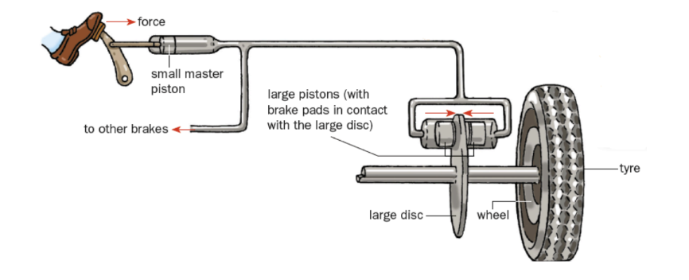

# Pressure

## Definition of Pressure

Pressure is defined as __force acting per unit area.__

$$\rho = \frac{F}{A}$$

where:

- $\rho$ is the pressure (SI unit: pascal , Pa)
- $F$ is the force (SI unit: newton, N), and
- $A$ is the (contact) area (SI unit: square metre, $m^2$)

__Note:__ $1 \pu{Pa} = 1 \pu{N/m^2}$

## Transmission of Pressure in Hydraulic System

Submerge:

- A syringe that has a plunger with a small cross-sectional area,
- A syringe with a plunger with a large cross-sectional area, and
- A rubber tube

into coloured water.

Fill the smaller syringe completely with the coloured water. Squeeze any air bubbles out of the rubber tube. Leave the larger syringe cross-sectional areas unfilled.

Connect each end of rubber tubing to the nozzle of each syringe. Remove the set-up from the coloured water.

To move both plungers at a constant speed, either plunger may be pressed separately.

1. Compared to the force needed to be exerted on the plunger with the larger cross-sectional area, a smaller force needs to be exerted on the plunger with the smaller cross-sectional area
2. When the smaller plunger is moved by a given distance, the larger plunger moves by a shorter distance and vice-versa.

## Pascal's Principle

When pressure is applied to an enclosed incompressible liquid, the pressure is __transmitted equally__ to all other parts of the liquid.

### Hydraulic Press

1. A force $F_X$ is exerted on piston 1. The pressure exerted at point $X$ is $\rho_X = \frac{F_X}{A_X}$
2. This pressure is transmitted equally to every part of the liquid, including to point Y.
3. A force, $F_Y$ is applied onto the base of piston 2
4. Thus,
$$\rho_X = \rho_Y \\\\ \frac{F_X}{A_X} = \frac{F_Y}{A_Y}$$
Equivalently, $\frac{F_X}{F_Y} = \frac{A_X}{A_Y}$$
5. Since $A_X < A_Y$, $F_X < F_Y$
6. Since the liquid is incompressible, the volume displaced at point X is equal to the volume displaced by point Y.
$$V_X = V_Y \\ A_X d_X = A_Y d_Y$$
Equivalently, $\frac{A_X}{A_Y} = \frac{d_Y}{d_X}$
7. Since $A_X < A_Y$, $d_X < d_Y$
8. To summarise, $\frac{F_X}{F_Y} = \frac{A_X}{A_Y} = \frac{d_Y}{d_X}$

__Suggest why a hydraulic press does not work properly if the hydraulic liquid contains gas bubbles__

A gas is compressible. Pressure will not be transmitted equally between the pistons.

## Hydraulic Brake System

Each large piston exerts a force that is equal to the force exerted by the driver multiplied by the ratio of the cross-sectional area of the large piston to the cross-sectional area of the small piston.

$$\frac{F_{small}}{A_{small}} = \frac{F_{large}}{A_{large}}$$

$$F_{large} = F_{small} \times \frac{A_{large}}{A_{small}}$$

## Density

### Definition

__Density__ is defined as mass per unit volume.

$$\rho = \frac{m}{v}$$

When an insoluble solid is placed in a liquid, the soild will:

1. __float__ of its (average) density is __less than__ that of the liquid.
2. __sink__ of its (average) density is __greater than__ that of the liquid.
3. be __suspended__ of its (average) density is __equal to__ that of the liquid.

## Pressure due to a liquid column

### Formula for liquid pressure

Consider a cuboidal liquid column of density $\rho$, base area $A$ and a depth $h$. The atmosphere (of pressure $p_0$) exerts a downward force $F_0$ on the top of the liquid. There is an upward force $F$ acting at the bottom surface of the liquid, which is at pressure $\rho$. The liquid column is in equilibrium and the gravitational field strength is at $g$.

1. $V = Ah$
2. $m = \rho \times V \times g = \rho Ahg$
3. weight, $W = m \times g = \rho Ahg$
4. Since the column is in equilibrium, by Newton's first law,
    - Upward force = sum of downward forces
    - $F = F_0 + W$
    - $pA = p_0 A + \rho A hg$
    - Dividing both sides of the equation by $A$
    - $\frac{pA}{A} = \frac{p_0A}{A} + \frac{\rho A h g}{A}$
    - $p = p_0 + \rho g h$
5. The pressure difference between the top surface and the base of the column is caused by the liquid column. Thus,
6. Pressure due to the liquid column = $p - p_0 = \rho g h$

The pressure due to a liquid column is:

$$p = \rho g h$$

where:
- $p$ is the pressure due to the liquid column (SI unit: pascal, Pa)
- $\rho$ is the density of the liquid (SI unit: kg/m^3)
- $g$ is the gravitational field strength (SI unit: N/kg), and
- $h$ is the __depth__ (__not depth__) of the liquid column (SI unit: metre, m)

### Note

- The pressure due to the liquid column does __not__ depend on the shape, cross-sectional area and the volume of the container.

__Pressure with atmospheric pressure in liquid column__

$$p = p_0 + \rho g h$$

## Barometer

A barometer is an instrument that can measure atmospheric pressure.

A long tube is completely filled with mercury. Then, it is inverted into a trough/reservoir that also contains mercury. Some mercury flows into from the tube into the reservoir, whereas the remaining mercury remains in the tube is supported by atmospheric pressure. 

1. __Atmospheric pressure__, $p_0$, acts on the surface of the mercury in the __trough__.
2. The __vaccuum__ exerts no pressure on the mercury in the tube.
3. The thick glass tube, which is about 1m long, contains mercury.
4. At point X, which is at the __same level__ as the surface of the trough, the __mercury__ exerts a __pressure, $p_X$__ , that __equals atmospheric pressure, $p_0$__ .
5. The __distance__ h of between the mercury levels in the tube and the trough is measured with a metre rule.

### Units of Pressure

- The pascal (Pa) is the SI unit of pressure
- 1 atm = $1.01 \times 10^5 Pa$
- 1m Hg (pronounced "one metre of mercury") is the pressure due to a 1-metre deep column of mercury. The density of mercury is 13 600 kg/m^3.
    * __Note:__ 1m Hg (a unit of pressure) $\ne$ 1m (a unit of length)

## Manometer

A manometer is an instrument used to measure the __difference__ in the pressure of __liquids or gases.__

| $p_{gas} > p_0$            | $p_{gas} < p_0$                                      |
|----------------------------|------------------------------------------------------|
| $p_{gas} = p_0 + \rho g h$ | $p_{gas} + \rho g h = p_0 \\ p_gas = p_0 - \rho g h$ |

