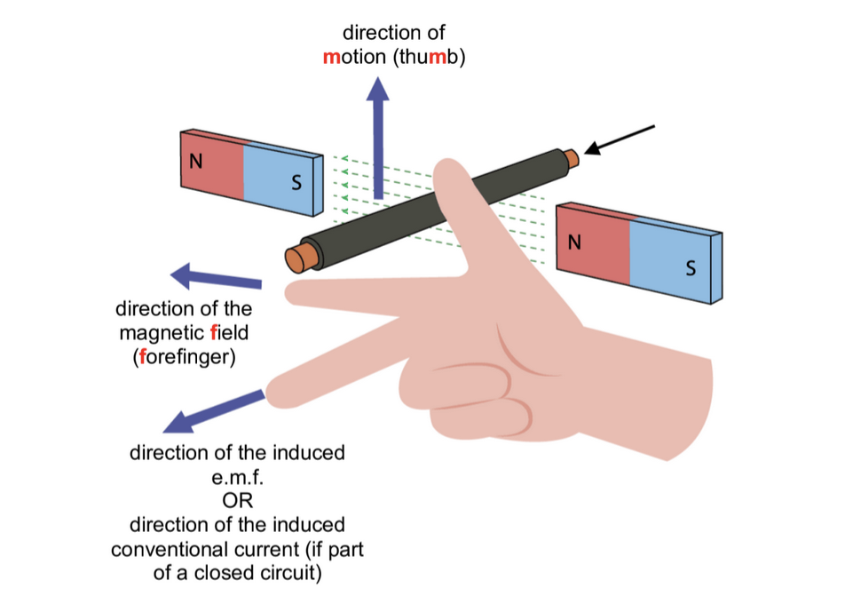
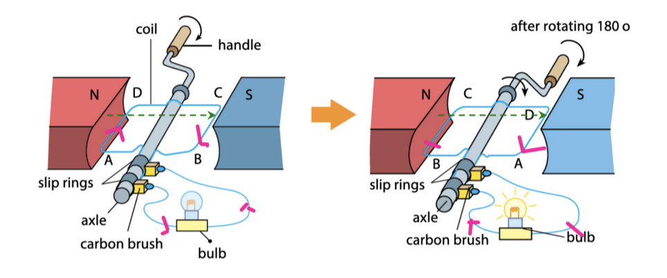
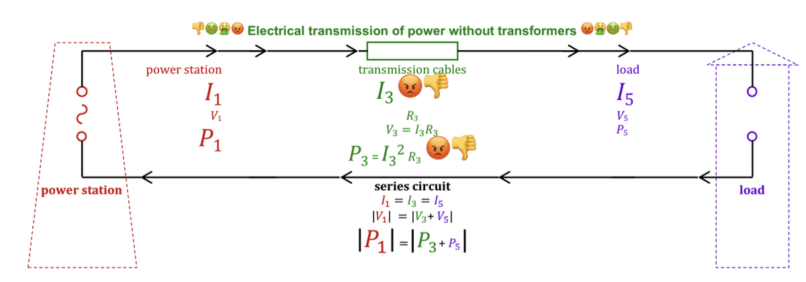
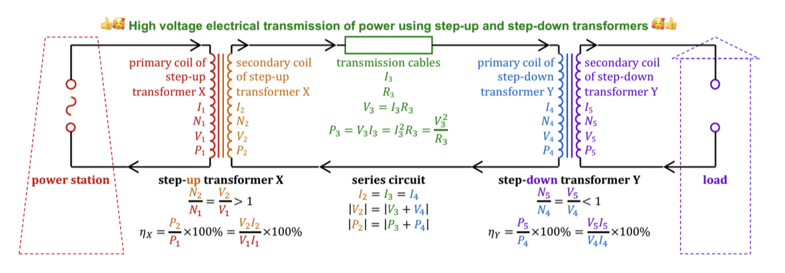

# Electromagnetic Induction

* [Electricity and Magnetism](#electricity-and-magnetism)
    * [Laws of Electromagnetic Induction](#laws-of-electromagnetic-induction)
        * [Faraday's law of electromagnetic induction](#faradays-law-of-electromagnetic-induction)
        * [Lenz's Law](#lenzs-law)
    * [Electromagnetic induction when magnetic field strength changes](#electromagnetic-induction-when-magnetic-field-strength-changes)
    * [Case 1: S moves towards solenoid](#case-1-s-moves-towards-solenoid)
    * [Case 2: N moves toward solenoid](#case-2-n-moves-toward-solenoid)
    * [Case 3: S moves away from solenoid](#case-3-s-moves-away-from-solenoid)
* [Motional e.m.f. induced on a conductor moving through a magnetic field](#motional-emf-induced-on-a-conductor-moving-through-a-magnetic-field)
* [Alternating Current (a.c.) Generator](#alternating-current-ac-generator)
    * [Simple Rotating Coil A.C. Generator](#simple-rotating-coil-ac-generator)
        * [Function of the 2 Slip Rings](#function-of-the-2-slip-rings)
        * [Graph of e.m.f output against time for a simple rotating coil a.c. generator](#graph-of-emf-output-against-time-for-a-simple-rotating-coil-ac-generator)
* [Transformers](#transformers)
    * [Structure of a Transformer](#structure-of-a-transformer)
        * [Function of the laminated soft iron core](#function-of-the-laminated-soft-iron-core)
            * [Lamination](#lamination)
    * [Efficiency of Transformer](#efficiency-of-transformer)

## Electricity and Magnetism

### Laws of Electromagnetic Induction
#### Faraday's law of electromagnetic induction
The magnitude of the electromotive force (e.m.f) induced in a closed circuit is directly proportional to the rate of change of the magnetic flux linkage through the area bounded by the circuit.
- Thus, the magnitude of the electromotive force (e.m.f) induced in a conductor is directly proportional to the rate at which magnetic field lines and the conductor cut each other.
- If the conductor is part of a closed circuit, the induced e.m.f produces an induced current through the conductor.

#### Lenz's Law
The direction of the induced electromotive force (and hence the direction of the induced current in a closed circuit) is such that its magnetic effect opposes the motion or change producing it.
- If the conductor is part of a closed circuit, the induced current produces induced magnetic poles that oppose the cause of the induced emf.

### Electromagnetic induction when magnetic field strength changes
Faraday's experiments demonstrate electromagnetic induction by moving a pole of a magnet moves nearer or further away from a solenoid, such that magnetic field lines cut through the solenoid.

### Case 1: S moves towards solenoid
1. The South pole of the magnet moves towards the solenoid
2. (By Faraday's law of induction,) the changing magnetic flux linkage through the solenoid (or the magnetic field lines cutting the solenoid) induces an e.m.f in the solenoid.
3. Since the circuit is closed, the induced e.m.f produces an induced current.
4. By Lenz's law, the magnet is repelled by the south pole induced on the right of the solenoid produced by the clockwise induced current when viewed from the right (using the right hand grip rule) that flows from B to A.

### Case 2: N moves toward solenoid

1. The __north__ pole of the magnet moves __toward__ the solenoid.
2. (By Faraday's law of electromagnetic), the __changing magnetic flux linkage__ through the solenoid (or the magnetic field lines cutting the solenoid) __induces__ an __e.m.f__ in the solenoid.
3. Since the circuit is __closed__, the induced e.m.f produces an __induced current.__
4. By Lenz's law, the magnet is repelled by the __north pole induced on the right__ of the solenoid produced by the __anticlockwise induced current__ when viewed from the right (using the right-hand grip rule) that flows from A to B

### Case 3: S moves away from solenoid

1. The __south__ pole of the magnet moves __away from__ the solenoid.
2. (By Faraday's law of electromagnetic induction,) the __changing magnetic flux linkage__ through the solenoid __induces__ an __e.m.f.__ in the solenoid.
3. Since the circuit is __closed,__ the induced e.m.f. produces an __induced current.__
4. By Lenz's law, the magnet is attracted by the __north pole induced on the right of the solenoid__ produced by the __anticlockwise induced current__ when viewed from the right (using the right-hand grip rule) that flows from A to B.

## Motional e.m.f. induced on a conductor moving through a magnetic field 

When a conductor moves perpendicular through a magnetic field, an e.m.f. is induced on the conductor.

__Fleming's right hand rule__ (for generators) shows the direction of the __induced e.m.f.__

If the conductor is part of a __closed__ circuit, the induced e.m.f. produces an __induced current__ through the conductor.

## Alternating Current (a.c.) Generator

As work is done to turn an a.c. generator, energy is transferred electrically by the alternating current to the connected electrical load, e.g.
- Simple rotating coil a.c. generator
- Simple rotating magnet a.c. generator

### Simple Rotating Coil A.C. Generator

1. The coil is rotated by turning the handle
2. As the coil rotates between the two magnets, the __magnetic flux linkage__ through the coil changes at a non-constant rate. (The coil __cuts the magnetic field lines__ at a non-uniform rate)
3. By Faraday's law of electromagnetic induction, an __e.m.f__ is __induced__ in the rotating coil. Fleming's right hand rule tells us the direction of the induced e.m.f. in sides AD and BC.
4. In the __closed__ circuit, the __induced alternating current__ flows through the coil, the 2 slip rings, the carbon brushes and the bulb.

#### Function of the 2 Slip Rings

The 2 slip rings maintain __continuous electrical contact__ between the rotating __coil__ and the __external circuit__ via the __carbon brushes__, so that the __induced current flows__ through the closed circuit.

#### Graph of e.m.f output against time for a simple rotating coil a.c. generator

- The direction of the __induced current__ through the coil __reverses every half turn__ (alternating current)

The __maximum__ induced e.m.f of an a.c generator can be __increased__ by increasing the rate at which the coil cuts the magnetic field lines, e.g. by

1. increasing the __number of turns__ of the coil
2. increasing the __magnetic field strength__ (e.g. stronger magnets)
3. increasing the __speed of rotation__ of the coil.
4. winding the coil on a __soft iron core__ (to strengthen the magnetic field through the coil)

The __maximum induced current__ can be __increased__ by increasing the induced e.m.f or by __decreasing the resistance__ of the coil.

- __Doubling__ the __number of turns__ of the coil (without changing its frequency of rotation and the magnetic field strength) __doubles the maximum__ induced e.m.f
- __Doubling__ the __frequency of rotation__ (i.e. halving the period) of the coil (without changing its number of turns and the magnetic field strength)
    * __doubles the maximum induced e.m.f__ and 
    * __doubles the frequency__ (i.e. halves the period) of the induced e.m.f.

## Transformers

A transformer is a device that can change a large alternating voltage (with a small current) to a small alternating voltage (at large current) and vice versa.
- A transformer does __not__ work on direct current (d.c.)

### Structure of a Transformer

1. The __alternating input voltage $V_P$__ produces an __alternating current $I_P$__ through the primary coil.
2. Current $I_P$ produces an __alternating magnetic field__ (which alternately increases and decreases in strength).
3. The __laminated soft iron core directs__ the alternating __magnetic field__ produced by the primary coil __toward__ the __secondary coil.__
4. By Faraday's law of electromagnetic induction, the __changing magnetic flux linkage__ through the secondary coil __induces__ an __alternating output voltage $V_S$__ in the secondary coil.
5. Since the secondary coil is part of a __closed__ circuit, the alternating output voltage $V_S$ produces an __alternating current $I_S$__ through the secondary coil and the load.

#### Function of the laminated soft iron core

- The __core directs__ the alternating __magnetic field__ produced by the primary coil __toward__ the __secondary coil__.
- __Iron__, a __soft magnetic material__, is chosen because it __magnetises and demagnetises quickly__ in the presence of the alternating magnetic field produced by the primary coil.

##### Lamination

- However, the changing magnetic field produced by the primary coil also induces __eddy currents __that flow in little loops through the core.
- Some __energy__ is __wasted__ is being transferred to the __internal__ (thermal) __store__ of the core.
- A __laminated__ soft iron core is made up of thin sheets of soft iron electrically insulated from each other (e.g. by coats of lacquer) reduces the path lengths of these eddy currents, and this __reduces__ this unwanted __wasted energy__.
- The transformer allows the alternating input voltage, $V_P$, and the alternating output voltage $V_S$ to differ, by having a __different number of turns__ in the __primary and secondary coils__.

$$\frac{V_S}{V_P} = \frac{N_S}{N_P}$$

### Efficiency of Transformer

$$\eta = \frac{P_S}{P_P} \times 100% = \frac{V_SI_S}{V_PI_P} \times 100%$$

| Ideal Transformer                                     | Non-ideal Transformer    |
|-------------------------------------------------------|--------------------------|
| efficiency $\eta = 100%$                              | efficiency $\eta < 100%$ |
| $\frac{V_SI_S}{V_PI_P} = 1$                           |                          |
| $\frac{I_P}{I_S} = \frac{V_S}{V_P} = \frac{N_S}{N_P}$ |                          |

For a __non-ideal__ transformer, energy is wasted due to:
1. Energy being transferred to the internal stores of the coils when current flows through them, since the __coils__ have some __resistance__.
2. Energy being transferred to the internal store of the core when __eddy current__ flows through the core, since the __core__ has some resistance
3. __leakage__ of __magnetic field__ lines between the primary and secondary coils.
4. __hysteresis loss__ caused by the __flipping of the magnetic domains__ in the core due to the alternating magnetic field produced by the primary coil. Energy is transferred to the internal store of the core.

### High Voltage Electrical Transmission of Power

1. Since the length $L_3$ is large, the resistance of the power cables, $R_3 = \frac{\rho_3L_3}{A_3}$ is significant.
2. Increasing the cross-sectional area $A_3$ of the transmission cables is impractical as thick cables are very expensive, heavy and difficult to suspend
3. To reduce the power $P_3 = I_3^2R_3$ wasted (transferred electrically to the internal stores of the transmission cables), the current $I_3$ through the transmission cables should be minimised.

__High voltage__ electrical transmission of power reduces current $I_3$ through the transmission cables, and thus reduces the power $P_3 = I_3^2R_3$ wasted (transferred electrically to the thermal stores of the transmission cables)
1. Near the power station, transformer X steps up the voltage from $V_1$ to $V_2 > V_1$
2. Since the output power of the secondary coil of transformer X is $P_2 = V_2I_2$, a small current:
    - $I_2 = \frac{P_2}{V_2}$
    - flows through the secondary coil of transformer X
3. Since the secondary coil of transformer X, the transmission cables and the primary coil of transformer Y are connected in series, the same __small current__ flows through the transmission cables and the primary coil of transformer Y
$$I_{transmission} = I_2 = I_3 = I_4 = \frac{P_2}{V_2}$$
4. The power wasted (transferred electrically to the internal stores of the transmission cables)
$$P_3 = I_3^2R_3 = \left(\frac{P_2}{V_2}\right)^2R_3$$
is minimised.

5. By the conservation of energy, the more power $P_4 = P_2 - P_3$ is transferred to the primary coil of transformer Y.
6. In the series circuit, the voltage across the primary coil of transformer Y is $V_4 = V_2 - V_3$
7. Before consumption, transformer Y steps down the voltage from $V_4$ to $V_5 < V_4$
8. A.C generators are used in the production of power to be transferred electrically. If __D.C__ generators are used, voltages __cannot__ be __stepped up__ or __down__ by transformers.

