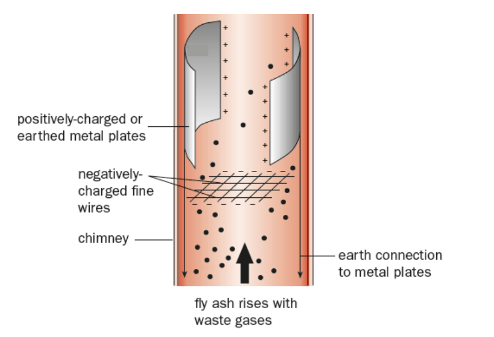
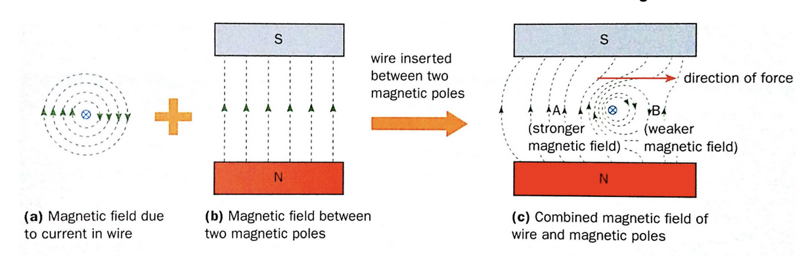
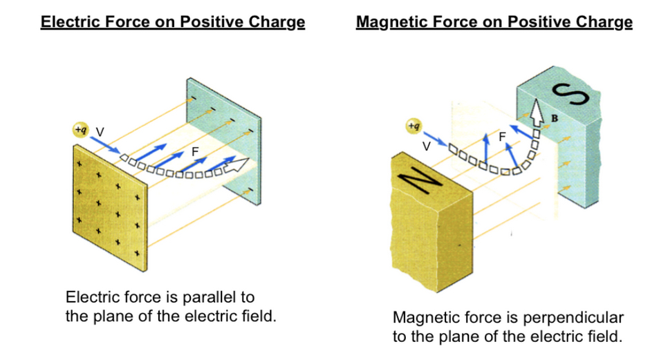
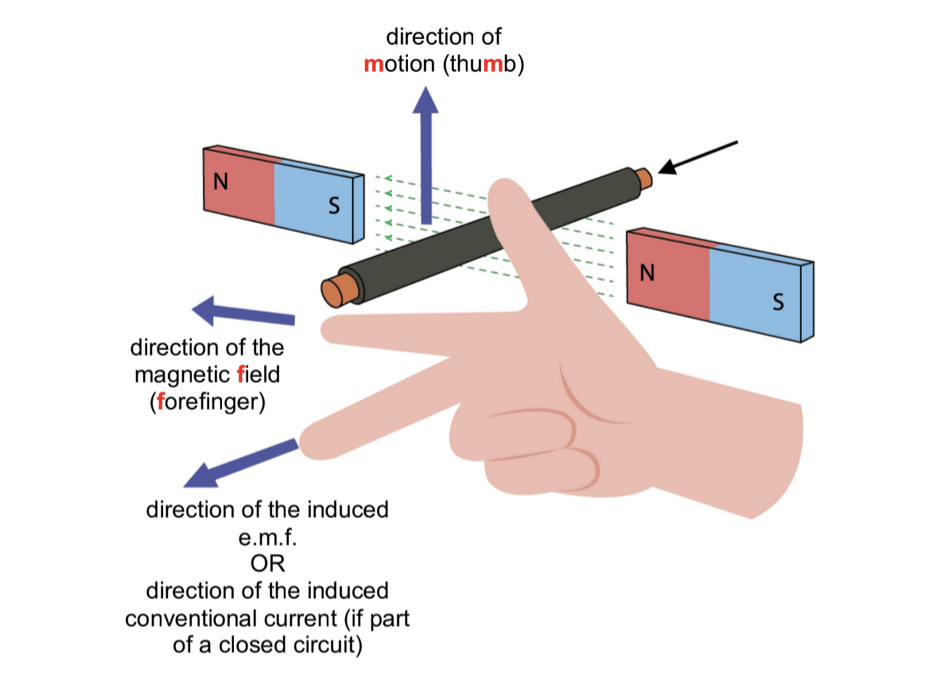
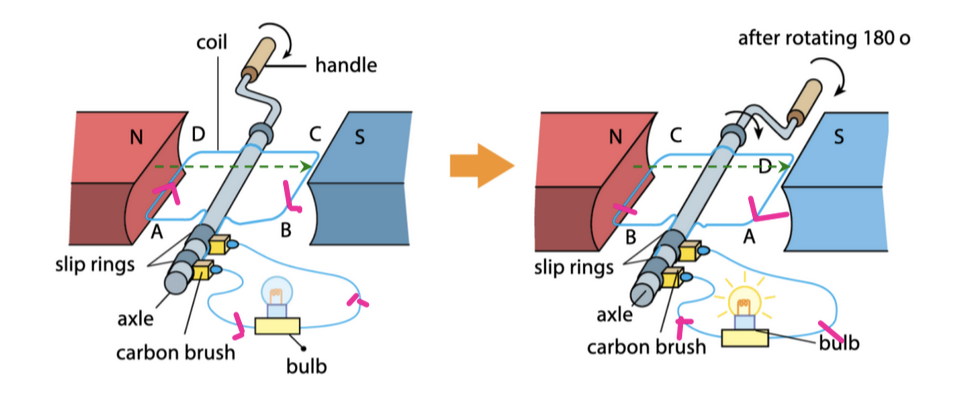
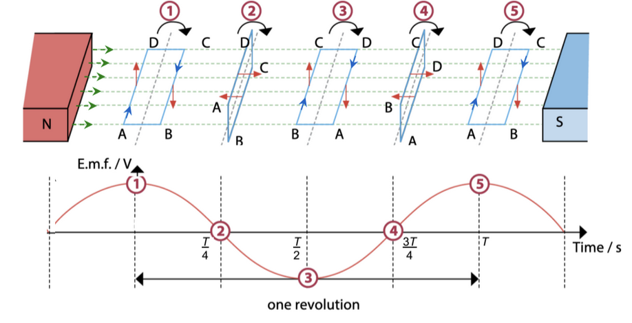
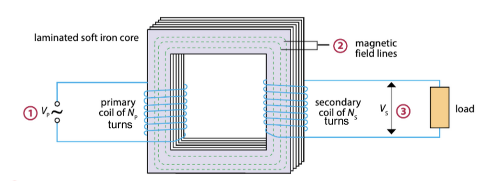
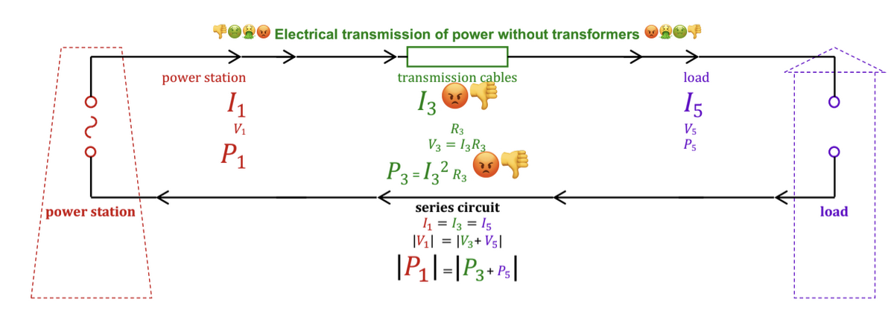
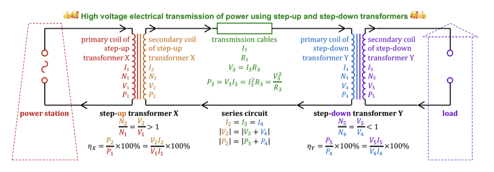

# Pressure

## Definition of Pressure

Pressure is defined as __force acting per unit area.__

$$\rho = \frac{F}{A}$$

where:

- $\rho$ is the pressure (SI unit: pascal , Pa)
- $F$ is the force (SI unit: newton, N), and
- $A$ is the (contact) area (SI unit: square metre, $m^2$)

__Note:__ $1 \space \pu{Pa} = 1 \space \pu{N/m^2}$

## Transmission of Pressure in Hydraulic System

Submerge:

- A syringe that has a plunger with a small cross-sectional area,
- A syringe with a plunger with a large cross-sectional area, and
- A rubber tube

into coloured water.

Fill the smaller syringe completely with the coloured water. Squeeze any air bubbles out of the rubber tube. Leave the larger syringe cross-sectional areas unfilled.

Connect each end of rubber tubing to the nozzle of each syringe. Remove the set-up from the coloured water.

To move both plungers at a constant speed, either plunger may be pressed separately.

1. Compared to the force needed to be exerted on the plunger with the larger cross-sectional area, a smaller force needs to be exerted on the plunger with the smaller cross-sectional area
2. When the smaller plunger is moved by a given distance, the larger plunger moves by a shorter distance and vice-versa.

## Pascal's Principle

When pressure is applied to an enclosed incompressible liquid, the pressure is __transmitted equally__ to all other parts of the liquid.

### Hydraulic Press

1. A force $F_X$ is exerted on piston 1. The pressure exerted at point $X$ is $\rho_X = \frac{F_X}{A_X}$
2. This pressure is transmitted equally to every part of the liquid, including to point Y.
3. A force, $F_Y$ is applied onto the base of piston 2
4. Thus,
$$\rho_X = \rho_Y \\\\ \frac{F_X}{A_X} = \frac{F_Y}{A_Y}$$
Equivalently, $\frac{F_X}{F_Y} = \frac{A_X}{A_Y}$$
5. Since $A_X < A_Y$, $F_X < F_Y$
6. Since the liquid is incompressible, the volume displaced at point X is equal to the volume displaced by point Y.
$$V_X = V_Y \\ A_X d_X = A_Y d_Y$$
Equivalently, $\frac{A_X}{A_Y} = \frac{d_Y}{d_X}$
7. Since $A_X < A_Y$, $d_X < d_Y$
8. To summarise, $\frac{F_X}{F_Y} = \frac{A_X}{A_Y} = \frac{d_Y}{d_X}$

__Suggest why a hydraulic press does not work properly if the hydraulic liquid contains gas bubbles__

A gas is compressible. Pressure will not be transmitted equally between the pistons.

## Hydraulic Brake System

Each large piston exerts a force that is equal to the force exerted by the driver multiplied by the ratio of the cross-sectional area of the large piston to the cross-sectional area of the small piston.

$$\frac{F_{small}}{A_{small}} = \frac{F_{large}}{A_{large}}$$

$$F_{large} = F_{small} \times \frac{A_{large}}{A_{small}}$$

## Density

### Definition

__Density__ is defined as mass per unit volume.

$$\rho = \frac{m}{v}$$

When an insoluble solid is placed in a liquid, the soild will:

1. __float__ of its (average) density is __less than__ that of the liquid.
2. __sink__ of its (average) density is __greater than__ that of the liquid.
3. be __suspended__ of its (average) density is __equal to__ that of the liquid.

## Pressure due to a liquid column

### Formula for liquid pressure

Consider a cuboidal liquid column of density $\rho$, base area $A$ and a depth $h$. The atmosphere (of pressure $p_0$) exerts a downward force $F_0$ on the top of the liquid. There is an upward force $F$ acting at the bottom surface of the liquid, which is at pressure $\rho$. The liquid column is in equilibrium and the gravitational field strength is at $g$.

1. $V = Ah$
2. $m = \rho \times V \times g = \rho Ahg$
3. weight, $W = m \times g = \rho Ahg$
4. Since the column is in equilibrium, by Newton's first law,
    - Upward force = sum of downward forces
    - $F = F_0 + W$
    - $pA = p_0 A + \rho A hg$
    - Dividing both sides of the equation by $A$
    - $\frac{pA}{A} = \frac{p_0A}{A} + \frac{\rho A h g}{A}$
    - $p = p_0 + \rho g h$
5. The pressure difference between the top surface and the base of the column is caused by the liquid column. Thus,
6. Pressure due to the liquid column = $p - p_0 = \rho g h$

The pressure due to a liquid column is:

$$p = \rho g h$$

where:
- $p$ is the pressure due to the liquid column (SI unit: pascal, Pa)
- $\rho$ is the density of the liquid (SI unit: kg/m^3)
- $g$ is the gravitational field strength (SI unit: N/kg), and
- $h$ is the __depth__ (__not depth__) of the liquid column (SI unit: metre, m)

### Note

- The pressure due to the liquid column does __not__ depend on the shape, cross-sectional area and the volume of the container.

__Pressure with atmospheric pressure in liquid column__

$$p = p_0 + \rho g h$$

## Barometer

A barometer is an instrument that can measure atmospheric pressure.

A long tube is completely filled with mercury. Then, it is inverted into a trough/reservoir that also contains mercury. Some mercury flows into from the tube into the reservoir, whereas the remaining mercury remains in the tube is supported by atmospheric pressure. 

1. __Atmospheric pressure__, $p_0$, acts on the surface of the mercury in the __trough__.
2. The __vaccuum__ exerts no pressure on the mercury in the tube.
3. The thick glass tube, which is about 1m long, contains mercury.
4. At point X, which is at the __same level__ as the surface of the trough, the __mercury__ exerts a __pressure, $p_X$__ , that __equals atmospheric pressure, $p_0$__ .
5. The __distance__ h of between the mercury levels in the tube and the trough is measured with a metre rule.

### Units of Pressure

- The pascal (Pa) is the SI unit of pressure
- 1 atm = $1.01 \times 10^5 Pa$
- 1m Hg (pronounced "one metre of mercury") is the pressure due to a 1-metre deep column of mercury. The density of mercury is 13 600 kg/m^3.
    * __Note:__ 1m Hg (a unit of pressure) $\ne$ 1m (a unit of length)

## Manometer

A manometer is an instrument used to measure the __difference__ in the pressure of __liquids or gases.__

| $p_{gas} > p_0$            | $p_{gas} < p_0$                                      |
|----------------------------|------------------------------------------------------|
| $p_{gas} = p_0 + \rho g h$ | $p_{gas} + \rho g h = p_0 \\ p_gas = p_0 - \rho g h$ |

# Light

## Reflection

### Laws of Reflection

1. The first law of reflection states that the __incident ray,__ __reflected ray__, and the __normal__ at the point of incidence all lie in the __same plane__.
2. The second law of reflection states that the __angle of incidence, $i$__ is __equal__ to the __angle of reflection, $r$__.

### Characteristics of an Image Formed by a Plane Mirror

1. It is __laterally inverted.__
2. It is the __same shape__ and __same size__ as the object
3. It is __upright__
4. It is __virtual__
    - A virtual image __cannot be formed on a screen__
    - (Real) light rays do not meet at the image position.
5. Its __image distance__ from the mirror is the __same__ as the __object distance__ from the mirror.

### Types of Reflection

- For __both__ regular and irregular surfaces, the laws of reflection apply to each ray.

#### Regular Reflection

- On __smooth surfaces__, reflection is __regular__.
- Parallel incident rays have the same angles of incidence and refraction.
- The __reflected rays__ travel in the same direction.

#### Irregular (Diffuse) Reflection

- On __rough / irregular surfaces, __reflection is __diffused__. (Sometimes, the roughness may not be detectable by the naked eye.)
- The normal at different points of the surface are not parallel to one another.
- Thus, even if the incident rays are parallel, they have different angles of incidence and reflection. The __reflected rays__ travel in __different directions__.
- The overall diffused image is made up of many image points at different locations.

## Refraction

- __Refraction__ is the __bending__ of light as it travels from one optical medium to another with a __different refractive index__.
- Refraction is caused by a __change in the speed of light__ as light travels from one medium to another medium.
- __Normal__ is an imaginary straight line that is perpendicular to the surface of the medium.
- __Angle of incidence ($i$)__ is the __angle __between the __incident ray__ and the __normal__
- __Angle of refraction ($r$)__ is the __angle__ between the __refracted ray__ and the __normal__
- The __incident ray__, the __refracted ray__, and the __normal at the point of incidence__ all lies in the __same plane__.

# Static Electricity

## Electric Charge

- Types of charges:
    - Neutrons
    - Protons
    - Electrons
 
- If electrons are removed , the atom becomes positively charged .
- If electrons are added , the atom becomes negatively charged .
- If the number of negative and positive charges are equal , the object is electrically neutral
- An atom that is charged is called an ion

- The law of conservation of charge is one of the fundamental laws of Physics
    - The net charge of a closed system remains unchanged.
    - The net charge of a system is the algebraic sum of the charges while taking into consideration the positive and negative signs of the charges.

## Interaction Between Charges

- Like charges repel
- Unlike charges attract

## Measuring Electric Charges

- The SI unit of electric charge is the coulomb ( C ).
- The amount of charge carried by an electron is $1.6 \times 10^{-19} C$

## Electrical Insulators and Conductors

- Objects around us can be classified into two broad categories:
1. electrical insulators
2. electrical conductors

|                                | electrical insulators                                        | electrical conductors                                |
|--------------------------------|--------------------------------------------------------------|------------------------------------------------------|
| motion of charged particles    | charged particles (electrons) are not free to move about | charged particles (electrons) are free to move about |
| ability to conduct electricity | low                                                          | high                                                 |
| method of charging             | by friction (e.g. rubbing)                                   | by induction                                         |
| examples                       | glass, perspex, silk wool                                    | copper, steel, fluids with mobile charged particles  |

## Electrostatic by Friction

- Some materials like silk and glass, gain static charges when they are rubbed together

### Example:

- When the glass rod and silk cloth are rubbed together, electrons move from the glass rod to the silk cloth.
- The glass rod loses electrons and becomes positively charged.
- The silk cloth gains electrons and becomes negatively charged.
- The electrons transferred are not able to move freely in the silk cloth.
- They remain at the surface where the silk cloth was rubbed.
- Materials in which the electrons do not move freely are called insulators.
- Insulators are charged by friction (e.g. rubbing)
- Different materials have different affinities to electrons. Some attract electrons weakly, while others attract electrons strongly.

## Electrostatic Charging by Induction

- Conductors cannot be charged by friction because mobile electrons can be easily transferred to and away from conductors.
- Metallic conductors can be charged by induction in which a conductor is charged without contact with the charging body.

### Method 1: Charging two metal

1. Two metal spheres (conductors) on insulating stands are placed side by side.
- They are touching each other.

2. A negatively-charged rod is brought near, but not touching, sphere A. Like charges repel.
- Electrons in both spheres A and B are repelled to the far end of sphere B.
- sphere A has excess positive charges,
- while sphere B has excess negative charges.

3. While holding the negatively charged rod in place (near sphere A), move sphere B away from sphere A.

4. The charged rod is removed.
- Sphere A is now positively charged and sphere B negatively charged.
- Spheres A and B have an equal number of opposite charges.
- Both spheres have been charged by induction.

5. When the charged rod is removed _before_ the two spheres are moved apart,
- The electrons will be redistributed in sphere A and B and both will become neutral again.

### Method 2: Charging a single conductor by induction

1. A positively charged rod is brought near, but not touching, a metal conductor on insulating stand.
- The electrons in the conductor are drawn (attracted) towards the end near the positively-charged rod.

2. Without removing the positively-charged rod, the positively charged end of the conductor is earthed by touching it with a person's hand.
- Free electrons move from earth to the conductor through the person.
- This neutralises the positive charges on the end of the conductor.

> :bulb: Earthing is a process which a conducting path is connected from a conductor to earth. This allows electrons to either flow into or out of the conductor.
> Earth refers to a large body of charge that remains electrically neutral regardless of the amount of charge that is added or removed from it.

5. When the charged rod is removed before the earthing process is stopped,
- The excess electrons in the conductor will flow to the earth and discharging occurs. The conductor will then become electrically neutral.

## Neutralising/Discharging a Charged Insulator

- A charged object is neutralised by discharging the excess charges on it.

### Discharging through heating

- The heat from the flame ionises the surrounding air particles.
- For a positively-charged glass rod, the ions neutralise the excess charges on the glass rod.

### Discharging due to humid conditions

- Water molecules in air are electrical conductors
- For a negatively charged insulator, excess charges are transferred to the water molecule.

## Neutralising / Discharging a Charged Conductor

- A charged conductor can be discharged through earthing
- When we earth a charged conductor, we provide a path (usually lower resistance and connected to the earth) for
    - excess electrons to flow away from the charged conductor, or
    - electrons to flow to the charged conductor if it has excess positive charges

# Hazards and Applications of Electrostatics

## Hazards of Electrostatics

1. __Lightning__
- The clouds are __charged by friction__ between water molecules in the clouds and air molecules in the atmosphere.
- __Negative charges__ accumulate at the __bottom__ of the clouds.
- These __repel__ the __electrons__ near the surface of the earth, causing the __surface__ of the Earth to be __positively charged__.
- When the accumulation of charges is large, the __air particles__ are __ionised__.
- The __ionised air particles__ provide a __conducting path__ for the electrons in the clouds to reach the Earth.
- When the __electrons travel down__ the conducting path to the Earth, __lightning__ forms.

2. __Electrostatic discharge__
- Excessive charges may build up on objects due to __friction__
- Electronic equipment, such as computer boards and hard drives, can be easily damaged by electrostatic discharge.
- Such equipment is usually packed in __antistatic packaging__.

3. __Electrostatic discharge of vehicles__
- Electric charges can accumulate on trucks due to __friction__ between
    - the road and the rotating tyres of the truck
    - the moving air molecules and the body of the truck
- When a __sudden discharge__ occurs, this may cause __sparks__ and __ignite__ any flammable items that the truck might be carrying.
- Gas tankers are equipped with a __metal chain__ at the rear end hanging/touching near to the __ground__ to provide an __earthing path__ for excess charges.
- During refueling, the gas tankers are also connected to an earth source to prevent static charges from accumulating on the body of the gas or fuel tanker.

# Applications of Electrostatics

## Photocopiers

- Photocopiers make use of static electricity to produce copies of documents.

1. The metal drum inside the photocopier is coated with __selenium__.
- Selenium is a __photoconductor__ (light-sensitive semiconductor). It only conducts electricity in the presence of light. When no light shines on the selenium, it is a good insulator.
- The selenium coating on the drum is initially in the dark. Behaving as an insulator, it can be electrically charged. When the selenium is illuminated, it becomes conducting wherever light falls on it.
- The drum's surface is charged __positively__ by a charged wire.

2. The original image to be photocopied is placed on a sheet of clear glass above the drum.
- An intense light beam is shone onto the image.
- The __darker__ areas of the image reflect less light and therefore, the corresponding regions on the drum remain __positively__ charged.
- The regions on the drum corresponding to the __lighter__ areas conductive. Electrons from the surroundings, which are attracted to these regions, discharge them.

3. The drum continues turning, and the positively-charged image on the drum attracts the __negatively-charged__ toner powder.

4. A __positively-charged__ sheet of paper is passed over the drum's surface.
- The paper attracts the __negatively-charged__ toner and the image is formed on the paper.
- The paper is heated and pressed to fuse the toner powder to the paper permanently.

## Electrostatic Precipitator

- The electrostatic precipitator is used to remove fly ash from the exhaust of a chimney.

### Removing fly ash from the exhaust gas

The fly ash (smoke and dust particles) is passed through a negatively charged wire grid making the particles to become negatively charged. The negatively charged particles are passed through positively charged or earthed plates which attract the negatively charged particles. Hence, air emitted into the atmosphere is cleaner. The fly ash are collected and used in making cement.

## Spray Painting

- The electrostatic spray painter is used to provide an even coat on the part to be painted.

### Even Coating

As the paint leaves the nozzle, the droplets are charged by friction. These made all the paint droplets to have the same charge and repel each other. Hence, they spread out evenly. Less paint is needed because the charged droplets are all attracted to the object (neutral or positively charged).

# Electromagnetism

## Magnetic Effect of a Current

### Properties of the Magnetic Field of a Current-carrying Conductor

- A current-carrying conductor produces a __magnetic field__ around it.

### Methods to Determine the Magnetic Field Around The Wire

1. Grip the wire with your right hand such that your thumb points in the direction of current flow.
2. The direction in which your fingers curl indicates whether the magnetic field is clockwise or anticlockwise.

#### Symbols

- __Dot__ at the middle shows wire carrying current __out__ of the wire
- __Cross__ at the middle shows wire carrying current __into__ of the wire

#### Properties

- Magnetic fields of a long, straight current-carrying conductor are represented by __concentric circles__ which are centered at the conductor itself.
- The __closer__ the field lines, the __greater__, the magnetic field strength (or the __stronger the magnetic field__)

### Factors affecting Magnetic Field Strength of a Solenoid

- A solenoid is a coil of insulated wire coiled into a cylinder shape.
- The magnetic field of a solenoid resembles that of a bar magnet.
- The __Right-hand Grip Rule__ can be applied to the solenoid to determine the direction of the magnetic field inside the solenoid.
    * Curl your __fingers__ around in the direction of the __current__ flow.
    * Your __thumb__ will point to the __North__ pole.

#### Factors that affect the strength of an electromagnet.

The magnetic field strength of a solenoid can be increased by:
1. Increase the magnitude of the __current__
2. Increase the __number of turns on the solenoid__, or
3. Placing a soft iron core within the solenoid to concentrate the magnetic field lines.

Note: The magnetic field strength __inside__ the solenoid is stronger than the magnetic field strength outside the solenoid.

## Force on a Current-carrying Conductor (Lorentz Force)

| Cases                                    | Observations                                                                                         |
|------------------------------------------|---------------------------------------------------------------------------------------------------------------|
| Spacing Between Magnets (Field Strength) | The wire gets a larger force when the spacing decreases (magnetic field gets stronger)               |
| Reversing Current Flow Direction         | The wire gets a force in the opposite direction when direction of the current is reversed.        |
| Reversing Magnetic Field Direction       | The wire gets a force in the opposite direction when direction of the magnetic field is reversed. |

### Conclusion

The __magnetic force__ produced on the current-carrying wire:
1. __Increases__ when the __magnetic field__ gets __stronger__
2. __Reverses__ in direction when the direction of the __electric current__ is __reversed,__ and
3. __Reverses__ in direction when the direction of the __magnetic field__ is __reversed__

- The diagram shows how the magnetic fields, produced by a current-carrying wire and a pair of magnets, interact with each other.
- There is a stronger magnetic field on the one side of the wire at A. All the magnetic field lines at A act in the same direction.
- There is a weaker magnetic field on one side of the wire at B. The magnetic field lines of the current carrying conductor act in the opposite direction of that of the magnet.
- The __interaction__ between the __current flowing in the conductor__ and the __external magnetic field__ produced a __force acting on the conductor.__
- The direction of the force acting on the conductor can be determined by Fleming's left hand rule.

### Fleming's Left Hand Rule

- Fleming's left-hand rule is used to find the direction of force when the direction of magnetic field and conventional current are known.
- The first three fingers are positioned at __right angles__ to each other.

1. Thumb: __Force__ on conductor
2. First finger: __Field__ (magnetic field)
3. Second finger: <ins>Conventional</ins> __Current__

### Force on a Moving Charge in a Magnetic Field

- Fleming's left-hand rule can be applied to all __moving charges.__
- __NOTE:__ For a beam of __charged particles__ (e.g electrons or protons), we need to follow the direction of the __conventional current__, which is __opposite in direction to the motion of negative charges.__

- While an electric force is always exerted on a charge within an electric field, a magnetic force is only exerted on a charge within a magnetic field if it is __moving.__
- For a __stationary__ charge within a magnetic field experiences __zero magnetic force.__
- For a __moving charge__, the direction of the force acting on the charge is perpendicular to the direction of travel.
- The __moving particle__ is deflected in a __circular path__ towards the centre of the circle.

## The DC Motor

- A DC motor converts __electrical energy__ into __mechanical energy__.
- A DC motor consists of the following components.
    * __Rectangular coil__ connected in series to a battery and rheostat.
    * __Permanent magnets__
    * __Split-ring commutator__
        + The ends of the coil are __fixed__ to the split-ring commutator 
    * __Two carbon brushes__
        + The carbon brushes rub against the commutator and keep the coil connected to the battery.

When the switch is closed, current will flow through the (rectangular) __conducting coil.__

The sides of the coil lie in between two __permanent magnets__.

Forces are produced on the current-carrying wires of the coil as the magnetic fields interact, which cause the coil to rotate about its axle 

The ends of the rotating coil are connected to two halves of a copper ring known as the __split ring commutator__ and they __rotate together with the coil.__

Electric current is passed from the circuit to the two halves of the copper ring via two separate __carbon brushes__.

The rheostat is used to control the __amount of current in the coil__, which affects the __strength of magnetic forces__ produced on the sides of the coil, the amount of the moment of these forces about PQ and hence the __rotational speed__ of the coil.

### How it Functions

- When an electric current flows through the coil ABCD, a __backward force is produced on side AB and an upward force on side CD__ (using Fleming's left-hand rule).
    * This causes the coil to __rotate anticlockwise__ about axis PQ.
- But when the rotating coil reaches __vertical position__, the split ring commutator (X and Y) __loses contact with the carbon brushes__, causing the current to be __cut off__ and the forces to __disappear.__
- However, the __inertia__ of the rotating coil keeps it rotating and the commutator to make contact with the brushes again but in the reverse manner.
- This __reverses the current direction in the coil__, and consequently side __AB now gets an upward force__ while __CD gets a downward force.__
- This allows the coil to continue rotating in the same anticlockwise direction.

### Total Moment

- The __total moment of the magnetic forces__ and the __rotational speed__ can be __increased by__:
    * __Increasing__ the magnitude of the __current__ in the coil.
    * Increasing the __number of turns __on the coil.
    * Inserting a __soft iron core__ into the coil.
    * Using a __stronger__ magnet.

# Electromagnetic Induction

* [Electricity and Magnetism](#electricity-and-magnetism)
    * [Laws of Electromagnetic Induction](#laws-of-electromagnetic-induction)
        * [Faraday's law of electromagnetic induction](#faradays-law-of-electromagnetic-induction)
        * [Lenz's Law](#lenzs-law)
    * [Electromagnetic induction when magnetic field strength changes](#electromagnetic-induction-when-magnetic-field-strength-changes)
    * [Case 1: S moves towards solenoid](#case-1-s-moves-towards-solenoid)
    * [Case 2: N moves toward solenoid](#case-2-n-moves-toward-solenoid)
    * [Case 3: S moves away from solenoid](#case-3-s-moves-away-from-solenoid)
* [Motional e.m.f. induced on a conductor moving through a magnetic field](#motional-emf-induced-on-a-conductor-moving-through-a-magnetic-field)
* [Alternating Current (a.c.) Generator](#alternating-current-ac-generator)
    * [Simple Rotating Coil A.C. Generator](#simple-rotating-coil-ac-generator)
        * [Function of the 2 Slip Rings](#function-of-the-2-slip-rings)
        * [Graph of e.m.f output against time for a simple rotating coil a.c. generator](#graph-of-emf-output-against-time-for-a-simple-rotating-coil-ac-generator)
* [Transformers](#transformers)
    * [Structure of a Transformer](#structure-of-a-transformer)
        * [Function of the laminated soft iron core](#function-of-the-laminated-soft-iron-core)
            * [Lamination](#lamination)
    * [Efficiency of Transformer](#efficiency-of-transformer)

## Electricity and Magnetism

### Laws of Electromagnetic Induction
#### Faraday's law of electromagnetic induction
The magnitude of the electromotive force (e.m.f) induced in a closed circuit is directly proportional to the rate of change of the magnetic flux linkage through the area bounded by the circuit.
- Thus, the magnitude of the electromotive force (e.m.f) induced in a conductor is directly proportional to the rate at which magnetic field lines and the conductor cut each other.
- If the conductor is part of a closed circuit, the induced e.m.f produces an induced current through the conductor.

#### Lenz's Law
The direction of the induced electromotive force (and hence the direction of the induced current in a closed circuit) is such that its magnetic effect opposes the motion or change producing it.
- If the conductor is part of a closed circuit, the induced current produces induced magnetic poles that oppose the cause of the induced emf.

### Electromagnetic induction when magnetic field strength changes
Faraday's experiments demonstrate electromagnetic induction by moving a pole of a magnet moves nearer or further away from a solenoid, such that magnetic field lines cut through the solenoid.

### Case 1: S moves towards solenoid
1. The South pole of the magnet moves towards the solenoid
2. (By Faraday's law of induction,) the changing magnetic flux linkage through the solenoid (or the magnetic field lines cutting the solenoid) induces an e.m.f in the solenoid.
3. Since the circuit is closed, the induced e.m.f produces an induced current.
4. By Lenz's law, the magnet is repelled by the south pole induced on the right of the solenoid produced by the clockwise induced current when viewed from the right (using the right hand grip rule) that flows from B to A.

### Case 2: N moves toward solenoid

1. The __north__ pole of the magnet moves __toward__ the solenoid.
2. (By Faraday's law of electromagnetic), the __changing magnetic flux linkage__ through the solenoid (or the magnetic field lines cutting the solenoid) __induces__ an __e.m.f__ in the solenoid.
3. Since the circuit is __closed__, the induced e.m.f produces an __induced current.__
4. By Lenz's law, the magnet is repelled by the __north pole induced on the right__ of the solenoid produced by the __anticlockwise induced current__ when viewed from the right (using the right-hand grip rule) that flows from A to B

### Case 3: S moves away from solenoid

1. The __south__ pole of the magnet moves __away from__ the solenoid.
2. (By Faraday's law of electromagnetic induction,) the __changing magnetic flux linkage__ through the solenoid __induces__ an __e.m.f.__ in the solenoid.
3. Since the circuit is __closed,__ the induced e.m.f. produces an __induced current.__
4. By Lenz's law, the magnet is attracted by the __north pole induced on the right of the solenoid__ produced by the __anticlockwise induced current__ when viewed from the right (using the right-hand grip rule) that flows from A to B.

## Motional e.m.f. induced on a conductor moving through a magnetic field 

When a conductor moves perpendicular through a magnetic field, an e.m.f. is induced on the conductor.

__Fleming's right hand rule__ (for generators) shows the direction of the __induced e.m.f.__

If the conductor is part of a __closed__ circuit, the induced e.m.f. produces an __induced current__ through the conductor.

## Alternating Current (a.c.) Generator

As work is done to turn an a.c. generator, energy is transferred electrically by the alternating current to the connected electrical load, e.g.
- Simple rotating coil a.c. generator
- Simple rotating magnet a.c. generator

### Simple Rotating Coil A.C. Generator

1. The coil is rotated by turning the handle
2. As the coil rotates between the two magnets, the __magnetic flux linkage__ through the coil changes at a non-constant rate. (The coil __cuts the magnetic field lines__ at a non-uniform rate)
3. By Faraday's law of electromagnetic induction, an __e.m.f__ is __induced__ in the rotating coil. Fleming's right hand rule tells us the direction of the induced e.m.f. in sides AD and BC.
4. In the __closed__ circuit, the __induced alternating current__ flows through the coil, the 2 slip rings, the carbon brushes and the bulb.

#### Function of the 2 Slip Rings

The 2 slip rings maintain __continuous electrical contact__ between the rotating __coil__ and the __external circuit__ via the __carbon brushes__, so that the __induced current flows__ through the closed circuit.

#### Graph of e.m.f output against time for a simple rotating coil a.c. generator

- The direction of the __induced current__ through the coil __reverses every half turn__ (alternating current)

The __maximum__ induced e.m.f of an a.c generator can be __increased__ by increasing the rate at which the coil cuts the magnetic field lines, e.g. by

1. increasing the __number of turns__ of the coil
2. increasing the __magnetic field strength__ (e.g. stronger magnets)
3. increasing the __speed of rotation__ of the coil.
4. winding the coil on a __soft iron core__ (to strengthen the magnetic field through the coil)

The __maximum induced current__ can be __increased__ by increasing the induced e.m.f or by __decreasing the resistance__ of the coil.

- __Doubling__ the __number of turns__ of the coil (without changing its frequency of rotation and the magnetic field strength) __doubles the maximum__ induced e.m.f
- __Doubling__ the __frequency of rotation__ (i.e. halving the period) of the coil (without changing its number of turns and the magnetic field strength)
    * __doubles the maximum induced e.m.f__ and 
    * __doubles the frequency__ (i.e. halves the period) of the induced e.m.f.

## Transformers

A transformer is a device that can change a large alternating voltage (with a small current) to a small alternating voltage (at large current) and vice versa.
- A transformer does __not__ work on direct current (d.c.)

### Structure of a Transformer

1. The __alternating input voltage $V_P$__ produces an __alternating current $I_P$__ through the primary coil.
2. Current $I_P$ produces an __alternating magnetic field__ (which alternately increases and decreases in strength).
3. The __laminated soft iron core directs__ the alternating __magnetic field__ produced by the primary coil __toward__ the __secondary coil.__
4. By Faraday's law of electromagnetic induction, the __changing magnetic flux linkage__ through the secondary coil __induces__ an __alternating output voltage $V_S$__ in the secondary coil.
5. Since the secondary coil is part of a __closed__ circuit, the alternating output voltage $V_S$ produces an __alternating current $I_S$__ through the secondary coil and the load.

#### Function of the laminated soft iron core

- The __core directs__ the alternating __magnetic field__ produced by the primary coil __toward__ the __secondary coil__.
- __Iron__, a __soft magnetic material__, is chosen because it __magnetises and demagnetises quickly__ in the presence of the alternating magnetic field produced by the primary coil.

##### Lamination

- However, the changing magnetic field produced by the primary coil also induces __eddy currents __that flow in little loops through the core.
- Some __energy__ is __wasted__ is being transferred to the __internal__ (thermal) __store__ of the core.
- A __laminated__ soft iron core is made up of thin sheets of soft iron electrically insulated from each other (e.g. by coats of lacquer) reduces the path lengths of these eddy currents, and this __reduces__ this unwanted __wasted energy__.
- The transformer allows the alternating input voltage, $V_P$, and the alternating output voltage $V_S$ to differ, by having a __different number of turns__ in the __primary and secondary coils__.

$$\frac{V_S}{V_P} = \frac{N_S}{N_P}$$

### Efficiency of Transformer

$$\eta = \frac{P_S}{P_P} \times 100% = \frac{V_SI_S}{V_PI_P} \times 100%$$

| Ideal Transformer                                     | Non-ideal Transformer    |
|-------------------------------------------------------|--------------------------|
| efficiency $\eta = 100%$                              | efficiency $\eta < 100%$ |
| $\frac{V_SI_S}{V_PI_P} = 1$                           |                          |
| $\frac{I_P}{I_S} = \frac{V_S}{V_P} = \frac{N_S}{N_P}$ |                          |

For a __non-ideal__ transformer, energy is wasted due to:
1. Energy being transferred to the internal stores of the coils when current flows through them, since the __coils__ have some __resistance__.
2. Energy being transferred to the internal store of the core when __eddy current__ flows through the core, since the __core__ has some resistance
3. __leakage__ of __magnetic field__ lines between the primary and secondary coils.
4. __hysteresis loss__ caused by the __flipping of the magnetic domains__ in the core due to the alternating magnetic field produced by the primary coil. Energy is transferred to the internal store of the core.

### High Voltage Electrical Transmission of Power

1. Since the length $L_3$ is large, the resistance of the power cables, $R_3 = \frac{\rho_3L_3}{A_3}$ is significant.
2. Increasing the cross-sectional area $A_3$ of the transmission cables is impractical as thick cables are very expensive, heavy and difficult to suspend
3. To reduce the power $P_3 = I_3^2R_3$ wasted (transferred electrically to the internal stores of the transmission cables), the current $I_3$ through the transmission cables should be minimised.

__High voltage__ electrical transmission of power reduces current $I_3$ through the transmission cables, and thus reduces the power $P_3 = I_3^2R_3$ wasted (transferred electrically to the thermal stores of the transmission cables)
1. Near the power station, transformer X steps up the voltage from $V_1$ to $V_2 > V_1$
2. Since the output power of the secondary coil of transformer X is $P_2 = V_2I_2$, a small current:
    - $I_2 = \frac{P_2}{V_2}$
    - flows through the secondary coil of transformer X
3. Since the secondary coil of transformer X, the transmission cables and the primary coil of transformer Y are connected in series, the same __small current__ flows through the transmission cables and the primary coil of transformer Y
$$I_{transmission} = I_2 = I_3 = I_4 = \frac{P_2}{V_2}$$
4. The power wasted (transferred electrically to the internal stores of the transmission cables)
$$P_3 = I_3^2R_3 = \left(\frac{P_2}{V_2}\right)^2R_3$$
is minimised.

5. By the conservation of energy, the more power $P_4 = P_2 - P_3$ is transferred to the primary coil of transformer Y.
6. In the series circuit, the voltage across the primary coil of transformer Y is $V_4 = V_2 - V_3$
7. Before consumption, transformer Y steps down the voltage from $V_4$ to $V_5 < V_4$
8. A.C generators are used in the production of power to be transferred electrically. If __D.C__ generators are used, voltages __cannot__ be __stepped up__ or __down__ by transformers.

# Radioactivity

## Composition of an Atom

- An atom is very tiny and typically has a size of __$1 \times 10^{-10} \pu{m}$__.
- It is made up of __subatomic particles__ such as protons, neutrons and electrons.
- An atom consists of a positively charged nucleus and negatively charged electrons moving around the nucleus.
- The nucleus of an atom consists of two types of particles - protons and neutrons.
- Strong attractive electrostatic forces between the positively charged nucleus and negatively charged electrons hold the electrons to the atom.

### Proton (atomic) Number Z.

- The __proton number $Z$__ is the number of protons in an atom.
- The proton number is also known as the __atomic number__.
- In a neutral atom, the number of protons is the same as the number of electrons.
- Each element has a unique proton number.

### Nucleon (Mass) Number A

- Proton and neutrons are called __nucleons__.
- The __nucleon number__ is the total number of neutrons and protons in the nucleus of an atom.
- The symbol $A$ is used to represent the nucleon number of an element.
- The nucleon number is also known as the __mass number.__
- The mass of an atom depends on the mass of nucleons in the nucleus of the atom as the mass of an electron is very small and thus negligible.
- To find the number of neutrons in an atom,

Number of neutrons $$= A - Z$$

- Note that in nuclear physics and nuclear chemistry, the various species of atoms whose nuclei contain a particular number of protons and neutrons are called __nuclides.__
- The nucleus of an atom can be represented by the __nuclide notation:__

$$\ce{^{A}_{Z}X}$$

### Isotopes

- __Isotopes__ are atoms of the same element that have the same number of protons but different numbers of neutrons.
- Isotopes of the same elements have *identical* chemical properties.
- Example: carbon isotopes

## Nuclear Decay

- __Nuclear decay__ is also known as radioactive decay or radioactivity.
- Nuclear decay is a random process by which an unstable atomic nucleus loses its energy by emission of electromagnetic radiation or particle(s).
- The radiation emitted by a radioactive nucleus is *spontaneous* and *random* in direction.
    * Spontaneous decay means that the decay is not affected by environmental changes (e.g. temperature and pressure.)
    * Random decay means that the decay cannot be predicted which particular nucleus will decay next.
- A material containing unstable nuclei is considered radioactive.
- The instability of the atomic nuclei is because the nuclear forces within the nuclei are not enough to bind the nucleons together.
- Since the direction of the emissions and the time between emissions cannot be predicted, hence it is:
    * not possible to make the radioactive nucleus emit radiation by heating, cooling, chemical means or any other method;
    * not possible to predict when a radioactive nucleus will emit radiation; and
    * not possible to know the direction in which the emitted radiation will leave a nucleus.

### Types of Nuclear Emission

There are three types of nuclear emission: __alpha ($\alpha$) particles, beta ($\beta$) particles and gamma ($\gamma$) rays.__ Different nuclear emissions have different compositions, ionising effects and penetrating abilities.

__Ionisation__ refers to the ability to eject electrons from atoms to form positively charged cations. Since the atoms lose electrons, the number of protons is greater than the number of electrons. Thus, ions carry a charge. The nuclei of the same isotope will emit the same type of nuclear radiation. During alpha decay or beta decay, the nucleus changes to that of a different element.

#### Alpha Decay

- When a radioactive nucleus undergoes alpha decay:
    * it emits an alpha particle (identical to helium nucleus $\ce{^4_2He}$)
    * the nucleon number A decreases by 4
    * the proton number Z decreases by 2
- A __nuclide equation__ involving nuclide notation can be used to represent the changes in the composition of the nucleus. The arrow in the equation means "reacts to form".

Example: Radium-226 (Ra) nucleus emits an alpha particle and decays to radon-222 (Rn).

$$\ce{^{226}_{88}Ra -> ^{222}_{86}Rn + ^4_2He}$$

Note that in a nuclear reaction, the __mass and charge are conserved.__ Hence, before and after the reaction,
- The total number of neutrons and protons remain constant, and
- The total relative charge should also be the same (i.e. sum of proton number before and after decay should be the same.)

#### Beta Decay

- When a radioactive nucleus undergoes ß-decay:
    * it emits a ß-particle (an electron); and
    * the nucleon number A remains the same
    * the proton number Z increases by 1

##### Example

$$\ce{^{238}_{92} U -> ^{234}_90 Th + ^4_2He + 2 ^0_0\gamma}$$

#### Gamma Radiation

- Usually, when radioactive  nuclei undergo alpha-decay or beta-decay, gamma radiation is also emitted.
- Example: When uranium-238 (U) emits an alpha particle, it decays to thorium-234 (Th) and two gamma rays of different energies are emitted.

$$\ce{^{238}_{92}U -> ^{234}_90 Th + ^4_2 He + 2 ^0_0 \gamma}$$

## Measuring Ionising Nuclear Radiation

A __Geiger-Muller (GM) counter__ is an instrument used to measure ionising nuclear radiation. 

The SI unit for the amount of radioactivity is the __Becquerel (Bq)__. One becquerel (1 Bq) is equal to 1 disintegration per second. It refers to the amount of ionising radiation released when a radioactive atom (e.g. uranium) spontaneously emits electromagnetic radiation as a result of the radioactive decay.

Alternative unit: count rate: counts per second or minute

### Why is ionising radiation still detected even if radioactive sources aren't brought into the environment?

Background radiation from natural or man-made sources is always present. These sources include cosmic radiation from outer space, nautrally occurring radioactive isotopes, man-made radioactive isotopes, radioactive waste from nuclear power stations, and so on.

### How would this affect our results when measuring radioactivity from a radioactive substance?

In general, the results collected will not present an accurate account of the radioactivity of the substance being measured, since the radiation detected comes form the radioactive substance being investigated, as well as background radiation. 

### Suggest what could be done to get a more accurate account of the radioactivity of the substance being investigated.

The background count should be measured and subtracted from the total count.

## Background Radiation

__Background radiation__ refers to nuclear radiation in an environment where no radioactive source has been deliberate introduced.

Radiation is all around us. For example, we have learned in Unit 11 Electromagnetic Spectrum that the visible light and infraerd radiation are electromagnetic radiation from the sun. The microwaves and the radio waves are radiation used in communication systems. These are non-ionising radiation, thus they have little biological effect.

__Ionising radiation__ is radiation with high energies that can knock off electrons from atoms to form ions. For example:

- Ionising electromagnetic radiation: Very high frequency ultraviolet rays, X-rays and gamma rays.
- Ionising nuclear radiation: Highly energetic particles from cosmic rays (from outer space) and from naturally occurring radioactive materials

Sources of background radiation that can be artificial (man-made) or natural:

### Artificial Sources

- Medical X-rays
- Building materials
- Waste products from nuclear power stations

### Natural sources

- Rocks
- Radon gas in the air
- Food and drink (e.g. food high in potassium such as bananas, carrots and salt may contain radioactive potassium-40).

Natural background radiation accounts for about 80% of the radiation that we are exposed to. The amount of background radiation we encounter is usually well below the recommended limit of radiation exposure.

## Half-Life

- Since nuclear decay is spontaneous, we will not know exactly when a particular nucleus will decay.
- Every nuclide has a fixed rate of decay. The __half-life__ of a radioactive nuclide is the time taken for half the nuclei of that nuclide in any sample to decay.
- Predictions about the decay of a large number of nuclei of a particular nuclide can be made because it has a fixed half-life.

## Nuclear Fission and Nuclear Fusion

### Nuclear Fission

- __Nuclear fission__ is a process in which a __parent nucleus__ splits (usually into two __daughter nuclei__) and releases a huge amount of energy.
- The original parent nucleus becomes nucleus of two different elements.
- The daughter nuclei may be stable or may decay further
- There may be several possible fission products and it is important to check that the total number of nucleons and the total relative charge (proton number Z) before and after the reaction are the same.

### Nuclear Fusion

- __Nuclear fusion__ is a process in which two light atomic nuclei combine to form one heavier atomic nucleus and releases a huge amount of energy.
- Two atoms join to become another bigger atom of a different element.

## Energy Changes During Nuclear Processes

- Nuclear fuel is a material used in nuclear power stations.
- Some examples of nuclear fuel are uranium and plutonium. Isotopes such as uranium-233, uranium-235 and plutonium-239 are commonly involved in nuclear fission.
- The nuclear fuels undergo nuclear reactions to release energy
- During __nuclear fission__, energy is transferred form the __nuclear store__ of the unstable nucleus to:
    * the __kinetic__ and __nuclear stores__ of the daughter nuclei and neutrons
    * the __internal store__ of the surroundings
- The internal store of the surroundings is used to heat the water so that it changes into steam.
- The neutrons produced in the nuclear fission will go on to split more nuclei.
- This creates a self-sustaining chain reaction taht is controlled in a nuclear reactor.
- The processes involved in mining, refining, purifying, using and disposing of nuclear fuel are collectively known as the nuclear fuel cycle.
- Energy can also be released from __nuclear fusion.__
- During nuclear fusion, energy is transferred from the __nuclear stores of the two nuclei to__:
    * The __kinetic__ and __nuclear store__ of the bigger nucleus.
    * The __internal store__ of the surroundings.
- The internal store of the surroundings can be used in the electical power generation  process.
- A lot of work is done to overcome the repusive forces between the positively charged nuclei during nuclear fusion
- Nuclear fusion cannot happen at low temperature and pressure as the two nuclei cannot come into close range of each other due to the repulsive forces.
- Hence, nuclear fusion requires __very high temperatures and pressures__ and is currently not used in nuclear power plants.
- Example: Nuclear fusion can take place in the sun where temperature and pressure are high.
- Scientists and engineers are working on reactors where nuclear fusion can take place in a safe and controlled manner.

## Uses Related to the Damage of Cells

### Medical

#### Detection of Tumors - Gamma Rays

- Isotope, technetium-99, is used in the detection of tumours
- Small amount of isotope is taken into the body and travels to the internal organs
- A gamma camera is used to detect the gamma-rays emitted from the internal organs  due to the technetium-99.
- The images formed will help in the diagnosis of tumours 
- The isotope has a short half-life (6 hours) so it does not remain in the body for too long.

#### Gamma Knife Radiosurgery - Gamma Rays

- Gamma rays from a radioactive source (cobalt-60) are directed at the brain to destroy brain tumours.
- The isotope has a long half-life (5.3 years) so it remains in the body for a long time. Hence, only a small quantity over a long treatment time.

#### Cancer Treatment - Beta Particles

- Isotope, iodine-131, is used in the treatment of thyroid disorder.
- When small amount is taken into the body, it can destroy the thyroid cells including cancer cells.
- The isotope has a short half-life (8-days) so it does not remain in the body for too long.
    
### Safety

#### Food Safety - Gamma Rays

- Fodo decays due to the actions of microbes
- Gamma rays can be used to kill the microbes so that the food is safe for consumption and can last longer.
- The isotope has a long half-life (a few years).
- Only a small quantity is needed over a long time.

#### Sterilisation of Medical Equipment - Gamma Rays

- Medical equipment such as syringes and scapels are kept in sealed packaging and exposed to gamma rays.
- The microbes present on the equipment will be killed and the equipment is sterile.
- Gamma rays can be used to kill the microbes so that the medical equipment is sterile
- The isotope has a long half-life (a few years)

## Uses Related to Radioactive Decay and Half-life

### Geology

#### Determine how old an object/material is - Alpha Particles

- The isotopes, uranium-238, is found in most rocks and has a half-life of 4.5 billion years
- The isotope decays to a stable isotope, lead-206.
- y determining the relative amounts of uranium-238 and lead-206 in a sample, the age of the rock can be known.
- The greater amount of lead-206 present, the older the rock.

## Uses Related to the Penetrating Abilities and Ionising Effects

### Safety

#### Smoke Detectors - Alpha Particles

- The isotope, Americium-241, is used in smoke detectors.
- When the alpha particles emitted fall on the detector, a current flows in the detector as alpha particles have high ionising ability.
- WHen smoke enters the detector, the smoke absorbs the radiation and disrupts the flow of current in the detector.
- The disruption triggers the detector's alarm.

### Industrial

#### Measure the Thickness of Materials - Beta-particles / Gamma-rays

- Manufacturer needs to ensure that the materials are of uniform thickness.
- Beta particles or gamma rays from a radioactive source are directed at the material.
- A detector measures the amount of radiation passing through.
- If the material is too thick, the amount of radiation is low and vice-versa.
- Beta-particles are more suitable for thinner materials such as papers.
- Gamma rays are more suitable for slightly thicker materials such as metal plates.

__Question:__ Why are alpha-particles not suitable?

Alpha particles have low penetrating power and will be absorbed by the materials most easily.

## Hazards of Radioactivity

### Protecting Ourselves from Radioactive Materials

#### Limit Contamination

If we are present at a site where there may have been a radioactive incident, we can take the following precautions.
1. Leave the immediate area quickly to avoid being contaminated with radioactive materials. Follow the directions of officials to the nearest safe building or area.
2. Remove the outer layer of the clothing as the radioactive materials may be on the clothing. Removing the clothing will reduce the risk of contamination.
3. Wash all exposed parts of the body with soap and lukewarm water. This removes radioactive materials that may be present on the body and reduces the risk of contamination.

#### Reduce Exposure

1. Reduce exposure time
    - Experiments involving radioactive materials should only be carried out in designated locations.
2. Increase distance between radioactive source and living tissue.
    - The intensity of all ionising radiation decreases with distance.
    - Use long tongs or remote-controlled device to increase the distance between radioactive materials and body.
3. Shielding
    - Wear materials that absorb the ionising radiation (e.g. lead-lined gloves)
    - Use thick concrete walls and lead-lined doors for rooms in which ionising radiation is used.
4. Storage
    - Store radioactive mateirals in a selaed container that will absorb hte radiation from the source (e.g. lead box)
    - This prevents the nuclear radiation from penetrating through the container and escaping into the air
    - Label the container with radioactive sign and keep in a secure place that is not accessible by anyone.

## Summary

| Property           | Alpha          | Beta                 | Gamma                   |
|--------------------|----------------|----------------------|-------------------------|
| Ionising Effect    | Highest        | Middle               | Lowest                  |
| Penetrating Effect | Lowest (Paper) | Middle (Aluminium)   | Highest (Lead concrete) |
| Representation     | $\ce{^4_2He}$  | $\ce{^0_{-1} \beta}$ | $\ce{_0^0\gamma}$       |
# Practical Planning

 ## Steps
 
$$T = \frac{kd}{r^2}$$

Assuming you fix $d$,

 1. Set up the apparatus as shown in the diagram (if a diagram is drawn)
 2. Independent Variable: I change
     * $r$, the radius
     * Always the one easier to change
     * __Planning terminology__: "Use [instrument] to measure and record ..."
 3. Dependent Variable: I observe
     * $T$, the time taken
     * __Planning terminology__: "Calculate ..."
         + Calculate __[physical quantity]__ by using $\frac{1}{r^2}$
 4. Repeat step ... to ... for ... further values of __[independent variable]__
 5. Tabulate all the results for __[all measured and calculated quantities]__
 6. Plot a graph of ... against ...

