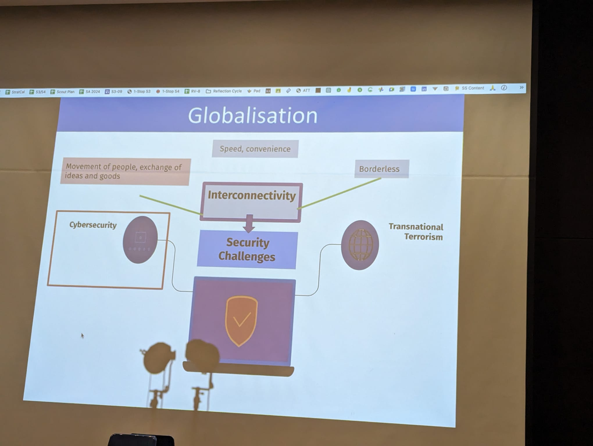

# Security Challenges in a Globalised World

## National Security Challenges

- Military
- Environment
- Resource
- Societal
- Economic Security
- Health Security
- Cyber Security

## Traditional vs Non-Traditional Security Concerns

| Aspect                  | Traditional Security Concerns                       | Non-Traditional Security Concerns                                 |
|-------------------------|-----------------------------------------------------|-------------------------------------------------------------------|
| Nature of Threat        | Country-centric, threats to state's sovereignty     | Trasnational, affecting country's security                        |
| Scope and Impact        | Immediate, visible, direct implications for country | Wide-ranging effects, Long-term effects on country                |
| Approach to Addressing  | Military, Diplomatic measures                       | Multi-faceted, international cooperation                          |
| Key Influencing Factors | Historical dynamics of the country                  | Interconnected systems brought about by globalisation             |
| Examples                | Military security                                   | Environmental security, economic security, resource security, etc |

## 4 Conceptual Understandings of Security Challenges

- __Tensions:__ Conflicting needs and interests between country and individual
- __Tradeoffs:__ Countries increase level of security-privacy/rights
- __Vulnerability:__ To reduce vulnerability through enhanced security
- __Complexity:__ Threats are transnational in nature

## Transnational Terrorism

- Refers to the acts of violence which are __global__ in terms of __aims, organisation__ and __impact.__
- Involves __the use of violence to harm or generate fear__ amongst victims (often civilians)
- The __use of violence__ against people to achieve a political goal is __never legitimate__ as the __respect for differences__ in opinion/views is a core component of a healthy, thriving community.

## Impacts of Transnational Terrorism - 9/11

### On Country

- __Exposed national security vulnerabilities:__ Terrorists can easily access information through the Internet and use it for recruitment, fund-raising, propaganda spread
- __Cost of War and Reconstruction of Nation:__ Human costs and casualties of wars and conflicts
- __Social/Racial Divide:__ Example: American society
- __Shakened Diplomatic Relations__ with other countries

### On Company

- __Economic Downturn:__ Stock markets immediately nose-dived
- Almost every sector of the __economy was damaged -__ airline and insurance were hit the hardest.

### On Individuals

- __Loss of Innocent Lives__
- __Violation of human rights__ due to increased security measures
- __Unemployment__
- __Rise of discrimination and stereotypes__ against certain groups

## Transnational Terrorism

- __Terrorism__ is a __complex security challenge__ because the threats can come from __within and beyond a country's borders.__
- __Violent extremism__ is often driven by __feelings of isolation and exclusion__ and by __fear and ignorance__
- Terrorists could appear to be __ordinary people__ (e.g. self-radicalised individuals)

## Growing Threat of Self-Radicalisation

- Terrorists grouops and radical ideologies are spreading their propaganda through social media and the Internet in order to attract recruits and supporters to their violent causes
- Self-radicalised individuals or lone wolves refer to individuals who are not members of any organised terrorist group, but have been __inspired and radicalised by extremised propaganda__, usually through what they have read on social media and the Internet.

## Threats from External Forces

### Transnational Terrorism

- Refers to acts of violence which are global in terms of aims, organisation and impact.

### Target: Singapore

#### Why target Singapore?

- Singapore is a globalised city, with many foreign businesses, which are the targets for terrorists.
- Singapore is also friendly to the West

#### Modus Operandi

- Uses racial and religious to create fear and suspicion among Singaporeans
    * Can potentially lead to anger, hatred and conflict.
    * No unity among the people.

## Tackling Transnational Terrorism

### Preventive Measures: Monitoring, detection and deterrence

#### Deterrence against threats

- Effective border controls
    * Biometrics and surveillance to prevent movement of foreign terrorists/destructive materials
- Collaboration between countries
    * UN Security Council Resolution 1373
    * ASEAN Counter-Terrorism Workshop
    * Interpol's Fusion Task Force (FTF)
- Within Singapore
    * Total Defence
    * Vigilance by individuals (prevent self-radicalisation)

### Protective Measures: Strengthening Defence/Security, Reducing Vulnerability

#### Internal Security against Threats

- Surveillance
    * E.g. Singapore Armed Forces (SAF)
    * e.g. Individual spotting suspicious articles on MRT
- Legal - detention of suspected terrorists indefinitely without trial
    * e.g. Internal Security Act (ISA)

### Responsive Measures: Readiness and Speed in Response and Recovery

#### Being Prepared

- Test contingency plans for acts of terrorism
    * Frequent exercises held by Singapore Police Force and the Singapore Civil Defence Force.
- Enhance civilian resilience to stand united as a community and recover quickly from an incident
    * Build community trust through social harmony advocacy groups
- Collaborates with other countries to improve capabilities in responding to transnational terrorist threats
    * e.g. International Security Assistance Force (ISAF)

## Globalisation

## Understanding Cyber Security Challenges

### There are more Cyber Security Challenges today because of...

- Advancement in technology &rarr; growth of online networks
- Increase in exchange of critical and confidential data
- Ease of access to information

### Areas to Focus On

#### Reasons

- For the cybersecurity measures

#### Results

- The impact of cybersecurity challenges
    * __Roles__
        + Individual
        + Company
        + Country

### Vulnerabilities

__The elusive nature of cyber attacks and inability to cope with challenges posed by cyber attacks.__

- Greater reliance on digital information systems and connectivity
- Actors who are less familiar with digital technology becomes vulnerable

__Critical information infrastructure and confidential information are at stake__

- Political impact
- Economic impact
- Social impact

#### Country

- National security
- National reputation
- Political stability
- Diplomatic ties

#### Company

- Confidence and trust of stakeholders (reputation)
- Revenue
- Confidential business data/trade secrets

#### Individual

- Confidential information
- reputation/relationship
- monetary loss

### Vigilance, resilience, and enhanced security

__It is a shared responsibility and everyone has a role to play__

- Country
- Company
- Individual
